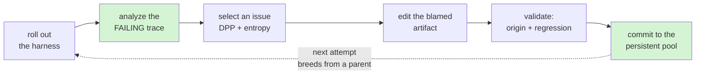

# AgentEvolve

**Agent-neutral RHO-Parallel-GEPA.** An evolution framework that improves an
agent's *harness* — its instructions, skills, policies and memory — by rolling it
out, diagnosing why it failed with a causal analyzer, editing the blamed artifact,
and keeping every candidate in a persistent pool with its evidence.

The reference adapter is **IBM CUGA, used through its SDK** (`cuga 0.2.20`
installed). This repository never forks or vendors CUGA.

> ### Read this before you trust a number
> 
> The suite is green — **2105 passed, 1 skipped** — and that proves the code
> *runs*. It does **not** prove it runs in production, and **nothing in this
> system has been observed end to end**. No correlation-captured live run has been
> performed, so **no claim of behavioural gain is supported today**.
> 
> Two specific traps, both measured:
> 
> - `core/merge.py` (crossover) and `core/parallel.py` are **fully tested and
>   unreachable** on the live path.
> - `Orchestrator.run_iteration` has **zero callers in `src/`**. The production
>   runner is `SequentialGepaRunner`. Reading the wrong one will mislead you.
> 
> Start at `docs/architecture/IMPLEMENTED-PIPELINE-MAP.md`, which annotates every
> claim with a `file:line` anchor and a LIVE / GATED / TEST-ONLY / DEAD / ABSENT
> marker.

---

## What it does



Three modes, all live, selected with `--mode`:

| Mode          | What runs                                                                                                              |
| ------------- | ---------------------------------------------------------------------------------------------------------------------- |
| `genetic`     | the attempt loop above                                                                                                 |
| `rho`         | 10 RHO phases: comprehension → difficulty → coreset → group rollouts → diagnosis → N proposals → judging → pool commit |
| `rho-genetic` | RHO rounds, each followed by genetic iterations on the coreset                                                         |

---

## Quick start

```bash
uv sync
uv run pytest                    # expect 2105 passed, 1 skipped

# offline lifecycle proof — no CUGA, no network, no cost
uv run python scripts/run_evolution.py --dry-run --tasks 3 --iterations 1
```

A live run needs `.env` exported **first** (`RuntimeSettings.from_env()` runs
before dotenv loads — `OPEN-ISSUES.md` S4-3):

```bash
set -a && . ./.env && set +a

uv run python scripts/run_evolution.py \
  --dataset datasets/gaia/<a-dataset> --grader expected_regex --harness vanilla \
  --tasks 5 --iterations 1 --max-workers 6 --isolation process \
  --export-harness data/harnesses/run-$(date +%Y%m%d-%H%M)/ \
  --capture-logs 2>&1 | tee terminal_output/evolution/run.log
```

**Always pass `--export-harness`.** Candidates live in an in-memory dict; without
it the evolved harness is destroyed at process exit (`OPEN-ISSUES.md` S4-8 — this
has already cost ~66 minutes of live optimizer work).

---

## Documentation map

Read in this order. The first three describe the code **as it is**; the rest are
intent, and say so.

```mermaid
flowchart TB
    subgraph WHAT["1 — what the code actually does"]
        ARCH["<b>docs/architecture/SYSTEM-ARCHITECTURE.md</b><br/>the whole system + ISSUE LIFECYCLE<br/>start here for the shape"]
        MAP["<b>docs/architecture/IMPLEMENTED-PIPELINE-MAP.md</b><br/>every claim has a file:line anchor<br/>LIVE / GATED / TEST-ONLY / DEAD / ABSENT"]
        SEV["<b>docs/SEVERE-OPEN-ISSUES.md</b><br/>defects where the MEASUREMENT INSTRUMENT lies<br/>SV-14 open · SV-7 low · rest closed"]
        OPEN["<b>docs/OPEN-ISSUES.md</b><br/>ordinary defects · S1-S4 severity<br/>7 of 11 budget caps do nothing"]
    end
    subgraph HOW["2 — how to operate it"]
        INT["<b>docs/architecture/LLM-INTERCEPTION-AND-REFLECTION.md</b><br/>see · substitute · label<br/>the BUILDER's reflection loop"]
        MAN["<b>docs/USER-MANUAL.md</b><br/>all 76 flags, env vars, artifact paths"]
        OBS["<b>docker/observability/README.md</b><br/>proxy interception + mock rules"]
    end
    subgraph WHY["3 — design intent and future work"]
        LIFE["<b>docs/design/issue-lifecycle.md</b><br/>D1-D4 shipped · <b>D5 = FUTURE DIRECTIVE</b><br/>two-judge positivity design"]
        SELA["docs/architecture/selection-algorithms.md<br/>the formulas"]
        TGT["docs/architecture/target-rho-parallel-gepa.md<br/>deliberately ahead of the code"]
    end
    subgraph HIST["4 — history (Gaia-specific paths)"]
        RHO["docs/rho_evolution/ 01-19<br/>authoritative RHO-GEPA rationale"]
        ANCH["docs/COMPACTION-ANCHOR-SV12.md<br/>session log · read §20 first"]
    end
    WHAT --> HOW --> WHY --> HIST
    style ARCH fill:#cfe8ff
    style MAP fill:#d4f4d4
    style SEV fill:#ffd9d9
    style INT fill:#cfe8ff
    style LIFE fill:#fff4cc
```



| File                                                                                                           | Use it for                                                                          | Caveat                                                       |
| -------------------------------------------------------------------------------------------------------------- | ----------------------------------------------------------------------------------- | ------------------------------------------------------------ |
| [`docs/architecture/SYSTEM-ARCHITECTURE.md`](docs/architecture/SYSTEM-ARCHITECTURE.md)                         | **the whole system + the issue lifecycle**, in diagrams                             | shape only; the map below is the `file:line` truth           |
| [`docs/architecture/IMPLEMENTED-PIPELINE-MAP.md`](docs/architecture/IMPLEMENTED-PIPELINE-MAP.md)               | *"is that actually wired?"*                                                         | reachability only, not runtime behaviour                     |
| [`docs/architecture/LLM-INTERCEPTION-AND-REFLECTION.md`](docs/architecture/LLM-INTERCEPTION-AND-REFLECTION.md) | **mitmproxy + LiteLLM: see, substitute, label** — and the builder's reflection loop | correlation labels are not yet set in production             |
| [`docs/SEVERE-OPEN-ISSUES.md`](docs/SEVERE-OPEN-ISSUES.md)                                                     | before trusting **any** measurement                                                 | **SV-14 is open**; every prior figure was produced under it  |
| [`docs/OPEN-ISSUES.md`](docs/OPEN-ISSUES.md)                                                                   | ordinary defects, budget caps, hazards                                              | S2-1: 7 of 11 caps bound nothing                             |
| [`docs/USER-MANUAL.md`](docs/USER-MANUAL.md)                                                                   | flags, env vars, where files land                                                   | §1.1 dedup adjudicator status is stale — it **is** wired now |
| [`docs/design/issue-lifecycle.md`](docs/design/issue-lifecycle.md)                                             | clustering decisions + **the future directive (D5.6)**                              | D5 is entirely unbuilt                                       |
| [`AGENTS.md`](AGENTS.md)                                                                                       | boundaries an agent must not cross                                                  | —                                                            |
| [`docker/observability/README.md`](docker/observability/README.md)                                             | capturing exact LLM payloads                                                        | restore `mocks/rules.json` after use                         |

---

## The future directive: two-judge positivity (D5)

Recorded in [`docs/design/issue-lifecycle.md`](docs/design/issue-lifecycle.md)
§6 D5, including a module map and an order-of-work diagram. **Nothing is built.**

**Why it matters.** Today only *failing* rollouts are analyzed
(`orchestrator.py:1401`), so the mechanism layer compares **bad against less
bad** and never records that another candidate did the same task *well*. Measured:
a candidate scored `1.0` on every task and held **zero** mechanism ids — invisible
to any mechanism-keyed lookup. The evidence that a fault is *fixable* sits in the
pool and is never read.

The fix is a second judge that reads a **winning** trace, so a mechanism cluster
holds both the fault and its fix, and the editor can voluntarily ask *"who is good
at this, and what does their artifact say?"*

Two decisions worth knowing before touching it:

- **One shared cluster namespace, sign as a separate field.** Measured cosine
  between a fault and its own fix: **0.963** and **0.944** (join threshold 0.75).
  They belong in the same cluster; splitting namespaces would destroy the join.
  Polarity rides on a new `valence` field, never on `severity`'s sign — two guards
  reject negatives and `w_severity * issue.severity` would make a strength
  *subtract* from the issue it informs.
- **Evidence only — no selection edge.** D5 does not touch `raw_issue_quality` or
  DPP, so an absent or broken Judge 2 makes the tool return *less*, never makes
  selection rank *differently*. The editor weighs a strength against a fault; the
  arithmetic does not.

---

## How to debug this effectively

Debugging here is unusual: the failure mode is rarely a crash. It is a **plausible
number produced by a path that never ran**. These techniques are the ones that
actually worked, and each is here because its absence cost real time.

### 1. Prove reachability before reading behaviour

A green test tells you nothing about production. Use AST, not grep:

```bash
# does anything in src/ call this?
python - <<'PY'
import ast; from pathlib import Path
target = "correlation_scope"          # <- change this
hits = []
for p in Path('src').rglob('*.py'):
    if '__pycache__' in str(p): continue
    for n in ast.walk(ast.parse(p.read_text())):
        if isinstance(n, ast.Call):
            f = n.func
            nm = f.attr if isinstance(f, ast.Attribute) else getattr(f, 'id', None)
            if nm == target: hits.append(f"{p}:{n.lineno}")
print(f"{target}: {len(hits)} src callers"); print(*hits, sep="\n")
PY
```

`§11` of the pipeline map has the full re-verification suite (dead-code audit,
core-purity check, merge-unwired check).

### 2. Capture the exact LLM payload — it is fully available

`docker/observability/` runs mitmproxy in **regular proxy mode** and captures
CUGA-internal calls too (verified: one editor invocation → 3 flows).

```bash
./docker/observability/proxy.sh up                 # proxy :8082, UI :8083
./docker/observability/proxy.sh run -- <command>
./docker/observability/proxy.sh down
```

Captures land in `docker/observability/captures/calls.jsonl` with the **full
request and response body** (`Authorization` redacted). A real capture carried a
61,561-byte request with a 56,364-char system prompt and the verbatim tool result
the model saw.

Two things that will bite you:

- **CUGA does not use OpenAI function-calling here.** There is no `tools` key —
  the 17 editor tools are inlined as prose in the system prompt. Searching a
  capture for `tools` finds nothing; search the prompt text.
- **`correlation` is `{}` today.** `correlation_scope` has zero production
  callers, so flows are unlabelled — group them by timestamp and body, and do not
  read empty labels as "no candidate".

### 3. Mock rules make live-path testing free

`mocks/rules.json` hot-reloads on mtime change. A request-hook mock never reaches
upstream, so you can drive a real agent through a real path at zero cost.

- **First match wins** — when driving a multi-turn agent, the **terminate rule
  must precede the drive rule**, or the agent is handed the same block forever.
- **Restore afterwards:** `cp mocks/rules.example.json mocks/rules.json`.
- A mocked arm proves **capability, never preference**. Label it that way.

### 4. Make the reproduction production-shaped

SV-1 was reported as a critical defect on a reproduction that passed `severity=`
into a test helper by hand. **No production call site writes it.** The arithmetic
was real; the scenario was unreachable. Before trusting any repro, check that
every value it injects is one production actually writes.

The converse trap, from SV-14: the offline fake harness makes the child **pass
every probe**, so a test measuring discarded analyses sees `0` and **passes
vacuously**. Force a failing probe.

### 5. Prove a test can fail

Revert the fix and confirm the test breaks. SV-6's suite was 13 tests, **12 of
which failed against unfixed source** — that is what made it evidence. SV-7's
aliasing defect was *injected* to prove the tests could see it.

### 6. Environment traps that have each cost hours

| Trap                    | Reality                                                                                                           |
| ----------------------- | ----------------------------------------------------------------------------------------------------------------- |
| `pytest -q`             | suppressed the summary line on the development machine — run via `subprocess` and print the line yourself         |
| `rg -r`                 | means `--replace`, **not** recursive. It modifies files. Never use it to search                                   |
| `load_dotenv()`         | from a stdin snippet can raise `AssertionError` — use `load_dotenv('.env')`                                       |
| `str(dict)`             | escapes newlines, so `"text" in str(payload)` can report `False` for content that is present                      |
| `.cuga/knowledge/.lock` | a crashed run leaves it; every later tool call fails with `'NoneType' has no attribute '_config'`. Delete it      |
| response `id`           | use it to detect an upstream cache hit — **never text equality** (a low-entropy prompt legitimately repeats text) |
| `terminal_output/`      | **gitignored**. Copy anything worth keeping somewhere tracked                                                     |

### 7. Where the evidence actually is

| Want                      | Look in                                                                                                  |
| ------------------------- | -------------------------------------------------------------------------------------------------------- |
| final answer of a rollout | `causal-trace.json`, **not** `manifest.json`                                                             |
| tool calls                | top-level `tool_observations` — `InvokeResult.tool_calls` has been seen empty while tools ran            |
| what the editor tried     | `editor` / `pipeline` log channels — pass `--capture-logs`; attempt records are **not** persisted (§7.6) |
| RHO phase detail          | not in `--capture-logs` (S4-6) — grep stdout                                                             |
| exact model payload       | the proxy (above)                                                                                        |

---

## Repository layout

```text
src/agent_evolve/core/        agent-neutral. 35 files, 0 forbidden imports.
                             MUST NOT import cuga, litellm, openai, httpx,
                             requests, or agent_evolve.adapters.
src/agent_evolve/adapters/    the only place core binds to a concrete agent
src/agent_evolve/pipeline.py  the single wiring seam (build_rho_hooks :1478)
scripts/run_evolution.py      evolution entry point
scripts/run_benchmark.py      inference / benchmark entry point
docker/observability/         mitmproxy interception + mock rules
tools/probes/                 preserved probes (tracked, unlike terminal_output/)
```

Verify core purity with the AST check in the pipeline map §11 — a substring grep
gives false positives, because several `core/` docstrings mention
`agent_evolve.adapters` in prose.

---

## Known discrepancy, unresolved

`pyproject.toml:12` declares `cuga>=0.3.1`; the installed version is **`0.2.20`**
— below its own declared floor. Do not "fix" this by editing the pin or
upgrading: every measurement to date ran against `0.2.20`, so either change
invalidates existing evidence. Raise it as a decision.


