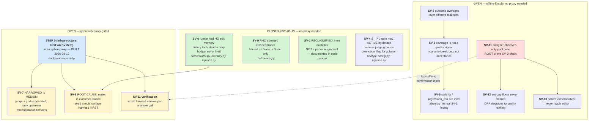
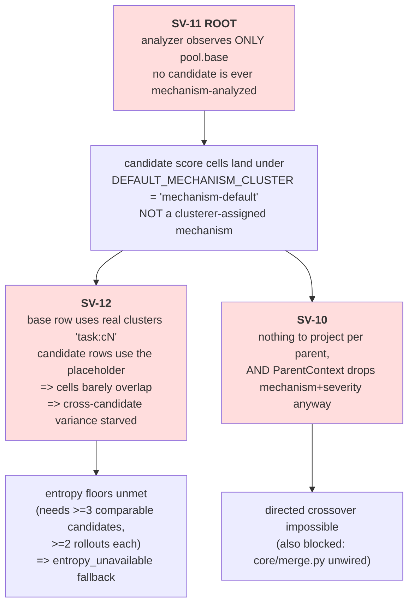

# SEVERE OPEN ISSUES — measurement-instrument defects

**Status: gated per item, not as a block.** SV-4, SV-6 and SV-9 are **CLOSED**
(2026-08-19). SV-1 is **RECLASSIFIED** — the documented defect does not exist and
the real one is milder. SV-7 is **NARROWED** to MEDIUM: the judge and the rollout
grid are both exonerated by offline tests, leaving only upstream materialization as
a possible defect. SV-8's **root cause is found** and it is not optimizer
blindness — the artifact roster is existence-based, so `instructions` was usually
the only surface in existence. SV-11 is **scoped**: two sites, cost-neutral if the
parent replaces the base rather than joining it. Everything else is open.

**The interception proxy is BUILT** (`docker/observability/`), so the remaining
proxy-gated verifications are now unblocked — they need `X-AE-*` correlation
headers emitted from the call sites, not new infrastructure.


These are not ordinary bugs. Every one of them shares a property: **the code runs
without error, produces a plausible number or an empty result, and there is
currently no way to see which.** A silent zero, an inert multiplier, and an
"efficient" crash all look like success from the outside.

## What the proxy is and is not a prerequisite for

The original version of this file deferred *every* item until the LiteLLM logging
proxy existed. That was too strong, and acting on it would have delayed seven
deterministic code defects behind an observability project. The split:

**Genuinely proxy-gated** — the claim is about payload *identity*, which an
offline test can only fake:

- **SV-7** — did the judge receive two *different* trajectories, or the same one
  twice?
- **SV-8** — which artifact surface was the optimizer *offered* versus which it
  chose?
- **SV-11 verification** — which harness version was the subject of each analyzer
  call? (The *fix* is not proxy-gated; the confirmation is.)

**Not proxy-gated** — deterministic behaviour, provable by executing real
objects: SV-1, SV-2, SV-3, SV-4, SV-5, SV-6, SV-9.

A caution learned the hard way, recorded because it produced a false finding:
**a reproduction is only evidence if it uses production-shaped inputs.** SV-1's
original reproduction passed `severity=` into a test helper by hand. Production
never does. The arithmetic was real; the scenario was unreachable. Before
trusting any reproduction in this file, check that every value it injects is one
some production call site actually writes.

Ordinary issues stay in `docs/OPEN-ISSUES.md`. This file is only for defects
where **the measurement instrument itself is untrustworthy**, so any number
produced before they are fixed carries an asterisk.

Cross-reference: `docs/architecture/IMPLEMENTED-PIPELINE-MAP.md` has the wiring
diagrams and formulas; `docs/research/rho-paper-prompt-fidelity.md` has the paper
deltas.

---

## Resolution log

| Item | Status | Evidence |
| --- | --- | --- |
| **SV-1** | **RECLASSIFIED** — not a perverse gradient; an *inert multiplier*. Merged with SV-5's category. Documented in code, no behaviour change. | `severity` is never written: all four `ScoreProvenance(...)` sites omit it, the class is frozen, no `replace`/`**kwargs` path. `weighted_score() == mean` always. |
| **SV-6** | **CLOSED** — and it was worse than documented: the production runner had *no* edit memory, so both history tools were dead **and the retry budget never fired**. | `tests/test_runner_edit_memory.py` — 13 tests; 12 fail against unfixed source. |
| **SV-9** | **CLOSED** — the GEPA path was already correct; the RHO path admitted crashed traces because it filtered on `trace is None` only. | `tests/test_crashed_rollout_exclusion.py` — 12 tests; 2 fail against unfixed source. |

Suite after all three: **1782 passed, 1 skipped** (from a 1757 baseline).
Logs in `terminal_output/severe_fixes/`.

---

## Fix order (remaining)



Revised rationale. **SV-6, SV-9 and SV-1 were closed without the proxy**, because
each was a deterministic code defect provable by executing real objects. Only
three items actually need it, and all three are claims about *payload identity*
that an offline test can only fake.

The champion-math chain **SV-2 → SV-3 → SV-4 → SV-5** must still be done in
sequence, because each changes what the next one measures. SV-5 now also absorbs
the real SV-1 finding: `severity`, `confidence`, `stability` and `regression_risk`
are **all four** inert, so that item is about one coherent problem rather than two.

**Revision 2026-08-19 — SV-4 should probably go first, not last.** Tracing the
consumers showed the paper's `S_j` acceptance gate is computed, paid for, printed,
and then discarded, while an aggregate the paper does not specify picks the
champion (see SV-4). That determines whether SV-2 and SV-3 are *repairs* to the
right decision rule or *repairs to a rule that should be demoted to a
tie-breaker*. Fixing the aggregate first risks polishing a mechanism we then
subordinate. **Open decision — see SV-4's three options; not yet chosen.**

**SV-11 remains the root of its own chain** and should be scheduled early despite
being the most expensive: SV-10 and SV-12 are its consequences, and fixing either
first would produce an empty structure or an unchanged fallback rate. Note the
SV-1↔SV-11 coupling asserted in the original — *"resolve them together"* — is
**dissolved**: it assumed severity reached candidate selection. It does not.
SV-11 is now independent of SV-1.

SV-8 still depends on SV-6, which is now satisfied: an editor with no history
could not be expected to explore new surfaces, and it now has history.

---

# Group SV-A — the champion aggregate math is wrong

SV-2 and SV-3 were **re-verified after the SV-1 correction**, using provenance of
exactly the shape the four production `ScoreProvenance` sites build (no `severity=`,
no `confidence=`). Both still reproduce. SV-1 did not survive that re-run; see its
own section.

```text
SV-2: base outcome=0.5000 cov=1.0 | candA outcome=0.9000 cov=0.5  -> candA wins (0.7450)
SV-3: base outcome=0.6000 cov=0.5 | candB outcome=0.5500 cov=1.0  -> candB wins (0.6525)
```

Effective ranking today (`core/pool.py:482`):

```python
aggregate = 0.55*outcome + 0.20*coverage + 0.15*stability - 0.10*regression_risk
#                                          ^^^^ =1.0 always   ^^^^ =0.0 always
# => both cancel in every comparison. Live formula is:
#    rank = 0.55*outcome + 0.20*coverage
```

`select_champion` decides **which harness is exported to `champion.json` and
carried into the next run via `--harness`**. It is not a survival gate inside a
round (`rho/rounds.py:561`: *"Rank orders the report and picks a champion; it
never decides survival"*), so the damage is to **chained multi-run experiments**,
where the error compounds each generation.

---

## SV-1 — RECLASSIFIED: `severity` is an inert multiplier, not a perverse gradient

**Severity: MEDIUM (was: CRITICAL). Belongs with SV-5. Documented in code
2026-08-19; no behaviour change.**

> **This item previously claimed the opposite of the truth.** It asserted that the
> diagnoser's per-candidate severity multiplies into `outcome`, so a candidate the
> diagnoser was more alarmed about would win selection. **It cannot.** The
> correction and how the error arose are both recorded below, because the failure
> mode — a reproduction built on inputs production never supplies — is the more
> transferable lesson.

### There are two unrelated fields named `severity`

Conflating them is the whole error:

| | Type | Written in production? | Feeds |
| --- | --- | --- | --- |
| **A** | `CausalAnalysis.severity`, `CausalFinding.severity` | **Yes** — `orchestrator.py:462`, `:611`, `:1405` | issue synthesis, issue selection, DPP targeting |
| **B** | `ScoreProvenance.severity` → `ScoreCell.severity` → `weighted_score()` | **No — never** | champion selection, Pareto dominance, parent sampling |

**(A) never flows into (B).** The lines this item originally cited as proof —
`orchestrator.py:462` and `:1405` — construct `CausalAnalysis(severity=...)` and
`CausalFinding(severity=...)`. Neither is a `ScoreProvenance`.

### Verified: `ScoreProvenance.severity` is unreachable

```text
core/orchestrator.py:342   severity passed: False   confidence passed: False
core/orchestrator.py:1498  severity passed: False   confidence passed: False
core/orchestrator.py:1872  severity passed: False   confidence passed: False
pipeline.py:1469           severity passed: False   confidence passed: False
```

All four sites omit it; the class is frozen; there is no `dataclasses.replace`,
no `**kwargs`, and no `ScoreProvenance(**...)` anywhere in `src/`. The only
`.severity` assignment in the package is a range check in `__post_init__`. So
both weights hold their `1.0` defaults for the lifetime of every cell.

A second trap sits alongside, and is probably what made this look wired:
`ScoreProvenance` carries **both** `blame_confidence` (always passed) and
`confidence` (never passed). Every production site sets the former.
`weighted_score()` uses the latter.

### The original reproduction, re-run with production-shaped provenance

```text
aaa-lowsev     outcome=1.0000  sev=1.0
zzz-highsev    outcome=1.0000  sev=1.0
champion = aaa-lowsev   (agg=0.9000)   # a tie, broken by candidate_id as designed
```

Two equal candidates tie. There is no gradient to be perverse. The documented
`lowsev agg=0.4600 / highsev agg=0.8450` required passing `severity=0.2` and
`severity=0.9` by hand into `tests/test_pool.py`'s `_prov()` helper, which exposes
severity as a parameter. Real arithmetic; unreachable scenario.

**SV-2 and SV-3 were re-run the same way and both still reproduce.** Those two
are real, and unaffected by this correction.

### The real defect

`weighted_score()` is `mean * 1.0 * 1.0`, so:

1. **`weighted_score() == mean`, always.** The spec's difficulty weighting is
   absent — Pareto dominance treats an easy task and a hard one identically.
2. **`parent_frequencies` degenerates to a count.** `freq[cid] += cell.severity *
   cell.confidence` is `+= 1.0` per cell won, so parent sampling is proportional
   to *how many cells* a candidate won, not to importance-weighted strength.
   The docstring advertises `sum of severity * confidence`.
3. **Two tests concealed it.** `test_weighted_score_multiplies_severity_and_confidence`
   and `test_pareto_uses_score_times_severity_times_confidence` pass by injecting
   values production never supplies, certifying a capability nothing exercises.

### Retraction

The paragraph claiming the GAP 2 diagnoser prompt change "now raises the outcome
of candidates that behave inconsistently" is **void**. That coupling requires
(A) to reach (B). It does not. The GAP 2 change affects diagnosis and targeting
only.

**Resolution applied:** the A/B distinction, the verification, and both
consequences are now documented at `core/pool.py` `ScoreCell.weighted_score()`
and `PersistentPool.parent_frequencies()`. No behaviour changed, so no test moved.

**Still open, as a deliberate architectural choice:** either implement
`(task, mechanism)`-scoped severity per `selection-algorithms.md:295`, or delete
the multiplier and amend that spec. Leaving an inert term in a published
aggregate misrepresents the method either way. Note that
`selection-algorithms.md:295` currently specifies the weighting, so it needs the
same correction or it will re-seed this confusion.

---

## SV-2 — `outcome` averages over different task sets

**Severity: HIGH. Not attempting a hard task raises your score.**

`_champion_outcome` (`core/pool.py:466`) is a two-level mean with **no shared-cell
restriction**. Cells with `rollout_count == 0` are skipped — correct on its own
("no evidence is not a zero") — but the resulting means are then compared across
candidates measured on *different* tasks.

```text
base   ran easy(0.9) + hard(0.1)   ->  outcome = 0.500  cov=1.000  agg=0.6250
candA  ran easy(0.9) only          ->  outcome = 0.900  cov=0.500  agg=0.7450  <== WINS
```

`candA` is **identical to base on the only task both attempted** and wins by
skipping the hard one. Under RHO's design (base gets `k x G`, candidates get
`k x R`) unequal task sets are the norm, not an edge case.

**Fix direction:** compute `outcome` over the **intersection** of cells both
entries have evidence for, and report the intersection size alongside it. Pairwise
rather than global — which is what `dominates`/`pareto_frontier` already do via
`min_comparable_rollouts`.

---

## SV-3 — `coverage` is not a quality signal, and carries 27% of the decision

**Severity: HIGH. A strictly worse candidate can be exported as champion.**

`_champion_coverage` (`core/pool.py:474`) measures **how much you measured**, not
how good you are:

```python
total_cells = { all (task,mech) cells with rollout_count>=1, UNIONED ACROSS THE POOL }
coverage    = |entry's cells & total_cells| / |total_cells|
```

Exchange rate: `cov 0.5 -> 1.0` buys `+0.100` aggregate, worth `0.100/0.55 =`
**0.18 of outcome**. Of the live weight (`0.75` total), coverage holds
`0.20/0.75 =` **27%**.

```text
base   outcome=0.600 cov=0.500 agg=0.5800
candB  outcome=0.550 cov=1.000 agg=0.6525  <== WINS
```

`candB` is **worse on every task both ran** (0.55 vs 0.60) and wins on coverage.

This is structural, not incidental: the architecture decision is that base gets
`G` rollout-group evidence while post-RHO candidates get `R` per selected task, so
base and candidates **systematically** differ in coverage. The formula reads that
budget asymmetry as quality. `pipeline.py:1295` already acknowledges the hazard in
one direction (*"Without base cells the incumbent's champion coverage is zero and
a candidate would win selection on coverage alone"*) and patches only
`coverage == 0`.

**Fix direction:** make coverage an **eligibility gate**, not a scored term — the
`champion_min_coverage_fraction` disqualifier already exists for exactly this.
Then rank on outcome alone over comparable cells. This subsumes SV-4.

---

## SV-4 — CLOSED 2026-08-19: `S_j > 0` acceptance gate now active by default (formerly S5-1)

**Severity was HIGH. Fixed: the pairwise judge now governs promotion.**

**Resolution.** The gate is implemented in `PersistentPool.select_champion` and is
**on by default** (paper behaviour). `ResolvedConfig.experimental_candidate_promotion`
(CLI: `--experimental-candidate-promotion`) disables it for ablation only.

What was wired, in the order the evidence flows:

```text
compare_symmetric()            pipeline.py:1400 -- confirmed bound, not the one-shot compare
  -> verdict.score
  -> CandidateEvidence.mean_preference
  -> pool.record_preference()  pipeline.py commit() -- NEW, was the drop point
  -> PoolEntry.preference      NEW field
  -> select_champion() gate    NEW, S_j > 0 required for non-base entries
  -> ChampionReport.preference + .preference_gate_applied
```

Design decisions, each deliberate:

* **Strict `> 0`.** A measured tie is not an improvement.
* **`None` ≠ `0.0`.** `record_preference` forces `preference=None` when
  `available == 0`, so an unjudged candidate cannot present as a measured tie.
  Both are gated, but for distinguishable reasons in the manifest.
* **The base is exempt.** It is the comparison subject, not a promotion candidate.
  Gating it would make "nothing improved" raise `ValueError` instead of falling
  back.
* **Promotion only, never survival.** Pool membership is untouched; AGENTS.md
  requires base plus every proposal retained, and a rejected candidate's negative
  evidence is what later analysis needs. Pinned by
  `test_pool_retention_is_unaffected_by_the_gate`.
* **Flag defaults to `False`.** Defaulting it to `True` would mean an ordinary run
  silently keeps the defect. The flag exists to *measure* the gate, not to opt in.

**Test evidence.** `tests/test_preference_gate.py` (16 tests) and three new tests in
`tests/test_rho_wiring.py`. Two of the three RHO tests were verified to **fail
against unfixed source** by reverting the `commit()` propagation; the third
(`test_gated_candidate_does_not_become_the_exported_champion`) passes either way,
because an absent preference also gates — noted rather than counted as
discriminating.

**Consequence for SV-2/SV-3.** The aggregate is now a *tie-breaker among gate
survivors*, not the acceptance rule. That is the reordering this entry argued for;
SV-2 and SV-3 remain open and are now correctly scoped as ranking bugs rather than
acceptance bugs.

<details>
<summary>Original finding (retained for provenance)</summary>

RHO Algorithm 1 accepts candidate `j` only when `S_j > 0` — the mean oriented
preference over the coreset — *"otherwise the harness remains at `h_0`"*. The base
wins ties and wins by default.

Ours was an **argmax over an aggregate with base as just another row.** Verified by
introspecting the function source:

```text
select_champion contains 'preference': False
                         'mean_score': False
                         'is_base':    False
                         'base':       False
                         'S_j':        False
```

### The pairwise judge is real, wired, and reported — but not actuated

Stated carefully, because "the judge does nothing" is wrong and was corrected
mid-session. What exists and genuinely runs:

- `cuga_preference_judge.py:591` — `compare_symmetric()` runs each comparison
  **twice with the slots swapped**, then decomposes the result: the antisymmetric
  part is the preference that survived the swap, the symmetric part is the
  position bias itself, reported rather than hidden. This is a careful
  implementation, not a stub.
- `pipeline.py:1389` — `compare=preference_judge.compare_symmetric`, wired into
  the RHO hooks.
- `rounds.py:537` — invoked once per task per candidate in phase 9, real LLM spend.
- `run_evolution.py:993` — the result **is** surfaced:
  `mean preference=+0.123`, with available/unavailable counts.

So the judge works. What it does not do is **change any decision.** Exhaustive
search for `mean_preference` / `preference_mean` in `src/` returns:

```text
rounds.py:268  docstring
rounds.py:278  field declaration   (CandidateEvidence)
rounds.py:306  field declaration   (RoundSummary)
rounds.py:553  WRITE  mean_preference=mean
rounds.py:593  WRITE  preference_mean=...
```

**Two writes, zero reads.** And both downstream doors are shut:

- `commit()` (`pipeline.py:1322`) copies `version`, `artifacts`, `hashes` and the
  buffered scores into the pool. `mean_preference` is not among them, so the
  preference never enters the pool at all.
- `select_champion` has no parameter that could receive it (signature above).

The causal chain terminates at stdout:

```text
compare_symmetric() -> verdict.score -> mean_preference -> RoundSummary -> console
                                                                  |
                                                                  X  never reaches
                                                                     pool, acceptance,
                                                                     or champion
```

Meanwhile the champion is chosen by `0.55*outcome + 0.20*coverage`, computed from
**grader** scores — a different measurement instrument entirely from the judge's.
So the paper's decision rule is implemented, paid for (2 calls/pair; roughly half
the aborted run's wall clock), printed, and then discarded, while an aggregate the
paper does not specify does the selecting.

### Where the aggregate is actually consumed

Verified: `select_champion` has exactly three production callers, none of which
is survival.

| Consumer | Effect |
| --- | --- |
| `EvolutionStack.champion_version()` (`pipeline.py:609`) | which version is reported best |
| `EvolutionStack.export_pool()` (`pipeline.py:632`) | which entry becomes `champion.json` |
| `SequentialGepaRunner.run()` (`orchestrator.py:2173`) | fills `GepaRunResult.champion` |

Survival is unaffected by design: RHO phase 10 commits **all N** candidates
(`rounds.py:560`, *"ALL N, never best-of-N … it never decides survival"*), and
`prune()` is for size-bounded ablations only. So the blast radius of SV-2/SV-3/SV-4
is **the exported `champion.json`** — which is exactly what seeds the next run via
`--harness`, so the error compounds across chained generations.

**Fix direction:** three coherent options, and this is a design decision, not a
silent patch.

1. **Fix the aggregate only** (SV-2 intersection, SV-3 coverage-as-gate), leave the
   judge unwired. Cheapest; keeps a non-paper rule as the method.
2. **Wire `S_j > 0` as the acceptance gate** per Algorithm 1, demoting the
   aggregate to a tie-breaker among accepted candidates. Matches the paper and
   makes the judge spend load-bearing. Requires deciding what happens when
   `preferences_available == 0`, and how this interacts with protected floors.
3. **Both, in order** — gate on `S_j > 0`, then rank survivors on
   intersection-comparable outcome. Recommended.

Interacts with protected floors and the entropy safeguards.

</details>

**Resolved as option 3** (gate first, then fix the aggregate for survivors). The
`preferences_available == 0` question is answered by treating absent evidence as
ineligible, and protected-floor violations are still checked first, so a floor
violation disqualifies regardless of preference.

---

## SV-5 — two of the four champion objectives are inert constants

**Severity: MEDIUM. The manifest overstates what selection considers.**

```python
stability       = 1.0   # hardcoded in select_champion, never computed
regression_risk = 0.0   # hardcoded in select_champion, never computed
```

Both are specified as functions in `selection-algorithms.md:330-331`. Neither was
implemented. They contribute a constant `+0.15` and `-0.0` to **every** entry, so
they cancel in all comparisons while `ChampionReport` still reports a four-term
aggregate as if all four were live.

A `blame_stability` field does exist on `ScoreProvenance`, set to `1.0` with
*"Single-call default; ablations vary this"* (`orchestrator.py:350`) — it feeds
nothing in champion selection.

**Fix direction:** implement them or delete them from the formula and the report.
Leaving inert terms in a published aggregate misrepresents the method.

---

# Group SV-B — the editors are blind

## SV-6 — CLOSED: the production runner had no edit memory at all

**Severity: was CRITICAL. Fixed 2026-08-19. Scope was larger than documented.**

> **The original diagnosis was correct that `search_edit_history` always returned
> `[]`, but wrong about why — and its prescribed two-line fix would have changed
> nothing.** Two further consequences were missed, one of which the item
> explicitly denied.

### What was actually wrong

`record_attempt` is called at exactly one place: `orchestrator.py:474`, inside
**`Orchestrator`** — a class constructed **only in tests**
(`test_orchestrator.py:65,105`, `test_analysis_bridge.py:603`).

Production runs **`SequentialGepaRunner`** (`pipeline.py:819` and `:992`), which
had no `edit_memory` field, never imported `EditMemory`, and never called
`.record()`. Verified by introspection:

```text
SequentialGepaRunner has edit_memory field: False
Orchestrator          has edit_memory field: True
SequentialGepaRunner source contains 'record_attempt': False
CugaEditorAgent       writes memory ('.record('):      False
Runner references editor.memory:                       False
```

So the editor's memory was **write-never**. Three consequences, not one:

| Consequence | Original item said | Actually |
| --- | --- | --- |
| `search_edit_history` returns `[]` | yes | yes — but because nothing writes, not because of the storage gate alone |
| `get_attempt_outcome(id)` | *"works: yes"* | **also always failed** (`KeyError`) — it reads `_by_id`, which was never populated |
| Retry budget | *"unaffected… works correctly"* | **never fired.** `RetryBudget.record_attempt` is only reachable through `EditMemory.record`, so retry exhaustion — a documented edit-validation mechanism — never ran in production |

The prescribed fix (`storage=storage` at `pipeline.py:995`) would have had **no
effect**, because no code path reached `.record()` to persist anything.

### Fix applied

1. **`core/orchestrator.py`** — `SequentialGepaRunner` gained an `edit_memory`
   field and a `_record_in_edit_memory` step that runs on **every** terminal
   attempt path, not only the accepted one. Rejected and regressed attempts are
   the load-bearing history entries: the point is "do not repeat a strategy that
   already failed".
2. **`core/orchestrator.py`** — `propose_edits` now populates
   `EditorRequest.history_refs` from `edit_memory.for_issue(...)`, so prior
   attempts reach the editor rather than being rediscovered.
3. **`core/memory.py`** — `record()` indexes `_records_by_issue`
   **unconditionally**. Previously that index was a side effect of `append()`,
   which requires a storage backend, so `retrieve()` returned nothing whenever
   `storage is None`. History must not silently depend on a persistence flag.
4. **`core/memory.py`** — `storage` retyped from `JSONFileStorage` to the
   `StorageBackend` protocol. The class only ever calls `write_record`, and the
   pipeline holds the protocol type.
5. **`pipeline.py`** — **both** factories now build one `EditMemory` and hand the
   *same object* to runner and editor. Two instances would be the silent
   regression: each internally consistent, every history tool still empty. The
   offline factory adopts an injected editor's existing memory rather than
   creating a second.

### Verification

`tests/test_runner_edit_memory.py` — 13 behavioural tests, **12 fail against
unfixed source**. Each drives `run_attempt` and then inspects what a *tool*
returns, never a prompt substring. Coverage includes: the memory exists and is
written; retrieval by id and by issue; `retrieve()` parity with and without
storage; a second attempt seeing the first; retry-budget consumption and
exhaustion; the real `search_edit_history` tool closure returning the prior
attempt; and both production-wiring sharing invariants.

Isolating fix 3 alone: reverting `memory.py` while keeping the runner wiring
still fails 4 tests, confirming both fixes are independently necessary.

One subtlety worth recording. The first attempt at the exhaustion test asserted
that three *accepted* attempts exhaust the budget. They do not, correctly: an
accepted attempt commits a new candidate, so the next forks from it and its
`lineage` key legitimately differs. The budget is scoped per
`(issue, artifact_group, lineage)` by design. Exhaustion needs repeated attempts
on **one** lineage, which is what a failing editor produces — so the test now uses
a deliberately ineffective editor.

Related: **S4-7** in `OPEN-ISSUES.md` (attempt records not persisted) is the same
root cause seen from the persistence side, and is also addressed.

---

## SV-7 — the preference judge may be receiving identical trajectories

**Severity: CRITICAL. If true, every preference score ever collected is void.**

Carried over from `OPEN-ISSUES.md` **S1-7**, unresolved. Observed live: the judge
reported

```text
Are events identical? True
Are raw strings identical? True
```

and then correctly scored `0.0`. Two readings, indistinguishable from outside:

1. genuine unchanged behaviour (candidate edit had no effect), or
2. a wiring bug feeding the same trace into both slots.

`read_baseline()` and `read_candidate()` (`cuga_preference_judge.py:392,400`) are
distinct closures over `baseline_slot` / `candidate_slot`, so the defect — if real
— is upstream, in what the pipeline hands them. Note **S1-1** (candidate rollouts
stamped `harness_version: base`) is a plausible mechanism.

**The judge prompt is not the suspect.** Do not "fix" the rubric for this.

**Proxy need — this is the cleanest case for it.** The proxy logs both tool results
verbatim in the same request. Identical payloads under two different slot names is
a direct answer, requiring no new instrumentation.

**Also add offline:** a test asserting `read_baseline()` and `read_candidate()`
return different payloads when given deliberately different traces. That is a real
behavioural test, unlike a prompt-substring assertion.

### NARROWED 2026-08-19 — the judge and the grid are both exonerated

The offline tests the entry asked for now exist:
`tests/test_judge_slot_distinctness.py`, 5 tests, all passing.

Ruled out as the cause:

* **The slot closures.** `_build_callables` renders `baseline_slot` and
  `candidate_slot` independently; distinct traces in produce distinct payloads
  out, and neither closure leaks the other's trace. Pinned by
  `test_slot_closures_return_distinct_payloads_for_distinct_traces` and
  `test_slot_closures_do_not_leak_the_other_slots_trace`.
* **`_rollout_grid` version stamping.** Each version's traces carry that version's
  `candidate_id`, so phase 9 receives two genuinely different objects. Pinned by
  `test_rollout_grid_stamps_each_version_onto_its_own_traces`. This is the S1-1
  mechanism the entry named as *plausible*, and at the grid boundary it does not
  reproduce.
* **`compare_symmetric` wiring.** Confirmed live at `pipeline.py:1400`: the RHO
  `compare` hook is bound to `compare_symmetric`, not to the one-shot `compare`.
  The two swapped-order calls are real.

Deliberately preserved: when the two trajectories genuinely *are* identical the
payloads still render identical (`test_identical_traces_are_reported_identically_not_hidden`).
Masking that would replace one blind spot with another — a no-op edit must be
visible as a no-op, not disguised as a difference.

**What remains, and it is narrower than the original claim.** Everything from the
grid boundary onward is proven correct, so the original live observation has only
two remaining explanations:

1. the edit genuinely produced no behavioural change (which, given SV-8 — every
   candidate edits only `instructions` — is entirely plausible and would be
   *correct* judge behaviour), or
2. the two versions were materialized to byte-identical harnesses upstream of the
   grid, i.e. in `materialize_candidate`/`register_candidate`.

Only (2) is a defect, and distinguishing them needs one artifact-hash comparison
between the two versions at rollout time — not a judge change. **Downgraded from
CRITICAL to MEDIUM**: "every preference score ever collected is void" is no longer
supported, because the mechanism that would void them has been excluded.

---

## SV-8 — every candidate ever produced edits only `instructions`

**Severity: HIGH. We do not satisfy the paper's "full harness" axis.**

RHO Table 5 claims: *"Full harness: edits executable **tools and skills**, not
memory or prompt text alone."* Its harness is a directory of real executables
(Listing 8 `bin/repair-verify`, Listing 11 `tools/validate_mask_csv.py`,
Listing 13 `are_helper.py`).

**Ours has never edited anything but `instructions`** — including in a run whose
prompt explicitly invited creating a skill. So on the paper's own axis we are the
*"prompt text alone"* case.

The capability is not obviously missing: `cuga_rho_optimizer.py:51` sets
`CREATABLE_PREFIX = "skills/generated-"` and the prompt documents all four surfaces
(`instructions`, `skills/`, `policies/`, `memory/`). So the question is **why the
optimizer never chooses them.**

### A structural reason, newly identified

The RHO optimizer is **blind by construction**. Verified:

```text
cuga_rho_optimizer.py:  EditMemory imported: False
                        'history' mentions:  0
                        search_edit_history: 0
                        list_parents:        0
```

It has **9 tools** vs the genetic editor's 16 — no history, no parents, no trace
access. Each of the `N` proposals in a round is fully independent: no knowledge of
prior rounds, and no knowledge of its sibling proposals in the same round.
**Nothing can tell it that "edit instructions" has already been tried N times**, so
there is no pressure toward an unexplored surface.

The genetic editor *could* know — and cannot, because of SV-6.

**Also missing:** an executable-tool artifact class. `cuga_editor_tools.py` is the
*editor's own* toolset, not an evolvable surface. There is no artifact type whose
content is a runnable script.

**Proxy need:** to see which `list_artifacts` roster the optimizer was offered
versus what it staged, and whether it ever considered a non-`instructions` surface
before choosing.

**Fix direction:** after SV-6, give the RHO optimizer surface-history awareness
(which surfaces prior candidates already touched, and how those fared), then decide
whether to add a tools artifact class. Not a prompt-wording fix.

### ROOT CAUSE FOUND 2026-08-19 — the roster is existence-based, so there was nothing else to choose

The entry above asks "why does the optimizer never choose them" and answers with
optimizer blindness. That is real but it is **not the binding constraint**. The
optimizer cannot choose a surface that is not on the menu, and usually nothing else
is on the menu.

The chain, verified end to end:

```text
HarnessVersion(version=..., instructions="...")   # skills/memory/policies default to {}
  -> wrapper.get_artifacts()                      # returns exactly what it was seeded with
  -> CugaAdapter.artifact_inventory()             # enumerates EXISTING artifacts only
  -> list_artifacts() -> sorted(base_artifacts)   # cuga_rho_optimizer.py:503
```

Measured, not inferred:

```text
HarnessVersion(version="base-v0", instructions="do the task well")
  instructions: 'do the task well'
  skills:   {}
  memory:   {}
  policies: {}
```

So for a bare live harness `list_artifacts()` returns `["instructions"]` and
nothing else. Editing `instructions` was not a preference the optimizer expressed;
it was the only readable surface in existence. `read_artifact` on anything else
returns `unknown artifact`.

**`CREATABLE_PREFIX` does not rescue this.** `skills/generated-<name>` is
creatable, but creation is an unprompted leap to an id absent from the roster the
model was just handed, while `instructions` is present, readable, and non-empty.
The roster is the strongest signal in the prompt and it points one way.

**Contrast with offline, which is why this hid.** The offline stack's base
enumerates three surfaces and **no** `instructions`:

```text
id='skills/retrieval'    kind='skill'  writable=True
id='policies/execution'  kind='policy' writable=True
id='prompts/system'      kind='prompt' writable=True
```

Offline therefore cannot reproduce the defect — it has a multi-surface roster by
construction. Any test written against `build_offline_stack` will show healthy
surface diversity while live runs edit `instructions` exclusively. That mismatch is
itself a finding: **offline is not a valid harness-surface fixture for live
behaviour.**

**Revised fix direction, in dependency order.** Surface-history awareness is now
*second*, not first:

1. **Seed a multi-surface base harness.** Until the roster has more than one entry,
   no amount of optimizer awareness can change the outcome. This is a seeding and
   harness-construction change, not a prompt change.
2. Then surface-history awareness (needs SV-6, now closed), so the optimizer can
   see that `instructions` has already been tried N times.
3. Then decide on an executable-tools artifact class for the paper's "full harness"
   axis.

Doing (2) before (1) would be measuring an optimizer's choice among one option.

---

# Group SV-C — evidence hygiene

## SV-9 — CLOSED: crashed rollouts entered RHO evidence

**Severity: was HIGH. Fixed 2026-08-19. One of the two paths was already correct.**

Formerly S5-2. In `data/cachefix_traces/` (29 rollouts) **all six 13-event
rollouts are `status=error`, `graph_node_error=4`, with no answer** — the shortest
trajectories in the corpus are crashes:

```text
event_count over 29 rollouts:  min=13  median=31  max=127
ALL SIX 13-event rollouts:     status=error, NO answer
all 23 successful rollouts:    25..127 events, llm_call_start 3..17
```

So any "fewer steps is better" efficiency signal ranks those six crashes **above
all 23 successful rollouts** — a rubric that rewards crashing — and any
consistency metric reads their divergence as a harness gap when it is transport
failure.

### The GEPA runner path was already correct

Pinned by test rather than assumed. `rollout_group` marks a rollout
`scorable=False` when its status falls outside `ANSWERED_TRACE_STATUSES`, and
`_record_rollout_score` **raises** rather than silently skipping one — the
deliberate choice that keeps a future miswiring visible.

### The RHO path was not

`_rollout_grid` (`core/rho/rounds.py:637-643`) dropped a rollout **only when
`trace is None`**. A crashed CUGA rollout returns a *real* `ExecutionTrace`
carrying `status="error"`, so it passed that check and flowed into:

- `_record_scores` → scored, and written into the **entropy cell**;
- phase 6 **group diagnosis**;
- phase 9 **preference judging**.

Worse for SV-12: a crash counted toward `min_rollouts_per_candidate` could promote
a candidate to *comparable* on evidence that does not exist, quietly converting
the DPP diversity term into a quality ranking.

The pre-existing tests only covered `trace=None`
(`test_failed_rollouts_do_not_discard_a_group`), which is why this survived.

### Fix applied

1. **`core/rho/rounds.py`** — new `_answered(trace)` helper reusing
   `ANSWERED_TRACE_STATUSES`, the same whitelist the scorers use, so the two paths
   cannot drift apart. A *whitelist* on purpose: an unrecognised status means
   "unknown", and unknown must not count as answered.
2. **`_rollout_grid`** — a trace that exists but answered nothing is now counted as
   an infrastructure failure and excluded from `usable`.
3. **`_record_scores`** — filters again, deliberate defence in depth. This is the
   function that writes the entropy cell and calls `mark_comparable`, so it must
   not depend on its caller having filtered.

### Verification

`tests/test_crashed_rollout_exclusion.py` — 12 tests, **2 fail against unfixed
source** (the two RHO ones; the 10 GEPA-path and whitelist tests passed before,
which is the point of pinning them). Crash statuses covered:
`error`, `failed`, `timeout`, `cancelled`, `""`. Each negative test uses a
*correct answer* in the trace buffer, so it proves status gates scorability before
the answer is inspected; a positive control guards against the whole file passing
vacuously.

**Still open — S1-6, and it is now the honest remaining gap.** `trace.error` still
does not reach `manifest.json` (`status=error, err=None`), so a *reader* cannot
distinguish transport failure from harness failure even though the *code* now
excludes both from evidence. Exclusion no longer depends on it; attribution does.

---

# Group SV-D — the population is not actually a population

These three are one causal chain, discovered by following a question about
severity's indices down to what the analyzer actually observes. **SV-11 is the
root; SV-10 and SV-12 are its consequences.** Fixing the projection (SV-10)
without fixing observation (SV-11) would surface an empty structure.



---

## SV-10 — a parent's vulnerabilities never reach the editor

**Severity: HIGH. Blocks informed offspring generation.**

The genetic editor cannot ask "what is this parent weak at?" Three independent
blocks, each sufficient alone.

### 1. `ParentContext.score_summary` is a lossy projection

`core/orchestrator.py:1705` and again at `:1720`:

```python
score_summary={
    t_id: cell.mean
    for (t_id, _m), cell in entry.score_tensor.items()
}
```

Three losses in one comprehension:

- **the mechanism key is destructured and discarded** (`_m`);
- **severity is discarded** — `cell.mean`, not `cell.weighted_score()`;
- **same-task mechanisms silently overwrite each other** — a dict keyed on `t_id`
  alone, so the editor sees whichever mechanism came last in iteration order.

The editor learns *"parent c3 scored 0.4 on gaia-7"*. It can never learn
*"…because of mechanism M, at severity 0.8."*

### 2. `EditorRequest` carries one analysis, for the primary only

`EditorRequest.analysis` (`core/editor.py`) is a single `CausalAnalysis` — the
issue currently being worked. There is no per-parent analysis collection, and
`parents: tuple[ParentContext, ...]` carries only the lossy summary above.

### 3. No tool can query it

Of the 16 genetic-editor tools, `list_parents` returns the lossy summary and
`read_parent_artifact` returns content. There is no `get_parent_issues`, and no
storage read path to build one on (see the write-only finding below).

### The data exists upstream — this is a projection defect, not a modelling gap

The pool tensor **is** `(candidate, task, mechanism) → ScoreCell` with severity in
provenance, and `EntropyTracker._Cell` (`core/entropy.py:59`) keeps exactly the
needed relation:

```python
@dataclass(slots=True)
class _Cell:
    key: CellKey                      # (task_id, mechanism_cluster_id)
    scores: dict[str, list[float]]    # candidate_id -> [score per rollout]
    comparable: set[str]
```

`parent_frequencies` (`core/pool.py`) already computes per-candidate,
per-mechanism strength **with severity retained**:

```text
frequency(c) = SUM over winning (t, m) of severity * confidence
```

That is used to *sample which parent to edit*. The editor is never shown the same
breakdown to *decide what to change*. The information is one projection away —
**but see SV-11: for candidates, that projection is currently empty.**

### Constraint on how far this can generalize

Cluster ids are namespaced `f"{task_id}:{cluster_id}"`
(`core/clustering.py:345`), i.e. **task-local by construction**. So "parent c3 is
weak on mechanism M" is only well-defined *within one task*. Cross-task mechanism
identity is not established by this structure. `AGENTS.md` says mechanisms align
*"through task-local semantic clusters anchored by base-harness observations"*, so
cross-task parent targeting needs that anchoring built, not merely a wider
projection.

### Severity is being asked to do two contradictory jobs

- In `weighted_score` it is a **reward multiplier** — high severity inflates
  `outcome` (SV-1's perverse gradient).
- For parent targeting it must be an **attention signal** — high severity means
  *fix this here*.

Same number, opposite directions. **Removing severity from `weighted_score` and
keeping it purely as attention/targeting fixes SV-1 and enables this feature in
one change.** That is the recommended resolution for both.

**Fix direction:** keep `(task, mechanism)` in `ParentContext`, use
`weighted_score()`, add a `get_parent_issues`-style tool. Respect the
persistence rule (`orchestrator.py:2078`): store `mechanism_cluster_id`,
severity, and `evidence_refs` — never mechanism prose that could carry task
content. Confirm whether `recurring_failure_mode` text is safe to persist at all.

---

## SV-11 — the analyzer observes only `pool.base`; no candidate is ever mechanism-analyzed

**Severity: CRITICAL (root cause). The genetic stage is base-centric mutation, not population evolution.**

Both entry points are hardwired to the base, not to a selected parent.

`build_issues` — its own docstring says *"issues for every task **the base**
currently fails"*:

```python
base = self.pool.base
inventory = self.adapter.artifact_inventory(base.version)
observed = self.rollout_group(base.version, tasks, prefix=f"obs-{base.candidate_id}")
```

`run_iteration`:

```python
base_entry = self.pool.base
for task in tasks:
    for r in range(self.profile.base_rollout_group_size):
        ... self.adapter.materialize_candidate(base_entry.version, base_attempt_id)
```

Everything downstream inherits it: `candidate_id=base.candidate_id`,
`lineage=base.version`, `pareto_relevance=self._pareto_relevance(base.candidate_id)`.
`self.pool.base` is a fixed property — **not** `select_parent()`, which exists
(`orchestrator.py:1623`) and is used only to choose an edit target and build
`ParentContext`.

### The concrete consequence

Only base rollouts get a clusterer-assigned mechanism:

```python
clusterer = self.cluster_registry.clusterer_for(task.task_id)
assignment = clusterer.assign(analysis)      # base rollouts only
cluster_id = assignment.cluster_id           # -> "task:cN"
```

Candidate scores are recorded in `commit_to_pool` from **validation probes**,
under a constant:

```python
cell = entry.cell(result.task_id, self.mechanism_cluster_id)
# pipeline.py:142  DEFAULT_MECHANISM_CLUSTER = "mechanism-default"
# passed at pipeline.py:827 and pipeline.py:1000
```

So the mechanism dimension holds **real clusters only along the base row**.
Candidate rows sit under a placeholder. That is why "fetch this parent's issues"
has nothing to return (SV-10): **no candidate has ever had a mechanism analysis
run on it.**

### It also invalidates a reassuring docstring

`ScoreCell.severity` (`core/pool.py:122`) claims severity is *"a property of the
(task, mechanism) pair… constant within a cell."* That holds **trivially** while
only one candidate is ever analyzed per real cluster. It breaks the moment
candidates are analyzed too — which is exactly what SV-10 requires. So SV-1 and
SV-11 must be resolved together, not independently.

### Is it deliberate?

**Checked, and no design doc sanctions it.** `docs/architecture/orchestration-lifecycle.md`
defines the lifecycle as `observe → build_issues → select_issues → select_parent →
propose_edits → validate → commit_to_pool` and **never states whose observation**
— the word "observe" appears in no normative sentence about a subject. Meanwhile
`docs/architecture/selection-algorithms.md:20` requires entropy be computed *"over
comparable candidate scores only"* with a `candidate_id -> current score` map and
`rollout counts per candidate` — a structure that presumes **multiple candidates
are measured per cell**. Base-only observation cannot satisfy its own selection
design, so this reads as drift, not intent.

### What it makes the genetic stage

- issues always describe the base's failures;
- `current_artifacts` always come from the base;
- `select_parent`/`select_parents` pick an edit target and donors whose mechanisms
  **nobody measured**;
- offspring cannot be steered by "parent A is weak on M1, parent B is strong on M1".

Combined with `core/merge.py` unwired (no crossover, see
`IMPLEMENTED-PIPELINE-MAP.md` §5) and `search_edit_history` returning `[]`
(SV-6), this is **repeated independent mutation of a fixed base**, not GEPA over a
population.

**Proxy need:** confirm from request logs that every analyzer/diagnoser call in a
genetic run carries base artifacts, and that no candidate version is ever the
subject of a mechanism analysis.

**Fix direction:** roll out and analyze the **selected parent** (and ideally the
pool members that lack evidence in a cell), not `pool.base` unconditionally. This
is a real cost increase — it must be budgeted, and it interacts with the RHO
decision that base receives `G` rollout-group evidence while candidates receive
`R`. Decide explicitly before changing.

### SCOPED 2026-08-19 — exactly two sites, and the cost is bounded

Not changed yet: the entry requires an explicit budget decision first, and this
section is that decision written down rather than a change made quietly.

**The two sites that actually matter.** Of the seven `self.pool.base` references in
`orchestrator.py`, only two drive observation:

| Line | Site | Effect |
| --- | --- | --- |
| `1441` | `build_issues` | whose failures become issues |
| `541` | `run_iteration` | whose rollouts are materialized |

`1944` and `1960` are error-path `parent_candidate_id` reporting on outcomes that
carry `status=PENDING` and no result; `1646` is `select_parent`'s own documented
fallback; `1837` is a distinct commit path. **Changing 1441 and 541 is the whole
fix** — a materially smaller change than "everything downstream inherits it"
suggests.

**`select_parent` is already correct and already non-trivial.** It samples
proportional to `parent_frequencies()` and returns `pool.base` only when no
candidate has a winning cell (`orchestrator.py:1632`). So the replacement target
exists, is tested, and needs no new selection logic.

**The bounded cost.** `base_rollout_group_size` defaults to `3`, so one observation
pass is `3 × |tasks|` rollouts plus one analyzer call per answered failure.
Observing the selected parent *instead of* the base is **cost-neutral** — same
group size, different version. It is only a cost *increase* if the base is observed
**as well**, to keep the incumbent's evidence fresh.

That is the actual decision, and it is a three-way choice:

1. **Parent-only** (cost-neutral). The base's cells go stale as rounds progress,
   and the base is the fallback champion — so its aggregate would be computed from
   increasingly old evidence.
2. **Parent + base** (2× observation cost). Both stay fresh. Directly contradicts
   nothing, but doubles the most expensive phase.
3. **Parent-only, with periodic base refresh every k rounds** (cost between the
   two). More moving parts, and `k` is another parameter to justify.

**Interaction that must not be missed.** SV-1 established that
`ScoreProvenance.severity` is never written, so `parent_frequencies()` is currently
a *count of cells won*, not a severity-weighted sum. `select_parent` samples on
that count. Fixing SV-11 therefore makes `select_parent`'s sampling distribution
suddenly meaningful across multiple analyzed candidates — which is exactly when
`ScoreCell.severity`'s "constant within a cell" docstring stops holding. **SV-1,
SV-5 and SV-11 land together**, as the section above already warned.

**Recommendation: option 1, after SV-8.** Observing the selected parent is
pointless while every candidate differs from the base only in `instructions` and
often not at all — there is no mechanism diversity to discover yet. SV-8's roster
fix is the prerequisite that makes SV-11 worth paying for.

---

## SV-12 — cross-candidate entropy is structurally starved

**Severity: HIGH. The DPP diversity term degrades to a quality ranking.**

Direct consequence of SV-11. `docs/architecture/selection-algorithms.md:43`
requires evidence floors before a cell may drive entropy selection:

```text
comparable candidates >= GEPA_ENTROPY_MIN_COMPARABLE_CANDIDATES (default 3)
rollouts per candidate >= GEPA_ENTROPY_MIN_ROLLOUTS_PER_CANDIDATE (default 2)
```

Entropy is defined per `(task, mechanism)` cell:

```text
H(t, m) = variance * max(max_score, GEPA_ENTROPY_SCORE_FLOOR)
```

But per SV-11, base rows carry real cluster ids (`"task:cN"`) while candidate rows
carry `"mechanism-default"`. **The cells where variance is meaningful and the cells
where candidates actually have scores barely overlap.** A cell needs ≥3 comparable
candidates; a real-mechanism cell typically has exactly one — the base.

The design doc's own guard then fires: a cell failing the floors is marked
`entropy_unavailable` *"and falls back to severity/coverage quality."* Which means
the documented failure mode from `core/rho/coreset.py:11-13` — *"a quality-only
selector is `severity_rank`"* — becomes the normal path rather than the exception,
silently.

This is exactly the hazard `AGENTS.md` names: *"Cross-candidate entropy requires
comparable evidence floors before it drives selection."* The floors are
implemented and correct; the **evidence to clear them is never produced.**

**Proxy need:** not primarily a proxy item — measurable offline by counting, per
run, how many cells clear the floors versus fall back. Worth instrumenting
alongside the proxy work so the fallback rate is visible rather than inferred.

**Fix direction:** follows from SV-11. Once candidates are mechanism-analyzed
into real clusters, cells can accumulate comparable candidates. Until then, report
the `entropy_unavailable` fallback rate in every run summary so a quality-only
selection is never mistaken for a diversity-driven one.

---

## What the proxy must capture to close these

**Status 2026-08-19 — the proxy is BUILT.** See `docker/observability/` (mitmproxy
in regular mode + optional LiteLLM layer). Note this is *infrastructure*, referred
to as "STEP 0" in the diagram above; it is **not** a numbered SV issue and there
is no SV-0.

Capability status against the needs below:

| Need | Serves | Status |
| --- | --- | --- |
| Full request + response body, per call, correlated to `(candidate, task, rollout, phase)` | all | **capture works**; correlation needs `X-AE-*` headers emitted by the callers — not yet wired into `src/` |
| Verbatim **tool results** as the model saw them | SV-7, SV-8, SV-10 | available in captured request bodies |
| Response `id` and `x-litellm-cache-key` | cache verification (U-1 regression guard) | **done** — captured verbatim per call |
| `list_artifacts` roster offered vs artifact staged | SV-8 | available in captured bodies |
| Both slot payloads within one judge request | SV-7 | available in captured bodies |
| **Which harness version is the subject of every analyzer call** | SV-11 verification | available in captured bodies |
| **`list_parents` payload as delivered** (to see mechanism/severity absent) | SV-10 | available in captured bodies |
| Live view of request/mocked-response while debugging | all | **done** — mitmweb intercept + hot-reload mock rules |

Remaining work before SV-7/SV-8/SV-11 can actually be *closed* with this tool:

1. Emit `X-AE-Candidate/Task/Rollout/Phase` from the rollout and judge call sites.
   Without them a capture is a flat HTTP log and cannot be grouped per candidate.
2. Confirm CUGA has no internally-configured client that bypasses `HTTPS_PROXY`.
   Regular proxy mode makes complete capture *possible*, not *proven*.

Two rows were removed as no longer proxy needs:

- *"Verbatim tool results … SV-6"* — SV-6 is closed, and it was closed by
  behavioural tests that drive the real `search_edit_history` closure and assert
  on its payload. The proxy would have confirmed the symptom; it was not needed to
  find or fix the cause.
- *"Diagnoser severity per `(candidate, task)`, side by side … SV-1"* — this was
  premised on severity reaching candidate selection. It does not (see SV-1), so
  there is nothing for side-by-side diagnoser severities to adjudicate.

Three items are **not** primarily proxy work and can be instrumented offline
alongside it:

- **SV-12** — count per run how many `(task, mechanism)` cells clear the entropy
  floors versus fall back to `entropy_unavailable`. Today that ratio is invisible,
  so a quality-only selection is indistinguishable from a diversity-driven one.
- **SV-2/SV-3** — report the comparable-cell count behind every champion decision.
- **SV-11's fix** (as opposed to its verification) — rolling out and analyzing the
  selected parent is a scheduling and budget change, not an observability one.

Note: temperature injection is **not** a proxy goal —
`azure/gpt-5.6-luna` rejects any non-default `temperature` upstream
(measured: `0.0` and `0.7` → HTTP 400; only `1.0` accepted). See
`reference/cuga_example_wrapper/docs/cuga-integration-learnings.md`.

---

## Standing caveat until this file is empty

No number produced before these are fixed is a clean measurement of harness
quality. Specifically:

- champion selection can prefer a **worse** candidate (SV-2, SV-3, SV-4);
- the RHO optimizer operates with **no history and no parents** (SV-8);
- preference scores may be **self-comparisons** (SV-7);
- **only the base is ever analyzed**, so the "population" is one measured member
  plus unmeasured offspring (SV-11), parent-targeted editing is impossible
  (SV-10), and cross-candidate entropy silently falls back to a quality ranking
  (SV-12);
- the champion aggregate advertises four objectives of which **all four weights
  are inert** — `severity`, `confidence`, `stability`, `regression_risk`
  (SV-5, absorbing the real SV-1 finding).

No longer applicable, as of 2026-08-19:

- ~~the genetic editor operates with no history~~ — **fixed (SV-6)**. It now also
  has an enforced retry budget, which it never had before.
- ~~crashed rollouts are counted as evidence~~ — **fixed (SV-9)** on both paths.
  Attribution of *why* a rollout failed still needs S1-6.
- ~~champion selection is biased by per-candidate severity~~ — **never true
  (SV-1)**. Any prior analysis resting on that claim should be re-read.

The last group is the most consequential for how the method is described: with
SV-11 open, `--mode genetic` is **repeated independent mutation of a fixed base**,
not population-based evolution, and no crossover runs at all
(`core/merge.py` unwired). Any write-up must say so.

Any reported delta must state which of these were still open when it was measured.
For runs after 2026-08-19, SV-1 (as a selection bias), SV-6 and SV-9 were closed;
everything else in this file was open.
