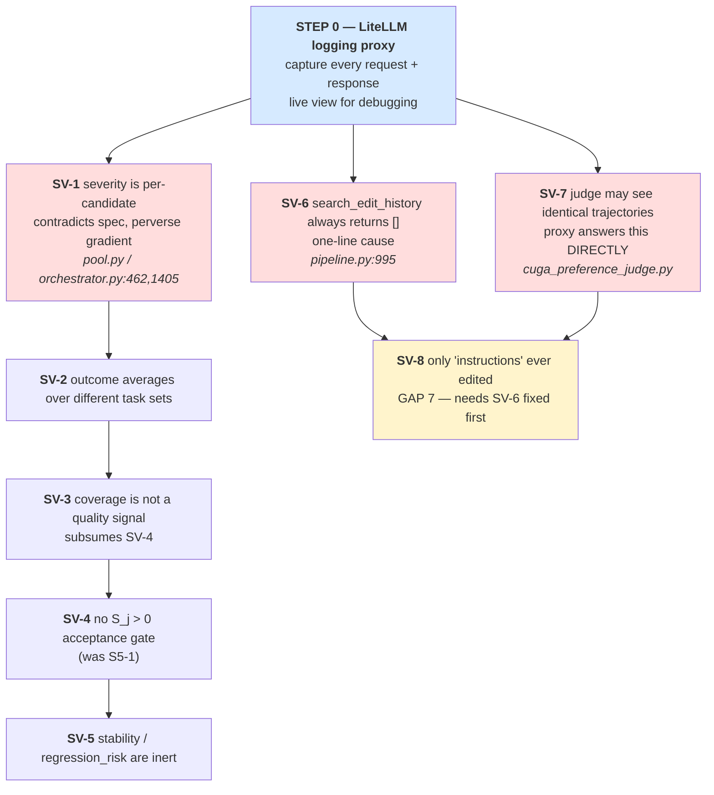

# SEVERE OPEN ISSUES — blocked on the LiteLLM proxy

**Status: all items here are DEFERRED until the LiteLLM logging proxy exists.**

These are not ordinary bugs. Every one of them shares a property: **the code runs
without error, produces a plausible number or an empty result, and there is
currently no way to see which.** A silent zero, an inert multiplier, and an
"efficient" crash all look like success from the outside.

The proxy is the prerequisite because it gives us the one thing missing —
**the exact request and response of every LLM call, in real time.** Without it:

- we cannot tell whether the judge received two *different* trajectories (**SV-7**)
  or the same one twice;
- we cannot tell whether a rubric change altered any actual verdict (**SV-1**
  verification), because offline tests can only assert that a substring exists;
- we cannot see which artifact surface the optimizer was *offered* versus which it
  chose (**SV-8**);
- we cannot see whether `search_edit_history` returned `[]` to the model
  (**SV-6**) — from the outside that is identical to a genuinely new issue.

Ordinary issues stay in `docs/OPEN-ISSUES.md`. This file is only for defects
where **the measurement instrument itself is untrustworthy**, so any number
produced before they are fixed carries an asterisk.

Cross-reference: `docs/architecture/IMPLEMENTED-PIPELINE-MAP.md` has the wiring
diagrams and formulas; `docs/research/rho-paper-prompt-fidelity.md` has the paper
deltas.

---

## Fix order (after the proxy is up)



Rationale for the order: **SV-1, SV-6, SV-7 are independent and cheap.** SV-1 is a
spec violation with a backwards gradient; SV-6 is one line; SV-7 the proxy answers
by inspection. The champion-math chain SV-2 → SV-5 must be done in sequence
because each changes what the next one measures. SV-8 depends on SV-6 (an editor
with no history cannot be expected to explore new surfaces).

---

# Group SV-A — the champion aggregate math is wrong

All four reproduced by **executing the real `PersistentPool`**, not by reading.

Effective ranking today (`core/pool.py:482`):

```python
aggregate = 0.55*outcome + 0.20*coverage + 0.15*stability - 0.10*regression_risk
#                                          ^^^^ =1.0 always   ^^^^ =0.0 always
# => both cancel in every comparison. Live formula is:
#    rank = 0.55*outcome + 0.20*coverage
```

`select_champion` decides **which harness is exported to `champion.json` and
carried into the next run via `--harness`**. It is not a survival gate inside a
round (`rho/rounds.py:561`: *"Rank orders the report and picks a champion; it
never decides survival"*), so the damage is to **chained multi-run experiments**,
where the error compounds each generation.

---

## SV-1 — `severity` is written per-candidate, contradicting its own spec

**Severity: CRITICAL. Perverse gradient — the system rewards looking broken.**

The design doc (`docs/architecture/selection-algorithms.md:295`) is unambiguous:

```
weighted(c, m) = score(c, t, m) * severity(t, m) * confidence(c, t, m)
```

`score` and `confidence` are indexed by candidate `c`. **`severity` is indexed
`(t, m)` only** — a task/mechanism difficulty weight, constant across candidates,
which therefore cancels in any comparison. `ScoreCell.severity`'s own docstring
(`core/pool.py:122`) agrees:

> *"`severity` is a property of the (task, mechanism) pair, so it is expected to
> be constant within a cell; the mean is a defensive summary."*

**The code writes something else.** `core/orchestrator.py:462` and `:1405` pass
`severity=analysis.severity` — the diagnoser's LLM judgment **of that candidate's
own rollouts**. Nothing enforces the invariant the docstring asserts.

### Reproduction — identical performance, different winner

Both candidates score a **perfect 1.0**. Only severity differs:

```text
lowsev   score=1.0  sev=0.2  ->  outcome=0.2000  agg=0.4600
highsev  score=1.0  sev=0.9  ->  outcome=0.9000  agg=0.8450  <== WINS
```

**The winner is whichever candidate the diagnoser was more alarmed about.**

### Reproduction — a perfect candidate scores 0.1

Because severity multiplies the score, and a *good* candidate causes the diagnoser
to report a *low* severity, fixing a problem shrinks your own multiplier:

```text
base     fails all 3 tasks (score 0.0, sev 1.0)  ->  outcome=0.0000  agg=0.3500
perfect  aces  all 3 tasks (score 1.0, sev 0.1)  ->  outcome=0.1000  agg=0.4050  <== WINS
```

A candidate that went from total failure to perfect earns `outcome = 0.1`, winning
by **0.055** — reversible by a single coverage cell (see SV-3). The improvement
signal is flattened by roughly 90%.

### Coupling with the GAP 2 prompt change (2026-08-19)

The new diagnoser anchors make *mere inconsistency* justify severity ≥ 0.4. Since
severity multiplies into `weighted_score` → `outcome` → champion, **that prompt
edit now raises the outcome of candidates that behave inconsistently.** The prompt
change is correct for diagnosis and actively harmful through this path. SV-1 must
be fixed before any run is treated as evidence.

**Proxy need:** to confirm severity is genuinely candidate-dependent in live runs
(not a constant the diagnoser happens to repeat), we need every diagnoser
response for the same task across candidates, side by side.

**Fix direction:** make severity `(task, mechanism)`-scoped per the spec — decided
once per task, reused for every candidate — or drop it from `weighted_score` and
keep it purely as an attention weight for the optimizer. Either restores the
docstring invariant; the second is simpler.

---

## SV-2 — `outcome` averages over different task sets

**Severity: HIGH. Not attempting a hard task raises your score.**

`_champion_outcome` (`core/pool.py:466`) is a two-level mean with **no shared-cell
restriction**. Cells with `rollout_count == 0` are skipped — correct on its own
("no evidence is not a zero") — but the resulting means are then compared across
candidates measured on *different* tasks.

```text
base   ran easy(0.9) + hard(0.1)   ->  outcome = 0.500  cov=1.000  agg=0.6250
candA  ran easy(0.9) only          ->  outcome = 0.900  cov=0.500  agg=0.7450  <== WINS
```

`candA` is **identical to base on the only task both attempted** and wins by
skipping the hard one. Under RHO's design (base gets `k x G`, candidates get
`k x R`) unequal task sets are the norm, not an edge case.

**Fix direction:** compute `outcome` over the **intersection** of cells both
entries have evidence for, and report the intersection size alongside it. Pairwise
rather than global — which is what `dominates`/`pareto_frontier` already do via
`min_comparable_rollouts`.

---

## SV-3 — `coverage` is not a quality signal, and carries 27% of the decision

**Severity: HIGH. A strictly worse candidate can be exported as champion.**

`_champion_coverage` (`core/pool.py:474`) measures **how much you measured**, not
how good you are:

```python
total_cells = { all (task,mech) cells with rollout_count>=1, UNIONED ACROSS THE POOL }
coverage    = |entry's cells & total_cells| / |total_cells|
```

Exchange rate: `cov 0.5 -> 1.0` buys `+0.100` aggregate, worth `0.100/0.55 =`
**0.18 of outcome**. Of the live weight (`0.75` total), coverage holds
`0.20/0.75 =` **27%**.

```text
base   outcome=0.600 cov=0.500 agg=0.5800
candB  outcome=0.550 cov=1.000 agg=0.6525  <== WINS
```

`candB` is **worse on every task both ran** (0.55 vs 0.60) and wins on coverage.

This is structural, not incidental: the architecture decision is that base gets
`G` rollout-group evidence while post-RHO candidates get `R` per selected task, so
base and candidates **systematically** differ in coverage. The formula reads that
budget asymmetry as quality. `pipeline.py:1295` already acknowledges the hazard in
one direction (*"Without base cells the incumbent's champion coverage is zero and
a candidate would win selection on coverage alone"*) and patches only
`coverage == 0`.

**Fix direction:** make coverage an **eligibility gate**, not a scored term — the
`champion_min_coverage_fraction` disqualifier already exists for exactly this.
Then rank on outcome alone over comparable cells. This subsumes SV-4.

---

## SV-4 — no `S_j > 0` acceptance gate (formerly S5-1)

**Severity: HIGH. Nothing requires a candidate to beat the base.**

RHO Algorithm 1 accepts candidate `j` only when `S_j > 0` — the mean oriented
preference over the coreset — *"otherwise the harness remains at `h_0`"*. The base
wins ties and wins by default.

Ours is an **argmax over an aggregate with base as just another row.** Verified by
introspecting the function source:

```text
select_champion contains 'preference': False
                         'mean_score': False
                         'is_base':    False
                         'base':       False
                         'S_j':        False
```

**The paper's `S_j` is computed and then ignored.** `preference_mean` exists at
`rho/rounds.py:596` and `pipeline.py:1662`, feeds `RoundSummary`, and never reaches
selection. `select_champion`'s signature has no parameter to receive it. Roughly
half the aborted run's wall clock went to symmetric judge calls
(2 calls/pair, `cuga_preference_judge.py:591`) that inform the report but not the
exported champion.

**Fix direction:** either plumb the oriented preference into selection and gate on
`> 0`, or (cheaper, no new plumbing) require `outcome > base_outcome` strictly
before a candidate is eligible. Interacts with protected floors and the entropy
safeguards — needs an explicit decision, not a silent patch.

---

## SV-5 — two of the four champion objectives are inert constants

**Severity: MEDIUM. The manifest overstates what selection considers.**

```python
stability       = 1.0   # hardcoded in select_champion, never computed
regression_risk = 0.0   # hardcoded in select_champion, never computed
```

Both are specified as functions in `selection-algorithms.md:330-331`. Neither was
implemented. They contribute a constant `+0.15` and `-0.0` to **every** entry, so
they cancel in all comparisons while `ChampionReport` still reports a four-term
aggregate as if all four were live.

A `blame_stability` field does exist on `ScoreProvenance`, set to `1.0` with
*"Single-call default; ablations vary this"* (`orchestrator.py:350`) — it feeds
nothing in champion selection.

**Fix direction:** implement them or delete them from the formula and the report.
Leaving inert terms in a published aggregate misrepresents the method.

---

# Group SV-B — the editors are blind

## SV-6 — `search_edit_history` always returns an empty list

**Severity: CRITICAL. A tool that silently lies "no prior attempts" on every call.**

The genetic editor has 16 tools including two history tools
(`cuga_editor_tools.py:25`). One of them never works.

### Root cause: split write path

`core/memory.py:278`:

```python
def record(self, attempt, artifact_group, lineage):
    if self.storage is not None:                            # <-- gate
        self.append(_attempt_to_memory_record(attempt))     # skipped when None
    self._attempts.append(attempt)                          # RAM only
    ...
```

`append()` is the **only** writer of `_records_by_issue`, and `retrieve()`
(`memory.py:372`) reads **only** `_records_by_issue`. And production constructs it
with no storage — `pipeline.py:995`:

```python
editor=CugaEditorAgent(adapter=adapter, memory=EditMemory(), log_sink=sinks["editor"])
#                                              ^^^^^^^^^^^^ no storage=
```

### Reproduction — executed

```text
storage backend: None
mem.record(attempt, ...)

len(mem)                   -> 1          # RAM store populated
mem.get("it1-0")           -> rejected   # get_attempt_outcome WORKS
mem.retrieve("issue-A", 5) -> ()         # search_edit_history returns EMPTY
mem._records               -> []
```

So of the two history tools:

| Tool | Reads | Works? |
| --- | --- | --- |
| `get_attempt_outcome(id)` | `_by_id` (RAM) | **yes** |
| `search_edit_history()` | `retrieve()` → `_records_by_issue` | **no — always `[]`** |

The editor cannot discover an id to pass to the working tool, because the tool that
lists ids is the broken one.

**Retry budget is unaffected** — `orchestrator.py:657` uses
`edit_memory.retry_budget.is_exhausted(...)`, which is in-RAM. Retry exhaustion
works correctly even though history retrieval does not, which is exactly why this
went unnoticed.

**Proxy need:** the proxy shows the literal tool result the model received. An
empty history array in the request log is unambiguous evidence; from the outside
it is indistinguishable from a genuinely new issue.

**Fix direction (two lines, both needed):**

1. `pipeline.py:995` — pass `storage=storage`. That object is already in scope two
   lines below at `pipeline.py:999`.
2. `memory.py:278` — index `_records_by_issue` **unconditionally**, so retrieval
   works in RAM. Otherwise "history works" silently depends on a persistence flag,
   which is the bug, not the fix.

Related: **S4-7** in `OPEN-ISSUES.md` (attempt records not persisted) is the same
root cause seen from the persistence side.

---

## SV-7 — the preference judge may be receiving identical trajectories

**Severity: CRITICAL. If true, every preference score ever collected is void.**

Carried over from `OPEN-ISSUES.md` **S1-7**, unresolved. Observed live: the judge
reported

```text
Are events identical? True
Are raw strings identical? True
```

and then correctly scored `0.0`. Two readings, indistinguishable from outside:

1. genuine unchanged behaviour (candidate edit had no effect), or
2. a wiring bug feeding the same trace into both slots.

`read_baseline()` and `read_candidate()` (`cuga_preference_judge.py:392,400`) are
distinct closures over `baseline_slot` / `candidate_slot`, so the defect — if real
— is upstream, in what the pipeline hands them. Note **S1-1** (candidate rollouts
stamped `harness_version: base`) is a plausible mechanism.

**The judge prompt is not the suspect.** Do not "fix" the rubric for this.

**Proxy need — this is the cleanest case for it.** The proxy logs both tool results
verbatim in the same request. Identical payloads under two different slot names is
a direct answer, requiring no new instrumentation.

**Also add offline:** a test asserting `read_baseline()` and `read_candidate()`
return different payloads when given deliberately different traces. That is a real
behavioural test, unlike a prompt-substring assertion.

---

## SV-8 — every candidate ever produced edits only `instructions`

**Severity: HIGH. We do not satisfy the paper's "full harness" axis.**

RHO Table 5 claims: *"Full harness: edits executable **tools and skills**, not
memory or prompt text alone."* Its harness is a directory of real executables
(Listing 8 `bin/repair-verify`, Listing 11 `tools/validate_mask_csv.py`,
Listing 13 `are_helper.py`).

**Ours has never edited anything but `instructions`** — including in a run whose
prompt explicitly invited creating a skill. So on the paper's own axis we are the
*"prompt text alone"* case.

The capability is not obviously missing: `cuga_rho_optimizer.py:51` sets
`CREATABLE_PREFIX = "skills/generated-"` and the prompt documents all four surfaces
(`instructions`, `skills/`, `policies/`, `memory/`). So the question is **why the
optimizer never chooses them.**

### A structural reason, newly identified

The RHO optimizer is **blind by construction**. Verified:

```text
cuga_rho_optimizer.py:  EditMemory imported: False
                        'history' mentions:  0
                        search_edit_history: 0
                        list_parents:        0
```

It has **9 tools** vs the genetic editor's 16 — no history, no parents, no trace
access. Each of the `N` proposals in a round is fully independent: no knowledge of
prior rounds, and no knowledge of its sibling proposals in the same round.
**Nothing can tell it that "edit instructions" has already been tried N times**, so
there is no pressure toward an unexplored surface.

The genetic editor *could* know — and cannot, because of SV-6.

**Also missing:** an executable-tool artifact class. `cuga_editor_tools.py` is the
*editor's own* toolset, not an evolvable surface. There is no artifact type whose
content is a runnable script.

**Proxy need:** to see which `list_artifacts` roster the optimizer was offered
versus what it staged, and whether it ever considered a non-`instructions` surface
before choosing.

**Fix direction:** after SV-6, give the RHO optimizer surface-history awareness
(which surfaces prior candidates already touched, and how those fared), then decide
whether to add a tools artifact class. Not a prompt-wording fix.

---

# Group SV-C — evidence hygiene

## SV-9 — crashed rollouts are indistinguishable from lean ones in code

**Severity: HIGH. Contaminates efficiency, consistency, and entropy signals.**

Formerly S5-2. In `data/cachefix_traces/` (29 rollouts) **all six 13-event
rollouts are `status=error`, `graph_node_error=4`, with no answer** — the shortest
trajectories in the corpus are crashes:

```text
event_count over 29 rollouts:  min=13  median=31  max=127
ALL SIX 13-event rollouts:     status=error, NO answer
all 23 successful rollouts:    25..127 events, llm_call_start 3..17
```

Consequences:

- any "fewer steps is better" metric ranks these six crashes **above all 23
  successful rollouts** — a rubric that rewards crashing;
- any consistency metric reads their divergence as a harness gap when it is
  transport failure.

The GAP 1/2/3 rubric wording now tells the judge and diagnoser to exclude them,
**but nothing in the code does.** Aggregation, entropy, and diagnosis all still
treat a crashed rollout as an ordinary one.

Blocked on **S1-6** (`trace.error` never reaches `manifest.json`), which is what
makes the exclusion impossible to automate downstream.

**Fix direction:** propagate `trace.error`/`status` into the manifest, then exclude
non-`success` rollouts from scoring cells, entropy, and diagnosis input — counting
them separately as infrastructure failures rather than evidence.

---

## What the proxy must capture to close these

| Need | Serves |
| --- | --- |
| Full request + response body, per call, correlated to `(candidate, task, rollout, phase)` | all |
| Verbatim **tool results** as the model saw them | SV-6, SV-7, SV-8 |
| Response `id` and `x-litellm-cache-key` | cache verification (U-1 regression guard) |
| Diagnoser severity per `(candidate, task)`, side by side | SV-1 |
| `list_artifacts` roster offered vs artifact staged | SV-8 |
| Both slot payloads within one judge request | SV-7 |
| Live view of request/mocked-response while debugging | all |

Note: temperature injection is **not** a proxy goal —
`azure/gpt-5.6-luna` rejects any non-default `temperature` upstream
(measured: `0.0` and `0.7` → HTTP 400; only `1.0` accepted). See
`reference/cuga_example_wrapper/docs/cuga-integration-learnings.md`.

---

## Standing caveat until this file is empty

No number produced before these are fixed is a clean measurement of harness
quality. Specifically:

- champion selection can prefer a **worse** candidate (SV-1, SV-2, SV-3, SV-4);
- the genetic editor operates with **no history** (SV-6);
- the RHO optimizer operates with **no history and no parents** (SV-8);
- preference scores may be **self-comparisons** (SV-7);
- crashed rollouts are counted as **evidence** (SV-9).

Any reported delta must state which of these were still open when it was measured.
