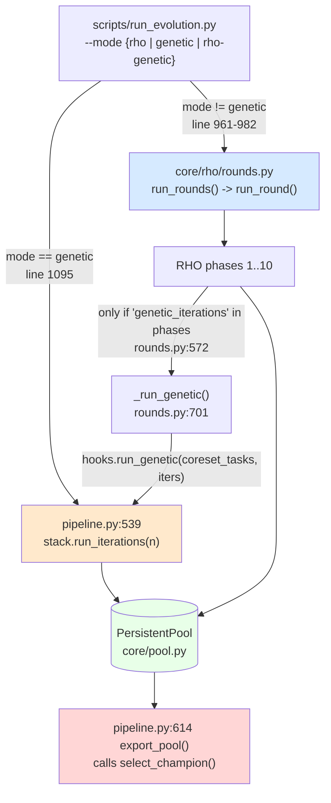
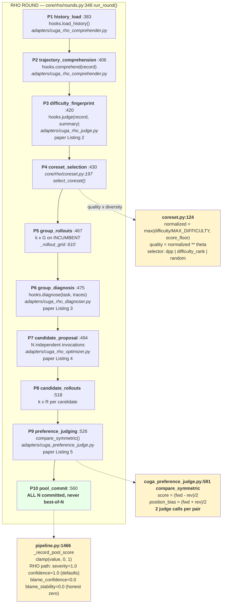
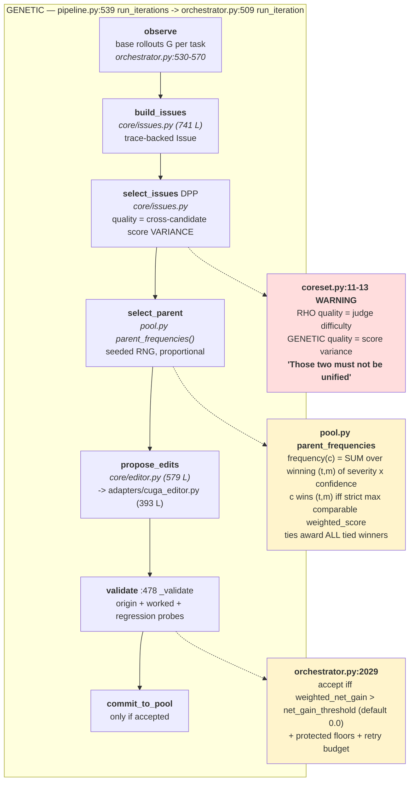
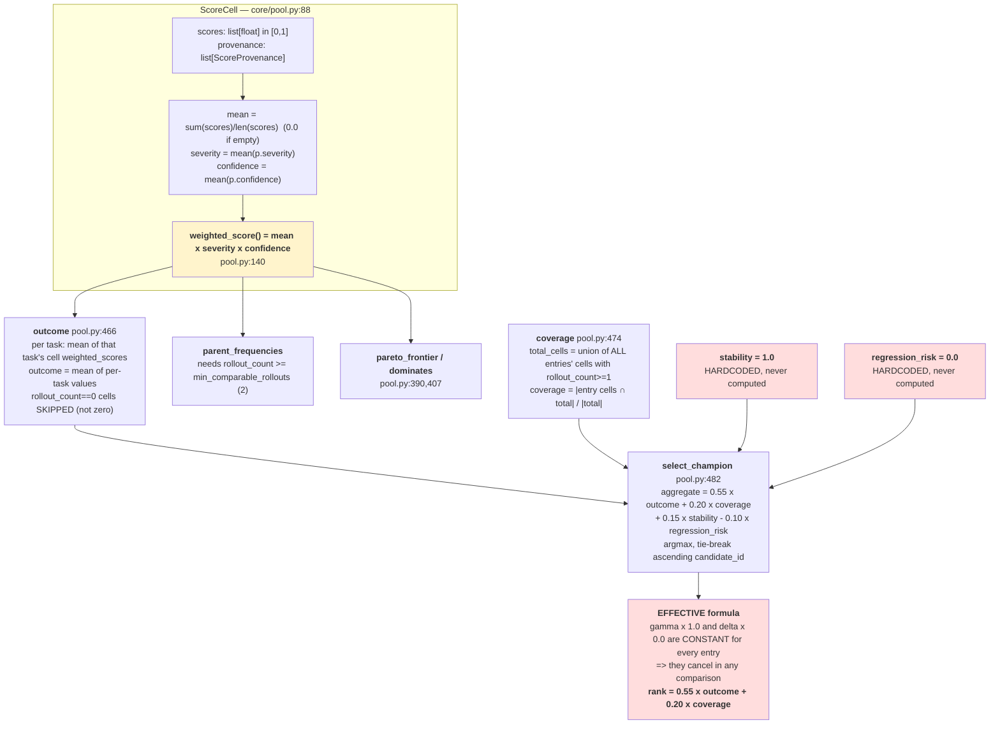
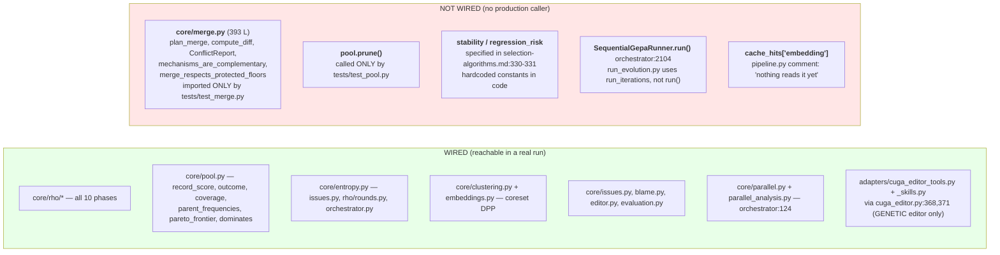
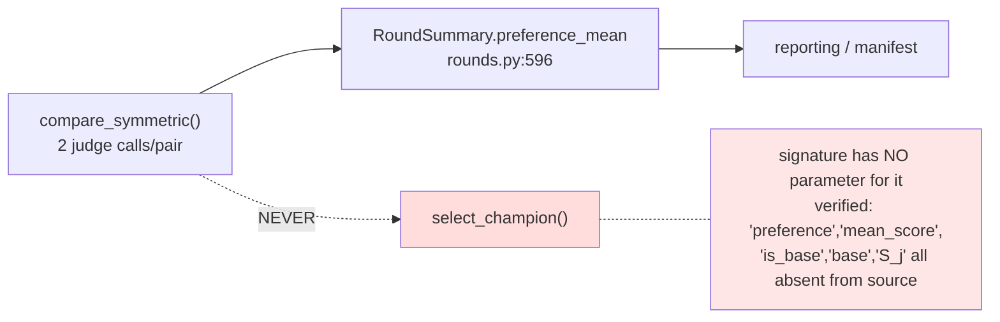
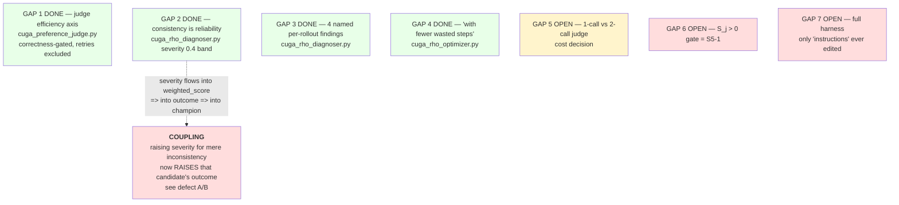
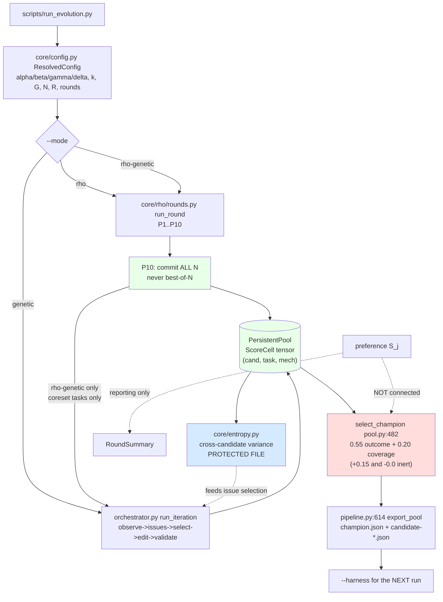

# Implemented Pipeline Map — what is actually wired, 2026-08-19

Derived by reading the code and by executing it, not from the design docs. Where
code and design doc disagree, the **code** is reported here and the divergence is
flagged.

> **First, a correction to a premise.** `select_champion` is **not** part of the
> genetic stage. It lives in `core/pool.py:482` and is called from exactly three
> places, none of them inside the genetic loop:
>
> ```
> core/orchestrator.py:2117   SequentialGepaRunner.run()   <- multi-attempt entry, NOT used by run_evolution.py
> pipeline.py:609             champion_version()           <- reporting
> pipeline.py:632             export_pool()                <- writing champion.json
> ```
>
> It is a **post-hoc reporting/export selector over the whole pool**, shared by
> all three modes. The genetic loop never consults it, and `run_round` never calls
> it — `rounds.py:561` says *"Rank orders the report and picks a champion; it never
> decides survival."* So the S5-1 finding is about **which harness you export and
> carry into the next run**, not about survival inside a round.

---

## 1. Three modes, one code path

`core/rho/rounds.py:69`

```python
PHASES = {
  "rho":         _RHO_PHASES,                              # 10 phases
  "genetic":     ("genetic_iterations",),                  # legacy GEPA loop only
  "rho-genetic": _RHO_PHASES + ("genetic_iterations",),    # RHO then genetic
}
```



**Key wiring fact:** the genetic phase is not a reimplementation. `pipeline.py:1334`
narrows `stack.tasks` to the coreset, calls the *same* `run_iterations`, and
restores it in `finally`. The comment states why: *"byte-for-byte the loop that
produced the measured baseline."*

---

## 2. RHO stage — 10 phases, with file mapping and formulas



### Phase-to-file table

| Phase | rounds.py line | Hook | Implementation | Paper |
| --- | --- | --- | --- | --- |
| 1 history_load | 383 | `load_history` | `core/rho/history.py` + `adapters/cuga_rho_comprehender.py` | — |
| 2 trajectory_comprehension | 406 | `comprehend` | `adapters/cuga_rho_comprehender.py` (600 L) | — |
| 3 difficulty_fingerprint | 420 | `judge` | `adapters/cuga_rho_judge.py` (541 L) | Listing 2 |
| 4 coreset_selection | 430 | — (core) | `core/rho/coreset.py:197` | §4.1 |
| 5 group_rollouts | 467 | `rollout` | `adapters/cuga_adapter.py` | Listing 1 |
| 6 group_diagnosis | 475 | `diagnose` | `adapters/cuga_rho_diagnoser.py` (660 L) | Listing 3 |
| 7 candidate_proposal | 494 | `propose` | `adapters/cuga_rho_optimizer.py` (795 L) | Listing 4 |
| 8 candidate_rollouts | 518 | `rollout` | same adapter, `R` per task | — |
| 9 preference_judging | 526 | `compare` | `adapters/cuga_preference_judge.py` (703 L) | Listing 5 |
| 10 pool_commit | 560 | `commit` | `core/pool.py` `record_score` | Alg. 1 |

---

## 3. Genetic stage — the legacy GEPA loop

Lifecycle per `orchestrator.py:865`:

```
observe -> build_issues -> select_issues -> select_parent -> propose_edits
        -> validate -> commit_to_pool
```



**Two different quality functions, deliberately.** `coreset.py:11-13` is explicit:
RHO's DPP quality is *judge-assigned difficulty*; genetic issue-selection quality
is *cross-candidate score variance*. They answer different questions and must not
be merged. This is also why `run_genetic` receives **coreset tasks only**
(`rounds.py` docstring): variance needs a populated `(task, mechanism)` cell, and
after a RHO round cells exist only for the coreset. Off-coreset variance is
*undefined*, not low.

---

## 4. The scoring tensor and every selection formula



### Disqualifiers applied BEFORE ranking

```python
# pool.py:482 select_champion
if entry.candidate_id in protected_floor_violations:  continue   # disqualified
if coverage < min_coverage_fraction:                  continue   # disqualified
if not scored: raise ValueError("no eligible candidates")
```

---

## 5. Wired vs NOT wired — verified by grep + execution



### CROSSOVER IS NOT IMPLEMENTED IN ANY RUNNABLE PATH

`AGENTS.md` states crossover is *"provenance-preserving deterministic merge by
default."* `core/merge.py` implements exactly that — 393 lines, `plan_merge`,
`ConflictResolution`, `merge_respects_protected_floors`. **Nothing in `src/`
imports it.** Verified:

```bash
grep -rn 'core.merge' src/ tests/ scripts/ | grep -v 'core/merge.py:'
#  tests/test_merge.py:8   <- only caller
```

`orchestrator.py:867` confirms scope: *"Merge, parallel batching, RHO proposal
generation, tracing, checkpoints, and replay are explicitly out of scope for
Phase 6."* So the genetic stage is **mutation-only**. The `donor_count: int = 2`
field (`orchestrator.py:947`, "Donor parents offered to the editor alongside the
primary") hands donors to an LLM editor as *context*; it does not run the
deterministic merge planner.

---

## 6. Known defects in the selection math

All four reproduced by executing the real `PersistentPool`.

| # | Issue | Evidence |
| --- | --- | --- |
| **A** | **Severity is per-candidate, contradicting the spec.** `selection-algorithms.md:295` defines `weighted = score(c,t,m) * severity(t,m) * confidence(c,t,m)` — severity indexed by `(t,m)` **only**. `ScoreCell.severity` docstring agrees: *"a property of the (task, mechanism) pair… constant within a cell."* But `orchestrator.py:462,1405` write `severity=analysis.severity`, the diagnoser's judgment **of that candidate**. | Two candidates both scoring a perfect `1.0`: `sev=0.2` → outcome `0.200`; `sev=0.9` → outcome `0.900`. **The more alarming-looking candidate wins on identical performance.** |
| **B** | **Perverse gradient.** Because severity multiplies the score and a *good* candidate makes the diagnoser report *low* severity, fixing a problem shrinks your own multiplier. | base fails all 3 (`0.0`, sev `1.0`) → outcome `0.0000`, agg `0.3500`. Candidate aces all 3 (`1.0`, sev `0.1`) → outcome `0.1000`, agg `0.4050`. A perfect candidate scores **0.1**, winning by 0.055 — reversible by one coverage cell. |
| **C** | **Coverage is not quality.** It measures how much you *measured*. Exchange rate: `cov 0.5→1.0` = `+0.100` aggregate = `0.100/0.55 = 0.18` of outcome. **A candidate can be 0.18 worse in weighted score and still win.** Structural, since base gets `G` rollouts and post-RHO candidates get `R` per task by design. | base `outcome=0.600 cov=0.500 agg=0.5800`; candB `outcome=0.550 cov=1.000 agg=0.6525` → **worse candidate exported as champion**. |
| **D** | **`outcome` averages over different task sets.** No shared-cell restriction. | base ran easy(0.9)+hard(0.1) → `outcome 0.500`. candA ran only easy(0.9), identical where compared → `outcome 0.900`, **wins by skipping the hard task**. |

Tracked as **S5-1** (no `S_j > 0` acceptance gate) and **S5-2** (crashed rollouts)
in `docs/OPEN-ISSUES.md`. Items A–D above are the fuller picture.

### Where the preference score goes



The paper's `S_j` — the mean oriented preference — **is computed** (`pipeline.py:1662`,
`rounds.py:596`) and **is never consulted by champion selection**. Roughly half the
aborted run's wall time went to judge calls that inform the RHO round's report but
not the exported champion.

---

## 7. Paper-fidelity status of the prompts

`docs/research/rho-paper-prompt-fidelity.md` — GAPs 1–4 implemented 2026-08-19.



**GAP 7 confirmed at the code level.** `cuga_rho_optimizer.py:51` sets
`CREATABLE_PREFIX = "skills/generated-"` and the prompt documents all four
surfaces (`instructions`, `skills/`, `policies/`, `memory/`), so the *capability*
exists. But no run has produced a candidate editing anything except
`instructions`, and there is **no executable-tool artifact class** — the paper's
harness contains real executables (`bin/repair-verify`,
`tools/validate_mask_csv.py`). `cuga_editor_tools.py` is the *editor's own*
toolset, not an evolvable surface.

---

## 8. End-to-end, one picture



---

## 9. Summary — what to trust

**Solid and wired:** all 10 RHO phases; the score tensor and its provenance
discipline (`rollout_count==0` is not a zero; `rollout_seq` must be the next slot);
persistent-pool retention of all N candidates; the two-quality-function separation;
entropy; coreset DPP with a documented quality-only fallback.

**Wired but mathematically wrong:** `select_champion`. Four independent defects
(A–D), each reproduced. It decides which harness gets **exported and carried into
the next run**, so a chained multi-run experiment compounds the error.

**Not wired at all:** `core/merge.py` — i.e. **crossover does not run**, despite
being an architecture decision in `AGENTS.md`. Also `pool.prune`,
`SequentialGepaRunner.run`, and 2 of the 4 champion objectives.

**Recommended order:** (A) severity → per-task, smallest change and it removes the
perverse gradient; (D) restrict `outcome` to shared cells; (C) make coverage an
eligibility gate rather than a scored term — subsumes S5-1; (2) delete or implement
`stability`/`regression_risk`. All are changes to selection semantics and none
should be made without an explicit decision.
