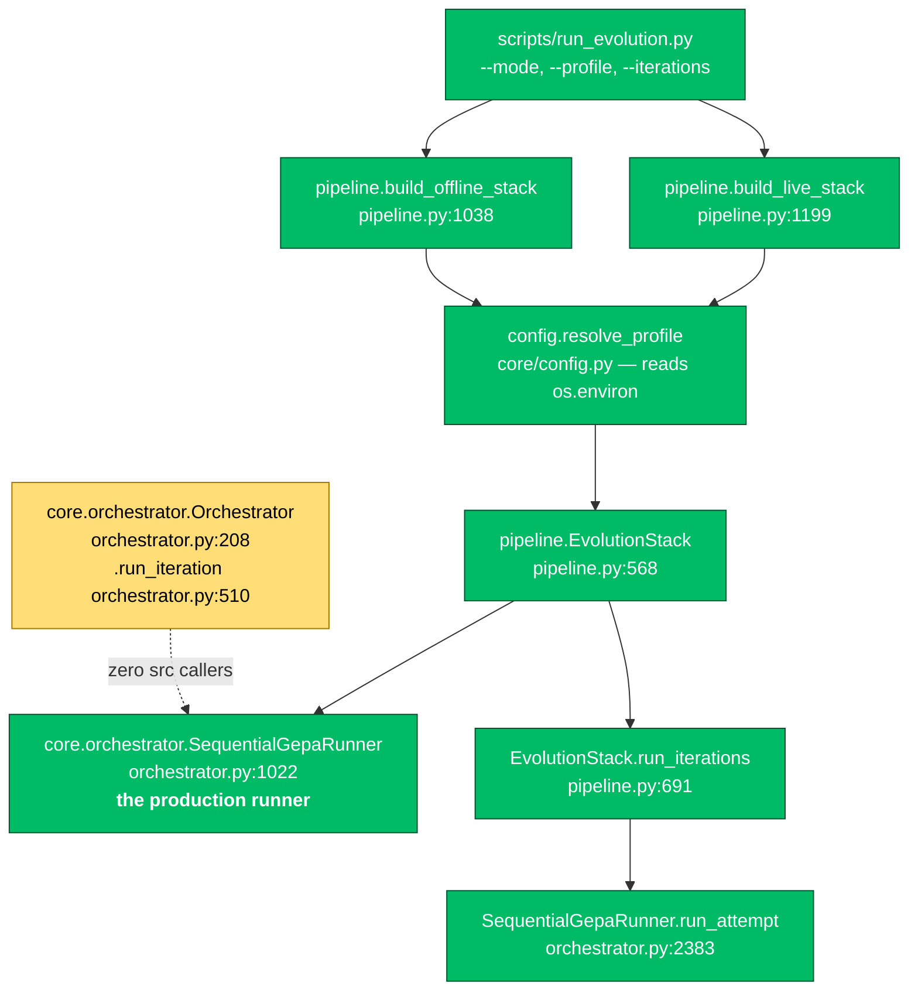
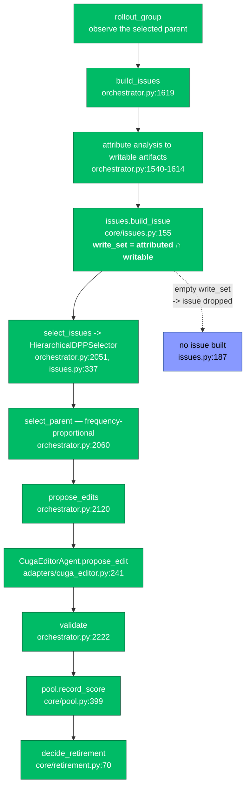
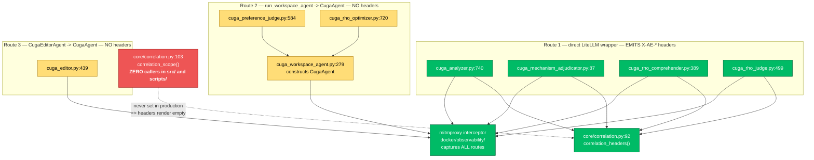
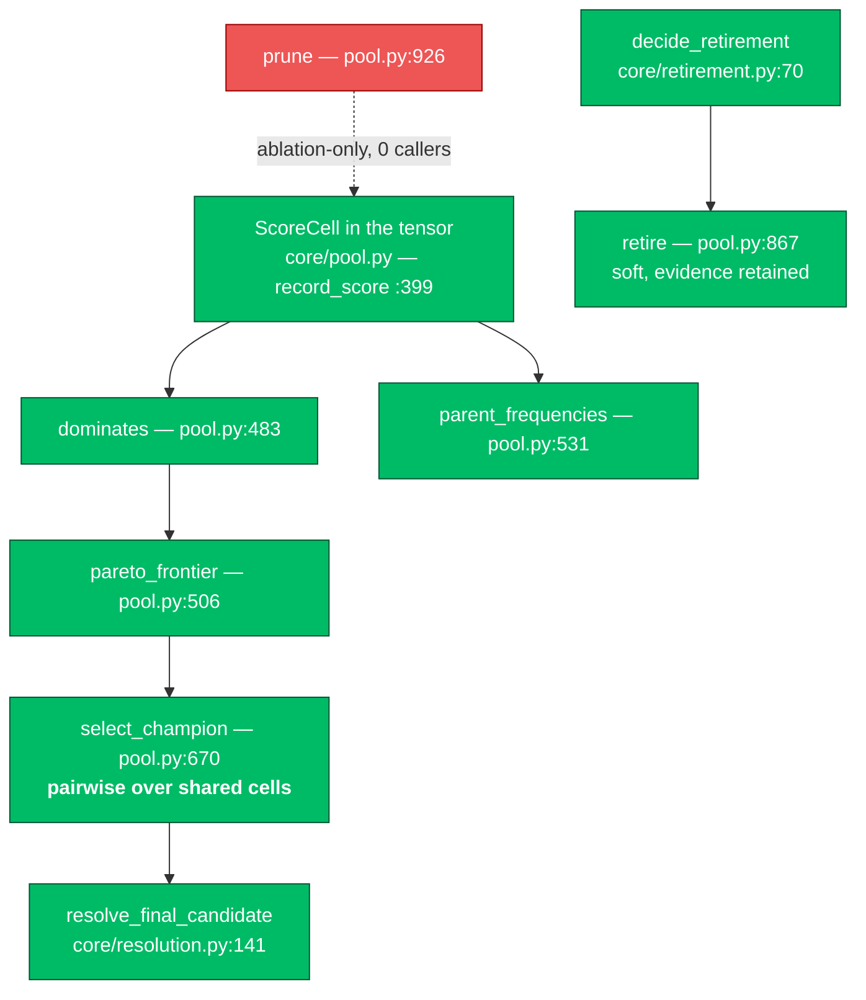
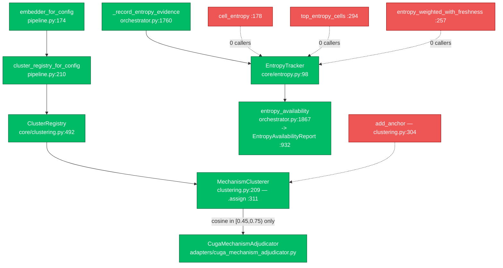
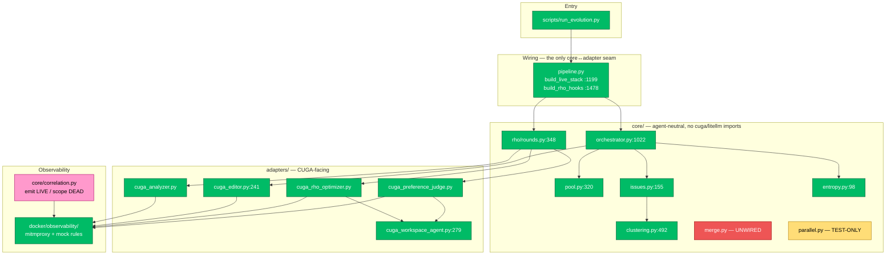

# Implemented Pipeline Map

**What this file is.** A map of what the code *actually does today*, with a
`file:line` anchor on every claim so you can jump straight to the source and check
it. It is deliberately not the target architecture — for that read
`target-rho-parallel-gepa.md`. Where the two diverge, this file wins for questions
of the form *"is that wired?"*.

**Status of this map: audited 2026-08-21 against `dev7` by static analysis, covering
reachability only.** Every **LIVE / GATED / TEST-ONLY / DEAD / ABSENT** marker below
was derived by parsing the code — an AST call-graph over all of `src/`, plus AST
import checks and targeted structural greps. A reachability claim means "a caller
exists / does not exist", established statically. The exact commands are in §11 so
you can re-run them.

*Excluded from that audit:* no claim here was confirmed by executing a full live
run — across all three mode **branches** and every one of the ten RHO **routes**,
none was observed end to end. Static reachability is not runtime behaviour, so
nothing in this document is evidence of a **behavioural gain**. Two exclusions
worth naming because they are easy to over-read: entropy is not known to clear its
evidence floors in practice, and no real model's artifact-surface *preference* has
been measured (§10).

Suite at time of writing: **2105 passed, 1 skipped, 0 failed**.

---

## Legend

Used in every diagram and table below.

| Marker | Meaning |
| --- | --- |
| **LIVE** | Reachable from a production entry point (`scripts/run_evolution.py`) and executes |
| **GATED** | Implemented and reachable, but off under the default profile |
| **TEST-ONLY** | Implemented, exercised by tests, **no** production caller |
| **DEAD** | Defined, zero callers anywhere in `src/` |
| **ABSENT** | Not implemented at all |

A note on why `TEST-ONLY` and `DEAD` are separated: a green test suite proves code
*runs*, never that it runs *in production*. Across all 2105 passing cases, several
**modules** listed in §8 are fully tested and still unreachable on the live path —
`core/merge.py` and `core/parallel.py` are the two largest.

---

## 1. The production spine

The one path a real run takes. Everything else in this document hangs off it.



**The `Orchestrator` / `SequentialGepaRunner` split matters and is easy to trip
over.** `Orchestrator.run_iteration` (`orchestrator.py:510`) has **zero callers in
`src/`**. `SequentialGepaRunner` is what both stack builders construct
(`pipeline.py:1140`, `pipeline.py:1333`). Reading `run_iteration` to understand a
live run will mislead you.

---

## 2. Modes and phases

Modes are data, not branches: `PHASES` in `core/rho/rounds.py` maps a mode name to
an ordered phase tuple, and `phases_for(mode)` (`rounds.py:76`) resolves it.

| Mode | Phase sequence | Status |
| --- | --- | --- |
| `genetic` | `("genetic_iterations",)` | **LIVE** |
| `rho` | the 10 `_RHO_PHASES` | **LIVE** |
| `rho-genetic` | `_RHO_PHASES + ("genetic_iterations",)` | **LIVE** |

```mermaid
flowchart LR
    subgraph RHO["_RHO_PHASES — core/rho/rounds.py, driven by run_round rounds.py:348"]
        direction TB
        P1["1 history_load<br/>hook: load_history"]:::live
        P2["2 trajectory_comprehension<br/>cuga_rho_comprehender.py"]:::live
        P3["3 difficulty_fingerprint<br/>cuga_rho_judge.py"]:::live
        P4["4 coreset_selection<br/>core/rho/coreset.py:188"]:::live
        P5["5 group_rollouts<br/>_rollout_grid rounds.py:622"]:::live
        P6["6 group_diagnosis<br/>cuga_rho_diagnoser.py"]:::live
        P7["7 candidate_proposal<br/>cuga_rho_optimizer.py"]:::live
        P8["8 candidate_rollouts"]:::live
        P9["9 preference_judging<br/>cuga_preference_judge.py"]:::live
        P10["10 pool_commit<br/>_record_scores rounds.py:680"]:::live
        P1-->P2-->P3-->P4-->P5-->P6-->P7-->P8-->P9-->P10
    end
    P10 -->|"mode rho-genetic only"| G["genetic_iterations<br/>_run_genetic rounds.py:740"]:::live
    classDef live fill:#0b6,stroke:#053,color:#fff
```



**`core/rho/rounds.py` may not import `cuga`, `litellm`, or
`agent_evolve.adapters`.** Every model call arrives as an injected callable on
`RhoHooks` (`rounds.py:162`); `hooks.require(name)` (`rounds.py:251`) raises rather
than silently skipping a phase. All 17 hooks are bound in one place —
`pipeline.build_rho_hooks` (`pipeline.py:1478`) — which is the only module allowed
to tie core to adapters.

---

## 3. Genetic loop, as it actually executes



`issues.py:186` is the single most consequential line for SV-8:

```python
write_set = tuple(sorted(aid for aid in attributed if aid in writable_ids))
if not write_set:
    return None          # issues.py:187 — no writable attribution, no issue
```

The offered surface is therefore *analyzer blame ∩ adapter-declared writable*, not
simply whatever the harness contains.

---

## 4. Artifact surfaces — seeded, offered, delivered

All four surfaces are **LIVE** as of 2026-08-21, verified at the LLM layer through
the interception proxy (see `docs/SEVERE-OPEN-ISSUES.md`, SV-8 "Proxy
verification").

```mermaid
flowchart LR
    HV["HarnessVersion<br/>benchmarks/cuga_executor.py:309<br/>VANILLA_HARNESS :489"]:::live
    HA["pipeline._harness_artifacts<br/>pipeline.py:1395<br/>seeds one EMPTY slot per surface"]:::live
    REG["CugaAdapter.register_candidate<br/>adapters/cuga_adapter.py:68"]:::live
    INV["artifact_inventory<br/>-> 4 writable descriptors"]:::live
    TOOL["list_artifacts tool<br/>cuga_editor_tools.py:118"]:::live
    APPLY["apply_structured_edits<br/>adapters/cuga_adapter.py"]:::live
    HC["_harness_config<br/>rollout payload groups"]:::live
    MAT["materialize_harness<br/>cuga_wrapper/__init__.py:304<br/>writes skills/&lt;n&gt;/SKILL.md"]:::live

    HV --> HA --> REG --> INV --> TOOL --> APPLY --> HC --> MAT
    classDef live fill:#0b6,stroke:#053,color:#fff
```



| Surface | Concrete id | Creatable prefix | Delivery route |
| --- | --- | --- | --- |
| `instructions` | `instructions` | — (scalar, always present) | assembled into context **every turn**, unconditional |
| `skills/<name>` | `skills/generated-evolved` | `skills/generated-` | body enters context only if the model calls `load_skill`; first line becomes the selection `description:` |
| `policies/<name>` | `policies/generated-evolved` | `policies/generated-` | loaded up front, applied only when its intent trigger matches |
| `memory/<name>` | `memory/generated-evolved` | `memory/generated-` | retrievable facts; does **not** govern behaviour |

Prefixes are `DEFAULT_CREATABLE_PREFIXES` at
`adapters/cuga_editor_state.py:58`; the surface-routing guidance the editor is
given lives in `EDITOR_INSTRUCTIONS`, `adapters/cuga_editor_skills.py:25`.

**Residual gap (not a wiring defect).** The concrete ids for the three group
surfaces contain the slot name `generated-evolved`, which appears **nowhere** in
the turn-1 request; only `instructions` is nameable before `list_artifacts` is
called. That asymmetry is the surviving explanation for the historical
"only `instructions`" observation. Full detail in `SEVERE-OPEN-ISSUES.md` SV-8.

---

## 5. LLM call topology and observability

**This is the section most likely to surprise you.** There are three distinct ways
the system reaches a model, and they differ in whether the call can be correlated.



| Fact | Status | Anchor |
| --- | --- | --- |
| CUGA-internal calls **are** captured by the proxy | **verified 2026-08-21** | 3 flows from one editor run; `docker/observability/README.md` |
| 4 adapters emit `X-AE-*` on the wire | **LIVE** | the four line refs above |
| `correlation_scope` ever *sets* a label in production | **DEAD** | 0 callers in `src/`, 0 in `scripts/`, 12 in `tests/` |
| Judge / optimizer / editor calls carry labels | **ABSENT** by construction | routes 2 and 3 bypass the wrappers |

**Consequence to hold onto.** Correlation is only half-wired: the *emit* side
exists, the *set* side has no production caller, so today every captured flow is
unlabelled and must be grouped by timestamp and body content. Claims elsewhere
that correlation is "DONE" refer to the emit side only.

---

## 6. Scoring, selection, retirement



Two invariants that are load-bearing and non-obvious:

- **Champion ranking is pairwise over the cells two candidates share**
  (`pool.py:670`). The weighted aggregate is a *reported diagnostic*, not a
  decision rule — mechanism-keyed pool cells would make the shared-cell
  intersection empty and regress this **silently**.
- **Retirement is soft** (`pool.py:867`). Score cells, lineage and the preference
  record are all retained; only parent sampling, the frontier and champion
  selection exclude a retired entry. `prune()` is ablation-only and has no caller.

---

## 7. Mechanism clustering and entropy



- Shipped band `[0.45, 0.75)` with `join_threshold = 0.75`
  (`core/clustering.py` `DEFAULT_BAND_LOW` / `DEFAULT_BAND_HIGH` /
  `DEFAULT_JOIN_THRESHOLD`). Cosine alone cannot separate analyzer paraphrase from
  a genuinely different fault, so the dedup LLM is **load-bearing**, not a cost
  optimisation.
- Mechanism identity is **task-local by design**. Cross-task pooling is deferred;
  `add_anchor` is dead *and* known not to work as built (anchors embed bare
  mechanism text, observations embed mechanism + actor + artifacts).
- **Live reads:** `.entropy()` (`:213`), `.classify()` (`:233`), `.all_cells()`
  (`:274`). **Dead reads:** the three above.
- Pool cells stay constant-keyed while tracker cells are mechanism-keyed — the two
  structures need opposite key policies. See the long comment at
  `orchestrator.py:1022+`.

---

## 8. Not wired — the honest list

| Item | Where | Status | Why it matters |
| --- | --- | --- | --- |
| **Crossover / merge** | `core/merge.py` (393 lines) | **DEAD** — zero importers in `src/` | `plan_merge` (`:267`), `compute_diff` (`:69`) fully built and unreachable. Provenance-preserving merge is a target-architecture decision with no runnable path |
| **Parallel batch execution** | `core/parallel.py`; branch at `orchestrator.py:638` | **TEST-ONLY** | `use_parallel_batch=True` exists only on `RESEARCH_PARALLEL`/`FULL_ABLATION` (`orchestrator.py:170`/`:178`), which are referenced **only by tests**. `config.py _PROFILES` independently lists `parallel_execution` as *deferred* |
| **`Orchestrator.run_iteration`** | `orchestrator.py:510` | **TEST-ONLY** | zero `src/` callers; live path is `run_iterations` -> `run_attempt` |
| **`correlation_scope`** | `core/correlation.py:103` | **DEAD in production** | headers render empty; see §5 |
| **`pool.prune`** | `pool.py:926` | **DEAD** | intentional — ablation only |
| **`add_anchor`** | `clustering.py:304` | **DEAD** | and defective as built |
| **3 entropy read APIs** | `entropy.py:178/257/294` | **DEAD** | no consumer |
| **`entropy_unavailable_reason`** | `orchestrator.py:1998` | **DEAD** | `entropy_availability` (`:1867`) has 2 callers; the per-task reason accessor has none |
| **Executable-tool artifact class** | — | **ABSENT** | RHO Table 5's harness includes runnable scripts; no artifact type here has executable content |
| **Checkpoint / counterfactual replay** | — | **ABSENT** | no adapter reports a valid checkpoint capability; replay must never be assumed |
| **Cross-task mechanism identity** | — | **ABSENT, deferred** | needs a design decision, not a patch |

---

## 9. End-to-end, one picture



---

## 10. What to trust

**Trust as measured.** The 10 RHO phases and their hook bindings; the genetic
attempt loop; four-surface seeding, offering and delivery; pairwise champion
ranking; soft retirement; the dedup band and its live calibration; proxy
interception including CUGA-internal calls.

**Do not trust without a live run.** Any claim about *behavioural gain*. No
end-to-end correlation-captured run has been performed. Entropy has been observed
reporting `3/3 cells unavailable = 100% fallback (floor_unmet=3)` on an offline
loop, so it is honest but not yet known to clear its floors in practice.

**Treat as unmeasured.** Which artifact surface a real unmocked model *prefers*.
The arm that captured the roster was mocked, so the staged surface was dictated by
the mock rule, never chosen by a model.

### Recommended reading order for a change

1. This file, §1 and §8 — what runs, what does not.
2. `SEVERE-OPEN-ISSUES.md` — the defects where the instrument itself is suspect.
3. `selection-algorithms.md` — the formulas §6 references.
4. `docs/design/issue-lifecycle.md` — clustering decisions D1–D4.

---

## 11. How to re-verify this map

These are the checks that produced it. Re-run them after any structural change;
each is cheap and none needs a model call.

```bash
# 1. Dead-code audit: definitions with zero callers in src/
python3 - <<'PY'
import ast
from pathlib import Path
calls, defs = {}, {}
for p in Path('src').rglob('*.py'):
    if '__pycache__' in str(p): continue
    tree = ast.parse(p.read_text())
    for n in ast.walk(tree):
        if isinstance(n, (ast.FunctionDef, ast.AsyncFunctionDef)):
            defs.setdefault(n.name, []).append(f"{p}:{n.lineno}")
        elif isinstance(n, ast.Call):
            f = n.func
            nm = f.attr if isinstance(f, ast.Attribute) else getattr(f, 'id', None)
            if nm: calls.setdefault(nm, set()).add(str(p))
for name in ('prune','add_anchor','cell_entropy','top_entropy_cells',
             'entropy_weighted_with_freshness','run_iteration',
             'entropy_unavailable_reason','correlation_scope'):
    print(f"{name:34} defs={len(defs.get(name,[]))} src_callers={len(calls.get(name,()))}")
PY
# EXPECT: every one reports src_callers=0

# 2. Core purity — must be 35 files, 0 forbidden imports (AST, not grep:
#    substring matching gives false positives on docstring prose)
python3 - <<'PY'
import ast
from pathlib import Path
FORBIDDEN = ('cuga','litellm','openai','httpx','requests')
bad, files = [], sorted(Path('src/agent_evolve/core').rglob('*.py'))
for p in files:
    for n in ast.walk(ast.parse(p.read_text())):
        mods = ([a.name for a in n.names] if isinstance(n, ast.Import)
                else [n.module] if isinstance(n, ast.ImportFrom) and n.module else [])
        for m in mods:
            if m.split('.')[0] in FORBIDDEN or m.startswith('agent_evolve.adapters'):
                bad.append((str(p), m))
print(f"core files={len(files)} forbidden={bad or 0}")
PY

# 3. merge.py really has no importer
rg -l 'core\.merge|from agent_evolve\.core import merge' src/ || echo "UNWIRED confirmed"

# 4. Full suite. -q suppresses the summary on this machine, so go via subprocess.
python3 - <<'PY'
import subprocess
r = subprocess.run(["python3","-m","pytest","-p","no:warnings","--tb=line"],
                   capture_output=True, text=True)
print("EXIT:", r.returncode)
print([l for l in r.stdout.splitlines() if "passed" in l][-1])
PY
```

Two traps worth naming, both of which produced a wrong answer during this audit:

- **`rg -r` means `--replace`,** not "recursive". It can modify files. Never use it
  to search.
- **Substring search over source is not an import check.** A scan for
  `agent_evolve.adapters` flagged five `core/` files whose only matches were
  docstring prose; the AST check in step 2 reports zero. Prefer the AST.
