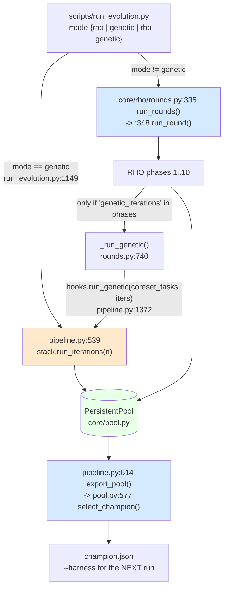
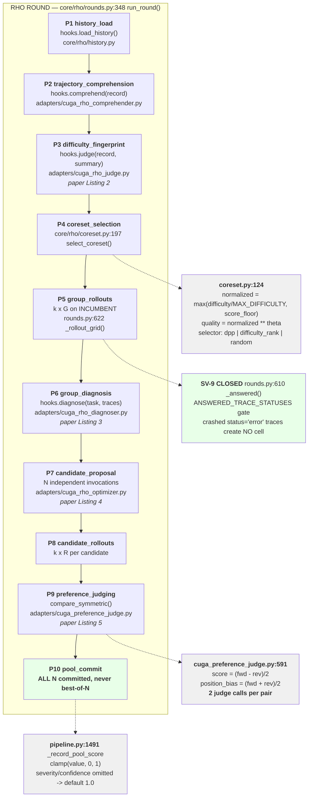
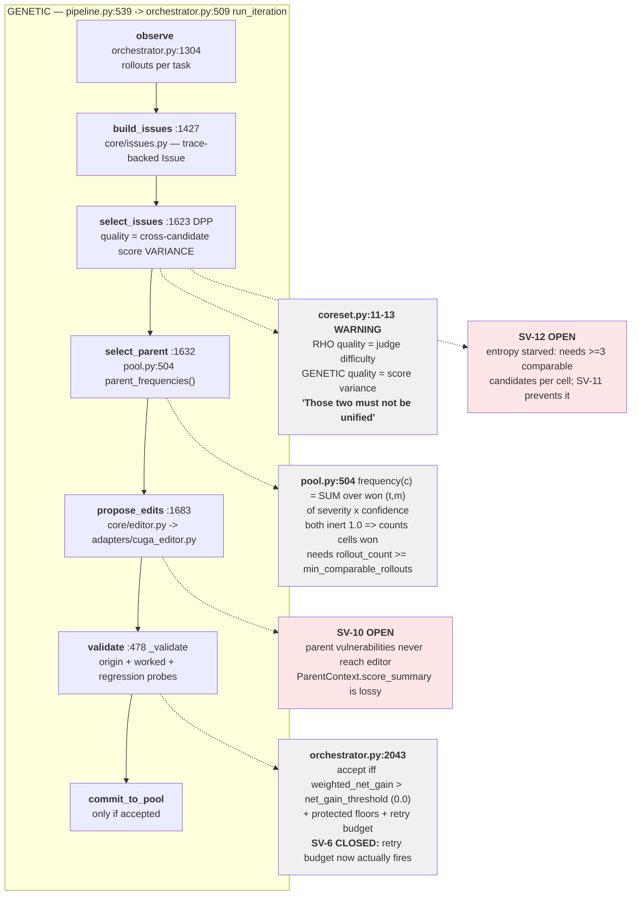
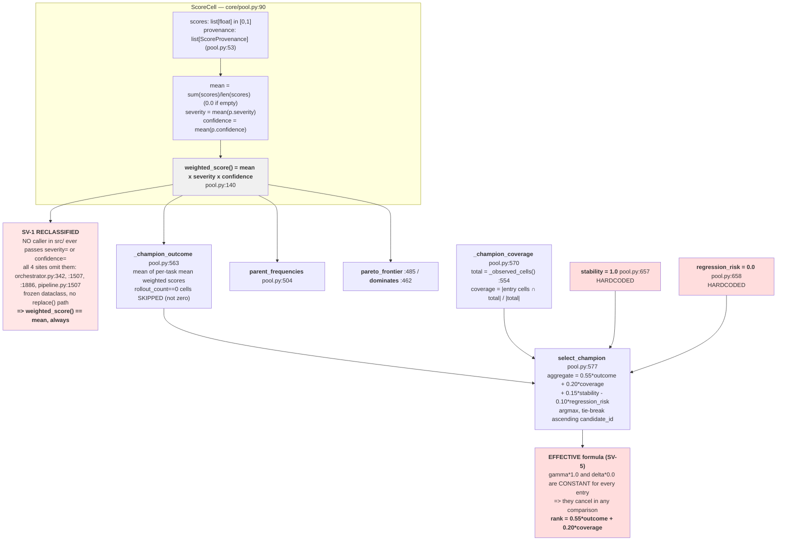
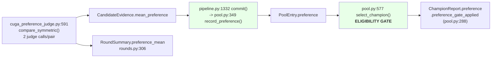
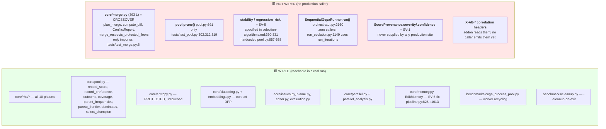
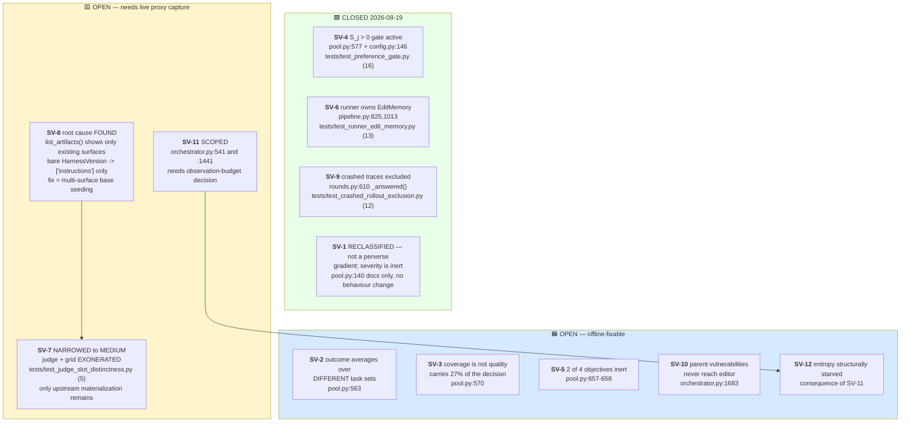
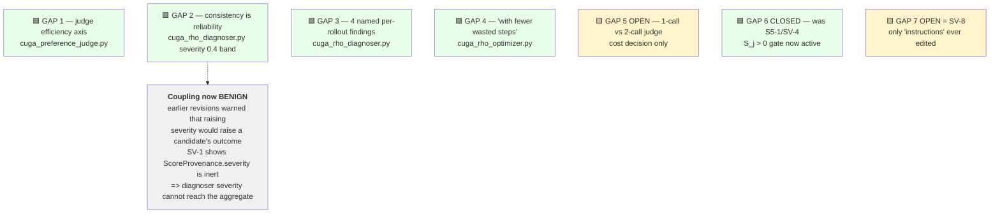
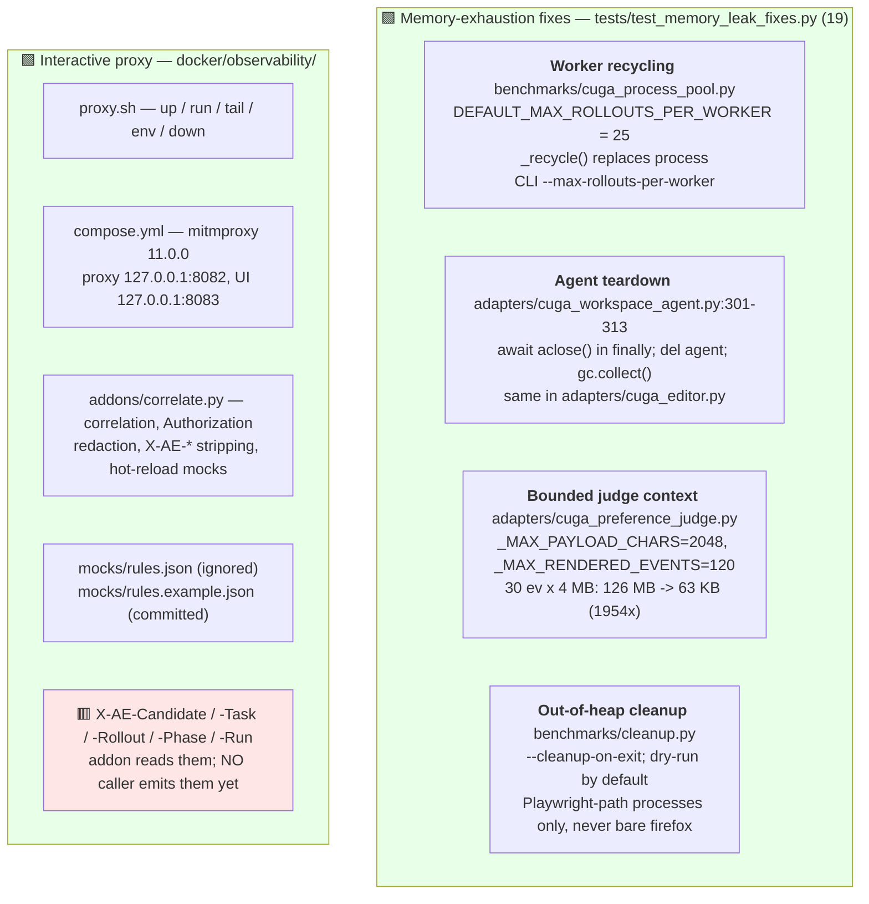
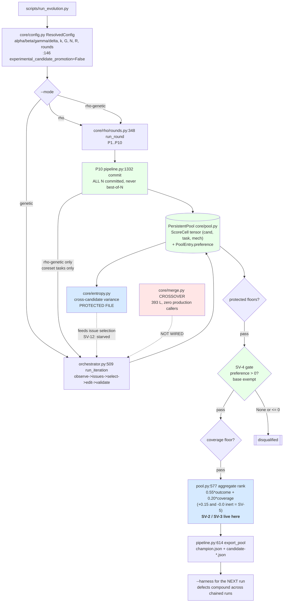

# Implemented Pipeline Map

**Verified against the codebase on 2026-08-19** (branch `dev7`, `HEAD` `0f72d98`,
suite `1825 passed, 1 skipped`). Derived by reading and executing the code, not
from the design docs. Where code and design doc disagree, the **code** is
reported here and the divergence is flagged.

Every box carries its `file:line` so you can cross-reference directly. Line
numbers drift as code moves — the accompanying grep anchor in each table is the
durable reference.

## Legend

| Colour | Meaning |
| --- | --- |
| 🟩 green | Implemented **and** wired into a real run |
| 🟦 blue | Implemented, wired, but semantics disputed / under active repair |
| 🟨 yellow | Partially implemented — capability exists, never exercised in practice |
| 🟥 red | **Not wired** — code exists but no production caller, or hardcoded stub |
| ⬜ grey | Formula / annotation, not an execution step |

---

## 0. Correction to a common premise

`select_champion` is **not** part of the genetic stage. It lives at
`core/pool.py:577` and has exactly three callers, none inside the genetic loop:

```
core/orchestrator.py:2160   SequentialGepaRunner.run()   <- NOT used by run_evolution.py
pipeline.py:606             champion_version()           <- reporting
pipeline.py:614             export_pool()                <- writes champion.json
```

It is a **post-hoc reporting/export selector over the whole pool**, shared by all
three modes. The genetic loop never consults it; `run_round` never calls it.
`rounds.py` is explicit: *"Rank orders the report and picks a champion; it never
decides survival."*

**Consequence:** champion defects change **which harness you export and carry into
the next run** via `--harness`, not who survives a round. In a chained multi-run
experiment that error compounds.

---

## 1. Three modes, one code path

`core/rho/rounds.py:69`

```python
PHASES: dict[str, tuple[str, ...]] = {
  "rho":         _RHO_PHASES,                              # 10 phases
  "genetic":     ("genetic_iterations",),                  # legacy GEPA loop only
  "rho-genetic": _RHO_PHASES + ("genetic_iterations",),    # RHO then genetic
}
```



**Key wiring fact:** the genetic phase is not a reimplementation.
`pipeline.py:1385` narrows `stack.tasks` to the coreset, calls the *same*
`run_iterations`, and restores it in `finally` — *"byte-for-byte the loop that
produced the measured baseline."*

---

## 2. RHO stage — 10 phases



### Phase-to-file table

| Phase | Anchor | Hook | Implementation | Paper | Status |
| --- | --- | --- | --- | --- | --- |
| 1 history_load | `rounds.py` `history_load` | `load_history` | `core/rho/history.py` | — | 🟩 |
| 2 trajectory_comprehension | `comprehend(` | `comprehend` | `adapters/cuga_rho_comprehender.py` | — | 🟩 |
| 3 difficulty_fingerprint | `hooks.judge(` | `judge` | `adapters/cuga_rho_judge.py` | Listing 2 | 🟩 |
| 4 coreset_selection | `coreset.py:197` | — (core) | `core/rho/coreset.py` | §4.1 | 🟩 |
| 5 group_rollouts | `rounds.py:622` | `rollout` | `adapters/cuga_adapter.py` | Listing 1 | 🟩 |
| 6 group_diagnosis | `diagnose(` | `diagnose` | `adapters/cuga_rho_diagnoser.py` | Listing 3 | 🟩 |
| 7 candidate_proposal | `propose(` | `propose` | `adapters/cuga_rho_optimizer.py` | Listing 4 | 🟨 SV-8 |
| 8 candidate_rollouts | `rounds.py:622` | `rollout` | same adapter, `R` per task | — | 🟩 |
| 9 preference_judging | `pipeline.py:1410` | `compare` | `cuga_preference_judge.compare_symmetric` | Listing 5 | 🟦 SV-7 |
| 10 pool_commit | `pipeline.py:1332` | `commit` | `core/pool.py:378 record_score` | Alg. 1 | 🟩 |

---

## 3. Genetic stage — the legacy GEPA loop

Lifecycle per `orchestrator.py:509 run_iteration`:

```
observe -> build_issues -> select_issues -> select_parent -> propose_edits
        -> validate -> commit_to_pool
```



**Two different quality functions, deliberately.** `coreset.py:11-13` is explicit:
RHO's DPP quality is *judge-assigned difficulty*; genetic issue-selection quality
is *cross-candidate score variance*. They answer different questions and must not
be merged. This is also why `run_genetic` receives **coreset tasks only**:
variance needs a populated `(task, mechanism)` cell, and after a RHO round cells
exist only for the coreset. Off-coreset variance is *undefined*, not low.

---

## 4. The scoring tensor and every selection formula



### Eligibility gates applied BEFORE ranking — `pool.py:577`

```python
# 1. protected floors
if entry.candidate_id in protected_floor_violations:  continue

# 2. SV-4 RHO pairwise gate — ACTIVE BY DEFAULT
if gate_applied and not entry.is_base:
    if entry.preference is None or entry.preference <= 0.0:
        disqualified.add(entry.candidate_id); continue

# 3. coverage floor (default 0.0 = inactive)
if coverage < min_coverage_fraction:                  continue

if not scored: raise ValueError("no eligible candidates for champion selection")
```

**SV-4 gate semantics** (`config.py:146` `experimental_candidate_promotion=False`):

- **Strict `> 0`** — a measured tie is not evidence of improvement.
- **`preference is None` disqualifies** — no verdict means no evidence.
- **Base is exempt** — it is the comparison subject, and gating it would raise
  `ValueError` whenever nothing improved.
- **Promotion only** — pool membership untouched; all N candidates retained.
- `--experimental-candidate-promotion` disables it for an ablation arm.

### Where the preference score goes — SV-4 CLOSED



The paper's `S_j` now gates promotion. Judge wall-time is no longer spent on a
signal that only reached the report.

---

## 5. Wired vs NOT wired — verified by grep



### Crossover is not implemented in any runnable path

`AGENTS.md` states crossover is *"provenance-preserving deterministic merge by
default."* `core/merge.py` implements exactly that. **Nothing in `src/` imports
it.** Verified:

```bash
grep -rn 'core\.merge' src/ tests/ scripts/ | grep -v 'core/merge.py'
#  tests/test_merge.py:8   <- only importer
```

So the genetic stage is **mutation-only**. `donor_count: int = 2`
(`orchestrator.py:957`) hands donors to an LLM editor as *context*
(`orchestrator.py:1683 propose_edits` → `select_parents(k=donor_count+1)`); it
does not run the deterministic merge planner.

---

## 6. Severe-issue register mapped onto the pipeline

Authoritative status: `docs/SEVERE-OPEN-ISSUES.md`.



### The two live ranking defects, with reproduced numbers

| # | Issue | Locus | Evidence |
| --- | --- | --- | --- |
| **SV-2** | `outcome` averages over **different task sets** — no shared-cell restriction, so dropping a hard task raises your own mean | `pool.py:563` | base ran easy(0.9)+hard(0.1) → `0.500`; candA ran only easy(0.9) → `0.900`, **wins by skipping the hard task** |
| **SV-3** | `coverage` measures how much you *measured*, not how well. Exchange rate `cov 0.5→1.0` = `+0.100` aggregate = `0.100/0.55 = 0.18` of outcome | `pool.py:570` | `base-v0: cells=4 outcome=0.5500 coverage=1.0000 aggregate=0.6525`<br/>`cand-A:  cells=2 outcome=0.8500 coverage=0.5000 aggregate=0.7175` |

**SV-9 makes these more visible, correctly.** A crashed rollout now creates *no
cell* instead of bad evidence — so a candidate that crashes on hard tasks shrinks
its own outcome denominator. The fix is to repair outcome/coverage, **not** to
revert crash filtering.

**SV-1 correction to earlier drafts of this document.** Previous revisions listed
"severity is per-candidate" and "perverse gradient" as live defects A and B. Both
are **wrong in production**: `ScoreProvenance.severity` and `.confidence` are
never supplied by any of the four construction sites, so they hold `1.0` and
`weighted_score() == mean`. Two unrelated fields share the name `severity` —
`CausalAnalysis.severity` **does** influence diagnosis and targeting; the
`ScoreProvenance` one does not.

---

## 7. Paper-fidelity status of the prompts

`docs/research/rho-paper-prompt-fidelity.md`.



**GAP 7 / SV-8 root cause, at code level.** `cuga_rho_optimizer.py:51` sets
`CREATABLE_PREFIX = "skills/generated-"` and the prompt documents all four
surfaces, so the *capability* exists. The blocker is upstream: `list_artifacts()`
exposes only **existing** artifacts, and a bare live
`HarnessVersion(instructions=...)` has empty `skills`, `memory`, `policies` — so
the optimizer is usually offered `["instructions"]` and nothing else. The offline
stack has multiple surfaces and therefore **does not reproduce** the live roster
condition. Correct first fix is multi-surface base seeding, then surface-history
awareness. There is also no executable-tool artifact class;
`cuga_editor_tools.py` is the *editor's own* toolset, not an evolvable surface.

`_CANDIDATE_FRAMINGS: tuple[str, ...] = ("",)` in `cuga_rho_optimizer.py` keeps
the N proposals prompt-identical and independent.

---

## 8. Operational subsystems (not in the algorithm, required to run it)

Built in response to the 90 GB memory-exhaustion incident
(`feedback/rho-memory-leak-report.md`) and the need for live interception.



**Rollout wrapper was never the agent leak.** `cuga_wrapper/__init__.py:2084`
already had `asyncio.run(agent.aclose())` in a `finally` before this work. The
worker path leaked by *reusing one wrapper across every rollout*, which is what
`--max-rollouts-per-worker` addresses. Note that site swallows exceptions
(`except Exception: pass`) — defensible, since cleanup must not mask rollout
evidence, but a consistently failing `aclose()` there would be invisible.

Current safe live-run shape:

```bash
set -a && . ./.env && set +a
rm -f .cuga/knowledge/.lock
./docker/observability/proxy.sh up          # UI http://127.0.0.1:8083 (pw: agentevolve)
./docker/observability/proxy.sh run -- python scripts/run_evolution.py --mode rho \
  --max-workers 6 --isolation process \
  --max-rollouts-per-worker 20 \
  --cleanup-on-exit
```

`--max-workers 10` or fewer, never 24. `--cleanup-on-exit` is destructive by
design: without it, cleanup only reports reclaimable resources.

---

## 9. End-to-end, one picture



---

## 10. Summary — what to trust

**🟩 Solid and wired.** All 10 RHO phases. The score tensor and its provenance
discipline (`rollout_count==0` is not a zero; `rollout_seq` must be the next
slot). Persistent-pool retention of all N candidates. The two-quality-function
separation. Entropy. Coreset DPP with a documented quality-only fallback. The
SV-4 pairwise acceptance gate. Crash-filtered RHO evidence (SV-9). Runner-owned
edit memory with a live retry budget (SV-6). Worker recycling, agent teardown,
and bounded judge context.

**🟦 Wired but semantics disputed.** `select_champion` ranking. Two reproduced
defects remain — SV-2 (`outcome` averaged over different task sets) and SV-3
(`coverage` scored as quality). Both are *ranking* defects; acceptance is now
gated separately by SV-4. It decides which harness gets **exported and carried
into the next run**.

**🟨 Partially implemented.** Multi-surface harness editing (SV-8 — capability
present, roster starves it). Mechanism analysis of candidates (SV-11 — needs an
observation-budget decision). Judge trajectory distinctness (SV-7 — judge and
grid exonerated; only upstream materialization unresolved).

**🟥 Not wired at all.** `core/merge.py` — **crossover does not run**, despite
being an architecture decision in `AGENTS.md`. Also `pool.prune`,
`SequentialGepaRunner.run`, two of the four champion objectives (SV-5), the
`ScoreProvenance` severity/confidence weights (SV-1), and `X-AE-*` correlation
headers at call sites.

### Recommended order

1. **SV-8** multi-surface base seeding — unblocks SV-7's remaining branch and is
   a precondition for meaningful proposals. *Needs a decision on what to seed.*
2. **SV-11** observation budget — parent-only is cost-neutral. *Needs a decision.*
3. **Emit `X-AE-*` headers**, then one bounded live proxy-captured RHO smoke to
   settle SV-7 upstream materialization and the live roster claims.
4. **SV-2** then **SV-3** — shared comparable-cell denominator; coverage becomes
   evidence *eligibility*, not a quality reward.
5. **SV-5** — delete or implement `stability` / `regression_risk`.
6. **SV-10**, then **SV-12** (largely a consequence of SV-11).

All of 4–5 change selection semantics and none should be made without an explicit
decision.

---

## Appendix — durable grep anchors

| Concept | Anchor |
| --- | --- |
| Mode → phase table | `grep -n "^PHASES" src/agent_evolve/core/rho/rounds.py` |
| RHO round body | `grep -n "def run_round" src/agent_evolve/core/rho/rounds.py` |
| Crashed-trace filter | `grep -n "def _answered\|ANSWERED_TRACE_STATUSES" src/agent_evolve/core/rho/rounds.py` |
| Champion selection | `grep -n "def select_champion" src/agent_evolve/core/pool.py` |
| SV-4 gate | `grep -n "experimental_candidate_promotion" src/agent_evolve/core/{pool,config}.py` |
| Inert weights | `grep -rn "ScoreProvenance(" src/` |
| Outcome / coverage | `grep -n "_champion_outcome\|_champion_coverage\|_observed_cells" src/agent_evolve/core/pool.py` |
| Hardcoded objectives | `grep -n "stability = 1.0\|regression_risk = 0.0" src/agent_evolve/core/pool.py` |
| Genetic lifecycle | `grep -n "def run_iteration\|def observe\|def build_issues\|def select_issues\|def select_parent\|def propose_edits\|def _validate" src/agent_evolve/core/orchestrator.py` |
| Crossover deadness | `grep -rn "core\.merge" src/ tests/ scripts/` |
| Symmetric judge | `grep -n "def compare_symmetric" src/agent_evolve/adapters/cuga_preference_judge.py` |
| Judge context bounds | `grep -n "_MAX_PAYLOAD_CHARS\|_MAX_RENDERED_EVENTS" src/agent_evolve/adapters/cuga_preference_judge.py` |
| Worker recycling | `grep -n "MAX_ROLLOUTS_PER_WORKER\|def _recycle" src/agent_evolve/benchmarks/cuga_process_pool.py` |
| Agent teardown | `grep -n "aclose" src/agent_evolve/adapters/cuga_{workspace_agent,editor}.py` |
| Export path | `grep -n "def export_pool\|def champion_version" src/agent_evolve/pipeline.py` |
