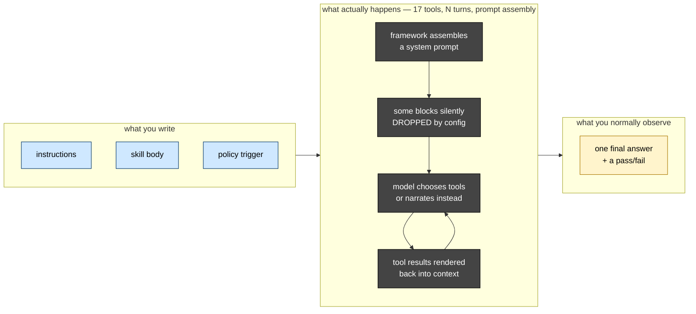
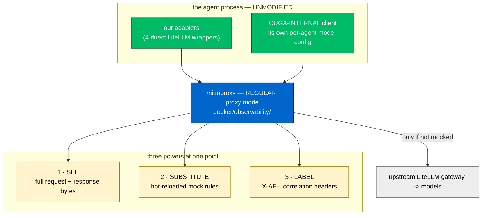
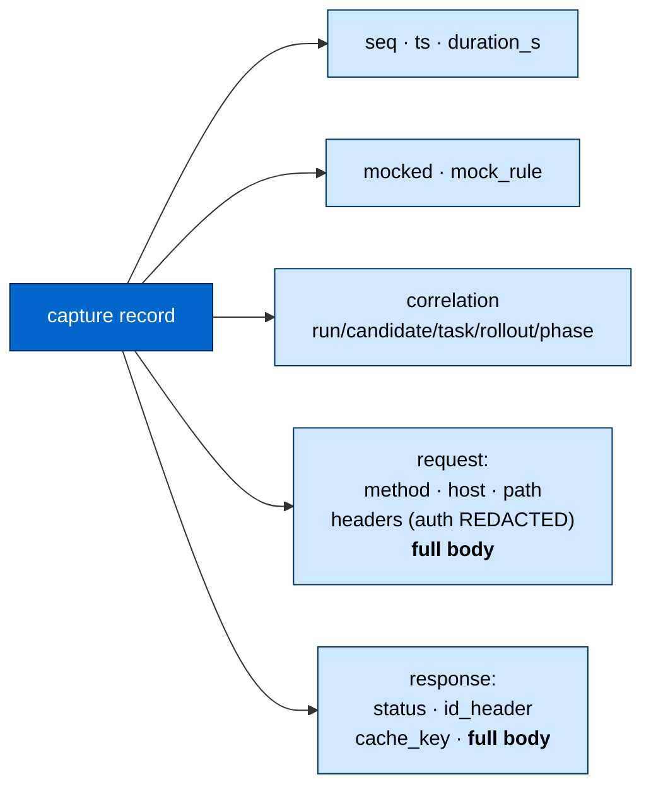
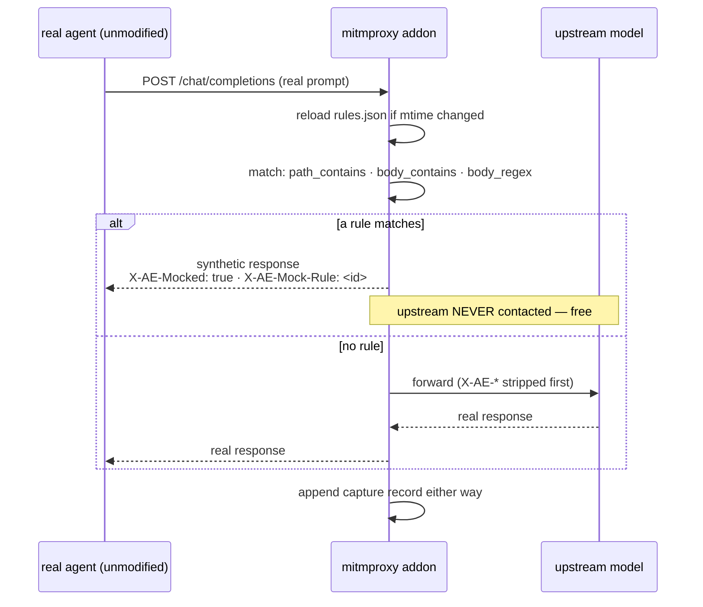
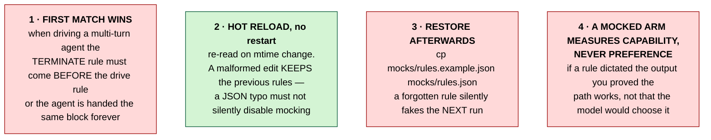
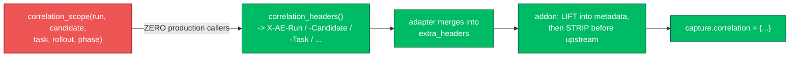
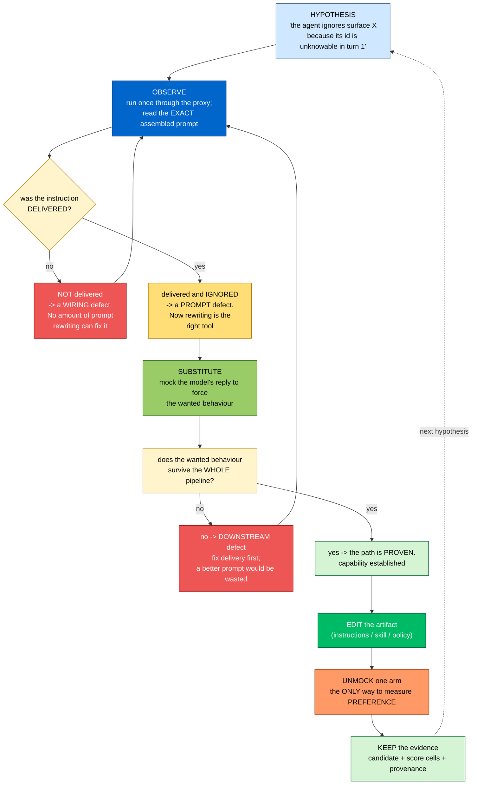
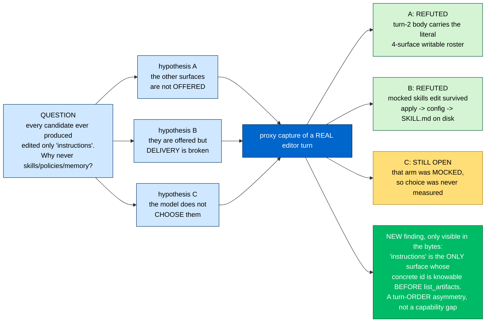
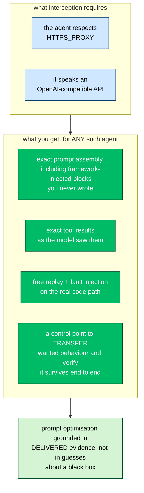

# LLM Interception and Reflection-Based Prompt Optimisation

**Who this is for.** A *builder* — human or LLM agent — who must transfer a wanted
behaviour into a complex agent they do not own, cannot single-step, and cannot
easily instrument from the inside.

**The core claim.** You do not need source access to a multi-agent system to
optimise it. You need to see, and be able to substitute, **the bytes it exchanges
with the model**. That layer is a complete control surface: it is where the prompt
is finally assembled, where every tool result is finally rendered, and where the
behaviour is finally decided.

**Verified, not asserted.** Every capability below has been exercised against a
real `CugaAgent` (`cuga 0.2.20`) through the interception proxy in
`docker/observability/`. Where something is unproven, it says so.

---

## 1. The problem: a complex agent is opaque exactly where it matters



Real failures this opacity produced in this project, each costing hours:

| Symptom | Actual cause |
| --- | --- |
| *"I'm unable to call the tool"* | model emitted no fenced block; extraction returned `""`; the sandbox was never reached |
| skill loads, has no effect | `ENABLE_SHELL_TOOL=false` **silently discards the entire skills block** |
| policy loads, never fires | `always: true` is never selected by any evaluator |
| 4 "independent samples" identical | an upstream **response cache**, not greedy decoding |
| candidates behave identically | policies persisted in a package DB across runs |

Notice the pattern: **every one is invisible in the output and obvious in the
payload.** A pass/fail cannot distinguish "the instruction was ignored" from "the
instruction never arrived."

---

## 2. The intervention: intercept at the LLM boundary



### Why *regular* proxy mode, not reverse

This is the decision the whole capability rests on. A reverse proxy requires each
client to be pointed at it. **CUGA ships its own per-agent model configuration**,
so a reverse proxy would capture our four adapter calls and *silently miss* every
CUGA-internal call — the ones that actually drive the agent.

Regular mode inherits `HTTPS_PROXY` from the environment, so anything in the
process tree that respects standard proxy variables is captured.

> **Verified:** one real editor invocation produced **3 captured
> `/chat/completions` flows**. CUGA's internal client honours `HTTPS_PROXY`.
> Caveat: this was proven for the *editor* agent, not yet for every CUGA subagent
> a full rollout instantiates.

---

## 3. Power 1 — SEE: the payload is completely available

```bash
./docker/observability/proxy.sh up                    # proxy :8082, UI :8083
./docker/observability/proxy.sh run -- <any command>  # runs it through the proxy
./docker/observability/proxy.sh tail
./docker/observability/proxy.sh down
```

`proxy.sh run` exports the four variables that matter, which is why it works for
libraries that ignore some of them:

```bash
HTTP_PROXY  HTTPS_PROXY          # honoured by most clients
SSL_CERT_FILE                    # stdlib ssl
REQUESTS_CA_BUNDLE               # requests / httpx
```

Every LLM call appends one JSON line to
`docker/observability/captures/calls.jsonl`:



**A real captured editor turn**, to make "full" concrete:

```text
model            gcp/gemini-3.6-flash, temperature=0.1
request body     61,561 bytes            <- complete
messages         4  (system 56,364 chars · user 781 · assistant 684 · user 2,066)
response body    complete JSON, incl. usage token counts
```

And it contains the **verbatim tool results the model saw**:

```text
ROSTER: {"writable": ["instructions", "memory/generated-evolved",
                      "policies/generated-evolved", "skills/generated-evolved"], ...}
STAGED: {"accepted": true, "reason": "staged replacement for 'skills/generated-evolved'"}
```

That is how the "which surface was *offered* vs which was *chosen*" question was
settled — by reading bytes, not by inference.

### Two things that will mislead you

**1. There is no `tools` key.** Payload keys are exactly:

```text
['max_completion_tokens', 'messages', 'model', 'stream', 'temperature']
```

CUGA is **not** using OpenAI function-calling here. It inlines all 17 editor tools
as **prose inside the 56 KB system prompt** and asks for a fenced Python block. If
you grep a capture for `tools` you will conclude tools are absent. Search the
prompt text instead.

**2. Bodies are capped at 256 KiB in the JSONL only.** The complete bytes are in
mitmproxy's `flows.mitm`. Do not conclude a prompt was truncated because the
sidecar truncated it.

---

## 4. Power 2 — SUBSTITUTE: mocking makes live-path testing free

This is the part that changes how you work. A mock is matched in the **request
hook**, so a mocked call **never reaches upstream** — zero tokens, zero latency,
while the agent runs its *real* code path.



### Rule shape

```json
{
  "rules": [
    {
      "id": "terminate-after-plan",
      "enabled": true,
      "when": { "path_contains": "/chat/completions",
                "body_contains": "submit_edit_plan" },
      "respond": { "content": "Done." }
    },
    {
      "id": "drive-the-editor",
      "enabled": true,
      "when": { "path_contains": "/chat/completions" },
      "respond": { "content": "```python\nlist_artifacts()\n```" }
    }
  ]
}
```

### Four rules of mocking, each learned the hard way



Rule 4 is an epistemic constraint, not a technical one, and it is the easiest way
to fool yourself. In this project a mocked `skills/` edit was staged and finalised
end to end. That proved **delivery works**. It said *nothing* about whether a real
model prefers that surface — which remains unmeasured, and is labelled as such
everywhere it is mentioned.

### What mocking unlocks

| Use | Rule |
| --- | --- |
| pin a judge verdict for a deterministic ablation | `body_contains: "preference"` → fixed score |
| inject a 429 / 500 to test degradation | `respond.status: 429` |
| force N different outputs from one prompt | `respond.content: ["A","B","C"]` |
| drive a multi-turn agent to a specific state | ordered rules, terminate first |
| exercise an expensive path at zero cost | any rule at all |

---

## 5. Power 3 — LABEL: correlation, and its current honest gap

Four direct adapters attach `X-AE-*` headers from an ambient `contextvars` scope.
The addon **lifts them into the capture record and strips them before the request
goes upstream**, so no vendor ever receives internal experiment identifiers.



**The gap, stated plainly:** `correlation_scope` has **zero callers in `src/` and
`scripts/`**. The emit side is built; production never sets the context. So today
`capture.correlation` is `{}` and every flow is **unlabelled**.

This is a *labelling* gap, not a *visibility* gap. You still see every byte; you
just cannot yet ask *"show me all calls for candidate c1"* — group by timestamp
and body instead. Wiring the set side is the prerequisite for a live run being
worth its cost.

Design note worth keeping: correlation is ambient via `contextvars`, never a module
global. A global would let one worker's candidate id label another worker's calls
under parallel execution — misattributed evidence, unrecoverable after the fact and
strictly worse than no correlation at all. And absent facts are **omitted, never
blanked**: a capture that is silent about the candidate is recognisable as
uncorrelated, whereas `candidate=""` looks like data.

---

## 6. The builder's reflection loop

Now the synthesis. With SEE + SUBSTITUTE + LABEL, a builder can run a tight
reflective optimisation loop over an agent they do not control — **and the loop's
inner iterations are free**.



### The decision that makes this loop worth running

**"Delivered but ignored" and "never delivered" look identical from the output and
demand opposite responses.** Separating them is the single highest-value thing
interception buys, because rewriting a prompt that never arrived is unbounded
wasted effort — and it *feels* like progress, because each rewrite produces a new
plausible-looking failure.

This is the same discipline the evolution engine applies to itself: an issue only
exists when blame lands on a *writable* surface. Here, a prompt change only makes
sense when the payload proves the prompt *arrived*.

### Worked example, exactly as it happened



Two hypotheses eliminated and a **new, better** one discovered — at **zero
upstream cost**, because the driving replies were mocked. The residual question is
correctly labelled unmeasured rather than quietly answered by the mock.

---

## 7. Discipline: rules that keep this honest

A control surface this powerful makes self-deception easy. These are enforced
conventions, not suggestions.

| # | Rule | Why |
| --- | --- | --- |
| 1 | **A mocked arm proves capability, never preference.** Label it. | the mock authored the output |
| 2 | **A reproduction must use production-shaped inputs.** | a "critical" defect here was reproduced by passing a value no production call site writes — real arithmetic, unreachable scenario |
| 3 | **Prove the test can fail.** Revert the fix; confirm it breaks. | one fix suite was 13 tests, **12 failing** against unfixed source — that is what made it evidence |
| 4 | **Use the response `id`, never text equality**, to detect a cache hit. | a low-entropy prompt legitimately returns identical text from 4 genuine samples |
| 5 | **Restore `mocks/rules.json` from the example.** | a stale rule silently fakes the next run |
| 6 | **Never persist secrets, expected answers, or grader internals** into prompts, memory, embeddings or logs. | contamination invalidates every subsequent measurement |
| 7 | **Name what a verification covered *and what it excluded*.** | "tests pass" is not "it works in production" |

On rule 4, measured:

```text
                      distinct response ids   distinct text
default (cache on)            1                    1        <- NOT 4 samples
cache disabled                4                    4
"what is 2+2"                 4                    1        <- genuine agreement
```

Text equality cannot separate a cache hit from real agreement. The response `id`
can.

---

## 8. Why this generalises beyond this repository



Two requirements, both nearly universal for current agent frameworks. No source
access, no fork, no vendored dependency, no framework-specific hooks. The agent
runs **unmodified** — which is what makes the observation trustworthy: an
instrumented agent is no longer the agent you are measuring.

---

## 9. Current limits — stated so nothing here is over-read

| Limit | Detail |
| --- | --- |
| **Correlation is half-wired** | `correlation_scope` has 0 production callers; captures are unlabelled today |
| **Routes 2 and 3 cannot carry labels** | preference judge, RHO optimizer and editor go via `CugaAgent`, bypassing our wrappers **by design** |
| **CUGA-internal capture proven for the editor only** | not yet for every subagent a full rollout instantiates |
| **Surface preference unmeasured** | the only non-`instructions` choice observed was dictated by a mock |
| **Nothing observed end to end** | no correlation-captured live run has been performed; **no behavioural-gain claim is supported** |
| **JSONL body cap 256 KiB** | full bytes in `flows.mitm` |
| **Not an SPA browser** | plain HTTP interception; no JS rendering |

---

## 10. Commands, in one place

```bash
# start / stop
./docker/observability/proxy.sh up          # proxy :8082 · UI :8083 · CA generated
./docker/observability/proxy.sh down

# run anything through it
./docker/observability/proxy.sh run -- python scripts/run_evolution.py --dry-run --tasks 3
./docker/observability/proxy.sh run -- python tools/probes/sv8_editor_surface_probe.py

# watch live
./docker/observability/proxy.sh tail
open http://127.0.0.1:8083

# mock: edit, no restart needed (hot reload on mtime)
$EDITOR docker/observability/mocks/rules.json

# ALWAYS restore afterwards
cp docker/observability/mocks/rules.example.json docker/observability/mocks/rules.json
```

Analyse a capture **without** reading it into your own context:

```bash
python - <<'PY'
import json
from pathlib import Path
recs = [json.loads(l) for l in
        Path('docker/observability/captures/calls.jsonl').read_text().splitlines() if l.strip()]
print(f"{len(recs)} calls | mocked={sum(r['mocked'] for r in recs)}")
for r in recs:
    b = json.loads(r['request']['body'])
    print(f"seq={r['seq']} model={b.get('model')} msgs={len(b.get('messages',[]))} "
          f"bytes={len(r['request']['body'])} mocked={r['mocked']} corr={r['correlation']}")
PY
```

---

## See also

- [`SYSTEM-ARCHITECTURE.md`](SYSTEM-ARCHITECTURE.md) — the whole system and the issue lifecycle
- [`IMPLEMENTED-PIPELINE-MAP.md`](IMPLEMENTED-PIPELINE-MAP.md) — `file:line` reachability truth
- [`../../docker/observability/README.md`](../../docker/observability/README.md) — the proxy's own reference
- [`../SEVERE-OPEN-ISSUES.md`](../SEVERE-OPEN-ISSUES.md) — SV-7 / SV-8, the investigations this workflow ran
