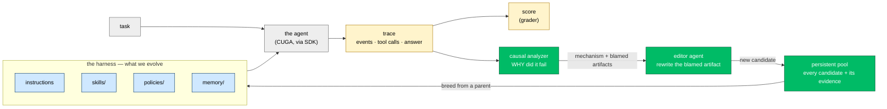
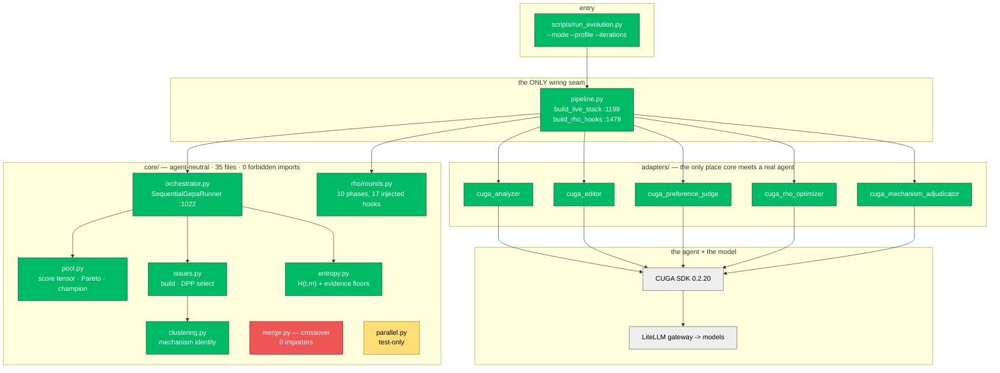
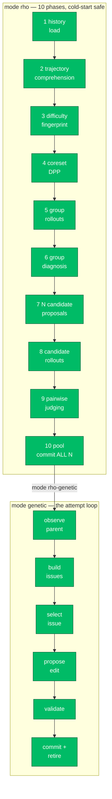
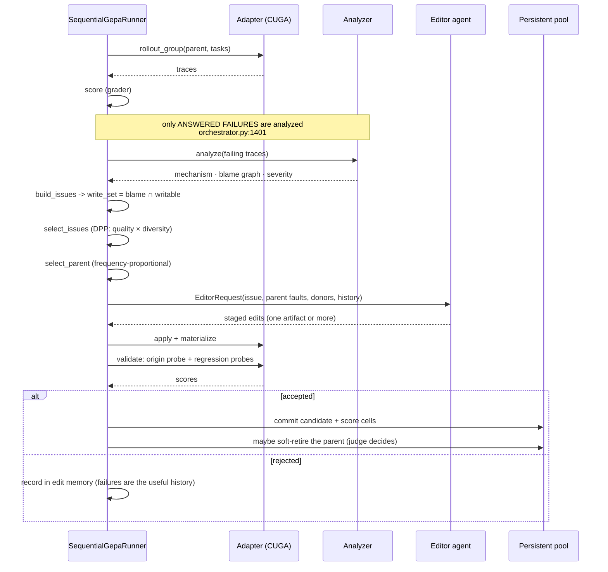
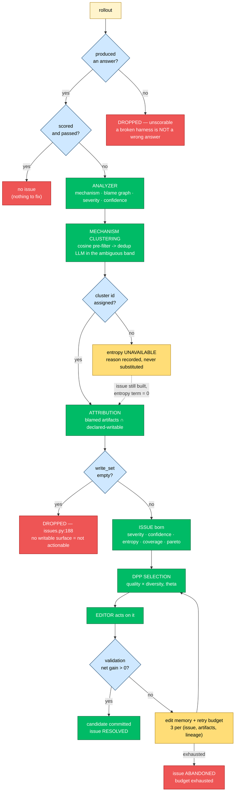
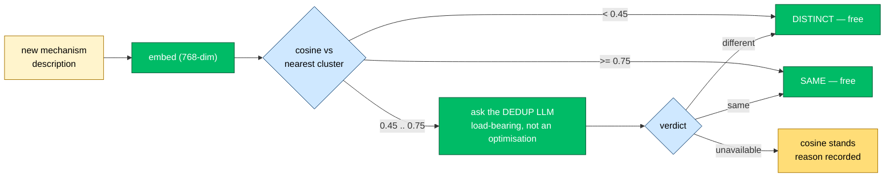
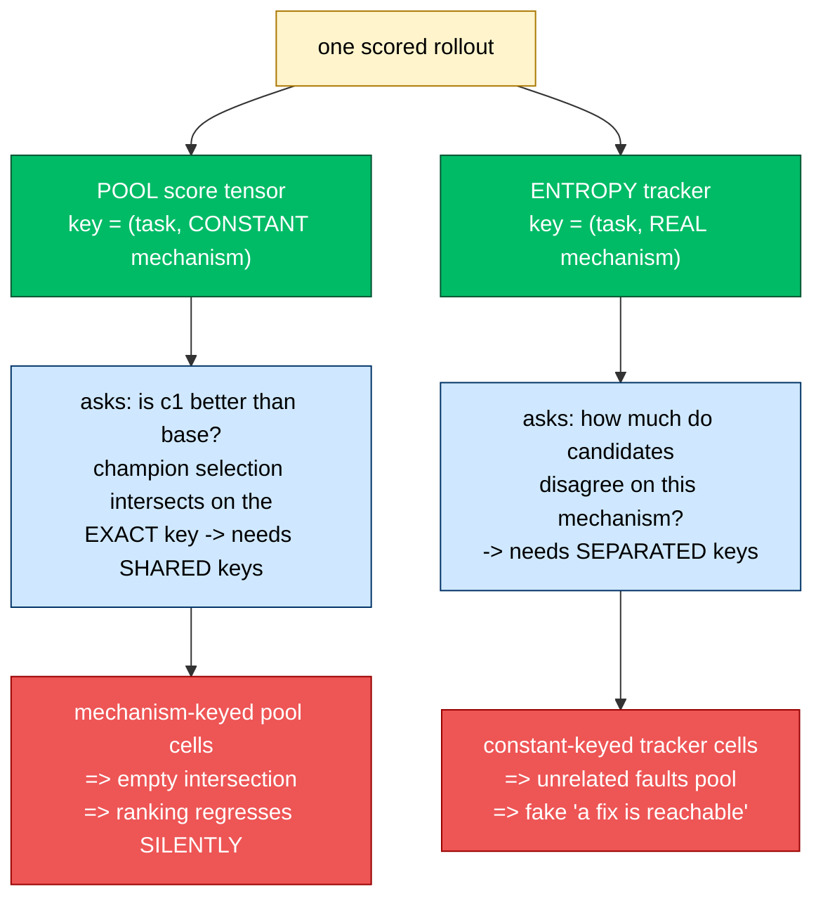
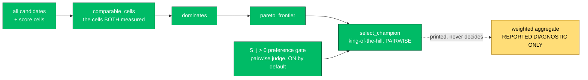
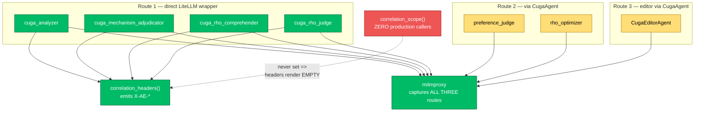

# System Architecture — AgentEvolve

**What this file is.** The complete system, end to end, in diagrams: how an agent's
harness is evolved, how an issue is born and dies, and how the LLM layer is
intercepted so a *builder* can transfer wanted behaviour into a complex agent it
does not control.

**Companion files.** For *"is that line actually wired?"* read
[`IMPLEMENTED-PIPELINE-MAP.md`](IMPLEMENTED-PIPELINE-MAP.md), which anchors every
claim to `file:line`. For the defects that make a number untrustworthy read
[`../SEVERE-OPEN-ISSUES.md`](../SEVERE-OPEN-ISSUES.md). This file is the shape of
the system; those two are its errata.

**Honesty marker used throughout.** Green = LIVE, amber = GATED or partial,
red = DEAD/ABSENT. Nothing here is aspirational unless the box says so.

---

## 1. The thesis in one diagram

An agent fails a task. Something in its *harness* — the instructions, skills,
policies and memory it carries — is responsible. Find which, edit it, prove the
edit helped, keep the evidence.



**Why this is not prompt engineering.** The edit is *attributed*: an issue only
exists if the analyzer's blame lands on an artifact the adapter declares writable.
The single most consequential line in the system, `issues.py:186-188`:

```python
write_set = tuple(sorted(aid for aid in attributed if aid in writable_ids))
if not write_set:
    return None          # issues.py:188 — no writable attribution, no issue
```

So the surface offered to the editor is **analyzer blame ∩ declared-writable**,
never "whatever the harness happens to contain."

---

## 2. Layered architecture, and the boundary that makes it agent-neutral



**The boundary is enforced, not aspirational.** `core/` must not import `cuga`,
`litellm`, `openai`, `httpx`, `requests`, or `agent_evolve.adapters` — currently
**35 files, 0 violations**, verified by AST (a substring grep gives false
positives; several `core/` docstrings mention adapters in prose).

**Why it matters commercially:** the evolution engine is not a CUGA product. Swap
the adapter package and the same engine evolves a different agent. CUGA is the
reference adapter because the research needs exact state tracing, not because the
core depends on it.

---

## 3. Modes — data, not branches

`PHASES` in `core/rho/rounds.py` maps a mode name to an ordered phase tuple.



Cost model, RHO: **rollouts per round = `k × (G + N×R)`**. Paper defaults
(k=10, G=3, N=3, R=2) → **90 per round**. This dominates a run; budget it first.

---

## 4. The genetic attempt loop, in detail



**Two design properties worth naming.**

- **Rejections are recorded too.** The point of history is *"do not repeat a
  strategy that already failed"*, so failed attempts are the load-bearing entries.
- **Retirement is soft.** When the pairwise judge prefers a child over its parent,
  the parent leaves *breeding* — parent sampling, Pareto frontier, champion
  selection — but keeps every score cell, lineage link and preference record. Hard
  deletion would destroy the comparable cells cross-candidate entropy needs.

---

## 5. Issue lifecycle — birth to death

This is the heart of the method. An *issue* is a trace-backed, attributed,
selectable unit of work.



### 5.1 Why mechanism identity is the hard part

Two analyzer descriptions of *the same* fault must land in the same cluster, or
their evidence fragments and variance becomes meaningless. **Cosine alone provably
cannot do this.** Measured over 66 live pairs across 4 fault families:

| | range | mean |
| --- | --- | --- |
| same fault | 0.466 – 0.851 | **0.728** |
| different fault | 0.244 – 0.502 | **0.393** |

The distributions **overlap** — separation `-0.036`. No single threshold separates
analyzer paraphrase from a genuinely different fault. Hence:



The shipped band `[0.45, 0.75)` is the smallest measured band that silently splits
**zero** true paraphrase pairs; the previous `0.60–0.85` split 2 of 12. A live
adjudicator probe in the newly reached `0.45–0.60` range scored **12/12** correct.

### 5.2 Two key policies that must stay separate

A subtle, load-bearing asymmetry. The same `(task, mechanism)` pair is keyed
**differently** in two structures because they answer different questions:



Collapsing these into one key looks like a tidy-up and breaks selection without
raising an error. This is the single easiest way to silently ruin the system.

### 5.3 Entropy: honest unavailability

`H(t,m) = Var(scores) × max(max_score, floor)`, gated on **≥3 comparable
candidates** and **≥2 rollouts each**. Below the floor the cell is **unavailable
with a reason from a stable category set** — never a substituted zero.

```
fallback_rate = None    for 0 observed cells   (never 0.0 — zero would claim
                                                perfect availability for a run
                                                that measured nothing)
```

Measured on an offline loop: `3/3 cells unavailable = 100% fallback
(floor_unmet=3)`. That is the report working, not the system working — and it is
exactly the distinction most frameworks hide.

### 5.4 The known gap: we only autopsy failures

Today only *failing* rollouts are analyzed. A candidate can score `1.0` on every
task and hold **zero** mechanism ids — invisible to any mechanism-keyed lookup. So
the compass compares **bad vs less-bad** and never reads the survivors.

The planned fix (two polarity-isolated judges, one shared cluster namespace,
signed valence) is specified as a **future directive** in
[`../design/issue-lifecycle.md`](../design/issue-lifecycle.md) §6 D5.6. It is
entirely unbuilt.

---

## 6. Selection: how work is chosen



**Why pairwise, not a scalar.** A candidate that *skipped* the hard task once won
champion selection by averaging over a smaller task set:

```text
base   ran easy(0.9) + hard(0.1)  -> outcome 0.500  agg 0.6250
candA  ran easy(0.9) only         -> outcome 0.900  agg 0.7450  <== WON
```

`candA` was identical to base on the only task both attempted. Ranking is now
pairwise over shared cells, so skipping cannot win. Four of the five champion-math
defects (SV-2..SV-5) were exactly this class: **arithmetic that ran without error
and ranked the wrong harness.**

---

## 7. LLM call topology — three routes, one observer

**The section most likely to surprise you.** There are three distinct ways this
system reaches a model, and they differ in whether a call can be *labelled*.



| Fact | Status |
| --- | --- |
| CUGA-**internal** calls are captured (it honours `HTTPS_PROXY`) | **verified** — one editor run → 3 flows |
| 4 adapters emit `X-AE-*` on the wire | **LIVE** |
| production ever *sets* a correlation label | **DEAD** — 0 callers in `src/`, 0 in `scripts/` |
| routes 2 and 3 can carry labels | **ABSENT by construction** — they bypass our wrappers |

**Hold onto this:** interception is complete; *correlation* is half-wired. Every
captured flow today is unlabelled and must be grouped by timestamp and body. That
is a labelling gap, not a visibility gap — see the next document.

---

## 8. What is not wired — the honest list

| Item | Status | Consequence |
| --- | --- | --- |
| Crossover / merge (`core/merge.py`, 393 lines) | **DEAD**, 0 importers | no recombination runs at all |
| Parallel batch execution | **TEST-ONLY** | sequential in production |
| `Orchestrator.run_iteration` | **TEST-ONLY**, 0 `src/` callers | read `SequentialGepaRunner` instead |
| `correlation_scope` | **DEAD in production** | captures unlabelled |
| Checkpoint / counterfactual replay | **ABSENT** | never assume a trace is replayable |
| Cross-task mechanism identity | **ABSENT, deferred by decision** | needs content-addressed ids, not a patch |
| Executable-tool artifact class | **ABSENT** | we edit text surfaces, not runnable scripts |
| Two-judge positivity (D5) | **ABSENT, specified** | survivors are never studied |

**Why we publish this list.** A framework that cannot name its own unwired paths
cannot be trusted on the paths it claims. Across 2105 passing tests, two fully
tested modules are unreachable in production — a green suite proves code runs, not
that it runs *here*.

---

## 9. Reading order

1. This file — the shape.
2. [`IMPLEMENTED-PIPELINE-MAP.md`](IMPLEMENTED-PIPELINE-MAP.md) — `file:line` truth.
3. [`../SEVERE-OPEN-ISSUES.md`](../SEVERE-OPEN-ISSUES.md) — where the instrument lies.
4. [`../design/issue-lifecycle.md`](../design/issue-lifecycle.md) — clustering decisions + D5 directive.
5. [`LLM-INTERCEPTION-AND-REFLECTION.md`](LLM-INTERCEPTION-AND-REFLECTION.md) — the builder's workflow.
6. [`selection-algorithms.md`](selection-algorithms.md) — the formulas.
7. [`../USER-MANUAL.md`](../USER-MANUAL.md) — every flag.
