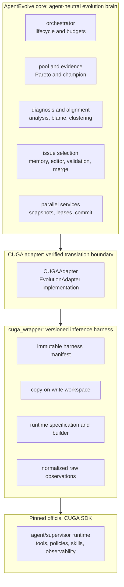
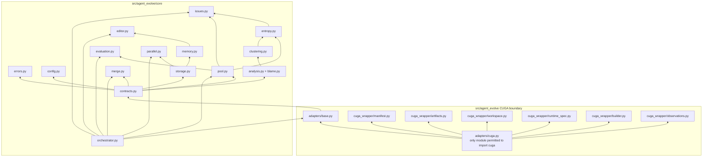

# Component-Level Target Architecture

## Purpose And Scope

This is the component-level design for the full RHO-Parallel-GEPA target. It
refines, but does not replace,
[Target RHO-Parallel-GEPA Architecture](target-rho-parallel-gepa.md). The
target evolves **stored immutable harness versions**, not model weights and not
live CUGA runtime objects.

The design has three ownership layers:

`core` decides what to evolve and whether evidence warrants admission.
`cuga_wrapper` owns the reproducible harness representation. `CUGAAdapter`
translates wrapper operations and verified SDK observations into neutral
contracts. The CUGA SDK executes the resulting harness.

## Package Topology

Rules:

- `core` imports only standard library modules and other agent-neutral core
  modules.
- `cuga_wrapper` does not import `cuga`; it is testable with a fake
  `RuntimeFactory`.
- `adapters/cuga.py` is the sole target module that may import the pinned
  official CUGA SDK.
- The orchestrator coordinates services. It must not reimplement pool,
  persistence, merge, or adapter semantics internally.

## Candidate And Evidence Flow

```mermaid
flowchart LR
    H["Historical corpus"] --> R["RHO proposals\nbase + initial candidates"]
    R --> W["Materialize immutable\ncandidate workspace"]
    W --> Run["Full rollout through adapter"]
    Run --> Trace["Sanitized trace and\nrollout evidence"]
    Trace --> Judge["Analyzer + judge\ncausal findings"]
    Judge --> Align["Task-local mechanism\nalignment"]
    Align --> Tensor["Provenance-bearing\nscore tensor"]
    Tensor --> Pool["Persistent pool"]
    Pool --> Select["Compatible issue or\nmerge selection"]
    Select --> Edit["Authorized stored\nharness edit"]
    Edit --> Validate["Origin + worked +\nregression validation"]
    Validate --> Commit{"Accepted and durable?"}
    Commit -->|yes| Pool
    Commit -->|no| History["Rejected/exhausted\nattempt history"]
    History --> Pool
```

The score tensor is not a collection of scalar scores. Each comparable cell
retains candidate, task, mechanism cluster, rollouts, verdict/evaluator
references, coverage, confidence, stability, and artifact-version provenance.
Missing or incompatible evidence is excluded from a comparison, never converted

## Design Constraints From Multi-Agent Failure Modes

| Concern | Architecture response |
| --- | --- |
| Stochastic LLM output | Require small machine-consumed fields, preserve bounded free-text rationale, and use repair/defer paths rather than brittle regex parsing. |
| Schema pressure harms reasoning | Keep schemas shallow; use structured fields for IDs, write targets, operations, and status only. |
| Open-ended failure space | Causal mechanisms are free-form, task-local, and may be uncertain or insufficiently evidenced. |
| Surface-form grading | Task evaluation remains adapter/evaluator-owned and semantic where appropriate; core does not perform exact-output matching. |
| Lost context between agents | Persist sanitized trace references, evidence summaries, rationale, uncertainty, and validation outcomes. |
| Blind crossover | Use provenance-preserving three-way inheritance, never token or paragraph splicing. |
| Single brittle controller | Validation, protected floors, retry exhaustion, and durable attempt records cross-check each proposed edit. |

## Logical Artifact Granularity

The generic core treats artifact IDs as opaque. An adapter or wrapper may declare
a complete skill, instruction, policy definition, structured configuration field,

Logical blocks are optional adapter declarations, not generic heading parsing.
An adapter must provide a stable identity, content hash, materialization rule,
