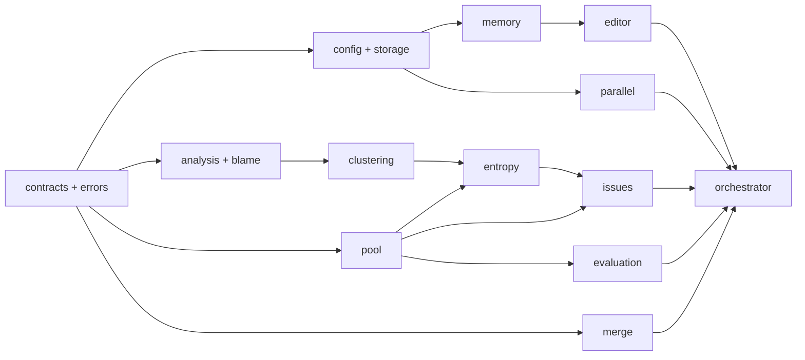

# Component Contracts

## Contract Style

This document specifies target ownership and externally visible behavior. The
binding record schemas are in [Data Contracts](data-contracts.md); the binding
algorithms are in [Selection Algorithms](selection-algorithms.md) and
[Merge Resolution](merge-resolution.md); the binding persistence semantics are in
[Storage And Transactions](storage-and-transactions.md). Where this document
describes intent and those documents state a mandate, the mandate governs.

## Core Modules

| Module | Status | Owns | Must Not Own |
| --- | --- | --- | --- |
| `contracts.py` | target expansion | Immutable IDs, records, neutral protocols, provenance references | Concrete CUGA/Gaia types or artifact parsing |
| `errors.py` | new | Typed domain failures and recovery classes | SDK-specific exception parsing |
| `config.py` | new | Profile resolution, feature gates, budgets, validated resolved config | Environment-specific adapter behavior |
| `storage.py` | new | Atomic run persistence, manifests, immutable records, redaction gateway | Selection or causal reasoning |
| `analysis.py` | target split | Sanitized rollout-group reports and analyzer exchange boundary | Artifact mutation |
| `blame.py` | target expansion | Dynamic causal graph and uncertainty validation | Fixed failure taxonomy |
| `clustering.py` | target completion | Task-local mechanism alignment and barrier refresh | Cross-task semantic equivalence assumptions |
| `pool.py` | target replacement | Candidate registry, score comparability, Pareto, parent/champion selection | Workspace mutation or persistence format internals |
| `entropy.py` | target narrowing | Incremental comparable-evidence entropy statistics | Work-item selection policy |
| `issues.py` | new | Work-item creation, compatibility constraints, quality-diversity DPP plus severity/coverage/random ablation modes | Editing or evaluation |
| `memory.py` | target replacement | Redacted attempts, worked/failed/probe/retry state, bounded retrieval | Raw task/evaluator/editor payload persistence |
| `editor.py` | target narrowing | Editor protocol, authorized reads/writes, repairable response handling | Candidate promotion decisions |
| `evaluation.py` | new | Validation plan, score collection, protected floors, probe budgeting | Adapter-specific evaluator implementation |
| `merge.py` | target completion | Lineage-aware deterministic inheritance and restricted conflict request | Blind text crossover |
| `parallel.py` | target replacement | Snapshot, leases, staged result checks, atomic barrier protocol | Worker mutation of shared state |
| `orchestrator.py` | target refactor | Lifecycle transitions and service coordination | Hidden business logic owned by other modules |

## Adapter-Neutral Invariants

### Artifact and workspace contract

An adapter must expose immutable artifact inventory for a candidate version. Each
descriptor provides a stable opaque ID, content/version hash, readability,

`materialize_candidate(parent, attempt)` creates an isolated workspace. It must
not alter the parent. `apply_structured_edits(workspace, edit_plan)` must reject
targets outside the explicit authorized write set. A successfully sealed
workspace yields a new immutable candidate/version identity.

### Rollout and trace contract

`run_full_rollout(workspace, task, rollout_id)` executes a candidate. The
adapter returns a status that distinguishes completed, timeout, cancelled, and
runtime failure. `capture_trace()` returns only adapter-supported, sanitized
provenance. The core must not invent missing causal events.

### Analyzer and editor exchange contract

The analyzer/judge supplies a small set of machine-consumed fields:

```text
candidate/task/trace references
finding status: observed | uncertain | insufficient_evidence | malformed
severity and confidence when observed
artifact candidates only when trace-backed
evidence references
```

It also supplies bounded free-text rationale, causal explanation, alternatives,

```text
machine fields: read requests, edit operation, artifact targets, status
free text: issue interpretation, rationale, risks, expected effect
```

The editor can only request inventory-declared readable content and propose edits
inside its lease-authorized write set. A malformed response receives at most one
correction request containing the validation defect; repeated malformed output is
recorded and the workspace is discarded.

### Evaluation contract

Focused validation contains origin evidence plus relevant worked-set and
regression-probe cases for every written artifact. Acceptance requires primary
gain, positive weighted net gain, and no protected-floor violation. A task with
missing evaluation evidence is not automatically successful or failed: it is
explicitly unavailable and excluded from comparisons requiring that evidence.

### Merge contract

Merge starts from a common ancestor and artifact-level change provenance:

```text
left unchanged, right changed: inherit right
left changed, right unchanged: inherit left
both unchanged or identical: inherit shared content
both changed differently: resolve by cited-artifact evidence score, else ancestor
```

Only an unresolved conflict within one declared artifact unit may request an
editor-assisted refinement. The refiner receives that unit's ancestor, left,
right, relevant evidence, and allowed write target only. The resulting child
uses normal validation and admission. The exact evidence formula, coverage guard,
deletion handling, and tie policy are mandated in
[Merge Resolution](merge-resolution.md).

## Dependency Boundaries



No arrow may point from a lower-level module to the orchestrator. No core module
may depend on `cuga_wrapper` or a concrete adapter.

## Required Cross-Cutting Tests

- Duplicate candidate IDs are rejected without altering persisted pool state.
- Full task IDs, never prefixes/substrings, are used as aggregation keys.
- Missing comparable mechanisms are excluded from Pareto calculations.
- Protected floors reject otherwise positive aggregate candidates.
- DPP selection jointly optimizes quality and diversity, uses greedy MAP
  inference with Schur-complement updates, and records `theta`, score floor,
  prefilter bounds, and any fallback reason.
- Editor writes outside the authorized set fail before workspace sealing.
- Nested or textual sensitive material is rejected/redacted before persistence.
- A malformed analyzer/editor response yields bounded repair then a recorded
  non-promotion outcome.
- A barrier failure leaves pool, score tensor, history, and manifest unchanged,
  verified by failure injection at each write statement.
- Disjoint artifact changes merge without an LLM; an unresolved conflict cannot
  modify unrelated artifacts.
- A record with an out-of-range score, zero rollouts, or missing mechanism
  cluster raises a typed validation error.
