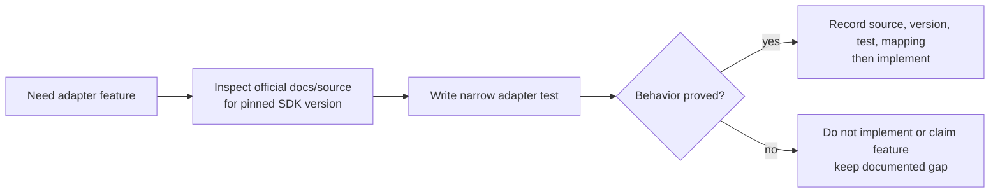

# CUGA SDK Verification Matrix

## Development-Time Purpose

This is a development-time checklist and evidence record, not a runtime routing


The soft CUGA context in `feedback/` is useful for identifying investigation

## Evidence Record Format

For every implemented CUGA feature, record:

```text
feature name
official documentation/source URL and revision
pinned package name and version
public SDK call(s) used
observed input/output/exception behavior
test file and test case
adapter module/function mapping
known limits and unsupported cases
date verified
```

## Required Verification Items

| Feature | Required proof before implementation | Current design position |
| --- | --- | --- |
| Agent construction | Official constructor/configuration API and lifecycle test | Required before adapter exists |
| Full rollout | Public invocation API, timeout/error behavior, cleanup test | First implementation target |
| Tool-call observation | Exact documented fields, availability conditions, sanitization test | Candidate initial provenance source |
| Streaming/callback observation | Stable public observation semantics and ordering test | Optional enhancement |
| Wrapper artifact materialization | Fresh runtime consumes wrapper manifest content as intended | Required for each writable artifact class |
| Policies/skills/knowledge mapping | Public configuration surface, scope, and reproducible rebuild test | Individually verified; do not generalize |
| Supervisor/topology configuration | Public construction/configuration and isolation test | Deferred unless a profile needs it |
| Checkpoint/replay | Public checkpoint, reconstruction, override, and validity test | Deferred; no implementation from generic trace alone |
| Concurrent execution | Documented safety plus isolated-client/process stress test | Deferred; parallel core may remain sequential at adapter boundary |
| SDK exception mapping | Public exception/partial failure behavior and recovery test | Required before production integration |

## Implementation Rule

After a feature is verified, the adapter can rely on the recorded pinned-version
mapping and must keep `supports_counterfactual_replay()` returning `False` until
a real checkpointer is verified end-to-end.

## Phase 7 Causal Tracing Verification (2026-08-14)

Evidence captured by the wrapper-level tracing increment. Only observed public
behavior is recorded; no replay, checkpointer, or streaming-normalization claim
is made.

- **Feature:** wrapper-owned thread-ID injection and tool-call tracking during a
  one-shot invoke.
- **Installed package version:** `cuga==0.3.1` (the `cuga.__version__` attribute
  reports the stale value `0.2.20`).
- **Public SDK surface recorded** (`terminal_output/cuga-tracing/sdk-surface-baseline.log`):
  - `CugaAgent.invoke(self, message=None, thread_id=None, config=None, action_response=None, user_context=None, track_tool_calls=False, variables=None) -> InvokeResult`
  - `CugaAgent.stream(self, message=None, thread_id=None, config=None, action_response=None)` — an `async` generator yielding LangGraph state updates (unnormalized).
  - `CugaAgent.graph` is a `property` (a compiled LangGraph object).
  - `InvokeResult` fields: `answer`, `tool_calls`, `sources`, `thread_id`, `error`, `variables`.
- **Public SDK calls used:** `CugaAgent.invoke(message, thread_id=..., track_tool_calls=True)`.
- **Focused tests:**
  - `tests/test_cuga_wrapper.py::test_sdk_runtime_uses_public_invoke_with_thread_id_and_tool_tracking`
  - `tests/test_cuga_wrapper.py::test_sdk_runtime_injects_wrapper_thread_id_and_reports_no_checkpointer`
  - `tests/test_cuga_wrapper.py::test_disabled_stream_capture_is_distinct_from_missing_sdk_stream`
- **Live smoke command log:** `terminal_output/cuga-tracing/live-smoke.log` (tracing-enabled wrapper invocation).
- **Observed behavior:** `invoke` accepted the wrapper-generated `thread_id`; the
  manifest records `thread_id_source=wrapper_generated_injected`. Capabilities
  are reported honestly: `graph_history` is `unavailable_no_checkpointer`;
  `stream_events` and `graph_final_state` are `runtime_failure` ("surface present
  but not collected"); `tool_observations` and `external_correlation` are
  `unavailable_no_sdk_surface`.
- **Known limits:** `stream` yields unnormalized LangGraph state and is not
  reduced to the stable normalized event schema in this increment; no
  checkpointer is attached; recorded-environment replay applies only to
  wrapper-recorded tool observations, never to arbitrary agent state. The CUGA
  adapter is untouched and `supports_counterfactual_replay()` remains `False`.
