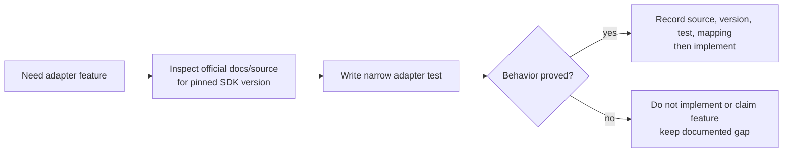

# CUGA SDK Verification Matrix

## Development-Time Purpose

This is a development-time checklist and evidence record, not a runtime routing


The soft CUGA context in `feedback/` is useful for identifying investigation

## Evidence Record Format

For every implemented CUGA feature, record:

```text
feature name
official documentation/source URL and revision
pinned package name and version
public SDK call(s) used
observed input/output/exception behavior
test file and test case
adapter module/function mapping
known limits and unsupported cases
date verified
```

## Required Verification Items

| Feature | Required proof before implementation | Current design position |
| --- | --- | --- |
| Agent construction | Official constructor/configuration API and lifecycle test | Required before adapter exists |
| Full rollout | Public invocation API, timeout/error behavior, cleanup test | First implementation target |
| Tool-call observation | Exact documented fields, availability conditions, sanitization test | Candidate initial provenance source |
| Streaming/callback observation | Stable public observation semantics and ordering test | Optional enhancement |
| Wrapper artifact materialization | Fresh runtime consumes wrapper manifest content as intended | Required for each writable artifact class |
| Policies/skills/knowledge mapping | Public configuration surface, scope, and reproducible rebuild test | Individually verified; do not generalize |
| Supervisor/topology configuration | Public construction/configuration and isolation test | Deferred unless a profile needs it |
| Checkpoint/replay | Public checkpoint, reconstruction, override, and validity test | Deferred; no implementation from generic trace alone |
| Concurrent execution | Documented safety plus isolated-client/process stress test | Deferred; parallel core may remain sequential at adapter boundary |
| SDK exception mapping | Public exception/partial failure behavior and recovery test | Required before production integration |

## Implementation Rule

After a feature is verified, the adapter can rely on the recorded pinned-version
