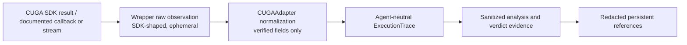

# CUGA Trace And Provenance Mapping

## Rule

This document specifies a neutral target mapping, not assumed CUGA fields. The

## Observation Flow



## Neutral Trace Requirements

`ExecutionTrace` records:

```text
candidate and workspace identity
task and rollout identity
terminal status and timing
final output reference or sanitized evaluation reference
ordered event references when available
tool/subagent event fields when available
artifact/version provenance only when actually observed
adapter and SDK version
missing-capability/unavailable markers
```

The exact CUGA soft reference suggests `InvokeResult` and tracked tool calls may

## Sanitization

Tool arguments/results and final output may contain secrets, private data,

## Causal Attribution Limits

Tool calls alone do not establish causal blame. The analyzer may cite available
