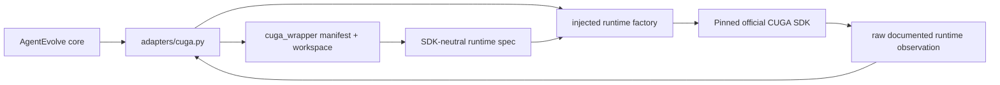
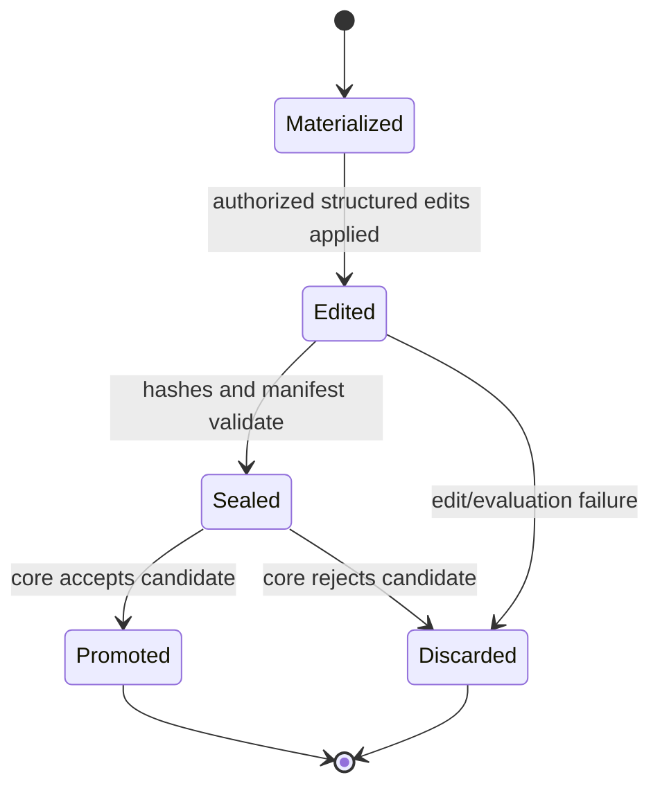

# CUGA Wrapper Architecture

## Ownership

`cuga_wrapper` is an AgentEvolve-owned, CUGA-specific but SDK-independent

It does not perform pool selection, causal attribution, edit-memory retrieval,



## Immutable Harness Manifest

A manifest describes one reproducible harness version:

```text
manifest identity and parent identity
resolved wrapper/runtime configuration
declared artifact units with opaque IDs and content hashes
read/write/merge declarations
activation bindings
SDK version expectation
observability configuration
content hash of the complete manifest
```

The manifest may reference wrapper-managed artifacts such as instructions,

Live SDK state, unknown SDK-managed storage, tool-provider implementation, graph

## Workspace Lifecycle



Every workspace derives from exactly one immutable parent manifest. It has an

## Artifact Granularity And Merge

The wrapper may expose a content block as an independent artifact only if it can

Example opaque IDs:

```text
cuga-wrapper/instructions/primary
cuga-wrapper/skills/retrieval-recovery
cuga-wrapper/policies/tool-guide/database
cuga-wrapper/workflows/customer-resolution
```

This supports deterministic inheritance of disjoint artifact edits. Same-unit

## Runtime Factory Boundary

`builder.py` defines an injected runtime-factory protocol:

```text
build(runtime_spec) -> runtime handle
run(runtime_handle, task) -> raw observation
close(runtime_handle)
```

The future CUGA adapter implements/injects this factory with the verified SDK.
Fake factories support wrapper tests before CUGA is installed. A fresh runtime is
