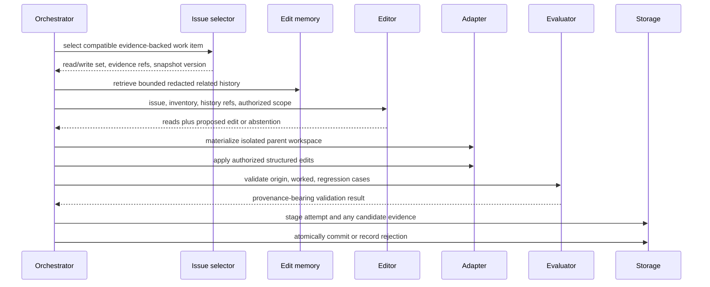
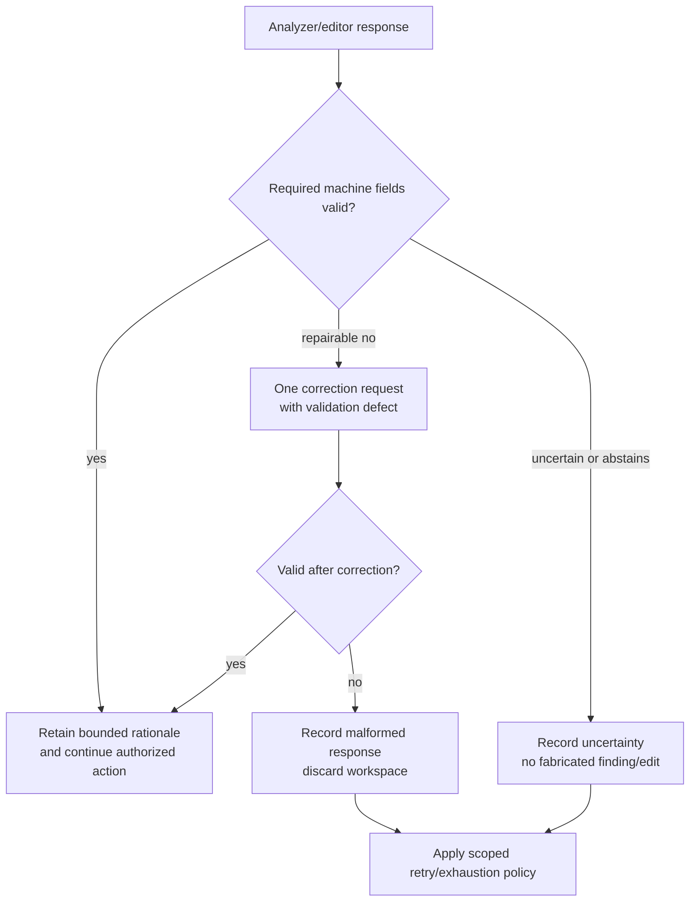
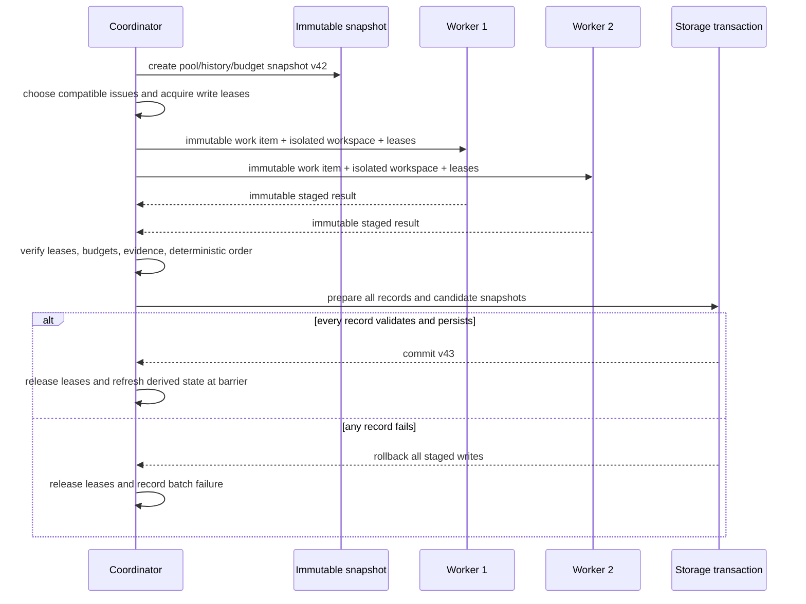

# Orchestration Lifecycle And Failure Policies

## Lifecycle State Machine

```mermaid
stateDiagram-v2
    [*] --> Initializing
    Initializing --> CorpusReady: config, storage, adapter, manifest valid
    Initializing --> Failed: invalid configuration or unavailable required service

    CorpusReady --> InitialPoolEvaluating: coreset and initial candidates ready
    InitialPoolEvaluating --> PoolReady: evidence persisted with provenance
    InitialPoolEvaluating --> Failed: no viable evidence or hard budget reached

    PoolReady --> SelectingWork: inner budget available
    SelectingWork --> AttemptExecuting: compatible issue selected
    SelectingWork --> MergeExecuting: eligible parent pair selected
    SelectingWork --> ChampionSelecting: budget or stop policy reached

    AttemptExecuting --> Validating: authorized workspace sealed
    AttemptExecuting --> AttemptRecorded: no-op, malformed, rejected, exhausted
    MergeExecuting --> Validating: child workspace sealed
    MergeExecuting --> AttemptRecorded: merge ineligible or unresolved

    Validating --> AttemptRecorded: terminal result assembled
    AttemptRecorded --> BarrierCommitting: sequential result or completed batch
    BarrierCommitting --> PoolReady: all staged records publish atomically
    BarrierCommitting --> Failed: durable transaction failure; no publication

    ChampionSelecting --> Completed: champion and manifest durable
    ChampionSelecting --> Failed: no eligible candidate
    Completed --> [*]
    Failed --> [*]
```

The state machine controls deterministic orchestration, budgets, and durable
records. It must not assume that an LLM response is deterministic or force model
reasoning into fixed branches.

## Attempt Lifecycle

The editor receives current artifact content only after requesting readable
artifact IDs. The adapter enforces the write set independently of the editor.

## LLM Output Recovery

The correction request contains no expected answer, evaluator internals, or
hidden labels. It describes only the missing/invalid interface field.

## Parallel Batch Protocol

Workers may write only their isolated workspace. They never write shared pool,
history, score tensor, budgets, or manifest state. Entropy/clustering refreshes

## Failure Policy

| Failure | Required response |
| --- | --- |
| Malformed analyzer/editor result | One repair request, then record non-promotion; never fabricate a verdict/edit. |
| Rollout timeout/cancellation | Record status and provenance; retry only within budget; exclude unavailable score cells. |
| Evaluator unavailable | Record unavailable evidence; do not call it a task success/failure. |
| Embedding unavailable | Use configured deterministic lexical fallback only if profile permits; record fallback in manifest. |
| Write lease conflict | Reject selection before execution; a conflict during execution aborts the batch transaction. |
| Protected floor violation | Reject candidate regardless of aggregate gain; persist validation evidence. |
| Storage transaction failure | Publish no candidate/history/tensor update from that barrier. |
| Retry exhaustion | Retain scoped exhaustion state; reopen only after materially changed evidence. |
