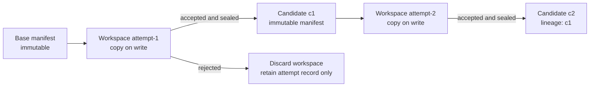
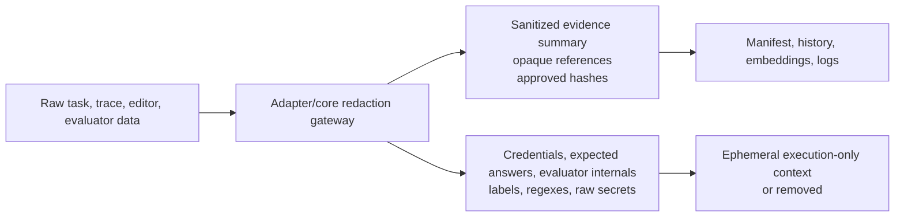

# Persistence And Provenance

## Goals

Persistent state must make an experiment reproducible, debuggable, and safe to
inspect without retaining prohibited material. Candidate and attempt records are
append-only immutable facts; mutable indexes are rebuildable derived state.

## Target Run Layout

```text
runs/
  {experiment_id}/
    manifest.json                 # resolved config, software/model IDs, status
    coreset.json                  # selected task references and selection evidence
    candidates/
      {candidate_id}/
        candidate.json            # lineage and immutable manifest reference
        artifacts.json            # opaque IDs, hashes, merge provenance
        score_tensor.json         # provenance-bearing comparable score cells
    attempts/
      {attempt_id}.json           # sanitized terminal attempt record
    analyses/
      {analysis_id}.json          # sanitized group reports
    verdicts/
      {verdict_id}.json           # causal findings and graph references
    workspaces/
      {workspace_id}/             # transient; promotion produces candidate record
    clusters/
      {iteration}/                # centroids, assignments, lineage, freshness
    merges/
      {merge_id}.json             # ancestry and per-artifact inheritance
    probes/
      {probe_id}.json             # deferred generalization evidence
    history/
      edit_memory.jsonl           # sanitized append-only records
    transactions/
      {transaction_id}.json       # prepare/commit/rollback audit state
    logs/
      budget.json
      errors.jsonl
```

Actual storage may be filesystem, database, or object store behind `storage.py`.
The logical record model and atomicity requirements are invariant.

## Immutable Candidate Versioning



A candidate record stores its own identifier, immutable wrapper/candidate

## Attempt Record Requirements

Each terminal attempt contains:

```text
attempt ID and snapshot version
parent candidate and resulting candidate, if admitted
issue fingerprint and task/mechanism references
authorized read/write artifact IDs
artifact hashes before and after
analysis, verdict, and edit-memory record IDs
sanitized rationale summary and risk summary
validation case references and score deltas
protected-floor decision
status: accepted | rejected | no_op | malformed | exhausted | unavailable
budget usage and timestamps
```

Raw editor prompts/responses, hidden expected answers, evaluator internals,

## Redaction Boundary



Redaction is recursive and content-aware. Denylisted field names alone are not

## Transactional Barrier Invariant

For a sequential attempt or completed parallel batch, exactly one durable

```text
attempt records
new immutable candidate records
score tensor updates
worked/failed/regression/retry history updates
budget consumption
manifest snapshot/version transition
lease release audit state
```

Derived caches such as entropy heaps or semantic indexes may be rebuilt from
