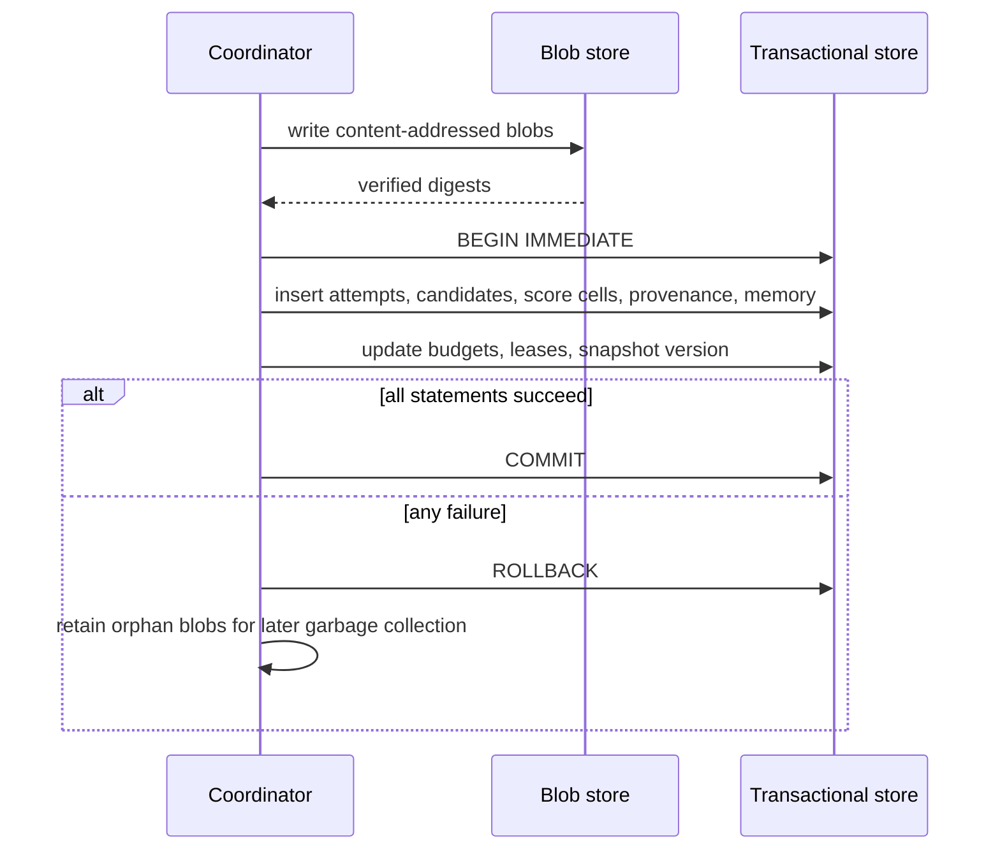

# Storage And Transactions

## Purpose

This document removes ambiguity from `core/storage.py`. The transactional barrier
invariant in [Persistence And Provenance](persistence-and-provenance.md) is not
achievable with independent file writes. This specification mandates a
transactional metadata store.

## Mandated Backend

The default and reference implementation must use **SQLite in WAL mode** as the
transactional metadata store, or another ACID RDBMS behind the same interface.

```text
Transactional store (required, ACID):
  candidates, score cells, attempts, validation results, merge provenance,
  memory records, retry state, budgets, leases, snapshots, cluster assignments,
  manifest state, transaction audit rows, blob references

Content-addressed blob store (filesystem or object store):
  large artifact content, sanitized trace bodies, analyzer/verdict payloads
```

Required SQLite configuration:

```text
journal_mode = WAL
synchronous = FULL
foreign_keys = ON
busy_timeout configured
one writer connection owned by the coordinator
```

A naive JSON-file implementation of the barrier is forbidden. A filesystem-only
backend may exist for tests only if it is explicitly labelled non-transactional
and rejected by any profile that enables parallel execution.

## Write Ordering

Blobs are written before the metadata transaction; metadata commits last.



Consequences:

- A committed metadata row always references an existing blob digest.
- An orphan blob is harmless and is reclaimed by garbage collection.
- A missing blob for a committed row is a corruption defect and must fail loudly.

## Barrier Commit Unit

Exactly one transaction publishes all of the following, or none:

```text
attempt records, including malformed, rejected, no_op, exhausted, unavailable
new immutable candidate records and artifact hash sets
score cells and comparability metadata
worked, regression, failed-strategy, and retry state updates
merge provenance rows
budget consumption
snapshot version transition
lease release audit rows
```

Rules:

- Workers never open a write transaction. Workers stage results in memory or in
  worker-private blob writes and return immutable results.
- The coordinator validates all staged results before `BEGIN IMMEDIATE`.
- Partial success is not representable: there is no code path that commits some
  records and reports failure.
- A crash between blob write and commit leaves the store in its pre-batch state.

## Idempotency And Recovery

Every write carries a deterministic idempotency key:

```text
attempt:   attempt_id
candidate: candidate_id
score:     (candidate_id, task_id, mechanism_cluster_id, rollout_ids digest)
merge:     merge_id
memory:    memory_record_id
```

Recovery on startup:

```text
1. Detect the last committed snapshot version.
2. Discard workspaces not referenced by a committed candidate.
3. Release expired leases.
4. Mark interrupted batches as failed with a reason.
5. Rebuild derived state from committed rows.
```

Derived state is never authoritative. Entropy heaps, cluster centroid caches,
semantic indexes, and Pareto frontier caches must be reconstructible from
committed rows.

## Redaction Gateway

All writes pass through a recursive sanitizer before persistence.

```text
1. Walk the full structure: mappings, sequences, nested records, and strings.
2. Reject prohibited categories by content and by field: credentials, expected
   answers, evaluator internals, labels, regexes, raw model prompts/responses,
   raw trace bodies not approved for persistence.
3. Replace approved-but-sensitive material with references and bounded summaries.
4. Produce a RedactionReport recording rule hits and truncations.
5. If sanitization cannot be completed, fail closed and abort the write.
```

Field-name denylists alone are insufficient. Embeddings, manifests, and terminal
logs are subject to the same gateway.

## Concurrency Rules

```text
one writer: the coordinator
many readers: snapshot-consistent reads for workers and reporting
write leases: rows in the transactional store with holder, scope, and expiry
lease acquisition and release are transactional
```

An expired lease is reclaimed only through a transaction that also records the
reclamation. Two holders of the same artifact write lease is a defect, and a
detected conflict aborts the batch transaction.

## Required Tests

```text
commit publishes every record type atomically
injected failure at each statement leaves zero published records
crash between blob write and commit yields no committed rows
orphan blobs are detected and garbage collected
duplicate idempotency keys do not create duplicate rows
recovery discards unreferenced workspaces and expired leases
non-transactional test backend is rejected by parallel profiles
recursive sanitizer rejects nested and string-embedded sensitive material
derived caches rebuild identically from committed rows
```
