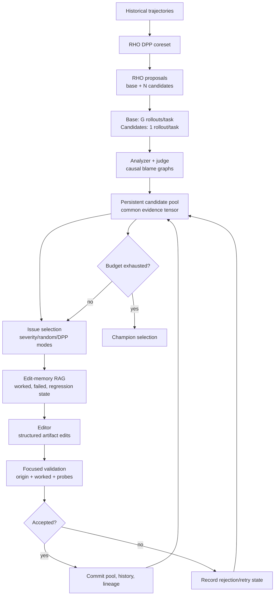

# RHO-Parallel-GEPA Target Architecture

## Scope

AgentEvolve evolves externally versioned agent harnesses. A harness can expose
skills, memory, policies, prompts, workflows, or other adapter-declared
artifacts. The generic core owns pool evolution, budgets, provenance, selection,
history, and concurrency. An adapter owns the concrete agent runtime and artifact
model.

The target reference adapter is CUGA through its SDK. CUGA source/docs are not
yet available locally, so this document defines capabilities rather than CUGA
internals.

## Core Pipeline



## Adapter Contract

The generic core uses `EvolutionAdapter` from
`src/agent_evolve/core/contracts.py`. The capability boundary is:

```text
artifact_inventory(candidate_version)
read_artifacts(candidate_version, artifact_ids)
materialize_candidate(parent_version, attempt_id)
apply_structured_edits(candidate_workspace, edits)
run_full_rollout(candidate_workspace, task, rollout_id)
capture_trace(rollout_result)
supports_counterfactual_replay()
discover_checkpoints(trace)
replay_from_checkpoint(checkpoint, workspace, task, rollout_id)
```

Replay is optional. An adapter that cannot prove checkpoint/state reconstruction
returns `False` and the core performs a full rollout instead.

## Pool And Evidence

The initial pool contains the base harness and every RHO proposal. The base
receives repeated `G` rollout evidence. Each post-RHO candidate starts with one
rollout per selected task to maintain RHO-scale cost. Candidates receive adaptive
repeat rollouts when they become Pareto relevant, have uncertain attribution,
need merge evaluation, or require worked-set validation.

Candidate evidence must retain provenance:

```text
task ID
trace IDs
rollout count
analyzer/judge model ID
mechanism cluster ID
score coverage
blame confidence and stability
artifact versions
```

No candidate may be compared as Pareto-equivalent merely because it has a number;
score provenance and coverage must be compatible.

## Causal Blame Graphs

The analyzer+judge emits dynamic failure mechanisms and causal blame graphs. It
does not force observations into a fixed taxonomy.

```json
{
  "mechanism": "deprecated schema propagated to executor",
  "severity": 0.9,
  "score": 0.2,
  "blame_graph": {
    "nodes": [
      {"id": "retriever", "blame": 0.75, "artifacts": ["skills/api-retrieval"]},
      {"id": "executor", "blame": 0.25, "artifacts": ["policies/execution"]}
    ],
    "edges": [
      {"from": "retriever", "to": "executor", "mechanism": "returned stale schema"}
    ]
  },
  "counterfactual_evidence": ["Replacing retrieved schema would make arguments valid."]
}
```

Default operation uses one analyzer+judge call. Consensus and controlled
intervention calibration are feature-gated research checks, not assumed truth.

## Mechanism Clustering And Entropy

Free-form mechanisms are embedded with task, phase/tool, artifact, and
counterfactual context. Base-harness mechanisms provide anchors. Task-local
incremental clusters assign `mechanism_cluster_id`, which is the cross-candidate
alignment key.

Cell comparability is decided by semantic similarity, not by cluster-ID equality.
Two mechanism clusters whose embeddings reach the comparability threshold
(default `0.95`) are treated as the same cell for entropy purposes, so variance
can be computed across candidates that failed the same way under slightly
different mechanism wording.

This threshold is deliberately stricter than the cluster join threshold. Joining
shapes the cluster space and a mistake there is recoverable at a refresh barrier;
comparability decides what may be *statistically compared*, and a false merge
silently corrupts entropy and every selection that reads it.

Clusters are stable inside an outer iteration. New observations may join an
existing cluster; cluster create/merge/split occurs at refresh barriers. Track
cluster freshness and reduce entropy weight when evidence is stale.

For comparable candidates:

\[
H(t,m)=Var(\{Q(h_i,t,m)\})
\times\max(\max_i Q(h_i,t,m), \epsilon_{floor})
\]

The score floor retains frontier-exploration signal where candidates differ but
no strong solution exists yet. Entropy cannot drive selection until at least
three comparable candidates and two rollouts per candidate support the cell.

Use a max-heap for incremental entropy priority. Use hierarchical DPP: task
selection first, then mechanism selection within tasks. Selection modes are
`dpp`, `severity_rank`, and seeded `random` for ablations.

## Feedback-Validated Editing

An editor may modify any adapter-declared artifact in its approved write set. It
must request/read current content before editing and returns rationale, reads,
writes, edits, risks, and expected effects. Every attempt records sanitized
reasoning, diff, evidence references, history IDs, validation results, and status.

Focused validation covers:

```text
origin mechanism cases
worked-set cases for written artifacts
regression probes for written artifacts
```

Small regressions are allowed only when weighted net gain is positive and no
protected critical floor is violated. Retry state is scoped to issue, artifact
group, and lineage, with a default maximum of three attempts.

Generalization probes are deferred until a mechanism edit cluster completes.
They are budgeted, may replay only when the adapter supports it, and otherwise
perform full rollouts. Probe failures become future regression evidence.

## Parallelism And Merge

Parallel mode creates an immutable pool/history snapshot, selects compatible
issues, grants exclusive artifact write leases, and gives each worker an isolated
candidate workspace. Workers do not write shared pool/history state. A
coordinator commits sorted attempt results at a barrier.

Merge is deterministic by default. It uses ancestry, artifact diffs, causal
mechanism complementarity, and protected regression floors. The editor may refine
only a documented same-artifact conflict; it cannot rewrite unrelated artifacts.

## Profiles

```text
minimal:
  persistent pool + outcome Pareto + RHO diagnosis editor

research_sequential:
  causal blame, edit memory, validation, sequential attempts

research_parallel:
  research_sequential + snapshot/lease batch execution

full_ablation:
  all individual feature controls exposed
```
