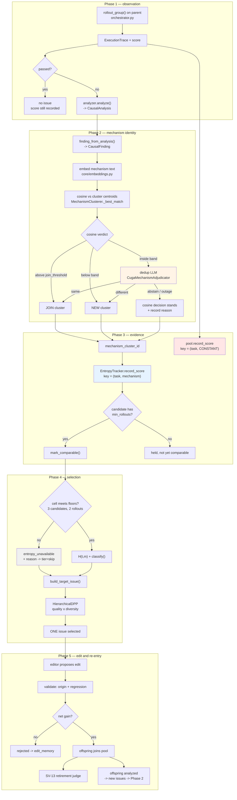

# Issue Lifecycle Design — mechanism identity, dedup, and entropy

**Status: DESIGN, not implemented.** This document exists because two attempts at
step 4 built on assumptions that did not survive measurement. Every number below
is measured and logged; every open decision is marked as such.

**Scope:** the whole life of an *issue* — from the moment a rollout fails, through
diagnosis, mechanism identity, entropy accumulation, DPP selection, editing, and
the arrival of an offspring whose issues re-enter the pool.

**Audience:** a fresh agent after compaction. Read this before touching
clustering, entropy, or issue selection.

---

## 1. What an issue is for

The optimizer must answer one question per attempt: **which fault, on which task,
is most worth fixing next?**

The signal it uses is *cross-candidate disagreement*. If N candidate harnesses all
score the same on a fault, there is nothing to learn from their differences. If
`h1` scores 0.9 and `h3` scores 0.1 on the **same** fault, then `h1` already knows
something `h3` does not — a fix is demonstrably reachable, and that fault should be
prioritised.

That is what entropy measures:

```text
H(t, m) = Var({Q(h_i, t, m)}) * max(max_i Q(h_i, t, m), score_floor)
```

`Var` over *which* scores is the whole problem. It must be the scores of
**candidates that failed for the same reason**. Group them wrongly and the number
is meaningless in one of two ways:

| grouping error | what the number becomes |
| --- | --- |
| too coarse (unrelated faults in one cell) | variance across *different* problems, read as "a fix is reachable here" for a mechanism that does not exist |
| too fine (one fault split across cells) | each cell holds one candidate, variance is undefined, the evidence floor is never met, entropy reports unavailable |

**The second error is the live one.** Section 3 measures it.

---

## 2. Why the analyzer makes this hard

Mechanism labels come from an LLM analyzer, which is stochastic. The *same*
underlying fault gets described differently on each observation:

```text
h1: "the agent did not verify units before reporting the final answer"
h2: "units were never checked prior to reporting the result"
h3: "failed to validate measurement units before emitting the answer"
```

One fault. Three strings. A naive exact-match or a strict cosine threshold treats
these as three mechanisms, which is the too-fine error.

So mechanism identity cannot be *lexical*. It has to be *semantic*, and the
semantic judgement has to be good enough that paraphrase merges while genuinely
different faults stay apart.

---

## 3. Measured: cosine alone provably cannot do this

Live `embeddinggemma` via Ollama, 768-dim. Four fault families, three analyzer
rephrasings each: 12 same-fault pairs, 54 different-fault pairs, all 66 unique
pairs evaluated. Log: `terminal_output/calibration/live-embedder-calibration.log`.

```text
SAME fault   min=0.466  mean=0.728  max=0.851
DIFF fault   min=0.244  mean=0.393  max=0.502

separation (min_same - max_diff) = -0.036      <- NEGATIVE
```

**The distributions overlap.** No single cosine threshold separates paraphrase
from distinct fault. This is not a tuning problem; it is a property of the
embedding space on this kind of text.

Threshold sweep, same 66 pairs:

| threshold | true merges (of 12) | false merges (of 54) |
| --- | --- | --- |
| 0.45 | 12 | 10 |
| 0.50 | 11 | 1 |
| 0.55 | 10 | 0 |
| 0.60 | 10 | 0 |
| 0.70 | 9 | 0 |
| **0.75 (current)** | **6** | 0 |

**At today's `join_threshold=0.75`, half of all analyzer rephrasings fragment into
separate cells.** Each fragment holds one candidate, so the 3-comparable-candidate
floor is never met and entropy reports unavailable — exactly the starvation SV-12
describes. Demonstrated end to end with the lexical embedder:

```text
FRAGMENTED (thr=0.75)   c0,c1,c2 -> 1 candidate each -> H=None, tier=skip
POOLED     (thr=0.45)   c0       -> 3 candidates     -> H=0.096, recombination_target
```

The 0.9-vs-0.1 spread — the signal worth acting on — is invisible in the first case.

### 3.1 The dedup adjudicator closes the gap

Live `openai/aws/gpt-oss-120b` via LiteLLM, 6 hand-labelled pairs (4 must merge,
2 must not): **6 of 6 correct**, including both refusals. Log:
`terminal_output/calibration/live-adjudicator-probe.log`.

This is why the two-stage design is load-bearing rather than an optimisation:

- **stage 1, cosine** — free, decides the clear cases at either extreme;
- **stage 2, dedup LLM** — costs one call, decides only where cosine is
  measurably unreliable.

### 3.2 The current band was miscalibrated — FIXED 2026-08-21

`band_low=0.60, band_high=0.85` captured 9 of 66 pairs, and by luck all 9 were
same-fault. But **2 true pairs fell below 0.60**, where cosine split them
silently with no adjudicator call. Those are exactly the fragmentations that
starve the cell.

Bands scored by **silent splits** — true paraphrase pairs decided against
merging by cosine alone, with no model call. This is the metric that matters;
raw band occupancy is only the cost:

| band | pairs adjudicated | silent splits | false-merge risk |
| --- | --- | --- | --- |
| 0.60–0.85 (was) | 9 / 66 | 2 / 12 | 0 |
| **0.45–0.75 (now)** | **16 / 66** | **0 / 12** | **0** |
| 0.40–0.75 | 35 / 66 | 0 / 12 | 0 |

`0.45–0.75` is the smallest measured band that silently splits **zero** true
pairs. `0.40–0.75` buys nothing and more than doubles the calls.

**Shipped:** `core/clustering.py` now owns `DEFAULT_JOIN_THRESHOLD`,
`DEFAULT_BAND_LOW` and `DEFAULT_BAND_HIGH` as the single definition;
`core/config.py` and `pipeline.py` re-export them. Previously the pair was
written out at **four** independent sites, which drift apart silently because a
wrong band produces a plausible-looking clustering rather than an error.

**A new invariant came out of the measurement:** `band_high` must not be below
`join_threshold`. The span `[band_high, join_threshold)` would be neither
ambiguous nor joining, so cosine would decide it alone — precisely the region the
adjudicator exists to cover. Measured: band `[0.45, 0.70)` against threshold
`0.75` stranded true pairs at cosine `0.718`, `0.749` and `0.726`. The check is
scoped to "an adjudicator is attached", because with no adjudicator the band is
never read and raising would reject legitimate cosine-only configurations.

**Live verification.** On the 12 pairs in the newly-reached `0.45–0.60` window the
dedup model scored **12/12**: it merged both true paraphrases and refused all 10
distinct pairs. Correction to an earlier draft of this document, which stated
`~43/66` adjudicated for this band: the measured figure is **16/66**.

These numbers are **indicative, not tuned**: 4 families, synthetic phrasings, not
real CUGA analyzer output. Do not present them as an optimum.

---

## 4. The lifecycle



### The two red/blue boxes are the invariant most easily broken

`N` (blue) and `S` (red) both key on `(task_id, mechanism_cluster_id)` and need
**opposite** things from the second slot:

| structure | question | key policy |
| --- | --- | --- |
| `EntropyTracker` cells | *where is variance high, so a fix is reachable?* | mechanism-**keyed** |
| Pool `score_tensor` | *is c1 better than base?* | **constant / shared** |

Champion comparison intersects on the exact full key (`pool.py:449-451`). Keying
pool cells by mechanism empties that intersection and SV-2 regresses **silently** —
`dominates()` correctly returns `False` on no overlap, and a frontier containing
everything looks like healthy diversity. Measured:

```text
POOL KEY = CONSTANT    shared cells: 2   dominates: True    frontier: ('c1',)
POOL KEY = MECHANISM   shared cells: 0   dominates: False   frontier: ('base','c1')
```

A guard test in `tests/test_embedder_wiring.py` enforces the constant pool key.
**Do not merge these two keyspaces.**

---

## 5. Module map

| Concern | Module | State |
| --- | --- | --- |
| Rollout, diagnosis, issue build | `core/orchestrator.py` (`SequentialGepaRunner`) | live |
| Mechanism embedding | `core/embeddings.py` (`build_embedder`, `FallbackEmbedder`) | live |
| Clustering decision | `core/clustering.py` (`MechanismClusterer`, `ClusterRegistry`) | live |
| Dedup adjudication | `adapters/cuga_mechanism_adjudicator.py` | built, probed live 6/6 |
| Entropy cells and floors | `core/entropy.py` | live, **0-diff constraint** |
| Issue quality and DPP | `core/issues.py` | live |
| Pool, champion, retirement | `core/pool.py`, `core/resolution.py` | live |
| Composition, env, wiring | `pipeline.py` (`embedder_for_config`, `cluster_registry_for_config`) | live |

`core/` is agent-neutral: the adjudicator enters as an **injected protocol**
(`MechanismAdjudicator`), constructed in `pipeline.py`, never imported by `core/`.

---

## 6. Decisions this document proposes

### D1 — Mechanism identity is task-local, and that is sufficient

Variance is computed *within* one task across N candidates, so the mechanism id
never has to mean anything outside its task. Cluster ids are a per-task counter
(`c0`, `c1`, ...), which is fine for this purpose.

This **supersedes** the earlier framing of step 4 as "task-agnostic mechanism
identity". Cross-task pooling is a *separate, optional* benefit (one fault on 4
tasks needing 3 candidates once instead of four times) and is **deferred**, because
counter-assigned ids are order-dependent: the same fault measured as `c2` in one
task and `c3` in another purely from arrival order.

### D2 — Anchor as you go, not from base-harness observations

`AGENTS.md:73` currently says mechanisms align *"through task-local semantic
clusters anchored by base-harness observations"*. `add_anchor(force_new=True)`
exists at `clustering.py:250` with **zero callers in `src/`**, and as built it does
not work:

- anchors embed **bare mechanism text**, observations embed mechanism **plus actor
  plus artifacts**, so an identical mechanism scored only **0.756** against its own
  anchor;
- 2 anchors plus their 2 matching observations produced **4 clusters, not 2**;
- `similarity` is `1.0` by construction on the `force_new` path, since it skips
  `_best_match` — a number that says nothing about proximity.

**Proposed:** clusters form dynamically as mechanisms arrive, at the two natural
points the user identified — initial post-RHO pool creation, and when an offspring
is analyzed. Emergent vocabulary, consistent with `AGENTS.md`'s "causal blame
graphs replace a fixed failure taxonomy". `AGENTS.md:73` must be updated to match;
see §8.

### D3 — Widen the ambiguity band; keep cosine as the free pre-filter — SHIPPED

Band is `0.45–0.75` (§3.2), the smallest measured band that silently splits zero
true pairs. `join_threshold` stays `0.75` so a confident cosine match still merges
for free, and `band_high >= join_threshold` is now enforced so no dead window can
open between them. Conservative on adjudicator outage: cosine stands, reason
recorded.

**A prerequisite defect had to be fixed first, and it made the band inert.**
`pipeline.cluster_registry_for_config` passed `base_url=dedup.base_url` while
`MechanismDedupConfig`'s field is `url`; the broad `except Exception` caught the
`AttributeError` and degraded to cosine-only clustering. So the adjudicator had
**never attached in production** despite the config reporting `enabled=True`, and
the band is only consulted when an adjudicator exists. Any earlier band number was
therefore decoration. The endpoint is now read behind an explicit guard that
raises rather than degrades on a rename.

### D4 — Unavailable is reported, never substituted — SHIPPED

A cell below the floors yields `tier="skip"`, `raw_issue_quality` zeroes the
entropy term, and selection falls back to severity/coverage. The reason is
retained (`entropy_unavailable_reason`). **Mechanism-keying makes `skip` MORE
frequent, not less** — correct-but-unavailable beats confidently wrong, but it is
not a throughput win.

Now aggregated too (Q1, closed): `EntropyAvailabilityReport` counts available and
unavailable **cells** with a per-category tally, reaches `GepaRunResult`, and is
recorded per iteration in the audit trail. `fallback_rate` is `None` for `0/0`
rather than `0.0`, because zero would claim perfect availability for a run that
measured nothing. Measured on the offline fake: **3/3 cells unavailable, 100%
fallback, `floor_unmet=3`** — entropy never drove selection there, which is
precisely what the report exists to expose.

---

## 7. Open questions

| # | Question | Why it needs a decision |
| --- | --- | --- |
| ~~Q1~~ | ~~Should the fallback rate be aggregated into the run summary?~~ | **CLOSED 2026-08-21.** Aggregated per cell with category tallies; wired into `GepaRunResult` and the per-iteration audit record. |
| Q2 | Is `max_clusters_per_task=12` right once paraphrase merges properly? | A full cap now returns `cluster_id=""` (refusal). Widening the band should reduce cluster count, so the cap may stop binding. |
| Q3 | Should the adjudicator verdict cache persist across runs? | Currently in-memory per instance. Persisting cuts cost but needs invalidation when the model changes. |
| Q4 | Cross-task pooling (deferred D1) — worth it later? | Would cut evidence cost ~4x on systemic faults, but needs order-independent ids. |
| Q5 | Do RHO and the genetic loop share a process? | Not verified. Bears on whether RHO's discarded evidence could ever feed the genetic tracker. |

---

## 8. Files this design contradicts, and what must change

Per the user's standing instruction: where this design conflicts with a document a
future session will rely on, **that document must be updated**, or the next agent
inherits a false premise.

| File | Current wording | Required change |
| --- | --- | --- |
| `AGENTS.md:73` | *"Mechanisms align through task-local semantic clusters anchored by base-harness observations."* | Anchoring is not implemented and does not work as described (D2). Replace with dynamic cluster formation plus cosine-and-adjudicator identity. |
| `docs/COMPACTION-ANCHOR-SV12.md` §9.3 | Frames the fix as task-agnostic identity via base-harness anchoring | Mark superseded by D1/D2; keep the measurement as evidence. |
| `docs/COMPACTION-ANCHOR-SV12.md` step-4 line | *"Step 4 — task-agnostic mechanism identity"* | Re-scope: within-task dedup quality first; cross-task pooling deferred. |
| `docs/SEVERE-OPEN-ISSUES.md` SV-12 | Constraint section says cross-task identity "needs that anchoring built" | Record that anchoring as built is defective, with the 0.756 measurement. |
| `docs/USER-MANUAL.md` §1.1 | Documents `AE_MECHANISM_DEDUP_*` | Band defaults change under D3; note the measured basis. |

---

## 9. What is NOT established

- **No real CUGA analyzer wording has been clustered.** All 12 calibration strings
  are synthetic phrasings written by me. The numbers are indicative.
- **No end-to-end live run** has exercised embedder plus adjudicator plus tracker
  together inside a real evolution loop.
- **The 4-family sample is small.** 12 same-fault pairs is enough to show the
  distributions overlap; it is not enough to fix a threshold precisely.
- **Cross-task identity is unsolved**, deliberately deferred, not designed here.
- `cell_entropy`, `top_entropy_cells`, and `entropy_weighted_with_freshness` on
  `EntropyTracker` still have **zero callers** — dead read API.
