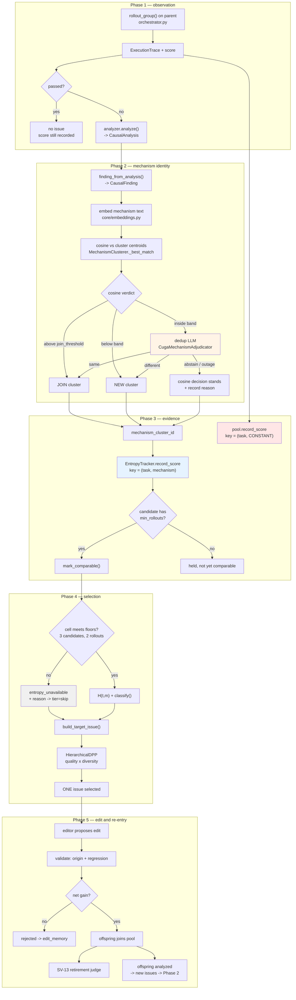
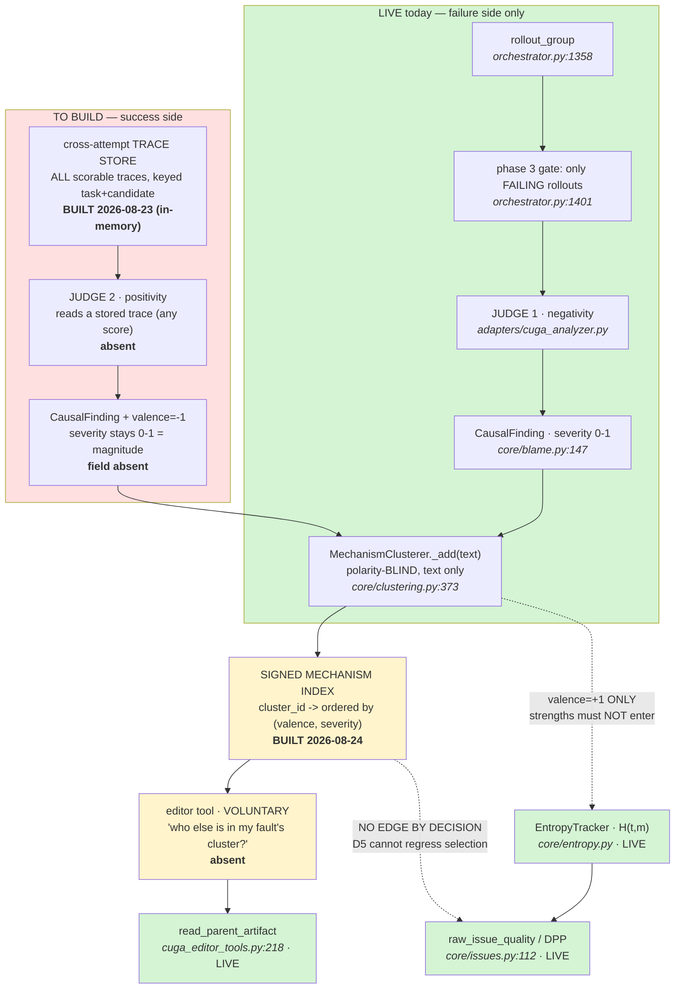
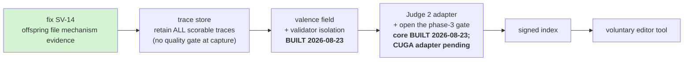

# Issue Lifecycle Design — mechanism identity, dedup, and entropy

**Status: DESIGN, not implemented.** This document exists because two attempts at
step 4 built on assumptions that did not survive measurement. Every number below
is measured and logged; every open decision is marked as such.

**Scope:** the whole life of an *issue* — from the moment a rollout fails, through
diagnosis, mechanism identity, entropy accumulation, DPP selection, editing, and
the arrival of an offspring whose issues re-enter the pool.

**Audience:** a fresh agent after compaction. Read this before touching
clustering, entropy, or issue selection.

---

## 1. What an issue is for

The optimizer must answer one question per attempt: **which fault, on which task,
is most worth fixing next?**

The signal it uses is *cross-candidate disagreement*. If N candidate harnesses all
score the same on a fault, there is nothing to learn from their differences. If
`h1` scores 0.9 and `h3` scores 0.1 on the **same** fault, then `h1` already knows
something `h3` does not — a fix is demonstrably reachable, and that fault should be
prioritised.

That is what entropy measures:

```text
H(t, m) = Var({Q(h_i, t, m)}) * max(max_i Q(h_i, t, m), score_floor)
```

`Var` over *which* scores is the whole problem. It must be the scores of
**candidates that failed for the same reason**. Group them wrongly and the number
is meaningless in one of two ways:

| grouping error | what the number becomes |
| --- | --- |
| too coarse (unrelated faults in one cell) | variance across *different* problems, read as "a fix is reachable here" for a mechanism that does not exist |
| too fine (one fault split across cells) | each cell holds one candidate, variance is undefined, the evidence floor is never met, entropy reports unavailable |

**The second error is the live one.** Section 3 measures it.

---

## 2. Why the analyzer makes this hard

Mechanism labels come from an LLM analyzer, which is stochastic. The *same*
underlying fault gets described differently on each observation:

```text
h1: "the agent did not verify units before reporting the final answer"
h2: "units were never checked prior to reporting the result"
h3: "failed to validate measurement units before emitting the answer"
```

One fault. Three strings. A naive exact-match or a strict cosine threshold treats
these as three mechanisms, which is the too-fine error.

So mechanism identity cannot be *lexical*. It has to be *semantic*, and the
semantic judgement has to be good enough that paraphrase merges while genuinely
different faults stay apart.

---

## 3. Measured: cosine alone provably cannot do this

Live `embeddinggemma` via Ollama, 768-dim. Four fault families, three analyzer
rephrasings each: 12 same-fault pairs, 54 different-fault pairs, all 66 unique
pairs evaluated. Log: `terminal_output/calibration/live-embedder-calibration.log`.

```text
SAME fault   min=0.466  mean=0.728  max=0.851
DIFF fault   min=0.244  mean=0.393  max=0.502

separation (min_same - max_diff) = -0.036      <- NEGATIVE
```

**The distributions overlap.** No single cosine threshold separates paraphrase
from distinct fault. This is not a tuning problem; it is a property of the
embedding space on this kind of text.

Threshold sweep, same 66 pairs:

| threshold | true merges (of 12) | false merges (of 54) |
| --- | --- | --- |
| 0.45 | 12 | 10 |
| 0.50 | 11 | 1 |
| 0.55 | 10 | 0 |
| 0.60 | 10 | 0 |
| 0.70 | 9 | 0 |
| **0.75 (current)** | **6** | 0 |

**At today's `join_threshold=0.75`, half of all analyzer rephrasings fragment into
separate cells.** Each fragment holds one candidate, so the 3-comparable-candidate
floor is never met and entropy reports unavailable — exactly the starvation SV-12
describes. Demonstrated end to end with the lexical embedder:

```text
FRAGMENTED (thr=0.75)   c0,c1,c2 -> 1 candidate each -> H=None, tier=skip
POOLED     (thr=0.45)   c0       -> 3 candidates     -> H=0.096, recombination_target
```

The 0.9-vs-0.1 spread — the signal worth acting on — is invisible in the first case.

### 3.1 The dedup adjudicator closes the gap

Live `openai/aws/gpt-oss-120b` via LiteLLM, 6 hand-labelled pairs (4 must merge,
2 must not): **6 of 6 correct**, including both refusals. Log:
`terminal_output/calibration/live-adjudicator-probe.log`.

This is why the two-stage design is load-bearing rather than an optimisation:

- **stage 1, cosine** — free, decides the clear cases at either extreme;
- **stage 2, dedup LLM** — costs one call, decides only where cosine is
  measurably unreliable.

### 3.2 The current band was miscalibrated — FIXED 2026-08-21

`band_low=0.60, band_high=0.85` captured 9 of 66 pairs, and by luck all 9 were
same-fault. But **2 true pairs fell below 0.60**, where cosine split them
silently with no adjudicator call. Those are exactly the fragmentations that
starve the cell.

Bands scored by **silent splits** — true paraphrase pairs decided against
merging by cosine alone, with no model call. This is the metric that matters;
raw band occupancy is only the cost:

| band | pairs adjudicated | silent splits | false-merge risk |
| --- | --- | --- | --- |
| 0.60–0.85 (was) | 9 / 66 | 2 / 12 | 0 |
| **0.45–0.75 (now)** | **16 / 66** | **0 / 12** | **0** |
| 0.40–0.75 | 35 / 66 | 0 / 12 | 0 |

`0.45–0.75` is the smallest measured band that silently splits **zero** true
pairs. `0.40–0.75` buys nothing and more than doubles the calls.

**Shipped:** `core/clustering.py` now owns `DEFAULT_JOIN_THRESHOLD`,
`DEFAULT_BAND_LOW` and `DEFAULT_BAND_HIGH` as the single definition;
`core/config.py` and `pipeline.py` re-export them. Previously the pair was
written out at **four** independent sites, which drift apart silently because a
wrong band produces a plausible-looking clustering rather than an error.

**A new invariant came out of the measurement:** `band_high` must not be below
`join_threshold`. The span `[band_high, join_threshold)` would be neither
ambiguous nor joining, so cosine would decide it alone — precisely the region the
adjudicator exists to cover. Measured: band `[0.45, 0.70)` against threshold
`0.75` stranded true pairs at cosine `0.718`, `0.749` and `0.726`. The check is
scoped to "an adjudicator is attached", because with no adjudicator the band is
never read and raising would reject legitimate cosine-only configurations.

**Live verification.** On the 12 pairs in the newly-reached `0.45–0.60` window the
dedup model scored **12/12**: it merged both true paraphrases and refused all 10
distinct pairs. Correction to an earlier draft of this document, which stated
`~43/66` adjudicated for this band: the measured figure is **16/66**.

These numbers are **indicative, not tuned**: 4 families, synthetic phrasings, not
real CUGA analyzer output. Do not present them as an optimum.

---

## 4. The lifecycle



### The two red/blue boxes are the invariant most easily broken

`N` (blue) and `S` (red) both key on `(task_id, mechanism_cluster_id)` and need
**opposite** things from the second slot:

| structure | question | key policy |
| --- | --- | --- |
| `EntropyTracker` cells | *where is variance high, so a fix is reachable?* | mechanism-**keyed** |
| Pool `score_tensor` | *is c1 better than base?* | **constant / shared** |

Champion comparison intersects on the exact full key (`pool.py:449-451`). Keying
pool cells by mechanism empties that intersection and SV-2 regresses **silently** —
`dominates()` correctly returns `False` on no overlap, and a frontier containing
everything looks like healthy diversity. Measured:

```text
POOL KEY = CONSTANT    shared cells: 2   dominates: True    frontier: ('c1',)
POOL KEY = MECHANISM   shared cells: 0   dominates: False   frontier: ('base','c1')
```

A guard test in `tests/test_embedder_wiring.py` enforces the constant pool key.
**Do not merge these two keyspaces.**

---

## 5. Module map

| Concern | Module | State |
| --- | --- | --- |
| Rollout, diagnosis, issue build | `core/orchestrator.py` (`SequentialGepaRunner`) | live |
| Mechanism embedding | `core/embeddings.py` (`build_embedder`, `FallbackEmbedder`) | live |
| Clustering decision | `core/clustering.py` (`MechanismClusterer`, `ClusterRegistry`) | live |
| Dedup adjudication | `adapters/cuga_mechanism_adjudicator.py` | built, probed live 6/6 |
| Entropy cells and floors | `core/entropy.py` | live, **0-diff constraint** |
| Issue quality and DPP | `core/issues.py` | live |
| Pool, champion, retirement | `core/pool.py`, `core/resolution.py` | live |
| Composition, env, wiring | `pipeline.py` (`embedder_for_config`, `cluster_registry_for_config`) | live |

`core/` is agent-neutral: the adjudicator enters as an **injected protocol**
(`MechanismAdjudicator`), constructed in `pipeline.py`, never imported by `core/`.

---

## 6. Decisions this document proposes

### D1 — Mechanism identity is task-local, and that is sufficient

Variance is computed *within* one task across N candidates, so the mechanism id
never has to mean anything outside its task. Cluster ids are a per-task counter
(`c0`, `c1`, ...), which is fine for this purpose.

This **supersedes** the earlier framing of step 4 as "task-agnostic mechanism
identity". Cross-task pooling is a *separate, optional* benefit (one fault on 4
tasks needing 3 candidates once instead of four times) and is **deferred**, because
counter-assigned ids are order-dependent: the same fault measured as `c2` in one
task and `c3` in another purely from arrival order.

### D2 — Anchor as you go, not from base-harness observations

`AGENTS.md:73` currently says mechanisms align *"through task-local semantic
clusters anchored by base-harness observations"*. `add_anchor(force_new=True)`
exists at `clustering.py:250` with **zero callers in `src/`**, and as built it does
not work:

- anchors embed **bare mechanism text**, observations embed mechanism **plus actor
  plus artifacts**, so an identical mechanism scored only **0.756** against its own
  anchor;
- 2 anchors plus their 2 matching observations produced **4 clusters, not 2**;
- `similarity` is `1.0` by construction on the `force_new` path, since it skips
  `_best_match` — a number that says nothing about proximity.

**Proposed:** clusters form dynamically as mechanisms arrive, at the two natural
points the user identified — initial post-RHO pool creation, and when an offspring
is analyzed. Emergent vocabulary, consistent with `AGENTS.md`'s "causal blame
graphs replace a fixed failure taxonomy". `AGENTS.md:73` must be updated to match;
see §8.

### D3 — Widen the ambiguity band; keep cosine as the free pre-filter — SHIPPED

Band is `0.45–0.75` (§3.2), the smallest measured band that silently splits zero
true pairs. `join_threshold` stays `0.75` so a confident cosine match still merges
for free, and `band_high >= join_threshold` is now enforced so no dead window can
open between them. Conservative on adjudicator outage: cosine stands, reason
recorded.

**A prerequisite defect had to be fixed first, and it made the band inert.**
`pipeline.cluster_registry_for_config` passed `base_url=dedup.base_url` while
`MechanismDedupConfig`'s field is `url`; the broad `except Exception` caught the
`AttributeError` and degraded to cosine-only clustering. So the adjudicator had
**never attached in production** despite the config reporting `enabled=True`, and
the band is only consulted when an adjudicator exists. Any earlier band number was
therefore decoration. The endpoint is now read behind an explicit guard that
raises rather than degrades on a rename.

### D4 — Unavailable is reported, never substituted — SHIPPED

A cell below the floors yields `tier="skip"`, `raw_issue_quality` zeroes the
entropy term, and selection falls back to severity/coverage. The reason is
retained (`entropy_unavailable_reason`). **Mechanism-keying makes `skip` MORE
frequent, not less** — correct-but-unavailable beats confidently wrong, but it is
not a throughput win.

Now aggregated too (Q1, closed): `EntropyAvailabilityReport` counts available and
unavailable **cells** with a per-category tally, reaches `GepaRunResult`, and is
recorded per iteration in the audit trail. `fallback_rate` is `None` for `0/0`
rather than `0.0`, because zero would claim perfect availability for a run that
measured nothing. Measured on the offline fake: **3/3 cells unavailable, 100%
fallback, `floor_unmet=3`** — entropy never drove selection there, which is
precisely what the report exists to expose.

### D5 — Two polarity-isolated judges, one shared cluster namespace, signed valence

**PROPOSED 2026-08-21, not built.** Origin: `feedback/from_qwen/qf36.md` — today the
analyzer is only ever shown failures, so the mechanism layer compares *bad* against
*less bad* and never records that some candidate did the same task **well**. The
consequence is concrete: a candidate can score `1.0` on every task and hold **zero**
mechanism ids, so it is invisible to any mechanism-keyed lookup. Verified on the
production runner:

```text
child: base-v0+att-i001-s0000
issues for child : 0
child task scores: {'task-a': 1.0, 'task-b': 1.0}
```

The cause is one line, `orchestrator.py:1401`:

```python
# Only answered failures are worth a model call.
to_analyze = [... if outcome.trace is not None and score.scorable and not score.passed]
```

That is a property of the current wiring, **not** of successes. A second judge is
what makes success describable.

#### D5.1 — One shared cluster namespace, because measurement demands it

A fault and its corresponding strength are **the same mechanism seen from two
sides**, and the live 768-dim embedder places them together:

| cosine | verdict at `join=0.75` | pair |
| --- | --- | --- |
| **0.963** | JOIN — same cluster | "skill does *not* verify checksums" vs "skill *verifies* checksums" |
| **0.944** | JOIN — same cluster | "planner *fails to* retry" vs "planner *retries*" |
| 0.331 | separate | two unrelated faults |

An earlier draft of this decision proposed **separate** `fault:` / `strength:`
namespaces to stop the collision. That was **wrong, and the measurement reversed
it**: separation would put the parent's fault in one cluster and the solver's
strength in another, destroying the very join the feature exists to make. The
collision is the feature. One namespace also leaves the `max_clusters_per_task=12`
cap (Q2) unchanged rather than doubling pressure on it.

Note this makes the clusterer's polarity-blindness *load-bearing*: `_add`
(`clustering.py:373`) takes **text only** — no score, no sign — so the same
clusterer, band and adjudicator serve both judges with no new identity machinery.

#### D5.2 — Sign is a separate field, never overloaded onto `severity`

Polarity must **not** ride on the sign of `severity`. Two independent guards reject
it outright, so this is not a stylistic preference:

```text
issues.py:85       if not (0.0 <= value <= 1.0): raise ValueError(...)
blame.py:187       if value is not None and not (0.0 <= value <= 1.0): raise ValueError(...)

Issue(severity=-0.8, ...) -> ValueError: severity must be in [0, 1], got -0.8
```

Widening those guards to `[-1, 1]` would be worse than the error it removes:
`raw_issue_quality` computes `w_severity * issue.severity` (`issues.py:147`, inside
the `146-152` return), so a negative severity would **subtract** from issue
quality — a strength observation silently demoting the issue it is supposed to
inform. That is the same shape as the `weighted_score`/`severity` inert-multiplier
trap (SV-1/SV-5).

**Decision:** magnitude and direction are separate fields. `severity` stays
`[0, 1]` and keeps meaning *"how much did this matter"*; a new `valence` carries
direction (`-1` strength, `+1` fault). Ranking is then `sort by (valence, severity)`
with no formula change, which is exactly the ordered map the editor tool wants.

#### D5.3 — Each judge sees exactly one polarity, enforced structurally

**The user's constraint, and it is an architecture rule, not prompt guidance:** a
judge must never be able to emit the polarity it was not commissioned for. Asking
one model to hunt faults *and* notice strengths splits its attention across two
objectives and degrades both — and it would let a single mislabelled verdict pollute
the ranking with the wrong sign.

| | Judge 1 — negativity (live today) | Judge 2 — positivity (unbuilt) |
| --- | --- | --- |
| input | failing traces only | scorable traces of any score — complementarity is *relative per mechanism*, so capture applies no quality gate (decided 2026-08-23) |
| emits | `valence = +1` | `valence = -1` |
| may emit the other sign? | **no — rejected at construction** | **no — rejected at construction** |

Enforcement belongs at the **type boundary**, not in the prompt: whatever the model
returns, the adapter constructs a finding whose `valence` is fixed by *which judge
built it*, and a mismatch raises rather than being coerced. `CausalFinding` is
already `frozen=True` with a `@model_validator` (`blame.py:167,183`) that rejects
malformed findings — the same seam takes a valence check, so polarity isolation
holds by construction the way `status="observed"` completeness already does.

Prompt-level scoping (show Judge 1 only failures) is still right, but it is defence
in depth. The prompt is advice; the validator is the guarantee.

#### D5.4 — What this unlocks, and the honest fallback

The editor tool becomes: *parent's fault → its cluster → who else is in that cluster
→ with what valence and magnitude*. Ranked descending, one structure returns

1. **strongest solvers first** (`valence=-1`, high magnitude) — read their artifacts
   via the existing `read_parent_artifact` (`cuga_editor_tools.py:218`);
2. then weaker solvers;
3. then, when no strength exists yet, **the least-bad failures** — today's only
   available evidence.

The user's point about (3) is the strongest part of the design: the tool degrades
gracefully instead of returning an empty list, so "no complementary parent exists"
is never confused with "nothing has been measured". That distinction is the same one
D4 enforces for entropy availability.

#### D5.5 — Prerequisites

1. **A cross-attempt trace store.** Judge 2 needs a trace for the same
   task from *another* candidate — and since complementarity is comparative, the
   store must hold failures too: a 0.4 may be the best any candidate has done on a
   mechanism, and D5.4 degrades to least-bad failures. Store every *scorable*
   rollout; unscorable stays excluded (SV-9). `_last_validation_traces` is reset
   every attempt
   (`orchestrator.py:2258`), so no such store exists. This is a build item, and
   voluntariness does not excuse it: if the editor calls the tool, the evidence must
   be there.
   **BUILT 2026-08-23, in-memory only:** `_trace_store` keyed
   `(candidate_id, task_id)`, fed at both rollout routes (`validate`,
   `build_issues` observation); read API `SequentialGepaRunner.traces_for`.
   Deliberately NOT persisted — raw traces never reach storage
   (`_persist_attempt` invariant) and the sanitizer's 2000-char truncation
   would return them silently amputated; a trace codec is its own future step.
   Tests: `tests/test_trace_store.py` (5, incl. pinning the no-persistence
   boundary and both capture routes proven load-bearing by separate reverts).
2. **SV-14 first.** ~~Offspring currently file no mechanism evidence at commit~~
   (**DONE 2026-08-23** — `docs/SEVERE-OPEN-ISSUES.md` SV-14 is closed: offspring
   provenance and entropy filing now describe the child). The ordering constraint
   this item imposed is satisfied; the chain starts at TS2.

**Deliberately NOT a prerequisite: the DPP quality formula.** qf36 sketches
`+ 0.1·task_solvability + 0.2·expected_improvement` added to `quality`. That is
**out of scope for D5 by decision.** D5 delivers *evidence* — a signed, ranked,
mechanism-keyed index the editor may query voluntarily. It does not change
`raw_issue_quality`, does not touch DPP selection, and therefore does not disturb
the 5-weights-summing-to-1.0 invariant (`issues.py:134-137`).

The reasoning is the user's, and it is the stronger design: **the editor agent
decides how to weigh a strength against a fault.** A judge-supplied
`expected_improvement` folded into `quality` would hard-code that judgement into a
selection formula, at a fixed weight nobody has calibrated, before either judge has
been validated live. Leaving it as evidence keeps the weighing where the context is,
and keeps a second uncalibrated instrument out of the one arithmetic path that ranks
work items.

This also means **D5 cannot regress selection**: an unbuilt or outage-degraded
Judge 2 makes the tool return less, never makes DPP rank differently. That property
is worth more than the bonus terms would have been, and it is what lets D5 be built
before the live run rather than after. Should a future decision want solvability or
`expected_improvement` inside `quality`, it is a **separate decision** with its own
weight-vector migration — not a rider on this one.

**Staging.** Task solvability is free today: `mean_score_per_task()` already exists
per candidate and needs no judge and no mechanism id (measured: `base` 0.0/0.0 vs
child 1.0/1.0). It answers *"is this task solvable"* but not *"by what lever"*.
Judge 2 is what supplies the lever, and it is the only thing that can put a
mechanism id on the success side. So solvability is not a substitute for Judge 2 —
it is the cheap first half of the same idea.

**Not established.** No live run has exercised any of this; Judge 2 does not exist;
the cosine figures above are three synthetic pairs through the real embedder, not
real analyzer wording (see §9); and adding a second judge before the first is
validated live means two uncalibrated instruments feeding one selection rule.

#### D5.6 — FUTURE DIRECTIVE: what to build, where, and why it matters

**Status: directive for a future session. Nothing here is implemented. Do not treat
any box as existing code unless the map below marks it LIVE.**

##### Why this matters at all

Today the loop can only ask *"who failed this least badly?"* — so when one candidate
hits a fault that two others have already solved by a different route, the evidence
that the fault is **fixable** exists in the pool and is never read. The editor is
handed a diagnosis and no worked example. D5 makes the survivor readable: the same
mechanism cluster holds both the fault and the fix, and the editor may ask *"who is
good at this, and what does their artifact say?"*

The payoff is not a better score formula. It is that **crossover becomes evidence-
driven** — `read_parent_artifact` already exists (`cuga_editor_tools.py:218`) and is
currently offered with no signal about *which* parent is worth reading.

##### Target flow



The dotted `IDX -..-> DPP` non-edge is the load-bearing part of the diagram: it is
the guarantee that a broken or absent Judge 2 can never change how work items rank.

##### Module / file map

| # | Change | File | Status |
| --- | --- | --- | --- |
| 1 | `valence: int` field (`-1` strength, `+1` fault), `severity` unchanged as magnitude (**BUILT 2026-08-23**, `StrictInt` — lax coercion let `"+1"` become a polarity) | `core/blame.py:147` `CausalFinding` | **done** |
| 2 | Reject a valence the judge was not commissioned for, in the existing `@model_validator` (**BUILT 2026-08-23**; plus a receive-site refusal in the orchestrator's parallel path that records a `polarity violation` failure rather than flipping) | `core/blame.py:183`, `core/orchestrator.py` `_analyze` parallel branch | **done** |
| 3 | Propagate valence to the selection unit (Q6: likely both layers) (**BUILT 2026-08-23**, propagation pinned by test; non-vacuity shown per revert) | `core/issues.py:52` `Issue` | **done** |
| 4 | Positivity judge, mirroring Judge 1's adapter shape (**BUILT 2026-08-24**: `adapters/cuga_positivity_judge.py`, reuses cuga_analyzer grounding wholesale; polarity code-stamped; LIVE-VERIFIED against the real endpoint - 3 strengths incl. one honest self-downgrade to uncertain) | `adapters/cuga_positivity_judge.py` | **done** |
| 5 | Protocol for it, so `core/` never imports the adapter (**BUILT 2026-08-23**: `PositivityJudge` + `FakePositivityJudge` in `core/analyzer.py`) | `core/analyzer.py:66` pattern | **done** |
| 6 | Analyze *passing* rollouts too — the gate that currently forbids it (**BUILT 2026-08-23**, core side: opt-in via `positivity_judge=None` default; strengths ride `ObservedRollout.strengths`; wrong-polarity batches refused+recorded) | `core/orchestrator.py` `rollout_group` | **done (core)** |
| 7 | Cross-attempt scorable-trace store (**BUILT 2026-08-23**, in-memory: `_trace_store` / `traces_for`; survives the per-attempt reset) | `core/orchestrator.py` | **done** |
| 8 | Signed index: `cluster_id -> [(valence, severity, candidate_id, artifact_ids)]` (**BUILT 2026-08-24**: `core/mechanism_index.py` + `SequentialGepaRunner.signed_mechanism_index`; ranking = solvers by severity DESC then faults ASC; shared-namespace join proven by test) | `core/mechanism_index.py` | **done** |
| 9 | Voluntary editor tool over the index | `adapters/cuga_editor_tools.py:83` | **new tool** |
| 10 | Clusterer, band, adjudicator, `read_parent_artifact` | `core/clustering.py`, `cuga_editor_tools.py:218` | **reused unchanged** |

Row 10 is the reason this is affordable: `_add` takes **text only**
(`clustering.py:373`), so both polarities share one clusterer, one band, one
adjudicator. No parallel identity machinery.

##### Invariants a future session must not break

1. **One namespace, sign as a field.** Measured `0.963` / `0.944` cosine between a
   fault and its own fix (D5.1). Splitting them into `fault:` / `strength:`
   namespaces destroys the join the feature exists to make.
2. **Never overload `severity`'s sign.** Guards at `issues.py:85` and
   `blame.py:187` reject it, and `w_severity * issue.severity` (`issues.py:147`)
   would make a strength *subtract* from the quality of the issue it informs.
3. **Polarity isolation is structural, not prompt-level** (D5.3). The prompt is
   advice; the validator is the guarantee.
4. **Strengths never enter `EntropyTracker`** (Q7). `H(t,m)` means disagreement
   among failures; a mixed cell silently redefines it.
5. **Evidence only — no selection edge** (D5.5). The editor weighs it, not the
   arithmetic.
6. **Degrade to the least-bad, never to empty** (D5.4). An empty list is
   indistinguishable from "nothing measured" — the failure mode D4 exists to prevent.

##### Order of work



SV-14 genuinely came first: while offspring filed no mechanism evidence at commit,
the failure side of the index was starved, and a success side layered on a starved
failure side measures nothing. **Done 2026-08-23** — SV-14 is closed (see
`docs/SEVERE-OPEN-ISSUES.md`); the chain now starts at TS2.

---

## 7. Open questions

| # | Question | Why it needs a decision |
| --- | --- | --- |
| ~~Q1~~ | ~~Should the fallback rate be aggregated into the run summary?~~ | **CLOSED 2026-08-21.** Aggregated per cell with category tallies; wired into `GepaRunResult` and the per-iteration audit record. |
| Q2 | Is `max_clusters_per_task=12` right once paraphrase merges properly? | A full cap now returns `cluster_id=""` (refusal). Widening the band should reduce cluster count, so the cap may stop binding. |
| Q3 | Should the adjudicator verdict cache persist across runs? | Currently in-memory per instance. Persisting cuts cost but needs invalidation when the model changes. |
| Q4 | Cross-task pooling (deferred D1) — worth it later? | Would cut evidence cost ~4x on systemic faults, but needs order-independent ids. |
| Q5 | Do RHO and the genetic loop share a process? | Not verified. Bears on whether RHO's discarded evidence could ever feed the genetic tracker. |
| Q6 | ~~Where does `valence` live — on `CausalFinding`, on `Issue`, or both?~~ | **RESOLVED 2026-08-23: both.** Field added to each layer with its own membership guard, and the finding→issue propagation is pinned by `tests/test_valence_polarity.py`. |
| Q7 | ~~Does a strength observation belong in the entropy tracker at all?~~ | **RESOLVED by D5.5's scope decision.** No. D5 is evidence-only and does not touch selection, so strengths are **not** filed into `EntropyTracker` — mixing `valence=-1` scores into a cell would silently redefine `H(t,m)` from "disagreement among failures" to variance over a mixed population. The signed index is a **separate structure** (see D5.6). |
| Q8 | Is one judge call per stored trace affordable at coreset scale? (D5.5) | Judge 2 costs one call per issue per analyzed trace; with capture ungated, *which* stored traces get analyzed becomes an index-time policy (per-cluster top-k, recency). qf36 proposes caching per `(candidate, task)`; the cache key and its invalidation are undesigned. |

---

## 8. Files this design contradicts, and what must change

Per the user's standing instruction: where this design conflicts with a document a
future session will rely on, **that document must be updated**, or the next agent
inherits a false premise.

| File | Current wording | Required change |
| --- | --- | --- |
| `AGENTS.md:73` | *"Mechanisms align through task-local semantic clusters anchored by base-harness observations."* | Anchoring is not implemented and does not work as described (D2). Replace with dynamic cluster formation plus cosine-and-adjudicator identity. |
| `docs/COMPACTION-ANCHOR-SV12.md` §9.3 | Frames the fix as task-agnostic identity via base-harness anchoring | Mark superseded by D1/D2; keep the measurement as evidence. |
| `docs/COMPACTION-ANCHOR-SV12.md` step-4 line | *"Step 4 — task-agnostic mechanism identity"* | Re-scope: within-task dedup quality first; cross-task pooling deferred. |
| `docs/SEVERE-OPEN-ISSUES.md` SV-12 | Constraint section says cross-task identity "needs that anchoring built" | Record that anchoring as built is defective, with the 0.756 measurement. |
| `docs/USER-MANUAL.md` §1.1 | Documents `AE_MECHANISM_DEDUP_*` | Band defaults change under D3; note the measured basis. |

---

## 9. What is NOT established

- **No real CUGA analyzer wording has been clustered.** All 12 calibration strings
  are synthetic phrasings written by me. The numbers are indicative.
- **No end-to-end live run** has exercised embedder plus adjudicator plus tracker
  together inside a real evolution loop.
- **The 4-family sample is small.** 12 same-fault pairs is enough to show the
  distributions overlap; it is not enough to fix a threshold precisely.
- **Cross-task identity is unsolved**, deliberately deferred, not designed here.
- `cell_entropy`, `top_entropy_cells`, and `entropy_weighted_with_freshness` on
  `EntropyTracker` still have **zero callers** — dead read API.
- **D5 is entirely unbuilt.** No positivity judge exists, no `valence` field exists,
  no cross-attempt trace store exists, and no editor tool queries a mechanism
  cluster for its members. The three cosine figures supporting D5.1 (`0.963`,
  `0.944`, `0.331`) come from the **real** live 768-dim embedder but on **synthetic**
  phrasings — same caveat as §3's calibration set. Q7 in particular is resolved by
  scope (D5 never touches selection); nothing here establishes any live behaviour
  for D5 because none of it runs yet.
