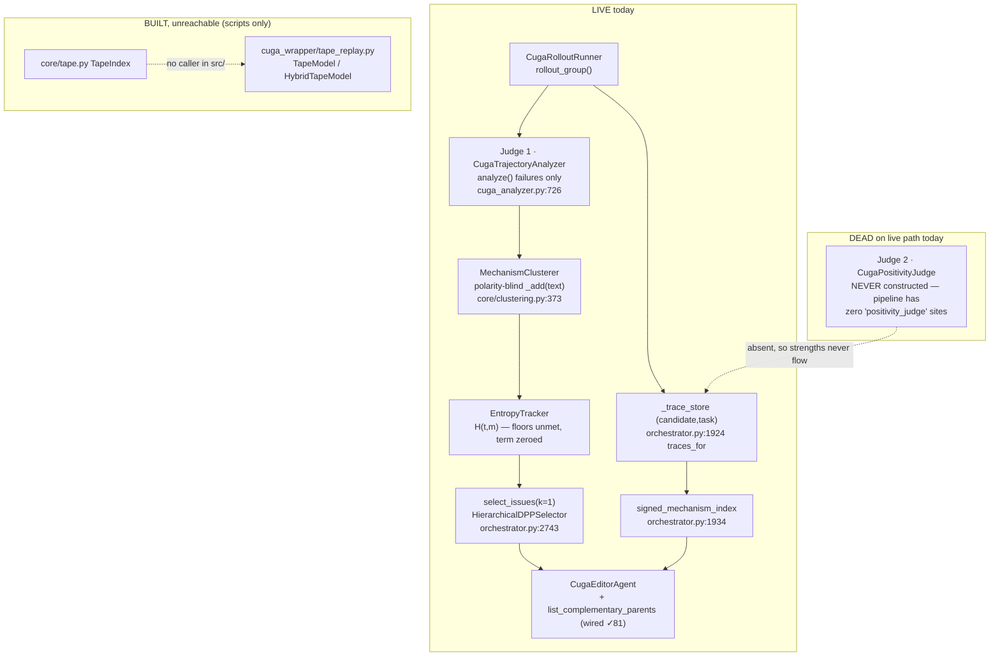
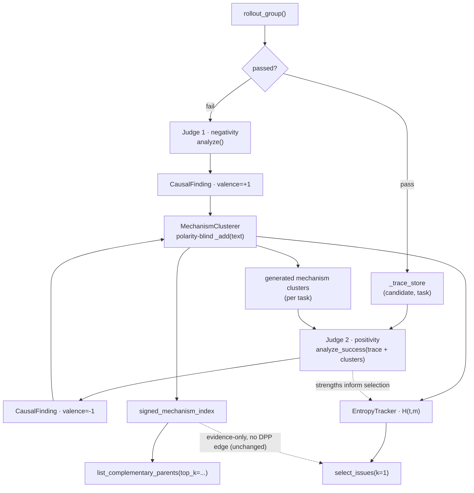
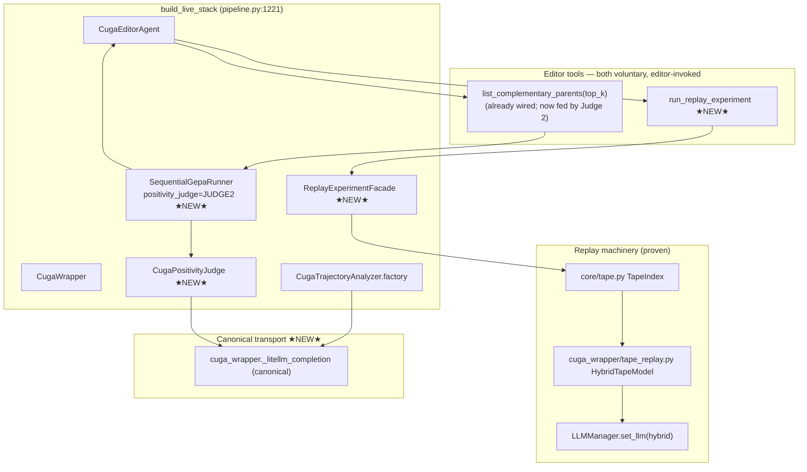
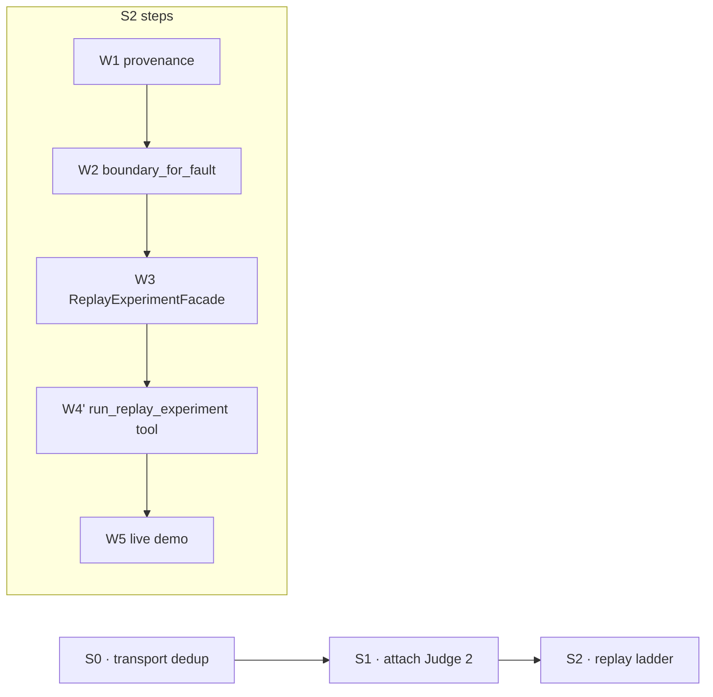

# Editor-Tools Live Wiring — Consolidated Plan & Tracker

**Status:** PLANNING (this doc) — nothing implemented yet
**Created:** 2026-08-27
**Purpose:** single source of truth for the remaining work: make the two proven
editor-facing capabilities reachable from the live evolution pipeline, plus the
one refactor they both benefit from. Every file:line below was verified against
the tree in-session (cuga 0.3.1, suite 2203). Written so a context switch or
compaction loses nothing.

**Supersedes / consolidates:** the fragmented state in
`docs/plans/replay-in-loop-integration.md` (§5's J-W fragment + §4 ladder). That
doc's Decisions/Progress history is preserved there; this doc is now the
authoritative plan for the remaining work.

---

## 0. One-paragraph state of the world

The house has proven, offline-tested machinery for **two** editor-facing
capabilities, and neither is reachable from the live loop today:

1. **Complementary-parent lookup** (`list_complementary_parents`) — *built and
   wired* (✓73, ✓81) but its evidence source is **dead**: the positivity judge
   (Judge 2) is never constructed on the live path, so strengths never enter the
   signed mechanism index, so the tool can only ever degrade to "least-bad
   failures", never "strongest solvers".
2. **Replay experiment** (`run_replay_experiment`) — *proven in scripts only*
   (✓86–✓92), not wired at all. The editor cannot invoke it.

Plus one shared refactor: **five divergent copies of `_litellm_completion`**
(?18) that any new model-call site risks forking a sixth time.

This plan wires both tools, attaches Judge 2, and collapses the five-copy
transport to one canonical function — in that order of dependency.

---

## 1. Scope — the three work streams

| Stream                                 | What                                                                                                                           | Why now                                                                                                                                                                  |
| -------------------------------------- | ------------------------------------------------------------------------------------------------------------------------------ | ------------------------------------------------------------------------------------------------------------------------------------------------------------------------ |
| **S0 — transport dedup (?18)**         | one canonical `_litellm_completion`; four adapters delegate; AST pin                                                           | every later stream adds or touches a model-call site; dedup first means Judge 2 and the replay live-tail both inherit the canonical path instead of a sixth/seventh copy |
| **S1 — attach Judge 2 (make D5 live)** | construct `CugaPositivityJudge` in `build_live_stack`, pass to runner                                                          | closes `docs/design/issue-lifecycle.md` line 668: "no full attempt with Judge 2 attached has run"; makes `list_complementary_parents` return real solver evidence        |
| **S2 — wire replay experiment**        | W1 provenance → W2 `boundary_for_fault` → W3 `ReplayExperimentFacade` → W4′ `run_replay_experiment` editor tool → W5 live demo | the crown-proven replay capability stays unreachable otherwise                                                                                                           |

**Explicitly out of scope (deferred, recorded as future directive):** whether
Judge 2 should ever feed entropy/DPP selection. The design (`issue-lifecycle.md`
Q7, invariant 4, "no selection edge") says evidence-only; the user has pushed
back on that framing. Resolved for now: the entropy/DPP selection is *already*
effectively inert on the live path (see §3), so this argument costs nothing to
defer. See §8 F1.

---

## 2. Architecture — current (as-is), with the dead seams marked

Notes (all verified):

* `use_entropy_selection` is a **dead flag** — read only at `config.py:251`
  (manifest serialization), never gated on. The entropy term in
  `raw_issue_quality` is zeroed when `entropy_tier == "skip"` (`issues.py:148`),
  which is the live reality (floors unmet). So entropy/DPP selection is
  de-facto inert regardless of Judge 2.
* `wire_editor_complements` (pipeline.py:1202) *is* called in `build_live_stack`
  (pipeline.py:1395) — so the complement tool is attached; its index is just
  starved of strengths.
* `CugaPositivityJudge` (cuga_positivity_judge.py:92) reuses the analyzer's
  grounding helpers and imports `_litellm_completion` from
  `cuga_analyzer` (line 45) — so S0's dedup must keep that import name alive or
  repoint it.

---

## 3. Architecture — target (to-be)

### 3.1 Mechanism signal flow — Judge 2 sits between clustering and entropy

The user-directed dataflow: Judge 2 (positivity) is positioned **after** the
clusterer and **before** the entropy/selection layer. It consumes stored traces
**and** the generated mechanism clusters, and its strengths feed both the
selection path (entropy) and the complementary-parent evidence (signed index).

Judge 2's input contract, per user clarification:

* **It reads the trace store** (`traces_for`, all scorable rollouts) — not just
  the single just-executed pass. This is the D5.3 "any score" + D5.5
  "cross-candidate" requirement.
* **It also reads the generated clusters** during each analysis, so it can
  decide *which mechanism/issue cluster is solved better by which candidate* —
  the purpose that makes complementary-parent lookup meaningful. Today's
  `analyze_success(task, trace)` (cuga_positivity_judge.py:116) has neither
  input; see S1 work items.

### 3.2 Composition wiring (build_live_stack)

Two editor tools, one shared pattern (mirroring `attach_complement_provider` /
`wire_editor_complements` at pipeline.py:1202–1218):

* **Tool 1 — `list_complementary_parents`** (already registered, cluster
  `parents`, cuga_editor_tools.py:45): fed by `complement_provider_factory`.
  Once Judge 2 is attached, `signed_mechanism_index()` carries strengths and the
  tool returns "strongest solvers" instead of only "least-bad failures".
  **Adds a `top_k` parameter** (default 5) limiting the returned ranked list.
* **Tool 2 — `run_replay_experiment`** (to build): registered in the same
  `parents` cluster (or a new `replay` cluster), fed by a new
  `replay_provider_factory` attached via a new `wire_editor_replays`. Returns
  raw structured observations; the editor interprets them.

---

## 4. Work items — detailed (file:line anchored, tests-first)

### S0 — transport dedup (?18)

**Problem:** five copies of `_litellm_completion`:
`cuga_wrapper/__init__.py:1086`, `cuga_analyzer.py:726`,
`cuga_mechanism_adjudicator.py:73`, `cuga_rho_comprehender.py:375`,
`cuga_rho_judge.py:485`. Each re-implements correlation-header merge + retry
injection; divergence already bit once (judge path used only the analyzer copy).

| Step | Deliverable                                                                                                                 | Done when                                       |
| ---- | --------------------------------------------------------------------------------------------------------------------------- | ----------------------------------------------- |
| S0.1 | Extract one canonical `_litellm_completion` in `cuga_wrapper` taking injected policies (correlation merge + retry + future) | canonical function + its unit tests green       |
| S0.2 | Four adapters re-export/delegate to the canonical fn (keep the name importable for `cuga_positivity_judge.py:45`)           | four adapter sites delegate; no behavior change |
| S0.3 | AST pin: no adapter defines its own litellm-completing function                                                             | test fails if a 6th copy appears                |

### S1 — attach Judge 2 (make D5 live)

**Problem:** `positivity_judge` field defaults `None` (orchestrator.py:1159);
loop gated at :1465; never constructed in `build_live_stack`. So `analyze_success`
(orchestrator.py:1481) never runs in production.

| Step | Deliverable                                                                                                                                                                                                                                                                                                                                                                                                   | Done when                                                                                                                                         |
| ---- | ------------------------------------------------------------------------------------------------------------------------------------------------------------------------------------------------------------------------------------------------------------------------------------------------------------------------------------------------------------------------------------------------------------- | ------------------------------------------------------------------------------------------------------------------------------------------------- |
| S1.1 | Construct `CugaPositivityJudge` in `build_live_stack` beside `analyzer_factory` (pipeline.py:1348), pass into `SequentialGepaRunner(positivity_judge=...)` (pipeline.py:1358)                                                                                                                                                                                                                                 | red→green composition-root pin: `build_live_stack` passes a non-None judge                                                                        |
| S1.2 | Config-gate it + count spend under `_positivity_calls` (already tracked, orchestrator.py:1474)                                                                                                                                                                                                                                                                                                                | flag-off byte-identical to today (pin test); flag-on exercises gate with fakes                                                                    |
| S1.3 | Extend the Judge 2 input contract: `analyze_success` must receive (a) the stored traces for the task (cross-candidate, any score) and (b) the generated mechanism clusters, so it can determine *which cluster is solved better by which candidate*. Today's signature is `analyze_success(task, trace)` (cuga_positivity_judge.py:116) — widen the `PositivityJudge` protocol (`core/analyzer.py`) + adapter | red→green tests: judge sees the cluster list + stored traces in its evidence/prompt; the loop passes them, not just the single just-executed pass |
| S1.4 | `list_complementary_parents` gains a `top_k` parameter (default 5), threaded through `ctx.complement_provider()` → `complementary_parent_payload(limit=top_k)` (mechanism_index.py:97 already accepts `limit`; the tool currently calls the provider with no args, cuga_editor_tools.py:260)                                                                                                                  | red→green test: `top_k=2` returns at most 2 members; default unchanged                                                                            |
| S1.5 | Loop-level test: a passing rollout now yields strengths → TS2 → `signed_mechanism_index`                                                                                                                                                                                                                                                                                                                      | red→green test proving strengths reach the index + complement payload                                                                             |

**User-directed refinement (2026-08-27):** Judge 2 is not a blind single-pass
scanner. Per the user's architecture it sits **between the clusterer and the
entropy/selection layer**, and during each analysis it must see (a) the stored
traces for the task and (b) the generated mechanism clusters — because its job
is to determine *which cluster of mechanisms/issues is solved better by which
candidate*, which is what lets the editor find a complementary better parent.
This is D5.3 "any score" + D5.5 "cross-candidate" made concrete, and it changes
the `PositivityJudge` protocol signature (S1.3), not just the wiring.

**Still scoped as a separate follow-up (F2):** the *which-stored-traces-get-
analyzed* cost policy (`issue-lifecycle.md` Q8: per-cluster top-k / recency,
cache key `(candidate, task)`). S1 widens the *input* the judge sees; F2 decides
the *budgeting* over the store. Both are needed for the full design, but they
are separable: S1 lands the judge with cluster + store access (gated), F2 tunes
the cost policy later with its own design doc.

### S2 — wire replay experiment (W1→W5)

| Step | Deliverable                                                                                                                                                                                                                                                                                                                                                                           | Done when                                                                                                                          |
| ---- | ------------------------------------------------------------------------------------------------------------------------------------------------------------------------------------------------------------------------------------------------------------------------------------------------------------------------------------------------------------------------------------- | ---------------------------------------------------------------------------------------------------------------------------------- |
| W1   | provenance plumbing: `trace_dir` persisted onto rollout record + cell provenance at capture time (Gap 1)                                                                                                                                                                                                                                                                              | red→green test: after `_record_rollout_score`, cell exposes trace location; AST/grep shows wrapper result path no longer discarded |
| W2   | `boundary_for_fault(tape_index, analysis) -> int` pure mapper (Gap 3) + the four edge cases (multiple blamed nodes → max-blame; fault before first boundary → fall through; fault at last boundary → fall through; subgraph nesting via `parent_event_id`)                                                                                                                            | tests green on synthetic fixture mirroring crown-trace shape; real-trace integration skipif-absent                                 |
| W3   | `ReplayExperimentFacade` (Gap 4) at composition root: owns HybridTapeModel build / `set_llm` / fresh-workspace / scrub registry; accepts `(parent_trace_dir, artifacts, resume_hint?)`; returns raw report JSON; correlation `phase="replay"`. Exercises the instructions-channel (constructor `special_instructions`) explicitly — see `replay-in-loop-integration.md` Decisions log | offline tests: control arm gates stay on, mutated arm gate-open, `live_calls` counted, report contract stable                      |
| W4′  | New editor tool `run_replay_experiment` in the `parents` (or new `replay`) cluster; `replay_provider_factory` attached via `wire_editor_replays(editor, facade_factory)` at `build_live_stack`; per-invocation cost cap + per-attempt limit as facade config                                                                                                                          | mirrors `attach_complement_provider` exactly; tool reports unavailable-by-default when unattached, never raises into the agent     |
| W5   | Live in-iteration demo: real editor invokes the tool mid-decision on F1; tee'd log + report artifacts                                                                                                                                                                                                                                                                                 | one end-to-end run with reports persisted; comparison vs manual baseline                                                           |

Spend: S0/S1/W1–W4′ zero provider calls (fakes/synthetic). W5 small (~1 editor
turn + 1–2 live tail calls).

---

## 5. Dependency order

Rationale for S0-first: Judge 2 imports the analyzer's `_litellm_completion`
(cuga_positivity_judge.py:45); deduping first means Judge 2 lands on the
canonical path in one step instead of a later re-point. S1 before S2 because the
replay tool's demo (W5) is cleaner once the complement tool already returns real
evidence (both are siblings the editor may call in one turn).

---

## 6. Open questions (carried + new)

| #   | Question                                                                                                               | Status                                  |
| --- | ---------------------------------------------------------------------------------------------------------------------- | --------------------------------------- |
| OQ1 | Should replay "cleared + gates pass" always invite full validation, or rate-limit?                                     | open (from replay-in-loop doc)          |
| OQ2 | RHO rounds eventually use replay for re-solves too?                                                                    | open                                    |
| OQ3 | Tape retention: promote parent traces out of gitignored `terminal_output/` before W5?                                  | open — must decide before W5            |
| OQ4 | Determinism caveat for mutated arms (`knowledge_search` live) — confirm no taped-boundary symmetry check depends on it | open — keep gates open in MUTATION mode |
| OQ5 | Facade on adapter vs runner — lean adapter (core-neutrality)                                                           | resolved in favor of adapter facade     |
| OQ6 | Q8 index-time targeting policy for Judge 2 (which stored traces get analyzed)                                          | deferred as §8 F2 milestone             |

---

## 7. Decisions log (append-only)

| Date       | Decision                                                                                                                                                                                                                        | Evidence                                                                                          |
| ---------- | ------------------------------------------------------------------------------------------------------------------------------------------------------------------------------------------------------------------------------- | ------------------------------------------------------------------------------------------------- |
| 2026-08-27 | Consolidated plan created across all three streams (transport dedup, Judge 2 attach, replay ladder); corrected the prior miss that the *complementary-parents* tool is also part of this wiring, not just replay                | user correction; grep: zero `positivity_judge` sites in pipeline.py                               |
| 2026-08-27 | Judge 2 sits **between the clusterer and the entropy/selection layer**; during each analysis it reads (a) stored traces and (b) the generated mechanism clusters, to decide *which cluster is solved better by which candidate* | user directive; widened the `PositivityJudge` input contract into S1.3                            |
| 2026-08-27 | `list_complementary_parents` gains a `top_k` parameter (default 5) for returning the top-k complementary candidates                                                                                                             | user directive; `complementary_parent_payload` already accepts `limit` (mechanism_index.py:97)    |
| 2026-08-27 | Q8 targeting policy (which stored traces get analyzed) deferred to its own milestone (F2), not bundled with S1                                                                                                                  | issue-lifecycle.md Q8 explicitly marks the policy + cache key undesigned                          |
| 2026-08-27 | Entropy/DPP-selection argument deferred (F1): flag is dead and floors are unmet, so the live path is already unaffected; no code touches it in this plan                                                                        | `use_entropy_selection` read only at config.py:251; `issues.py:148` zeroes entropy term on `skip` |

---

## 8. Future directives (recorded, NOT in this plan's build)

* **F1 — Judge 2 → entropy/DPP selection.** The user has now positioned Judge 2
  **between the clusterer and the entropy/selection layer** in the target
  dataflow (see §3.1), arguing the original intent was to *enhance
  variance/entropy-driven selection* and *track which candidate solved which
  issue better*. The design (`issue-lifecycle.md` Q7, invariant 4, "no selection
  edge") says evidence-only. **Deferred, not resolved:** the §3.1 diagram
  reflects the user's placement, but the *entropy-cell arithmetic migration*
  (letting strengths actually enter `EntropyTracker` cells / DPP weights) still
  needs its own design doc + weight-vector migration before any code, and the
  live selection is already inert on entropy today.
* **F2 — Q8 index-time targeting policy.** Per-cluster top-k / recency selection
  of which stored traces Judge 2 analyzes, plus the `(candidate, task)` cache key
  and its invalidation. Genuinely new; own design doc.
* **F3 — dead flag cleanup.** `use_entropy_selection` is inert decoration; either
  wire it to actually gate the entropy term or delete it. Small, separate.

---

## 9. Progress log (append-only)

| Date       | Entry                                                                                                            |
| ---------- | ---------------------------------------------------------------------------------------------------------------- |
| 2026-08-27 | Plan written; nothing implemented. Prerequisite: user commits the dirty files (see git status) before S0 surgery |
| 2026-08-27 | **S1 DONE** (S0 transport dedup deferred by user). S1.4 `top_k` threaded through `list_complementary_parents` → `complementary_parent_payload(limit=top_k)` (tests 11). S1.3 `PositivityJudge.analyze_success` widened to accept `clusters` + `stored_traces` (protocol + Fake + adapter + loop + 5 call-site fakes). S1.1/S1.2 `use_positivity_judge` feature gate (default OFF) + `_build_positivity_judge` + composition-root pass in `build_live_stack`. S1.5 end-to-end chain test. All tests-first + non-vacuity revert-proven. Suite 2217 passed / 9 platform failures |
| 2026-08-27 | **S2 W1-W4' DONE** (all offline). W1 `ExecutionTrace.trace_dir` + `ScoreProvenance.trace_dir` + adapter carries `causal_trace_path` + orchestrator writes it (tests 5). W2 `boundary_for_fault` pure mapper in `core/tape.py` + `NodeStart.event_id/parent_event_id` (tests 8). W3 `ReplayExperimentFacade` + `default_live_factory` in `cuga_wrapper/replay_facade.py` (tests 5). W4' `run_replay_experiment` editor tool (replay cluster) + `attach_replay_provider` + `wire_editor_replays` + composition-root wiring + AST pin (tests 7). Core neutrality re-verified: 37 files, 0 violations. Suite 2242 passed / 9 platform failures / 3 skipped |
| 2026-08-27 | **W5 deferred**: live in-iteration demo is a PAID run (real editor turn + live tail) and non-deterministic (editor may or may not invoke the tool). Awaiting explicit go-ahead + run shape before spending |
| 2026-08-27 | **Live-testing verification (free tier) DONE.** All new import paths resolve (`wire_editor_replays`, `_build_positivity_judge`, `_build_replay_facade` on pipeline; `run_replay_experiment` in `replay` cluster; `attach_replay_provider` + `replay_provider_factory` on CugaEditorAgent; `ReplayExperimentFacade` + `default_live_factory`; `boundary_for_fault`/`NodeStart`/`TapeIndex` in core.tape). Both deferred-import helpers CONSTRUCT through the CUGA SDK: `_build_positivity_judge` → `CugaPositivityJudge` (analyzer_model_id=cuga-positivity-judge, analyze_success callable); `_build_replay_facade` → `ReplayExperimentFacade` with `live_factory` set. `build_live_stack` source confirmed to carry `wire_editor_complements(runner, editor_agent)`, `wire_editor_replays(...)`, and `positivity_judge=` kwarg. Offline `--dry-run --tasks 3 --iterations 1` runs clean end-to-end: base 0/3, 1 accepted attempt, pool=2, no errors. Core neutrality re-verified 37 files / 0 violations |
| 2026-08-27 | **Remaining: PAID live test.** Next is the actual live run: `build_live_stack` against a real benchmark + endpoint, exercising Judge 2 (gate ON) and ideally the editor invoking `run_replay_experiment`. Reference trace `3306905e` exists at `terminal_output/live-run-prep/traces/`. `.env` present. Resume point for next session is §below |
| 2026-08-27 | **LIVE RUNS 1-3 DONE (paid, real endpoint + CUGA + GAIA).** Env loading via PowerShell (`Get-Content .env \| ForEach-Object { Set-Item Env:... }`) — `run_evolution.py` does NOT load_dotenv. Added `--enable-positivity-judge`/`--disable-positivity-judge` CLI ablation flag + `use_positivity_judge` in `gate_fields` (tests: `test_positivity_judge_ablation_flag_moves_the_gate`, green). **Judge 2 PROVEN LIVE**: `cuga-positivity-judge` fires on successful rollouts, returns real causal strength findings; the widened `clusters` + `stored_traces` args flow live (3rd positivity call's prompt shows `KNOWN MECHANISM CLUSTERS` + `OTHER CANDIDATES' TRACES` with final_output "6"), and Judge-2's rationale explicitly echoes the cluster text. **Fault analyzer PROVEN LIVE**: correctly diagnosed the BBC failure as `call_model` emitting code that never invoked a tool (0 tool_call events). **Base passes tiny5 entirely** (glm-5.3-flash too good for L1); full-validation set (29 tasks, baseline 24%) needed to get a fault. Logs tee'd to `terminal_output/live-test-judge2/` |
| 2026-08-27 | **STRUCTURAL FINDING: editor path unreachable for current failures.** `core/evidence.py` `_PAYLOAD_BEARING_KINDS = {"tool_call"}` — the analyzer sees ONLY tool_call payloads; all other payloads (graph_node_start incl. `prepare` instruction text, llm_call) are stripped to `{}`. So `_grounded_blame_graph` (cuga_analyzer.py:894) can only keep an artifact blame when the artifact id is a literal substring of a tool_call payload. The observed L1 failures are "model emitted code that never called a tool" → no tool_call → no artifact name in evidence → `artifacts=[]` → `build_issues` yields no work item → editor/complement/replay never fire. This is design-correct (never fabricate artifact attribution), but it means the remaining editor→`list_complementary_parents`→`run_replay_experiment` chain needs a fault where a NAMED artifact (skill/policy/instruction) is provably involved — e.g. a harness with a skill that the agent loads via tool call and then misapplies |
| 2026-08-27 | **S4-9 FIXED (user ruling: absence of guidance IS misguidance).** Surface absence is now first-class evidence end-to-end: `surface_activity` summary in sanitized evidence (ids only, contamination-guarded, computed over the FULL event list) → `absent_surfaces` on finding+analysis (closed vocabulary, grounded against the summary by the analyzer) → `build_issue` attributes declared-but-unused artifacts of absent surfaces (issue carries the signal) → orchestrator forwards absence + judged severity → editor prompt shows `MEASURED ABSENT SURFACES` with stage_create guidance. 28 new tests, non-vacuity revert-proven, suite 2270/9/2, core 37 files 0 violations. NEXT: synthetic complex dataset run testing BOTH improve-existing and create-new artifact paths |

## 10. Lessons (append-only)

| Date       | Entry |
| ---------- | ----- |
| 2026-08-27 | W2 nesting semantics first draft was wrong ("walk to top-most ancestor"): with every real node nested under a `CugaLiteSubgraph` root that always yields resume=0. Correct = last occurrence of the blamed node wins (faults localize near the end); `parent_event_id` is carried for the caller to disambiguate, not walked eagerly. |
| 2026-08-27 | A test's own fake node placement matters: `test_max_blame_actor` placed the blamed node AFTER the last boundary, so it hit the "fault at last boundary → fall through" guard and asserted the wrong value. Fix: keep a boundary after the blamed node. |
| 2026-08-27 | `pipeline.py` edits via PowerShell string-replace are error-prone (docstring truncation, dropped `def` line). Prefer the Edit tool with exact context; verify with `import` immediately after. |
| 2026-08-27 | `run_evolution.py` does NOT load `.env`; the live stack fails with `RuntimeError: CUGA_MODEL or LITELLM_MODEL is required` unless the env is already set. On PowerShell, load it in the SAME invocation as the run (env vars do not persist between shell tool calls): `Get-Content .env \| ForEach-Object { ... Set-Item Env:... }` then run. |
| 2026-08-27 | `--max-rollouts` must cover base + champion + "after" measurements, not just the evolution loop: `--tasks N` needs ≥ 3N rollouts minimum (3N for no-fault; more with edits). Run 1 died at the final "after" measure with `BudgetExceededError: rollouts budget exceeded` at 2 < 3. |
| 2026-08-27 | The analyzer can only blame an artifact whose id literally appears in a `tool_call` payload (`core/evidence.py` `_PAYLOAD_BEARING_KINDS`). "Model didn't call any tool" failures are therefore never artifact-blameable → no edit → no editor turn. To exercise the editor path live, seed a harness whose fault is provably artifact-attributed (skill/policy loaded via tool call). |
