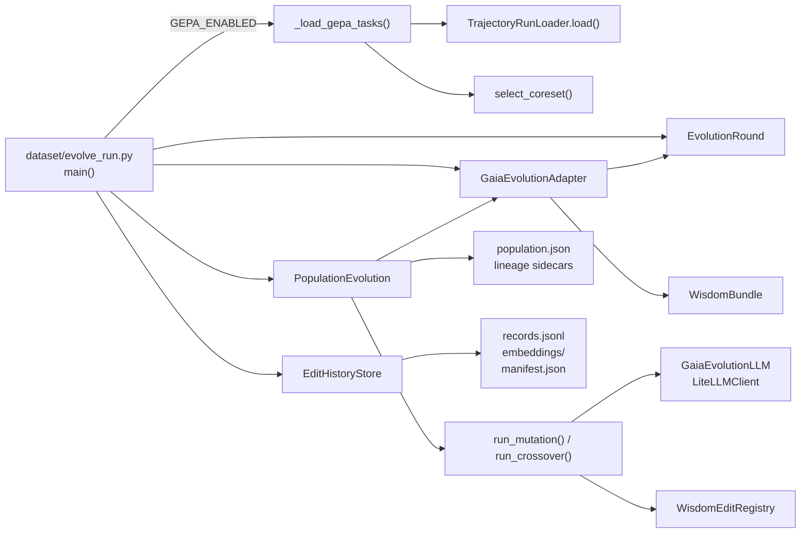
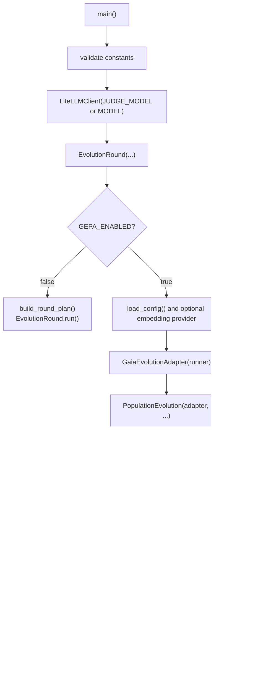
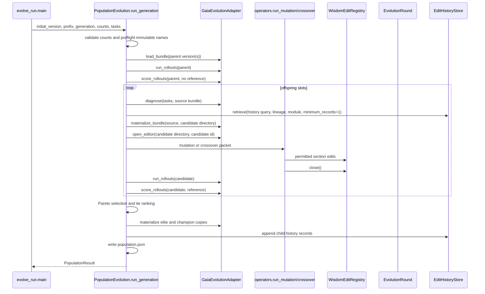

# RHO-GEPA Architecture And Debugging Dossier

## 1. Purpose, Scope, And Vocabulary

This is the implementation-level reference for the opt-in RHO-GEPA pipeline.
It describes the code currently in this repository, its observable artifacts,
its failure behavior, and a prioritized improvement backlog. It is intended for
engineers investigating a generation result, changing the evolutionary loop, or
integrating another agent through the reusable core.

RHO-GEPA here means a population evolution loop over immutable wisdom bundles:

- A **bundle** is a versioned mapping from module filename to prompt text.
- A **parent** is an existing bundle evaluated in the current generation.
- A **child** is a candidate produced by mutation or crossover and evaluated in
  the same generation.
- An **elite** is a selected bundle materialized for use by the next generation.
- A **champion** is a separate materialized copy of the first selected elite.
- A **trajectory** is normalized historical or rollout data used for diagnosis,
  evidence, and scoring.
- An **adapter** owns all agent-specific bundle, rollout, score, diagnosis, and
  editing behavior; the generic core owns lifecycle and selection.

The pipeline is offline policy evolution. It is not part of a normal Gaia agent
run. Normal Gaia tool registries do not expose wisdom-edit operations. The GEPA
path constructs the editor explicitly for a candidate workspace only.

The companion references remain useful:

- [13-rho-gepa-population-evolution.md](13-rho-gepa-population-evolution.md)
  describes the compact population lifecycle and operational configuration.
- [14-agent-integration-and-history-rag.md](14-agent-integration-and-history-rag.md)
  describes the adapter contract and history-RAG details.

## 2. System Map And Ownership



| Owner | Files and symbols | Owns | Does not own |
| --- | --- | --- | --- |
| Runner | `dataset/evolve_run.py`, `main()`, `_load_gepa_tasks()` | Configuration validation, source-run loading, one fixed coreset, construction and invocation of a population engine | Candidate policy writes, selection policy, scoring semantics |
| Neutral core | `agent/evolution_core/population.py`, `PopulationEvolution` | Generation lifecycle, immutable target preflight, child scheduling, selection, lineage, manifests, history write requests | Gaia bundle structure, runtime execution, pairwise judging, actual file-editor policy |
| Neutral operators | `agent/evolution_core/operators.py`, `run_mutation()`, `run_crossover()` | Prompt packet assembly, safe-field filtering, LLM edit JSON parsing, operation normalization, editor dispatch | File access and policy-specific validation |
| Neutral history | `agent/evolution_core/history.py`, `EditHistoryStore` | Redacted JSONL persistence, retrieval cascade, lexical/semantic ranking, embedding cache | Determining whether a child was selected or semantically useful |
| Gaia adapter | `agent/gaia_lg_react/evolution/gaia_adapter.py`, `GaiaEvolutionAdapter` | Gaia wisdom conversion, rollout delegation, pairwise scoring, diagnosis conversion, candidate editor creation | Generic parent/child lifecycle |
| Gaia editor | `agent/gaia_lg_react/evolution/edit_tools.py`, `WisdomEditRegistry` | Candidate-scoped write authorization, six-file allowlist, Markdown heading operations, edit log | LLM prompting, candidate selection |

The generic core imports no Gaia runtime modules. The Gaia adapter is the only
bridge from generic contracts to Gaia's evolution machinery.

## 3. Runner Dispatch And Input Preparation

`dataset/evolve_run.py:main()` validates configuration before constructing
either execution path. `GEPA_ENABLED=False` uses the original sequential
`EvolutionRound.run()` chain. `GEPA_ENABLED=True` instead builds one
`PopulationEvolution` instance and executes `ROUND_COUNT` generations.



### 3.1 Configuration invariants

`main()` enforces the following before dispatch:

| Invariant | Failure |
| --- | --- |
| `SOURCE_RUNS` is non-empty | `ValueError` |
| `OPTIMIZE_SAMPLES == CANDIDATE_COUNT` | `ValueError`; this is retained even though GEPA does not consume candidate count directly |
| `ELITE_COUNT >= 1` when GEPA is enabled | `ValueError` |
| `OFFSPRING_COUNT >= ELITE_COUNT` when GEPA is enabled | `ValueError` |
| `0 <= MERGE_OFFSPRING_COUNT <= OFFSPRING_COUNT` | `ValueError` |
| worker counts are at least one | `ValueError` |
| global worker cap does not exceed rerun workers times rollout workers | `ValueError` |
| `CACHE_MODE == "off"` | `ValueError`; response cache is not implemented |

In the GEPA path, `ROUND_COUNT` means number of generations,
`MERGE_OFFSPRING_COUNT` becomes `crossover_count`, and the task tuple is loaded
only once. Consequently every generation evaluates the same selected historical
tasks; the only evolving input is the retained wisdom population.

### 3.2 Offline corpus to neutral trajectories

`_load_gepa_tasks()` creates `TrajectoryRunLoader(DATASET_RUNS_ROOT)`, loads
every `SOURCE_RUNS` entry, combines records with task IDs, calls Gaia's existing
`select_coreset()`, and converts selected records to `NormalizedTrajectory`.

`TrajectoryRunLoader.load()` recursively discovers `agent_spans.log`,
`trajectory_summary.md`, and JSON files below a source run. It merges records by
normalized task ID, sanitizes raw records through
`trajectory_summary.redact_summary_text()`, reconstructs a summary where none
was captured, and returns both records and a `ParseReport`. `_load_gepa_tasks()`
currently ignores the parse report. That makes source parse errors observable
only if a caller separately loads and inspects the run.

The normalized contract is declared in
`agent/evolution_core/contracts.py:NormalizedTrajectory`:

```python
NormalizedTrajectory(
    task_id: str,
    input_text: str,
    output_text: str,
    status: str,
    events: tuple[dict[str, object], ...],
    source_paths: tuple[str, ...],
)
```

## 4. Generic Contracts And Trust Boundaries

`agent/evolution_core/contracts.py` defines the reusable surface. The relevant
objects are deliberately simple frozen dataclasses, though
`EvolutionBundle.modules` is a mutable `dict` and is therefore not deeply
immutable.

| Contract | Producer | Consumer | Meaning |
| --- | --- | --- |
| `EvolutionBundle` | adapter | core and operators | `version` plus allowed policy module text |
| `NormalizedTrajectory` | runner/adapter | core and operators | task input/output/status with normalized events |
| `DiagnosisRecord` | adapter | operators/history query | failure mode, root cause, fix, severity, phase, evidence |
| `RolloutLimits` | runner | adapter | scheduler limits for fresh rollouts |
| `CandidateEditor` | adapter | operators | narrow section-level write capability |
| `EvolutionLLM` | adapter bridge | operators | one system prompt and one user prompt to response text |
| `AgentEvolutionAdapter` | Gaia integration | `PopulationEvolution` | all policy- and runtime-specific operations |

`CandidateEditor` permits only:

```python
append_section(filename, heading, content)
replace_section(filename, heading, content)
delete_section(filename, heading)
close()
```

There is no raw file-write, shell, directory, or arbitrary path method in this
protocol. The operator checks filenames against the parent/ancestor bundle; the
Gaia registry separately checks the six-file allowlist. Both checks matter:
the former protects the generic call, while the latter is the actual filesystem
capability boundary.

## 5. One Generation: Exact Control Flow

`PopulationEvolution.run_generation()` in
`agent/evolution_core/population.py` is the lifecycle owner.



### 5.1 Preflight and parent loading

`preflight_targets()` calculates:

```text
<version-root>/<prefix>-g<generation>-elite-<rank>
<version-root>/<prefix>-g<generation>-champion>
```

If any destination already exists, it raises `FileExistsError` before opening
the generation directory. `run_generation()` also rejects an existing:

```text
<artifact-root>/evolution/g<generation>
```

The engine intentionally has no resume or overwrite mode.

Generation 1 loads exactly `initial_version`. Generation N greater than 1 loads
all expected prior elite names, not the prior champion:

```text
<prefix>-g<N-1>-elite-1 ... <prefix>-g<N-1>-elite-<elite_count>
```

If a prior elite is missing, `GaiaEvolutionAdapter.load_bundle()` delegates to
`WisdomBundle.load()` and the generation fails with a bundle-directory or
bundle-file validation error.

### 5.2 Parent evaluation and baseline meaning

Every parent is evaluated through `_evaluate_parent()` and `_scores()`. The
first evaluation calls `adapter.run_rollouts()` and caches the result by bundle
version for the lifetime of the engine. It then calls
`adapter.score_rollouts()` with no reference bundle.

Gaia's `score_rollouts()` returns `0.0` for each requested task when
`reference_rollouts is None`. This is a baseline convention used to rank a
child relative to its direct reference; it is not an absolute quality estimate.
Do not read a parent score of zero as an observed task failure or success.

### 5.3 Crossover scheduling

The first `crossover_count` slots are reserved for crossover. An eligible pair
is two currently retained parents with equal non-null `ancestor_id`; pair order
is deterministic according to parent list order. In generation 1 there is only
one parent, so every reserved crossover slot becomes mutation.

`_crossover()` loads the common ancestor, materializes it into a candidate
directory, targets one module by child index, diagnoses against the ancestor,
retrieves history, and calls `run_crossover()`. If crossover raises, the error
is appended to `errors`, `_crossover()` returns `None`, and the reserved slot is
filled by mutation. A returned crossover with no edits is still a normal child,
not a fallback.

### 5.4 Mutation scheduling

The remainder of the child slots are mutation. Parent selection cycles over the
retained parents. Target module selection cycles by child index through
`adapter.module_names`. For Gaia the module order is:

```text
intent_planner.md
reAct.md
critic.md
consolidator.md
scratchpad.md
synthesis.md
```

`_mutation()` first creates `<round>/candidates/`, materializes the parent
bundle into `<round>/candidates/g<generation>-mutation-<index>`, obtains
diagnoses and history, opens an editor, invokes the mutation operator, reloads
the candidate module texts, rolls it out, and scores it against the direct
parent. An LLM/operator exception becomes an evaluated no-op candidate, with an
error string recorded in the generation manifest.

The explicit parent-directory creation is required because
`WisdomBundle.materialize()` rejects a target whose immediate parent does not
exist. This was discovered by a live one-task smoke run and is now performed in
both `_mutation()` and `_crossover()`.

### 5.5 Selection, materialization, and lineage

`_select()` evaluates parents and children together. `dominates(left, right)`
compares only shared task IDs for which both scores are not `None`. A candidate
dominates only if it is no worse on every comparable task and strictly better on
at least one. Candidates with no comparable scores do not dominate one another.

The non-dominated frontier is sorted by descending available-score average,
then candidate ID. If fewer than `elite_count` frontier members exist, the
remaining slots are populated from dominated candidates by the same rank.
Selection may therefore retain the original parent. A worse child is expected to
lose to the parent baseline.

Each selected bundle is materialized to an elite destination; the first selected
bundle is also materialized independently as the champion. `_write_lineage()`
adds `.rho-gepa-lineage.json` to each materialized directory:

```json
{
  "schema_version": "1",
  "candidate_id": "g2-mutation-3",
  "parents": ["rho-g1-elite-1"],
  "ancestor": "rho-g1-elite-1"
}
```

`_read_lineage()` treats missing, unreadable, or invalid lineage as a local
root: `{"ancestor": version, "parents": []}`. It does not traverse an
arbitrary ancestor graph.

## 6. Mutation, Crossover, And Wisdom Editing

### 6.1 Prompt data and redaction

`run_mutation()` receives the full parent module mapping, the selected target
module, adapter diagnoses, normalized trajectories, and retrieved history. Its
packet includes:

```json
{
  "parent": {"<module>": "<text>"},
  "target_module": "<module>",
  "diagnoses": ["sanitized diagnosis records"],
  "phase_evidence": ["at most 20 matching events"],
  "history": "rendered helpful/harmful/inconclusive packet"
}
```

`_phase_packet()` matches an event phase only when it equals the target filename
or the filename with `.md` removed. It does **not** call the adapter's
`phase_evidence()` method, even though that method remains in the adapter
protocol. This is current behavior and a design inconsistency.

`run_crossover()` includes ancestor, left-parent, and right-parent module maps,
left/right per-task scores, diagnoses, up to 30 sanitized events from all
trajectories, and history. It does not use module-specific evidence filtering.

`_safe()` recursively removes dictionary keys containing `api_key`, `token`,
`secret`, `expected`, `evaluator`, `regex`, or `label`. It truncates each string
value to 4,000 characters. It does not sanitize arbitrary string contents at
the operator boundary; history applies an additional inline assignment redactor.

### 6.2 Model response and edit parser

Both operators ask an `EvolutionLLM` for JSON with an `edits` list. The generic
format is:

```json
{
  "edits": [
    {
      "operation": "append_section",
      "filename": "reAct.md",
      "heading": "Recovery",
      "content": "Use a distinct source after a repeated failure."
    }
  ]
}
```

`_apply_edits()` extracts the outermost JSON object from surrounding model text,
requires an `edits` list, validates each filename against the bundle keys, and
delegates each accepted action to the adapter editor. It reports successful
module names and per-edit failures separately in `OperatorResult`.

Supported canonical operations are `append_section`, `replace_section`, and
`delete_section`. The parser also accepts these compatibility aliases:

| Model operation | Applied operation |
| --- | --- |
| `add`, `append` | `append_section` |
| `replace` | `replace_section` |
| `delete` | `delete_section` |

Leading Markdown hashes are removed from headings before editor invocation, so
both `"Recovery"` and `"## Recovery"` refer to the same heading.

#### Verified live compatibility finding

During an operator diagnostic with concrete diagnosis and phase evidence, the
live Gaia evolution model returned:

```json
{"operation":"add","filename":"intent_planner.md","heading":"## Evidence-first search plan"}
```

Before alias normalization, this was recorded as a skipped edit with
`"unsupported operation"`, so no candidate file or edit log changed. The
registry was not hidden: the model reached `_apply_edits()`, and the skip was a
schema-vocabulary mismatch. `operators.py` now normalizes `add` and strips the
heading prefix. Repeating the diagnostic produced:

```text
changed_modules=('intent_planner.md',)
skipped_edits=()
edit_log_exists=True
```

The diagnostic logs are retained under
`terminal_output/rho_gepa_wisdom_verification/` in the working tree. They are
operational evidence, not part of the generic runtime artifact contract.

### 6.3 Gaia's editor capability boundary

`GaiaEvolutionAdapter.open_editor()` creates:

```python
WisdomEditRegistry.create(candidate_dir, candidate_id, True)
```

This is the only GEPA path that enables the registry. The registry rejects:

- disabled writes;
- absolute paths and path traversal;
- paths resolving outside the candidate workspace;
- symlinks;
- filenames outside Gaia's six allowed wisdom modules;
- duplicate appended headings;
- replace/delete operations whose heading does not exist.

Every successful operation records a unified diff. `close()` appends these
records to `candidate_dir/edit_log.jsonl`. The registry is candidate-scoped: it
cannot write to an elite, champion, source bundle, or arbitrary project file.

The GEPA operator is allowed to edit any bundle module, not only its selected
target module. The selected target influences module cycling, phase evidence,
and history lookup. It is not a hard single-file write restriction. Tests prove
that one operator output can apply edits through the real registry to all six
Gaia files.

### 6.4 Candidate reload caveat

After operation, `_load_candidate()` reads every filename in
`adapter.module_names` from the candidate directory and constructs a fresh
`EvolutionBundle` with `version=candidate_id`. If a module file is missing,
this currently raises rather than returning the fallback. Materialization of a
validated Gaia bundle normally makes all six files present, so this is a
corruption/adapter-contract failure path rather than expected operator behavior.

## 7. Gaia Adapter: Rollouts, Diagnosis, And Scores

`GaiaEvolutionAdapter` is implemented in
`agent/gaia_lg_react/evolution/gaia_adapter.py`.

| Adapter method | Current implementation | Important consequence |
| --- | --- | --- |
| `load_bundle()` | `WisdomBundle.load(wisdom_root, version)` | Requires exactly six regular Gaia wisdom files |
| `materialize_bundle()` | `WisdomBundle(...).materialize(target)` | Creates the target but requires its parent directory to already exist |
| `run_rollouts()` | Converts tasks to `TrajectoryRecord`, calls `EvolutionRound._run_rollouts()` | Reuses existing Gaia rollout scheduler and persistence |
| `score_rollouts()` | Calls `pairwise_preference()` for zipped reference/candidate rollouts | Unavailable judgments become `None`, not zero |
| `diagnose()` | Calls `EvolutionRound._diagnose_selected()` | Diagnosis occurs once per child, rather than cached per parent/task set |
| `phase_evidence()` | Filters matching event phase | Declared but not called by the generic core |
| `open_editor()` | Creates enabled `WisdomEditRegistry` | Explicit evolution-only edit authority |

### 7.1 Candidate wisdom-root selection

`run_rollouts()` derives `candidate_root = artifact_dir.parent`. It uses that
directory as `wisdom_root` only if every bundle module exists as a file there;
otherwise it falls back to the adapter's configured persistent wisdom root.

For a child rollout artifact path:

```text
.../g1/candidates/g1-mutation-0/rollouts
```

`candidate_root` is:

```text
.../g1/candidates/g1-mutation-0
```

which is the materialized and edited candidate workspace. This guards against
attempting to run a candidate that is not fully materialized, but it can silently
fall back to the persistent root if an adapter supplies an incomplete candidate.
That fallback needs explicit observability before relying on it operationally.

### 7.2 Pairwise preference semantics

For each task, `score_rollouts()` zips reference and candidate rollout
sequences, runs `pairwise_preference()` on each pair, retains only available
normalized scores, and averages the retained values. If no comparison is
available, that task receives `None`. The core averages only non-`None` task
scores through `_average()`.

Consequences:

- Missing judges do not automatically reject a candidate.
- A candidate with all `None` scores has average `None` and ranks after a
  finite-score candidate, but may remain non-dominated if there are no
  comparable task pairs.
- Crossover compares against the left parent only, not both parents or the
  common ancestor.

## 8. Edit History And Retrieval-Augmented Context

`EditHistoryStore` stores agent-scoped history beneath:

```text
<artifact-root>/history/<agent-name>/
  records.jsonl
  manifest.json
  embeddings/<sanitized-record-id>.json
```

`PopulationEvolution._persist_history()` writes a record for each changed module
after selection/materialization. A no-change child still writes one record for
the first adapter module. The text is currently only:

```text
<operator> <module> score=<average_score>
```

Outcome is `helpful` for a non-negative average, including `None` under the
current expression, and `harmful` for a negative average. It does not encode
whether a child became an elite/champion, whether it was a no-op, or whether a
judge was unavailable.

### 8.1 Redaction and persistence

`redact_history_value()` removes prohibited dictionary keys and inline
assignments involving `api_key`, `token`, `secret`, `expected`, `evaluator`,
`regex`, and `label`. It is applied before append, on loaded records, before
embedding query/document text, and during history-packet rendering.

`append()` reads all existing records, writes the complete replacement JSONL to
a temporary sibling, atomically replaces `records.jsonl`, then writes a manifest.
This protects a single-writer replacement from partial file writes but provides
no interprocess synchronization. A malformed existing JSONL line raises during
record loading and can block a generation.

### 8.2 Retrieval cascade and ranking

`retrieve(query, lineage_id, module, minimum_records)` chooses candidates in
this order:

1. Same lineage and same module.
2. Same module across other lineages until `minimum_records` is met.
3. Any remaining agent-scoped history until `minimum_records` is met.

The population engine sets `minimum_records=1`. Its query contains the target
module and available diagnosis fields `failure_mode`, `root_cause`, `fix`,
`evidence`, and `phase`; it does not include arbitrary raw trajectory contents.

| Configuration | Result |
| --- | --- |
| retrieval disabled | `HistoryRetrieval(mode="off", records=())` |
| retrieval enabled, semantic disabled/no embedder | lexical term-overlap sort then record ID |
| semantic enabled with working embedder | cosine similarity, lexical tie-break, record ID |
| embedding/query failure | lexical ranking and `fallback_reason` |

Embedding cache reuse checks schema version, text hash, model identity, and a
non-empty numeric vector. It writes a `dimension` field but does not validate
the stored dimension or query/document vector-length equality; cosine uses
`zip()`. This is a known correctness limitation.

## 9. Artifact Contract And Inspection Map

For generation `g2`, the generic core produces:

```text
<artifact-root>/
  evolution/
    g2/
      parents/
        <parent-version>/                  # adapter rollout artifacts
      candidates/
        g2-mutation-0/
          intent_planner.md                # materialized candidate bundle
          reAct.md
          critic.md
          consolidator.md
          scratchpad.md
          synthesis.md
          edit_log.jsonl                   # only after successful edit calls
          rollouts/                        # adapter-defined rollout artifacts
        g2-crossover-1/
          ...
      population.json                      # generic manifest
  history/
    gaia_lg_react/
      records.jsonl
      manifest.json
      embeddings/

<wisdom-root>/
  <prefix>-g2-elite-1/
    <six wisdom files>
    .rho-gepa-lineage.json
  <prefix>-g2-champion/
    <six wisdom files>
    .rho-gepa-lineage.json
```

`population.json` is written last. Important fields are:

| Field | Interpretation |
| --- | --- |
| `adapter` | Adapter agent name, currently `gaia_lg_react` |
| `configuration` | elite, offspring, and crossover counts |
| `parents` | Version names loaded at generation start |
| `candidates` | Parent and child summaries: IDs, parent IDs, ancestor, operator, changed modules, task scores, average, artifact directory |
| `elite_ids`, `elite_paths` | Selected candidates and materialized version destinations |
| `champion_id`, `champion_path` | First selected candidate and independent materialization |
| `history` | Mode, JSONL path, and retrieval fallback reasons |
| `errors` | Operator-level exceptions that reached population fallback handling |

It does **not** currently persist raw model output, skipped-edit records,
candidate edit-log path, source task IDs, source-run parse reports, or a
candidate file hash. Inspect candidate-local files to diagnose those concerns.

## 10. Failure Analysis Playbook

All commands below are read-only. Replace bracketed paths with the actual
generation location. Preserve terminal output with `tee` when running live
diagnostics, for example:

```bash
mkdir -p terminal_output/rho_gepa_diagnostics
uv run python dataset/evolve_run.py 2>&1 | tee terminal_output/rho_gepa_diagnostics/run.log
```

| Symptom | First evidence | Current likely cause | Next inspection |
| --- | --- | --- | --- |
| No generation begins | process exception before `GEPA generation` output | invalid runner constants, missing source run, or empty coreset | `uv run python -c 'import dataset.evolve_run as e; print(e._load_gepa_tasks())'` |
| `coreset selection produced no tasks` | `ValueError` from `main()` | source records lacked IDs or selector returned no IDs | inspect source `result.json` and load report with `TrajectoryRunLoader.load()` |
| `immutable evolution target already exists` | `FileExistsError` from `preflight_targets()` | reused prefix/generation or prior partial output | `ls "policies/evolved_context/<prefix>-g<g>-elite-1"` |
| `generation artifact already exists` | `FileExistsError` from `run_generation()` | reused artifact root/generation | `ls "<artifact-root>/evolution/g<g>"` |
| parent bundle unavailable | `WisdomBundle.load()` error | initial bundle missing, or expected prior elite was not materialized | `ls "policies/evolved_context/<version>"` |
| candidate parent directory error | `target parent directory does not exist` | caller omitted `candidates/` parent creation | inspect `_mutation()` and `_crossover()`; current implementation creates it first |
| child has `changed_modules: []` | candidate in `population.json` | model sent `edits: []`, malformed output, skipped edits, or operator exception | inspect candidate `edit_log.jsonl`, then `errors`; raw response is not in manifest |
| no `edit_log.jsonl` | candidate directory | no successful registry operation occurred | check whether the model response was empty/no-op or every edit was skipped; rerun a bounded operator diagnostic if necessary |
| `unsupported operation` in a diagnostic | skipped edit evidence | model vocabulary differs from canonical operations | current aliases accept `add`, `append`, `replace`, `delete`; inspect `operators._apply_edits()` |
| edits exist but candidate rollout behaves as base | rollout artifact and candidate bundle | candidate wisdom-root fallback or ineffective prompt edit | compare candidate files to parent; confirm all six files exist in candidate root |
| all task scores are `null` | candidate `task_scores` | no available pairwise judgments | inspect rollout files and pairwise judge errors; selection falls back to available averages/IDs |
| champion remains parent | `champion_id` equals parent | child was worse, no-op, or incomparable | compare candidate scores, `changed_modules`, edit logs, and pairwise artifacts |
| requested crossover appears as mutation | candidate `operator`, `errors` | generation 1 lacks a pair, lineages do not share ancestor, or crossover raised | inspect prior elite `.rho-gepa-lineage.json` and manifest `errors` |
| history mode is lexical unexpectedly | `population.json.history` | semantic flag disabled, embedder unavailable, or embedding failed | inspect `fallback_reasons`, Ollama configuration, and history manifest |
| history read fails | Python JSON exception | malformed `records.jsonl` | validate each JSONL line before repair; no malformed-line recovery exists |
| generation N fails before children | missing prior elite | generation N-1 did not produce all requested elite directories | inspect `elite_paths` from prior manifest and corresponding filesystem paths |

### 10.1 Minimal candidate audit

For a completed generation, inspect generic selection facts first:

```bash
uv run python - <<'PY'
import json
from pathlib import Path

manifest = Path("<artifact-root>/evolution/g<generation>/population.json")
data = json.loads(manifest.read_text())
print("champion:", data["champion_id"])
print("errors:", data["errors"])
for candidate in data["candidates"]:
    print(candidate["candidate_id"], candidate["operator"],
          candidate["changed_modules"], candidate["average_score"])
PY
```

Then inspect each child edit log, which contains the exact candidate-local diff
for successful registry edits:

```bash
for log in "<artifact-root>/evolution/g<generation>/candidates"/*/edit_log.jsonl; do
  test -f "$log" && { printf '\n### %s\n' "$log"; cat "$log"; }
done
```

## 11. Verification Scope

| Evidence | What it establishes | What it does not establish |
| --- | --- | --- |
| `tests/unit/test_evolution_operators.py` | Prompt redaction, edit parsing, aliases, and all-six-module editor dispatch | Provider behavior or real rollout quality |
| `tests/unit/test_evolution_edit_tools.py` | Registry allowlist, heading behavior, symlink/path protections, edit logs | Population scheduling or model output quality |
| `tests/unit/test_gaia_adapter.py` | Gaia bundle and editor mapping | Live model, scheduler, or judge integration |
| `tests/unit/test_evolution_population.py` | Naming, selection helpers, parent/child lifecycle details | Gaia filesystem and LLM behavior |
| `tests/integration/test_evolution_core_population.py` | Generic generation artifacts, elites, champion, lineage, crossover lifecycle | Production Gaia runtime or real scores |
| `tests/integration/test_evolution_runtime_gate.py` | Normal runs do not expose evolution editing tools | GEPA production rollout quality |
| One-task live smoke test | Actual runner, source loading, Gaia adapter, registry, rollout, score, materialization integration | Statistical quality or multi-generation stability |
| Live operator diagnostic | The provider's actual edit vocabulary and editor application | Full generation selection quality |

The currently retained terminal-output evidence verified a one-task GEPA
generation, then demonstrated the live `add` compatibility mismatch and its
post-fix successful application. It should not be generalized to benchmark
quality, all provider models, or crossover behavior.

## 12. Current Limitations And Improvement Backlog

This section separates observed/current behavior from recommendations. None of
the recommendations are claimed to be implemented.

### 12.1 Current limitations

1. `EvolutionBundle` is frozen but its `modules` dictionary remains mutable.
2. `AgentEvolutionAdapter.phase_evidence()` is declared but unused by generic
   operators; they inspect normalized events directly.
3. Crossover eligibility compares immediate stored ancestors only. It does not
   traverse a lineage graph or explicitly avoid sibling combinations.
4. History retrieval uses fixed `minimum_records=1` in population execution.
5. History outcome classification is based on non-negative average score, not
   elite selection, no-op state, or judge availability.
6. `population.json` omits raw model output and skipped edit detail, making a
   no-change child difficult to explain from the manifest alone.
7. Source-run `ParseReport` values are discarded by `_load_gepa_tasks()`.
8. History JSONL loading has no malformed-line isolation or concurrent-writer
   coordination.
9. Embedding cache validation does not check recorded dimension or equal query
   and document vector lengths.
10. Candidate rollout wisdom-root fallback can mask an incomplete candidate
    workspace without a manifest field stating which root was used.
11. Parent baseline `0.0` and judge-unavailable `None` interact with selection
    but are not explicitly annotated in the manifest as measurement states.

### 12.2 Recommended sequence

1. **Observability first:** persist sanitized `OperatorResult.raw_output`,
   skipped edits, edit-log path, and candidate content hashes in a
   candidate-local record referenced by `population.json`.
2. **Make edit contracts explicit:** publish a JSON schema or constrained
   structured-output mechanism for canonical operations while retaining the
   tolerant aliases at the parser boundary.
3. **Explain selection:** record each candidate's comparison availability,
   dominance relations, selection rank, and selected/rejected reason.
4. **Correct history labels:** classify selected, rejected, harmful, no-op,
   unavailable-score, and inconclusive outcomes separately; store an edit
   summary meaningful enough for retrieval.
5. **Close the adapter mismatch:** route phase evidence through
   `adapter.phase_evidence()` or remove that method from the protocol and make
   event conventions explicit in `NormalizedTrajectory`.
6. **Harden persistence:** skip/quarantine malformed history records with a
   documented recovery artifact; add locking or a single-writer service if
   concurrent runs are supported.
7. **Validate vector correctness:** reject cache/query dimensional mismatches
   rather than scoring a truncated dot product.
8. **Add controlled live coverage:** retain a one-task smoke harness with an
   isolated artifact root, unique version prefix, lexical-history mode option,
   and mandatory `tee` capture under `terminal_output/`.

## 13. RHO-Parallel-GEPA Plan Fidelity Audit

This section compares the current implementation with the intended algorithm in
`feedback/rho-gepa/rho-gepa-plan_conv.md`. That document proposes replacing
RHO's one-round best-of-N controller with a persistent, Pareto-guided candidate
pool. It then extends the design with structured edit memory and a batched,
semantically diverse parallel mutation loop.

The labels mean:

- **Implemented:** active runtime behavior provides the proposed capability.
- **Partial:** a related primitive exists but differs in a way that changes the
  algorithm or prevents the intended guarantee.
- **Missing:** the active GEPA path has no such capability.
- **Contradictory:** the current behavior conflicts with the proposed invariant.

### 13.1 Executive Assessment

The current system is a **sequential, generational elite evolution engine**. It
uses RHO inputs and runtime machinery but is not yet the proposed
RHO-Parallel-GEPA system.

```text
Implemented today:
  RHO historical corpus -> DPP coreset -> Gaia diagnosis -> candidate editor
  -> full-cohort rollout -> local pairwise preference -> elite selection

Planned target:
  persistent pool -> common per-task score matrix -> Pareto parent selection
  -> targeted one-module edit -> minibatch gate -> full Pareto evaluation
  -> structured edit memory -> deterministic complement merge
  -> optional diverse parallel batches
```

The central blocker is score semantics. The active selector compares parent
baseline zeros with children whose scores are pairwise deltas against different
direct parents. Those are not a common candidate-by-task score matrix. Until
that is corrected, neither Pareto dominance nor champion selection has the
meaning required by the plan.

### 13.2 Requirements Traceability Matrix

| Plan requirement | Status | Active implementation | Gap or consequence |
| --- | --- | --- | --- |
| RHO DPP coreset selection | Implemented | `dataset/evolve_run.py:_load_gepa_tasks()` loads all source runs and calls `select_coreset()` once | Same coreset is reused for all generations, as intended for a stable experiment but without a separate feedback/Pareto split |
| RHO-style rollout and pairwise evaluation | Implemented | `GaiaEvolutionAdapter.run_rollouts()` delegates to `EvolutionRound._run_rollouts()`; `score_rollouts()` calls `pairwise_preference()` | RHO machinery is reused, but the resulting child deltas are not converted to a common global score scale |
| Persistent candidate pool `P` | Partial | Later generations load only previous elite version names in `PopulationEvolution.run_generation()` | Non-elite specialists are permanently unavailable as future parents or merge partners |
| Initial baseline score for every Pareto task | Contradictory | Gaia returns `0.0` for a parent without a reference rollout | `0.0` is a baseline convention, not an observed absolute task score |
| Common per-candidate/per-task score matrix | Contradictory | Each child is scored only against its direct mutation parent or the left crossover parent | Score vectors across different lineages cannot safely be compared through Pareto dominance |
| Per-instance Pareto parent selection | Missing | Parents are selected in deterministic round-robin order in `_mutation()` | No task-winner union, dominance filtering before mutation, or frequency-weighted sampling |
| Pareto survivor retention | Partial | `_select()` computes non-dominance after all children are created | It is an end-of-generation elite filter, not GEPA's parent-selection and persistent-diversity mechanism |
| Weakness-guided module selection | Missing | `_mutation()` cycles `adapter.module_names` by child index | Module is not selected from the parent’s task losses or diagnosed issue ownership |
| Strict one-module mutation | Contradictory | `run_mutation()` allows any filename in `parent.modules` | A child nominally targeting one module can edit all six Gaia wisdom files |
| Module-specific trace feedback | Partial | `_phase_packet()` filters matching normalized events | All diagnoses are supplied, adapter `phase_evidence()` is unused, and no fresh parent minibatch traces are collected |
| Minibatch gate | Missing | Every child receives `_scores(..., tasks)` over the whole selected coreset | No cheap child-versus-parent rejection before expensive full evaluation |
| Explicit rollout budget and lineage early stopping | Missing | `ROUND_COUNT` and `OFFSPRING_COUNT` indirectly determine work | No budget counter, accepted-child cost accounting, or stalled-lineage policy |
| Child admission only after improvement | Missing | Every generated child participates in final selection | No accepted/rejected state and no direct gate against parent on a common metric |
| System-aware deterministic merge | Missing from active path | Active crossover uses `run_crossover()` and an LLM synthesis prompt | The dormant `agent/gaia_lg_react/evolution/gepa.py:merge_bundles()` is closer to the plan but is not called |
| Common-ancestor DAG merge eligibility | Partial | Sidecars save direct parents and one ancestor; `_common_ancestor()` tests equal immediate ancestor IDs | No ancestor traversal, direct-lineage exclusion, improvement-over-ancestor proof, or merge-attempt ledger |
| Complementary/disjoint module merge guard | Missing | Crossover has no changed-module disjointness test | The LLM can rewrite unrelated modules; the result cannot be explained as union of complementary parent changes |
| Candidate-local edit diffs | Implemented | `WisdomEditRegistry.close()` writes `edit_log.jsonl` | Logs are local and do not enter shared retrieval memory or manifest references |
| Structured edit/outcome memory | Missing | `EditHistoryStore` persists only lineage, module, coarse text, and binary outcome | Actual diff, issue context, RAG context, per-task delta, status, and candidate selection result are lost |
| History RAG | Partial | Same-lineage/module then module then global retrieval; optional semantic ranking | Retrieval has no top-K, no real edit content, no issue object, and no outcome-aware ranking |
| Correct history outcomes | Contradictory | `_persist_history()` marks non-negative average, including `None`, as helpful | No-op, unavailable-score, rejected, and selected states are conflated |
| GEPA-Parallel issue selection | Missing | DPP exists only for source coreset selection | No candidate/module/issue objects, issue embeddings, or semantic diversity scheduler |
| K-way mutation and batch pool update | Missing | Offspring mutation/crossover loop is serial | Existing concurrency is only within rollout execution |
| Parallel-safe persistence | Missing | History uses read-modify-replace without lock; rollout cache is an unsynchronized dict | Parallel offspring or generations would risk lost records and duplicate evaluation |

### 13.3 What Has Been Completed

The following deliverables are usable and should be retained as the foundation:

1. **Opt-in dispatch and legacy preservation.** `GEPA_ENABLED` switches from
   the sequential `EvolutionRound.run()` chain to `PopulationEvolution` without
   changing the default RHO-only path.
2. **Agent-neutral integration boundary.** Contracts in
   `agent/evolution_core/contracts.py` isolate generic lifecycle code from Gaia
   bundle format, rollout machinery, scoring, and editing.
3. **Immutable artifact and version targets.** Elite/champion names, generation
   directories, and lineage sidecars protect existing run outputs from overwrite.
4. **Bounded Gaia rollout execution.** The adapter reuses the existing worker
   limits and scheduler rather than introducing unconstrained candidate work.
5. **Gated wisdom editing.** The registry limits candidate writes to six Gaia
   wisdom modules and records successful section-level diffs.
6. **Basic mutation/crossover execution.** The core can create candidate
   workspaces, request LLM edits, evaluate candidates, retain elites, and run
   later generations.
7. **History storage with redaction and optional semantic ranking.** The store
   has lineage/module locality, lexical fallback, an embedding cache, and
   prohibited-field filtering.
8. **Verified smoke-path fixes.** Candidate-parent directory creation and live
   model compatibility for `add`/Markdown-heading edit syntax were verified with
   captured terminal output and regression tests.
9. **Current architecture documentation.** This dossier, documents 13 and 14,
   focused tests, and captured diagnostics describe the currently implemented
   engine rather than claiming plan-level fidelity.

### 13.4 What Must Be Built Before Parallelism

Do not add K-way parallel proposal generation to the current score and history
model. It would make the following pre-existing correctness/observability gaps
harder to diagnose. The ordered prerequisites are:

1. **Common-score evaluation:** establish a score representation comparable for
   every retained candidate and every Pareto task. Record score provenance,
   comparison coverage, and unavailable judgments explicitly.
2. **Persistent pool model:** retain candidate identity, score matrix, lineage,
   and selection status across generations instead of reloading only elites.
3. **GEPA parent selection:** implement task-winner frontier construction and
   parent selection from that frontier. Define deterministic seeded behavior for
   reproducible tests.
4. **Strict targeted mutation:** make target module an editor-level write
   constraint; pass only module-relevant diagnoses/evidence to the reflector.
5. **Two-stage evaluation:** add deterministic task partition/minibatch
   selection, a child-versus-parent admission gate, and full Pareto evaluation
   only for accepted children.
6. **Structured optimization memory:** promote sanitized edit-log content and
   outcome metadata into retrievable records. Preserve rejected/no-op/unavailable
   outcomes rather than overwriting their explanation with a binary label.
7. **System-aware merge:** activate a deterministic ancestor-based module merge
   with explicit eligibility, complementarity, and conflict decisions. An LLM
   refinement should be optional and auditable, not the only merge mechanism.
8. **Only then add parallel batches:** snapshot pool/history, select diverse
   non-conflicting issue work items, run independently, and commit results at a
   controlled batch barrier with safe storage synchronization.

### 13.5 Planned Work Packages

| Phase | Deliverable | Why it precedes the next phase |
| --- | --- | --- |
| A | Score matrix and persistent pool foundation | Gives Pareto and champion logic a valid metric and durable search state |
| B | Pareto parent selection plus strict module mutation | Makes the actual search behavior faithful before optimizing cost |
| C | Minibatch gate and explicit budget | Prevents full-evaluation waste and makes cost measurable |
| D | Structured edit memory and retrieval | Gives reflectors/merges actionable knowledge of prior work |
| E | Deterministic system-aware merge | Combines known complementary edits using reliable ancestry and change provenance |
| F | Diverse parallel batch scheduler | Introduces throughput only after state and persistence are safe |
| G | End-to-end experiments and ablations | Demonstrates each mechanism independently and in combination |

The execution-ready task breakdown is maintained in
`docs/superpowers/plans/2026-08-03-rho-parallel-gepa-completion.md`.

## 14. Source Index

| Concern | Primary source |
| --- | --- |
| GEPA config and runner dispatch | `dataset/evolve_run.py:158-234` |
| Reusable contracts | `agent/evolution_core/contracts.py` |
| Lifecycle, naming, selection, lineage, manifest | `agent/evolution_core/population.py` |
| Operator prompts, safety filter, edits | `agent/evolution_core/operators.py` |
| Edit history and embedding cache | `agent/evolution_core/history.py` |
| Gaia contract implementation | `agent/gaia_lg_react/evolution/gaia_adapter.py` |
| Candidate editor enforcement | `agent/gaia_lg_react/evolution/edit_tools.py` |
| Six-file bundle validation/materialization | `agent/gaia_lg_react/evolution/wisdom.py` |
| Offline trajectory normalization | `agent/gaia_lg_react/evolution/trajectory_loader.py` |
| Legacy round mechanics reused by adapter | `agent/gaia_lg_react/evolution/round.py` |
| Pairwise judging reused by adapter | `agent/gaia_lg_react/evolution/prompts.py:pairwise_preference()` |
