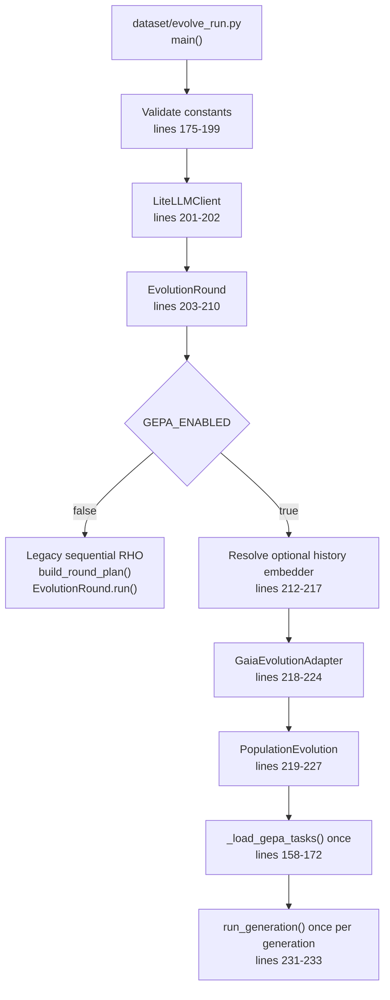
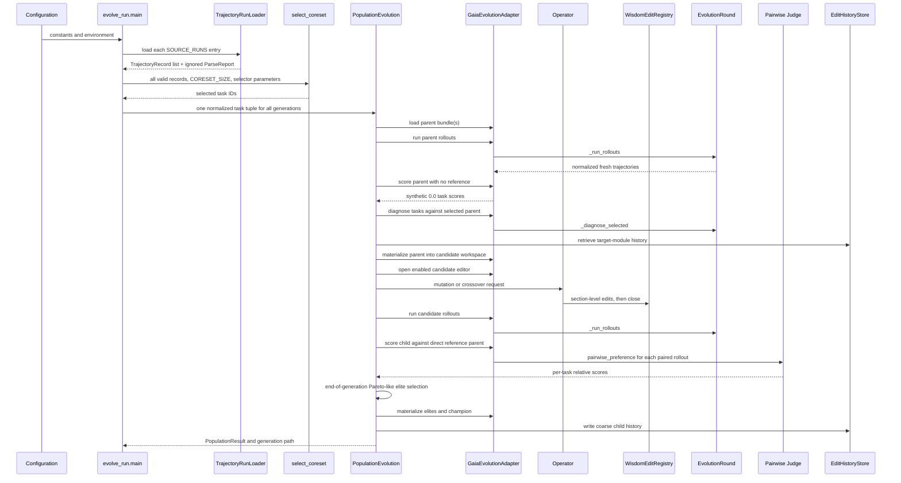
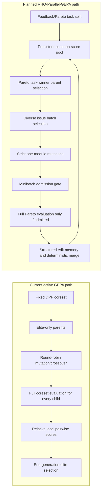

# RHO-GEPA Execution Atlas

## Purpose

This document is a traceable map of the **active** offline evolution pipeline:
what runs today, where state is created, which functions own each transition,
what artifacts prove the transition occurred, and where current behavior differs
from the intended RHO-Parallel-GEPA design.

Read this together with:

- [15-rho-gepa-architecture-and-debugging.md](15-rho-gepa-architecture-and-debugging.md)
  for failure analysis and the plan-fidelity audit.
- [17-rho-gepa-prompts-and-data-contracts.md](17-rho-gepa-prompts-and-data-contracts.md)
  for exact active LLM prompt and response formats.
- `docs/superpowers/plans/2026-08-03-rho-parallel-gepa-completion.md` for
  the ordered implementation work that remains.

## 1. Two Execution Paths

`dataset/evolve_run.py:main()` constructs one `EvolutionRound` in both modes,
then takes exactly one branch.



The GEPA branch does **not** call `EvolutionRound.run()`. It does reuse private
RHO/Gaia primitives through `GaiaEvolutionAdapter`:

| Reused RHO/Gaia capability | Active call chain |
| --- | --- |
| Offline trajectory parsing | `_load_gepa_tasks()` -> `TrajectoryRunLoader.load()` |
| Coreset selection | `_load_gepa_tasks()` -> `select_coreset()` |
| Diagnosis model prompt | `GaiaEvolutionAdapter.diagnose()` -> `EvolutionRound._diagnose_selected()` -> `diagnose_trajectory()` |
| Fresh agent rollouts | `GaiaEvolutionAdapter.run_rollouts()` -> `EvolutionRound._run_rollouts()` |
| Pairwise preference judge | `GaiaEvolutionAdapter.score_rollouts()` -> `pairwise_preference()` |
| Gaia wisdom validation | `GaiaEvolutionAdapter.load_bundle()` -> `WisdomBundle.load()` |
| Candidate edit sandbox | `GaiaEvolutionAdapter.open_editor()` -> `WisdomEditRegistry.create(..., True)` |

The GEPA branch replaces legacy RHO's sequential candidate acceptance controller
with `PopulationEvolution.run_generation()`. It is therefore an integrated
RHO-data/RHO-evaluation plus population-controller path, not a separate GEPA
post-processing program.

## 2. Active Data Flow



## 3. Input Lifecycle

### 3.1 Static configuration

The active GEPA controls live in `dataset/evolve_run.py`.

| Setting | Current role |
| --- | --- |
| `SOURCE_RUNS` | Historical trajectory directories below `DATASET_RUNS_ROOT` |
| `INITIAL_HARNESS` | Initial Gaia wisdom version name, usually `base` |
| `TARGET_HARNESS_NAME_PREFIX` | Prefix for immutable elite/champion versions |
| `ROUND_COUNT` | Number of population generations when GEPA is enabled |
| `CORESET_SIZE` | Number of source tasks selected once and reused in every generation |
| `GROUP_ROLLOUTS_PER_TASK` | Fresh parent/candidate rollouts per evaluated task |
| `ELITE_COUNT` | Number of versions retained between generations |
| `OFFSPRING_COUNT` | Number of new children created per generation |
| `MERGE_OFFSPRING_COUNT` | Number of early child slots reserved for active crossover attempts |
| `EDIT_HISTORY_RETRIEVAL_ENABLED` | Enables/off switch for history retrieval |
| `EDIT_HISTORY_SEMANTIC_ENABLED` | Attempts Ollama-backed semantic history ranking |
| worker limits | Bounds concurrent fresh agent runs inside one rollout operation |

`MODEL` and `JUDGE_MODEL` are passed to one `LiteLLMClient`. `GaiaEvolutionLLM`
uses that client for mutation/crossover, and `EvolutionRound` uses it for
diagnosis and pairwise preference. A separate judge model is optional but not
architecturally isolated in the GEPA population API.

### 3.2 Source-run ingestion

`_load_gepa_tasks()` is the only active conversion point from historical Gaia
artifacts to generic evolution inputs.

```text
dataset/runs_dataset_4rho/<source-run>/
  result.json
  traces/
  ... agent_spans.log, JSON, trajectory_summary.md files ...
```

Flow:

1. `TrajectoryRunLoader.load(source)` discovers files recursively.
2. It parses JSON or JSONL-like span logs and groups records by normalized task
   ID (`gaia_` becomes `gaia-`).
3. It sanitizes records through `redact_summary_text()`.
4. It builds `TrajectoryRecord` values with query, final answer, status, events,
   source paths, and summary provenance.
5. `_load_gepa_tasks()` discards records lacking task IDs.
6. `select_coreset()` returns selected IDs.
7. Selected records become `NormalizedTrajectory` values.

```python
NormalizedTrajectory(
    task_id=record.trajectory_id or record.task_id or "unknown",
    input_text=record.query,
    output_text=record.final_answer,
    status=record.status or ("success" if record.correct else "failure"),
    events=tuple(event for event in record.events if isinstance(event, dict)),
    source_paths=record.source_paths,
)
```

`TrajectoryRunLoader.load()` returns a `ParseReport`, but `_load_gepa_tasks()`
currently ignores it. Parse errors can therefore silently reduce source quality
without appearing in a generation manifest.

## 4. Active Generation Lifecycle

The active lifecycle is `PopulationEvolution.run_generation()` in
`agent/evolution_core/population.py`.

### 4.1 Preconditions and immutable names

`run_generation()` validates count relationships, then calls
`preflight_targets()` before any work:

```text
<WISDOM_ROOT>/<prefix>-g<generation>-elite-1
<WISDOM_ROOT>/<prefix>-g<generation>-elite-N
<WISDOM_ROOT>/<prefix>-g<generation>-champion
```

It separately rejects an existing generation artifact directory:

```text
<EVOLUTION_ARTIFACT_ROOT>/evolution/g<generation>
```

No resume path exists. A retry needs a new prefix/artifact root or deliberate
cleanup of intentionally discarded outputs.

### 4.2 Parent population

```text
generation 1:
  parents = [INITIAL_HARNESS]

generation N > 1:
  parents = [<prefix>-g<N-1>-elite-1 ... elite-ELITE_COUNT]
```

This is a **generational elite population**, not the persistent pool proposed
in the RHO-Parallel-GEPA plan. A candidate not materialized as an elite cannot
be selected as a parent later, even if it was excellent on one task.

For each parent, `_evaluate_parent()` calls `_scores()`. Rollouts are cached in
`self._rollout_cache` by `bundle.version` for the lifetime of the Python engine.

### 4.3 Parent score semantics

`GaiaEvolutionAdapter.score_rollouts()` returns `0.0` for every task when no
reference rollouts are supplied:

```python
if reference_rollouts is None:
    return {task.task_id: 0.0 for task in tasks}
```

This says only "this parent is the comparison origin." It does **not** measure
absolute task quality. A child is scored as a pairwise preference delta against
its direct parent, or against the left parent for crossover. The current selector
compares those values anyway. This is the highest-priority semantic defect to
correct before building parallel proposal scheduling.

### 4.4 Child scheduling

Current scheduling is serial:

```text
first MERGE_OFFSPRING_COUNT slots:
  attempt crossover if two current parents have equal immediate ancestor IDs
  otherwise make a mutation

remaining slots:
  make mutations
```

Mutation parent selection cycles in list order. Target module selection cycles
in `GaiaEvolutionAdapter.module_names` list order. Neither is selected from
task losses, Pareto-win frequency, or semantic issue diversity.

### 4.5 Mutation execution

`PopulationEvolution._mutation()` performs:

1. Create `<round>/candidates/`.
2. Materialize a full parent bundle into `gN-mutation-index/`.
3. Choose the nominal target module by index.
4. Call `adapter.diagnose(tasks, parent_bundle)`.
5. Call `history.retrieve()` for that target module and parent lineage.
6. Create an enabled `WisdomEditRegistry` for the candidate directory.
7. Call `run_mutation()`.
8. Read candidate module files back into an `EvolutionBundle`.
9. Run fresh candidate rollouts across every active task.
10. Pairwise-score each candidate rollout against the parent rollout.

The model can return no edits, invalid JSON, or invalid operations. Those cases
are normally evaluated as no-change candidates unless the operator itself raises.
An operator exception is caught, added to generation `errors`, and represented
as an empty `OperatorResult`.

### 4.6 Active crossover execution

`_crossover()` requires a pair of parent candidates with matching immediate
`ancestor_id`. It loads the ancestor bundle, materializes it into a child
workspace, retrieves history, and calls `run_crossover()`.

The active crossover is LLM synthesis. It is not the deterministic,
module-by-module GEPA merge described in the research plan. The codebase contains
a dormant closer-to-plan helper in `agent/gaia_lg_react/evolution/gepa.py`:
`merge_bundles()`. The active core does not use it.

### 4.7 Selection and final materialization

`_select()` builds a conventional non-dominated frontier over comparable task
scores, then ranks candidates by average available score and candidate ID.

```text
candidates compared:
  parents + children created in this generation

retained:
  first ELITE_COUNT selected candidates

champion:
  selected candidate at rank 1
```

The selected bundles are copied to elite directories, and rank one is copied
again to the champion directory. The engine then writes `.rho-gepa-lineage.json`
sidecars, coarse history records, and `population.json`.

## 5. Gaia Wisdom and Editor Boundary

`WisdomBundle` requires exactly six regular files:

```text
intent_planner.md
reAct.md
critic.md
consolidator.md
scratchpad.md
synthesis.md
```

`WisdomEditRegistry` allows only candidate-local section edits to those files.
It rejects absolute paths, traversal, symlinks, duplicate appended headings, and
unknown files. A successful operation produces an edit record containing:

```json
{
  "candidate_id": "g1-mutation-0",
  "target": "reAct.md",
  "operation": "append_section",
  "heading": "Recovery",
  "timestamp": "...",
  "diff": "--- a/reAct.md\n+++ b/reAct.md\n..."
}
```

The registry flushes these records to:

```text
<candidate-dir>/edit_log.jsonl
```

### Current mutation-scope mismatch

`_mutation()` has a `target_module`, but `run_mutation()` passes all parent
bundle module names to `_apply_edits()`. Therefore the target is an evidence and
history hint, not an editor constraint. A model can modify all six files in one
nominal module mutation. The planned strict one-module mutation changes this by
passing only `target_module` as the allowed filename set.

## 6. Fresh Rollout Execution

`GaiaEvolutionAdapter.run_rollouts()` maps each normalized task to a
`TrajectoryRecord`, derives a base config through `EvolutionRound._make_base_config()`,
and chooses a wisdom root:

```text
candidate root when every module file exists there
otherwise adapter persistent WISDOM_ROOT
```

It then calls `EvolutionRound._run_rollouts()`.

`_run_rollouts()` is the existing bounded scheduler:

```text
pending tasks
  -> admit at most MAX_RERUN_WORKERS task groups
  -> run at most MAX_ROLLOUT_WORKERS repeats per admitted task
  -> never exceed GLOBAL_MAX_WORKERS futures globally
  -> persist each result as task JSON under artifact directory
```

Execution failures become a synthetic failed `TrajectoryRecord` and are appended
to the local `errors` list. This is real rollout concurrency, but it is not yet
parallel evolutionary proposal generation.

## 7. Artifact Walkthrough

```text
<EVOLUTION_ARTIFACT_ROOT>/
  evolution/
    g1/
      parents/
        base/
          rollouts/<task>.json
      candidates/
        g1-mutation-0/
          intent_planner.md
          reAct.md
          critic.md
          consolidator.md
          scratchpad.md
          synthesis.md
          edit_log.jsonl                 # only if one or more edits applied
          rollouts/<task>.json
      population.json
  history/
    gaia_lg_react/
      records.jsonl
      manifest.json
      embeddings/<record-id>.json

<WISDOM_ROOT>/
  <prefix>-g1-elite-1/
    <six wisdom files>
    .rho-gepa-lineage.json
  <prefix>-g1-champion/
    <six wisdom files>
    .rho-gepa-lineage.json
```

`population.json` records candidate IDs, parent IDs, immediate ancestor,
operator, `changed_modules`, task scores, averages, artifact directories,
selection paths, history mode, and caught operator errors. It does not record
operator raw output, skipped edits, edit-log locations, source parse reports,
task IDs, score provenance, or selection explanation.

## 8. Current State Versus Planned State



The target is not an incremental performance tuning of the current selector. It
changes score meaning, pool persistence, mutation scope, admission, history data,
merge semantics, and then scheduling. The completion plan deliberately orders
those changes before parallel batches.

## 9. Function Index

| Stage | Function or class | File | Input -> output |
| --- | --- | --- | --- |
| Configuration/dispatch | `main()` | `dataset/evolve_run.py` | Constants/environment -> legacy RHO result or GEPA generations |
| Task conversion | `_load_gepa_tasks()` | `dataset/evolve_run.py` | source runs -> selected `NormalizedTrajectory` tuple |
| Artifact parsing | `TrajectoryRunLoader.load()` | `evolution/trajectory_loader.py` | source directory -> `list[TrajectoryRecord], ParseReport` |
| Population lifecycle | `PopulationEvolution.run_generation()` | `evolution_core/population.py` | parent/prefix/counts/tasks -> `PopulationResult` |
| Parent evaluation | `_evaluate_parent()`, `_scores()` | `evolution_core/population.py` | bundle/tasks -> `_Candidate` score map |
| Mutation | `_mutation()` | `evolution_core/population.py` | parent/tasks -> child `_Candidate` |
| Active crossover | `_crossover()` | `evolution_core/population.py` | two parents/ancestor/tasks -> child `_Candidate` or fallback |
| Survivor selection | `_select()` | `evolution_core/population.py` | candidates -> elites |
| Prompt mutation | `run_mutation()` | `evolution_core/operators.py` | LLM/editor/parent/evidence/history -> `OperatorResult` |
| Prompt crossover | `run_crossover()` | `evolution_core/operators.py` | LLM/editor/three bundles/evidence/history -> `OperatorResult` |
| Edit parsing | `_apply_edits()` | `evolution_core/operators.py` | raw text/editor/allowed modules -> changed + skipped edits |
| History | `EditHistoryStore.retrieve()` | `evolution_core/history.py` | query/lineage/module -> ranked `HistoryRetrieval` |
| Gaia bundle bridge | `GaiaEvolutionAdapter` | `evolution/gaia_adapter.py` | neutral contracts <-> Gaia runtime/bundles |
| Editor policy | `WisdomEditRegistry` | `evolution/edit_tools.py` | section edits -> candidate-local diff log |
| Diagnosis | `_diagnose_selected()` | `evolution/round.py` | source records/parent bundle -> `Diagnosis` list |
| Diagnosis prompt | `diagnose_trajectory()` | `evolution/prompts.py` | trajectory digest/bundle -> one `Diagnosis` |
| Rollout scheduler | `_run_rollouts()` | `evolution/round.py` | records/config/limits -> fresh trajectory map |
| Pairwise judge | `pairwise_preference()` | `evolution/prompts.py` | before/after trajectory -> `CandidateScore` |
