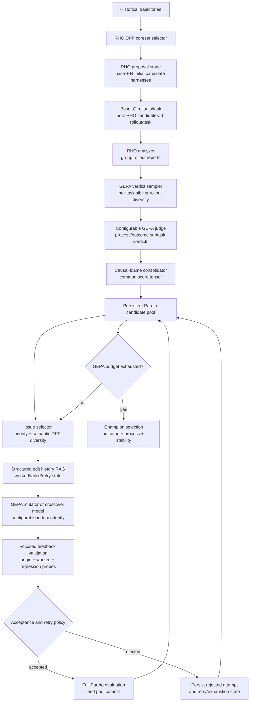
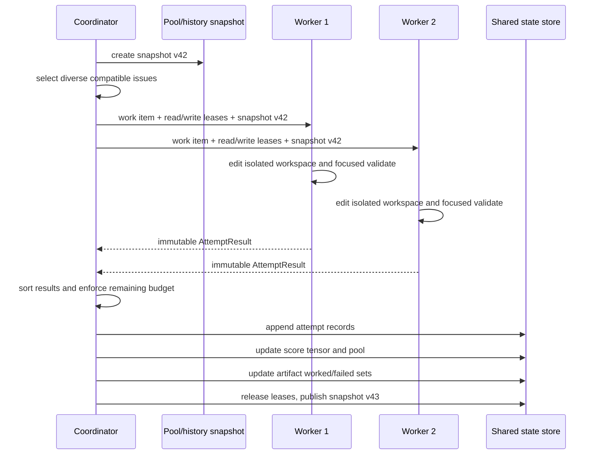

# RHO-Parallel-GEPA Target Architecture

## Status And Purpose

This document defines the approved **full, feature-gated target architecture**
for the next RHO-GEPA implementation. It is intentionally not a description of
the current runtime. Current behavior and implementation gaps are documented in
[15-rho-gepa-architecture-and-debugging.md](15-rho-gepa-architecture-and-debugging.md).

The target combines:

- RHO's DPP-selected historical corpus and repeated rollout analysis;
- a persistent GEPA candidate pool instead of best-of-N discard;
- causal-blame-graph process objectives instead of final-outcome-only scores or
  a fixed failure taxonomy;
- analyzer-driven, feedback-validated edits over wisdom, skills, and memory
  artifacts;
- structured edit memory with semantic RAG;
- deterministic, provenance-preserving crossover;
- optional lock-safe K-way parallel GEPA proposal batches;
- candidate-relative entropy as a configurable quality signal after a pool has
  sufficient comparative evidence.

The principal references that motivated this design are:

- `feedback/rho-gepa/rho-gepa-plan_conv.md`
- `feedback/rho-gepa/target.md`
- `docs/superpowers/plans/2026-08-03-rho-parallel-gepa-completion.md`

## 1. Research Objective

The system evolves an external agent harness rather than model weights. A
harness version contains configurable artifacts such as:

```text
wisdom/
  intent_planner.md
  reAct.md
  critic.md
  consolidator.md
  scratchpad.md
  synthesis.md
skills/
  <agent-specific skill artifacts>
memory/
  <agent-specific durable-memory artifacts>
```

The active Gaia implementation initially exposes six wisdom files. The target
generic evolution interface must also support agent adapters that expose skill
and memory artifacts. Artifact inventory, read access, write policy, and merge
semantics belong to the adapter; population, evaluation, history, and batch
orchestration stay agent-neutral.

### 1.1 CUGA reference-adapter decision

The next evolution phase is designed with IBM CUGA as the intended reference
adapter because exact agent-state tracing, state provenance, and valid replay
boundaries are expected to be essential for causal blame graphs and deferred
generalization probes. CUGA source code and documentation are not yet present in
this workspace. No CUGA-specific API, path, trace field, artifact type, or
checkpoint assumption is made in the generic core until those materials are
imported and inspected.

Gaia remains a baseline and compatibility adapter. Its six-wisdom-file model and
current rollout representation must not shape the generic architecture.

The future CUGA integration may live in a separate repository that imports or
copies the generic evolution modules after the repository boundary is decided.
That decision is intentionally deferred. Planning now defines only the stable
capability contract CUGA must satisfy.

The target optimization objective is not merely final-answer correctness. It is
to find a harness that improves reliable task completion while preserving the
process capabilities that made earlier edits valuable:

\[
\operatorname*{argmax}_{h \in P}
  \alpha\,Outcome(h)
  + \beta\,ProcessCoverage(h)
  + \gamma\,Stability(h)
  - \delta\,RegressionRisk(h)
\]

where `P` is the persistent pool of admitted candidate harnesses.

The coefficients are experiment configuration, not hardcoded universal truths.
The initial outcome-first defaults are:

```text
alpha = 0.55   final outcome and output-contract quality
beta  = 0.20   causal process coverage
gamma = 0.15   rollout stability
delta = 0.10   weighted regression risk
```

Protected critical floors override this aggregate. A candidate violating a
configured safety, privacy, evidence-grounding, or output-contract floor cannot
win merely through a high aggregate score.

## 2. Target System Topology



The outer RHO stage seeds the GEPA search. The inner GEPA stage evolves the
pool until the configured per-iteration budget ends. The fittest retained pool
members become the inputs to the next outer RHO-GEPA iteration.

## 3. Execution Hierarchy

```text
Experiment
  -> RHO-GEPA iteration r
    -> DPP-selected task set D_core
    -> initial harness set H0 = {base} union {N RHO proposals}
    -> base group evaluation plus one rollout per post-RHO candidate/task
    -> persistent GEPA pool P_r
    -> GEPA attempts/batches until iteration budget is exhausted
    -> elite pool members E_r
    -> next RHO-GEPA iteration seeded from E_r
```

### 3.1 Initial pool rule

The target preserves every RHO proposal in the initial pool, but uses the
approved **RHO-scale rollout policy**:

```text
initial pool = base harness + every N RHO-generated candidate harness
```

```text
base harness:
  G fresh rollouts for every DPP-selected task

each of N post-RHO candidates:
  1 fresh rollout for every DPP-selected task
```

No initial RHO proposal is discarded through aggregate best-of-N ranking. The
base group rollouts remain the rich RHO analysis source; candidate rollouts seed
comparative pool evidence at RHO-scale cost.

For `k` selected tasks and `G` rollouts per task, initial agent-rollout cost is:

\[
k \times G + N \times k + N \times k
\]

The final `N x k` term represents evaluation/judging work in the same budget
accounting convention as the RHO proposal stage. Agent rollouts and judge calls
must be reported separately in manifests.

An initial candidate with one rollout has lower stability evidence than the base
group. It may still enter the pool, but selection confidence must retain coverage
metadata. The engine schedules adaptive repeat rollouts when a candidate becomes
Pareto-relevant, has uncertain attribution, is considered for merge, or enters
worked-set regression validation.

### 3.2 GEPA budgets

The target has an explicit budget object, not only fixed generation and offspring
counts. A deployment must expose at least:

```bash
GEPA_MAX_ATTEMPTS=...
GEPA_MAX_ACCEPTED_EDITS=...
GEPA_MAX_MODEL_TOKENS=...
GEPA_MAX_ROLLOUTS=...
GEPA_MAX_JUDGE_VERDICTS=...
GEPA_EDIT_MAX_RETRIES=3
GEPA_MAX_WALL_SECONDS=...
GEPA_MAX_POOL_CANDIDATES=...
GEPA_MAX_HISTORY_RECORDS=...
GEPA_MAX_RAG_CONTEXT_TOKENS=...
```

The engine stops the inner GEPA loop when any hard budget is exhausted. It also
supports a configurable no-improvement stop policy for a lineage or the whole
pool. Budget manifests must distinguish reserved, spent, cached, and skipped
work. The last three controls are a complexity budget: they bound persistent
pool, edit-memory, and editor-context growth across outer iterations.

### 3.3 Standard experiment profiles

The full feature surface is intentionally broad for ablations. Operators should
not assemble arbitrary flag combinations by default. The configuration resolver
must expose named profiles and persist both the profile name and all resolved
flags in the experiment manifest:

| Profile | Intended use | Default mechanisms |
| --- | --- | --- |
| `minimal` | Establish persistent-pool GEPA against RHO | fixed coreset, pool, basic outcome Pareto, sequential editor, no causal graph/RAG/merge/parallelism |
| `research_sequential` | Validate causal editing and memory without batch staleness | causal graph, feedback validation, worked/regression sets, sequential attempts, semantic RAG optional |
| `research_parallel` | Measure bounded parallel proposal throughput | `research_sequential` plus compatible issue batches, write leases, coordinator barrier |
| `full_ablation` | Explicit experiment matrix | every feature individually selectable and recorded |

The `minimal` profile is not a different code path. It is a documented resolved
configuration of the same agent-neutral architecture.

In `minimal`, the sequential editor uses RHO's original severity-weighted
self-validation and self-consistency diagnosis instructions to select/edit
artifacts. It does not require a causal blame graph. This makes the B0-versus-B1
comparison precise: it tests retained pool plus iterative GEPA-style mutation
against RHO best-of-N, before attributing any result to causal blame.

## 4. Data Contracts

### 4.1 Artifact inventory

Every adapter exposes an immutable artifact inventory before analysis or editing:

```python
ArtifactDescriptor(
    artifact_id="wisdom/reAct.md",
    kind="wisdom",                 # wisdom | skill | memory
    format="markdown",             # markdown | text | json | executable-policy
    version_hash="sha256:...",
    readable=True,
    writable=True,
    merge_strategy="text-by-ancestor",
    phase_bindings=("reAct",),
)
```

An artifact may be a single file or an adapter-declared atomic group. The target
does **not** force one-file mutations. A mutation work item declares its intended
read set and write set; locks determine whether it can run concurrently with
other work.

### 4.1.1 Agent-neutral execution and trace capabilities

The generic core requires capabilities, not Gaia-specific methods. An adapter
must expose the following conceptual operations:

```text
artifact_inventory(candidate_version)
read_artifacts(candidate_version, artifact_ids)
materialize_candidate(parent_version, attempt_id)
apply_structured_edit(candidate_workspace, edit_plan)
run_full_rollout(candidate_workspace, task, rollout_id)
capture_trace(rollout_result)
evaluate_trace(trace, task_contract)
```

For counterfactual replay, the capability is optional:

```text
discover_checkpoints(trace) -> checkpoint descriptors
replay_from_checkpoint(checkpoint, updated_artifacts) -> rollout result
```

The core must query `supports_counterfactual_replay`. It uses replay only when
the adapter declares a valid checkpoint, state reconstruction contract, and
artifact dependency boundary. Otherwise it performs and budgets a full rollout.
It must never infer that generic trajectory events can be resumed.

CUGA is expected to map these capabilities to its exact agent state, skills,
memory, policy, workflow, tool, subagent, and checkpoint representations once
its source and documentation are available. Gaia may implement only the full
rollout path until its own replay semantics are demonstrably valid.

### 4.2 Candidate state

```python
PoolCandidate(
    candidate_id="rho-r2-c17",
    bundle_version="rho-r2-c17",
    artifact_hashes={"wisdom/reAct.md": "sha256:..."},
    parent_ids=("rho-r1-c4",),
    ancestor_ids=("base",),
    admitted=True,
    score_tensor_ref="scores/rho-r2-c17.json",
    attempt_ids=("attempt-r2-07",),
    lineage_stall_count=0,
)
```

The pool is persistent for the entire RHO-GEPA iteration. Elite materialization
is an output/versioning mechanism, not a reason to delete non-elite task
specialists from evolutionary state.

### 4.3 Dynamic causal-blame GEPA verdict

The GEPA judge returns a strict JSON object for a selected fresh rollout:

```json
{
  "schema_version": "1",
  "candidate_id": "rho-r2-c17",
  "task_id": "gaia-123",
  "trajectory_id": "gaia-123__rho-r2-c17__1",
  "failure_mechanisms": [
    {
      "mechanism_id": "retrieval-empty-result-loop",
      "mechanism_description": "The same retrieval strategy was retried after an empty result.",
      "kind": "process",
      "severity": 0.88,
      "score": 0.20,
      "confidence": 0.91,
      "status": "failed",
      "blame_graph": {
        "nodes": [
          {"node_id": "gaia-react", "kind": "agent_or_module", "blame": 0.75, "artifact_candidates": ["wisdom/reAct.md", "skills/retrieval-recovery.md"]},
          {"node_id": "gaia-critic", "kind": "agent_or_module", "blame": 0.25, "artifact_candidates": ["wisdom/critic.md"]}
        ],
        "edges": [
          {"from": "gaia-react", "to": "gaia-critic", "mechanism": "Repeated retrieval was not rejected before synthesis.", "evidence_refs": ["event-4", "event-7"]}
        ]
      },
      "counterfactual_evidence": [
        {"intervention": "Replace the retrieval response with a changed-source result.", "predicted_effect": "The repeated-call loop does not occur.", "confidence": 0.82}
      ],
      "verdict": "The agent retried the identical query after an empty result.",
      "improvement_direction": "Escalate source type or reformulate retrieval strategy."
    },
    {
      "mechanism_id": "unsupported-final-claim",
      "mechanism_description": "A final claim was emitted without supporting evidence.",
      "kind": "outcome",
      "severity": 1.0,
      "score": 0.45,
      "confidence": 0.95,
      "status": "partial",
      "blame_graph": {"nodes": [], "edges": []},
      "counterfactual_evidence": [],
      "verdict": "The final answer contains an unsupported claim.",
      "improvement_direction": "Require claim-to-evidence verification before finalization."
    }
  ]
}
```

The target does not force findings into a fixed taxonomy. A mechanism is a
free-form but versioned causal hypothesis. The judge assigns continuous blame to
agent/module/artifact nodes present in the trajectory and supports that
attribution with counterfactual evidence. The highest-blame editable node is
normally the primary mutation target; ties or shared causal responsibility may
produce an explicitly declared multi-artifact write set.

Mechanism descriptions are embedded and dynamically clustered for DPP diversity,
history retrieval, and longitudinal analysis. Cluster labels assist reporting;
they are not hardcoded correctness categories.

### 4.3.1 Mechanism alignment and cluster lifecycle

Cross-candidate entropy needs a stable meaning for "the same mechanism." The
alignment key is `mechanism_cluster_id`, not the judge's free-form mechanism ID.

For each mechanism, the engine embeds a normalized representation:

```text
mechanism description
+ task context and task type
+ phase/tool context
+ blame-graph artifact candidates
+ counterfactual summary
```

The resolver first aligns against base-harness anchor mechanisms for that task,
then performs incremental clustering within the task:

```text
1. Embed a new mechanism.
2. Find the nearest active task-local cluster centroid.
3. If similarity is at least GEPA_CLUSTER_SIMILARITY_THRESHOLD:
   assign the existing mechanism_cluster_id and update its centroid.
4. Otherwise create a new cluster, unless GEPA_MAX_CLUSTERS_PER_TASK is reached.
5. Persist representative descriptions, member count, creation time, and cluster lineage.
```

Clusters are frozen within an outer RHO-GEPA iteration. Centroids carry forward
into the next outer iteration, where new mechanisms first compare against them.
Cluster merge/split events are versioned in the manifest for longitudinal
analysis. A mechanism may retain a secondary-cluster association when two cluster
similarities are close; primary cluster assignment remains the entropy key.

Default embedding configuration is adapter-neutral:

```bash
GEPA_MECHANISM_EMBEDDING_MODEL=embeddinggemma
GEPA_CLUSTER_SIMILARITY_THRESHOLD=0.80
GEPA_MAX_CLUSTERS_PER_TASK=12
```

The adapter may resolve this through Ollama or another embedding provider. The
resolved provider/model and clustering mode are mandatory manifest fields.

### 4.4 Candidate task/subtask score tensor

For candidate `c`, task `t`, rollout `r`, and failure mechanism `m`, the GEPA
judge supplies:

\[
q(c,t,r,m) \in [0,1]
\]

with severity and confidence:

\[
w(c,t,r,m) = severity(c,t,r,m) \times confidence(c,t,r,m)
\]

The consolidator creates:

\[
Q(c,t,m) = \operatorname{weightedMean}_{r=1}^{G} q(c,t,r,m)
\]

and retains rollout stability instead of discarding disagreement:

\[
Stability(c,t,m) = 1 - Dispersion(q(c,t,1:G,m))
\]

The stored score cell must contain provenance, not only a float:

```json
{
  "task_id": "gaia-123",
  "mechanism_id": "retrieval-empty-result-loop",
  "mechanism_cluster_id": "cluster-7",
  "score": 0.62,
  "severity_weight": 0.88,
  "confidence_weight": 0.91,
  "stability": 0.74,
  "rollout_count": 1,
  "verdict_ids": ["verdict-101", "verdict-102"],
  "source": "gepa-judge-v1"
}
```

## 5. Analyzer, Verdict Sampling, And GEPA Judge

### 5.1 Model roles

The default target uses three model roles. Specialized roles remain configurable
overrides for ablation studies and cost/quality experiments.

| Role | Input | Output | Environment configuration |
| --- | --- | --- | --- |
| Rollout agent | task plus candidate harness | fresh execution trajectory | `GAIA_MODEL` |
| Analyzer + GEPA judge | rollout group, selected trajectory, artifact inventory | group report plus causal-blame verdicts | `GEPA_ANALYZER_JUDGE_MODEL` |
| Editor | selected issue, artifacts, RAG context, focused evidence | mutation rationale/edits or crossover conflict refinement | `GEPA_EDITOR_MODEL` |

Optional overrides resolve in this order:

```text
RHO_ANALYZER_MODEL or GEPA_JUDGE_MODEL
  -> GEPA_ANALYZER_JUDGE_MODEL
  -> GAIA_MODEL

GEPA_MUTATOR_MODEL or GEPA_CROSSOVER_MODEL or PAIRWISE_JUDGE_MODEL
  -> GEPA_EDITOR_MODEL
  -> GAIA_MODEL
```

The pairwise judge remains optional compatibility/evaluation evidence; it is not
required as a separate default operational role.

Every variable is independently overrideable. Defaults may map roles to the
same provider/model, but manifests must record resolved model IDs for ablations.

### 5.2 RHO analyzer contract

The analyzer+judge sees the complete rollout group for one `(candidate, task)`
pair. It is not allowed to edit artifacts. Its purpose is to preserve rich
trajectory information and emit causal-blame verdicts before editor prompts are
assembled.

The default mode uses **one** analyzer+judge call for each selected evidence
unit. This is a cost and coordination choice, not a claim that a single LLM
verdict is causal ground truth:

```bash
GEPA_BLAME_CONSENSUS_RUNS=1
GEPA_BLAME_CALIBRATION_ENABLED=false
```

Consensus runs and intervention calibration remain feature-gated research
ablations. When enabled, the system may request two or three independent
verdicts and measure agreement; it must not silently overwrite disagreement.
Regardless of mode, every verdict stores attribution confidence, evidence
references, and blame-stability metadata. The single-verdict default prevents
causal analysis cost from dominating the initial experiment budget.

System instruction:

```text
You are an offline trajectory analyzer and causal GEPA judge. Analyze all
supplied rollout trajectories for one candidate and task. Identify common
successes, common failures, rollout disagreement, causal mechanism chains,
counterfactual blame distributions over active agents/modules/artifacts, and
generalizable learnings. Do not edit artifacts. Do not infer unsupported causes.
Return only the requested JSON report and verdicts.
```

Required output:

```json
{
  "schema_version": "1",
  "candidate_id": "...",
  "task_id": "...",
  "common_successes": ["..."],
  "common_failures": ["..."],
  "rollout_disagreements": ["..."],
  "causal_findings": [
    {
      "severity": 0.85,
      "evidence_refs": ["rollout-0:event-4"],
      "finding": "...",
      "generalized_learning": "...",
      "blame_graph_ref": "verdict-101"
    }
  ],
  "risk_notes": ["..."],
  "sanitization_notes": []
}
```

### 5.2.1 Blame reliability and calibration

Blame confidence is self-reported evidence, not calibrated causal probability.
The target records three distinct quantities:

```text
attribution_confidence:
  the analyzer+judge confidence in one verdict.

blame_stability:
  agreement across repeated verdicts or repeated rollout groups when available.

calibration_outcome:
  observed effect of a controlled intervention when a calibration experiment is run.
```

`GEPA_BLAME_CALIBRATION_ENABLED` selects a bounded sample of high-impact or
low-stability findings. The engine applies a controlled intervention, such as
replacing one blamed agent output or temporarily substituting one artifact, then
observes whether the predicted downstream failure changes. It reports calibration
agreement as a research metric; it does not require intervention data for every
normal edit attempt.

### 5.3 Task-local rollout diversity for judge budget

The GEPA analyzer+judge has a capped verdict budget. It must not compare trajectories
across distinct DPP-selected tasks; DPP already diversified the task set.

For each task `t`, only sibling rollouts are compared:

\[
\sum_{t \in D_{core}} \binom{G}{2}
\]

For `k=10` and `G=3`, this is:

\[
10 \times \binom{3}{2} = 30
\]

pairwise comparisons. This is inexpensive. The sampler maximizes within-task
rollout diversity using cosine **distance** over cached sanitized trajectory
representations:

\[
d(i,j) = 1 - cosineSimilarity(e_i,e_j)
\]

Subject to:

```text
1. Select at least one rollout from each DPP-selected task.
2. Never exceed GEPA_MAX_JUDGE_VERDICTS.
3. Do not select a duplicate trajectory.
4. Prefer high-severity analyzer findings, low-stability groups, under-covered
   tasks, and novel phase/tool patterns.
5. Fill spare capacity with trajectories that maximize task-local diversity.
```

The sampler does not minimize diversity. It maximizes dissimilar failure and
process patterns within each task so the judge observes different ways the same
task succeeds or fails.

### 5.4 GEPA analyzer+judge contract

The analyzer+judge receives a selected rollout, relevant group analysis, task
contract, artifact inventory, and a strict schema. It does not edit artifacts.

System instruction:

```text
You are an offline GEPA causal process-and-outcome judge. Extract independently
actionable high-severity failure mechanisms from the supplied sanitized
trajectory and analysis report. Score process and final outcome behavior. Build a
causal blame graph over active agent/module/artifact nodes only when evidence and
counterfactual reasoning support the attribution. Preserve uncertainty. Never
expose prohibited secrets, evaluator internals, expected answers, labels, or
regexes. Return only valid JSON matching the requested schema.
```

Its output is the verdict schema in section 4.3. A consolidator combines sampled
rollout verdicts and group analysis into the score tensor in section 4.4.

## 6. Causal-Blame Pareto Selection

### 6.1 Why task-only scalar selection is insufficient

One task can contain multiple independent process obligations. A candidate that
improves retrieval recovery but still misses final formatting is useful genetic
material. A final-outcome-only scalar can discard that candidate in favor of a
lucky answer with weak reusable process behavior.

The target Pareto unit is therefore:

```text
(candidate, task, failure mechanism / blame-graph region)
```

not merely `(candidate, task)`.

### 6.2 Task-local dominance

Candidate `a` dominates candidate `b` on task `t` only when:

```text
- both have comparable score provenance for the applicable mechanisms;
- a is no worse on every comparable severity-weighted mechanism;
- a is strictly better on at least one;
- no protected critical subtask regresses below its floor.
```

Missing/not-applicable subtasks are excluded, not converted to failure or zero.
The engine must retain comparison coverage in the score tensor.

### 6.3 Pool parent selection

For every task/mechanism objective, find current pool maxima. Form the union of
task/subtask winners, remove dominated candidates, and sample parents with
probability proportional to weighted objective coverage:

\[
frequency(c) = \sum_{t,m} severity(t,m) \times confidence(t,m)
\times \mathbf{1}[c \text{ wins } (t,m)]
\]

This preserves specialists while still favoring candidates that win meaningful,
well-supported objectives.

### 6.4 Final champion

The champion is selected only after budget exhaustion from the persistent pool.
It uses a transparent aggregate over:

```text
outcome quality
process coverage
rollout stability
weighted regression risk
comparison coverage
```

The manifest must expose every component and tie-breaker. Pareto preserves
diversity during search; it does not itself replace a final transparent decision.

## 7. Issue Selection And Semantic DPP

### 7.0 Coreset modes and cross-candidate entropy

Cross-candidate entropy measures whether candidate harness design changes task
behavior. Severity alone identifies hard tasks but cannot distinguish a uniformly
unsolved task from a task where one lineage already contains useful genetic
material.

For admitted candidates with comparable task scores, the target entropy quality
signal is:

\[
H(t) = Var(\{Q(h_i,t)\}_{h_i \in P}) \times \max_i Q(h_i,t)
\]

At causal-mechanism granularity:

\[
H(t,m) = Var(\{Q(h_i,t,m)\}_{h_i \in P}) \times \max_i Q(h_i,t,m)
\]

The default uses floored multiplication with a two-tier classification:

\[
H(t,m) = Var(\{Q(h_i,t,m)\}) \times
\max(\max_i Q(h_i,t,m), \epsilon_{floor})
\]

```bash
GEPA_ENTROPY_SCORE_FLOOR=0.15
GEPA_ENTROPY_RECOMBINATION_SCORE_THRESHOLD=0.30
GEPA_ENTROPY_FRONTIER_WEIGHT=0.30
```

Multiplication encodes the desired conjunction: candidates must disagree and
there should be at least some solution signal. The floor prevents low but
meaningful frontier variation from being suppressed to zero. The target classifies
items as:

```text
recombination_target:
  maximum score exceeds GEPA_ENTROPY_RECOMBINATION_SCORE_THRESHOLD.

frontier_exploration:
  variance exceeds threshold but maximum score remains below it; quality receives
  GEPA_ENTROPY_FRONTIER_WEIGHT.

skip:
  insufficient variance/evidence.
```

Only admitted candidates with compatible score provenance participate. Entropy
is inexpensive once scores exist, but score collection is not; the target
therefore exposes three coreset modes:

```bash
GEPA_CORESET_MODE=fixed           # default: one historical RHO DPP coreset
GEPA_CORESET_MODE=anchor_refresh  # fixed anchor plus probe/entropy refresh
GEPA_CORESET_MODE=full_entropy    # costly broad pool evaluation over corpus
```

`fixed` is the default scientific baseline. At cold start or when fewer than
three comparable admitted candidates exist, DPP quality uses historical severity
and source-trajectory signals. Once a pool is sufficiently measured, a
configurable hybrid is used:

\[
Quality(t) = \beta(n) Severity(t) + (1-\beta(n)) H(t)
\]

where `beta(n)` decreases as comparable pool size `n` grows.

Raw entropy from one-rollout candidate scores is not strong selection evidence.
Before a task/mechanism cell contributes to entropy-driven DPP quality, the
default evidence floor is:

```text
at least 3 admitted candidates with comparable score provenance
and at least 2 rollouts per candidate for that task/mechanism
```

Equivalent configuration defaults:

```bash
GEPA_ENTROPY_MIN_COMPARABLE_CANDIDATES=3
GEPA_ENTROPY_MIN_ROLLOUTS_PER_CANDIDATE=2
```

The engine must schedule adaptive repeat rollouts to meet this floor before
computing entropy, subject to rollout budget. If the floor cannot be met, the
cell falls back to severity/coverage quality and is marked entropy-unavailable;
it must not produce a high-variance signal from one noisy sample.

Entropy refresh is configurable:

```bash
GEPA_ENTROPY_REFRESH_MODE=outer_iteration   # outer_iteration | accepted_edits | pool_growth
GEPA_ENTROPY_REFRESH_ACCEPTED_EDITS=5
GEPA_ENTROPY_REFRESH_POOL_GROWTH=0.20
```

`outer_iteration` is the default. The other modes refresh after the configured
number of accepted edits or when admitted pool size increases by the configured
fraction.

### 7.0.1 Incremental entropy and bounded DPP execution

For every `(task_id, mechanism_cluster_id)` pair, maintain incremental score
statistics over candidates with comparable evidence:

```text
count
sum of scores
sum of squared scores
candidate -> current score map
maximum score and maximum owner
evidence coverage / rollout counts
cluster freshness
```

Adding or updating one candidate score changes this state in `O(1)`, except when
the updated candidate owned the maximum and a bounded rescan is required. A
max-heap stores entropy priority entries keyed by `(task, mechanism cluster)`:

```text
heap update: O(log N)
top-K entropy candidates: O(K log N)
lazy stale-entry removal at query time
```

In parallel mode, updates occur only at a coordinator batch barrier. The
accepted-edit counter, pool-growth threshold, and entropy-refresh condition are
checked atomically after all batch results are committed. A batch that moves the
counter from 3 to 6 with a threshold of 5 triggers exactly one refresh after the
barrier, never inside a worker.

The target uses hierarchical DPP, not one flat cubic DPP over all possible
task/mechanism pairs:

```text
Stage 1: select tasks using aggregate task entropy and task embeddings.
Stage 2: within each selected task, select mechanism clusters using mechanism
         entropy and mechanism embeddings.
```

The architecture bounds `k` selected tasks and
`GEPA_MAX_CLUSTERS_PER_TASK`. With `k=10` and maximum 12 clusters per task,
hierarchical exact kernels are small. For larger candidate item sets, prefilter
with the entropy heap and use deterministic greedy MAP DPP rather than dense
eigendecomposition. Manifest fields record item counts, algorithm choice,
selection time, and prefilter threshold.

`anchor_refresh` maintains a stable anchor coreset for comparability and probes
a bounded reservoir to select a small entropy refresh subset. `full_entropy`
evaluates the pool broadly enough to calculate entropy over the historical corpus
and is an expensive research ablation, not the default.

### 7.1 Work item

An evolution work item represents a failure hypothesis, not a raw prompt:

```json
{
  "attempt_id": "r2-b3-a1",
  "pool_snapshot": 12,
  "parent_candidate": "rho-r2-c17",
  "task_id": "gaia-123",
  "failure_mechanism": "retrieval-empty-result-loop",
  "issue_context": "Repeated identical query after empty retrieval result.",
  "severity": 0.88,
  "confidence": 0.91,
  "artifact_read_set": ["wisdom/reAct.md", "skills/retrieval-recovery.md"],
  "artifact_write_set": ["wisdom/reAct.md", "skills/retrieval-recovery.md"],
  "evidence_refs": ["verdict-101", "analyzer-44"],
  "validation_task_refs": ["gaia-123"],
  "history_query": "..."
}
```

### 7.2 DPP domain

DPP is applied to **structured weakness/issue representations**, not raw wisdom
text. Issue embedding content includes:

```text
failure mechanism and mechanism cluster
failure pattern
root cause and improvement direction
phase/tool context
artifact kinds and IDs
sanitized evidence summary
candidate task-loss context
```

Initial selection can use deterministic lexical max-min diversity. The target
semantic version uses quality-weighted DPP:

\[
L_{ij} = q_i \times similarity(issue_i, issue_j) \times q_j
\]

where quality includes severity, confidence, parent Pareto relevance, coverage
need, expected gain, and cross-candidate entropy; similarity is derived from
issue embeddings.

Hard constraints apply before DPP ranking:

```text
- never duplicate the same parent plus overlapping write set in one batch;
- never allow two workers to edit the same candidate workspace;
- cap repeated issue families per batch;
- reserve capacity for under-covered task/mechanism regions;
- reject work items lacking attributable artifact evidence.
```

The issue-selection baseline is configurable:

```bash
GEPA_ISSUE_SELECTION_MODE=dpp
# allowed: dpp | severity_rank | random
```

`severity_rank` sorts by severity, confidence, entropy availability, and stable
attempt ID. `random` uses a seeded deterministic RNG. The manifest records
candidate issue count, selected issue count, mechanism-cluster coverage, write
set conflicts rejected, selection wall time, and mutation diversity:

\[
MutationDiversity =
\frac{\text{distinct selected mechanism clusters}}{\text{selected work items}}
\]

This makes DPP a testable hypothesis rather than an assumed benefit.

## 8. Feedback-Validated Editing

### 8.1 Artifact learning state

Every editable artifact or declared atomic artifact group maintains:

```text
worked set:
  prior task/subtask cases improved by accepted edits

regression probe set:
  prior cases harmed by related edits or protected because of critical behavior

failed strategy set:
  rejected edit approaches and their evidence

retry state:
  attempts used for issue fingerprint + artifact/group
```

Example:

```json
{
  "artifact_id": "wisdom/reAct.md",
  "accepted_worked_set": [
    {
      "task_id": "gaia-101",
      "failure_mechanism": "retrieval-empty-result-loop",
      "minimum_score": 0.80,
      "accepted_by_attempt": "attempt-014"
    }
  ],
  "regression_probe_set": [
    {
      "task_id": "gaia-208",
      "failure_mechanism": "retrieval-source-escalation",
      "minimum_score": 0.74,
      "reason": "Related edit regressed this case."
    }
  ],
  "failed_strategy_set": [
    {
      "attempt_id": "attempt-031",
      "issue_fingerprint": "retrieval-empty-result",
      "summary": "Rephrased query but did not change source strategy."
    }
  ],
  "retry_state": {
    "issue_fingerprint": "retrieval-empty-result",
    "attempts_used": 2,
    "max_attempts": 3
  }
}
```

### 8.2 Mutator protocol

The mutator must first receive the artifact inventory and request the current
contents of artifacts it needs to read. It may then propose edits only within
its locked write set.

System instruction:

```text
You are an offline harness editor. First inspect the supplied artifact inventory
and read the current content of artifacts required to solve the selected issue.
Use analyzer findings, GEPA verdicts, and edit memory. Preserve worked-set
behavior and avoid known failed strategies. Explain your reasoning, requested
reads, intended writes, expected gains, and risks. Return only JSON matching the
requested schema. Do not access or propose paths outside the provided inventory.
```

Response shape:

```json
{
  "analysis": {
    "issue_interpretation": "...",
    "why_prior_attempts_failed": ["..."],
    "why_this_attempt_differs": "...",
    "regression_protection": ["..."]
  },
  "read_requests": ["wisdom/reAct.md"],
  "edits": [
    {
      "artifact": "wisdom/reAct.md",
      "operation": "append_section",
      "heading": "Recovery After Empty Retrieval",
      "content": "..."
    }
  ],
  "expected_effect": {
    "failure_mechanisms": ["retrieval-empty-result-loop"],
    "risk_artifacts": ["wisdom/reAct.md"]
  }
}
```

The engine persists sanitized reasoning, read set, write set, retrieved history
IDs, analyzer IDs, verdict IDs, and applied diff. This is intentionally richer
than current coarse history; it prevents information bottlenecks between
analysis, editing, validation, and future RAG.

### 8.3 Focused validation and weighted regressions

Each proposed edit is first evaluated on:

```text
origin issue cases and causal mechanism evidence
+ worked-set regression cases for every written artifact
+ regression probes for every written artifact
```

An edit is accepted if:

\[
\Delta_{primary} \geq \epsilon
\]

\[
\Delta_{net} = Gain_{primary} - WeightedRegressions > 0
\]

and no critical protected floor is violated.

Small regressions are allowed when a new edit produces a substantially larger,
well-supported primary improvement. The policy does **not** impose an absolute
no-regression rule. It does impose hard floors for critical categories such as
evidence grounding, privacy, safety, and required output compliance.

The validation manifest records:

```text
primary improvement
each worked-set delta
each regression-probe delta
weighted net delta
protected-floor result
rollout stability
acceptance decision and reason
```

Generalization probes are **deferred** until a configured edit cluster completes.
They are not a mandatory per-edit cost. The default cluster key is
`mechanism_cluster_id`; `batch` and `artifact_write_set` remain ablation modes:

```bash
GEPA_GENERALIZATION_PROBE_MODE=deferred   # deferred | per_edit | disabled
GEPA_PROBE_CLUSTER_BY=mechanism_cluster   # mechanism_cluster | batch | artifact
GEPA_PROBE_BUDGET_FRACTION=0.15
GEPA_COUNTERFACTUAL_REPLAY_ENABLED=true
```

After all edits in a probe cluster are committed, the coordinator selects one or
two semantically related task/mechanism cases not present in origin, worked, or
regression sets. Selection uses nearby `mechanism_cluster_id`, similar blame
graph artifact targets, and a distinct task ID from the fixed coreset or bounded
entropy reservoir.

Probe cost is reserved from `GEPA_MAX_ROLLOUTS` and cannot exceed
`GEPA_PROBE_BUDGET_FRACTION` of that budget. If capacity is unavailable, the
cluster is marked `generalization_unverified`; it is not silently treated as a
passing probe. `generalization_rate` includes only clusters where probes ran.

The adapter decides whether a probe can use replay:

```text
supports_counterfactual_replay and valid checkpoint boundary:
  replay from the causal mechanism checkpoint with updated artifacts

otherwise:
  run a full rollout and charge it to probe budget
```

Probe failures are appended to the relevant artifact's regression/failed-strategy
state and carried into the next cluster's RAG context. This avoids per-edit probe
cost while retaining negative generalization evidence.

### 8.4 Retry and exhaustion

`GEPA_EDIT_MAX_RETRIES=3` applies to an `(issue fingerprint, artifact/group,
lineage)` context, not globally. A rejected attempt increments its retry state.
After three failures, the state becomes `exhausted` and is retained in RAG.

The system may retry an exhausted issue only when evidence materially changes:

```text
- a new task family exhibits the issue;
- the analyzer attributes a different root cause;
- an upstream artifact changed;
- the candidate lineage changed;
- a new accepted edit makes another strategy plausible.
```

## 9. Parallel GEPA and Locking

### 9.1 Execution modes

```bash
PARALLEL_GEPA_ENABLED=false
GEPA_BATCH_SIZE=1
```

means one work item follows select -> edit -> validate -> commit before the next
is selected.

```bash
PARALLEL_GEPA_ENABLED=true
GEPA_BATCH_SIZE=K
GEPA_MUTATION_WORKERS=W
```

means a coordinator snapshots pool, history, artifact state, and budget; selects
up to `K` compatible diverse work items; executes them concurrently; then commits
all results at one barrier.

### 9.2 Lock policy

Artifact content is immutable in a candidate workspace once an attempt begins.
The lock manager operates over logical artifact IDs and workspace IDs:

| Operation pair on same artifact | Allowed? |
| --- | --- |
| read + read | Yes |
| read + write | No while a write lease is held |
| write + write | No |
| operations on disjoint artifacts/workspaces | Yes |

Read locks may be optional implementation detail for immutable snapshot content,
but write leases are mandatory. A worker receives:

```text
pool snapshot version
history snapshot version
candidate workspace ID
artifact read leases
artifact write leases
lease expiry / release token
```

Workers never write shared pool, history, score tensor, or global manifest state.
They only write their isolated candidate workspace and return immutable attempt
results. The coordinator commits results in deterministic attempt-ID order.

### 9.3 Batch barrier



This avoids read-write and write-write races while allowing independent edits to
run in parallel. It accepts a bounded stale-frontier tradeoff because every item
in the batch was selected from the same explicit snapshot.

## 10. Crossover / Merge

The target crossover is deterministic by default.

Eligibility requires:

```text
1. distinct admitted candidates;
2. no direct ancestor/descendant relationship;
3. a common ancestor found through full lineage traversal;
4. no prior attempt for the same ancestor/left/right triple;
5. at least one descendant improves over ancestor on comparable objectives;
6. the other descendant does not violate a catastrophic protected regression floor;
7. complementarity score is high enough to justify the merge risk;
8. at least one complementary artifact change relative to ancestor;
9. no unresolved write/provenance conflict prevents deterministic merge.
```

For each artifact:

```text
ancestor unchanged in left, changed in right:
  take right

ancestor changed in left, unchanged in right:
  take left

both unchanged or both identical:
  retain shared content

both changed differently:
  choose the side with stronger relevant comparable evidence,
  or retain ancestor if evidence is tied/unavailable
```

Only unresolved same-artifact conflicts may invoke `GEPA_CROSSOVER_MODEL`. The
refiner receives just the conflicting artifact, ancestor/left/right versions,
relevant verdicts, worked sets, and history. It cannot rewrite unrelated
artifacts.

The merged child uses the same focused validation, retry policy, and full Pareto
admission path as mutation. Merge provenance must identify the source candidate
for every inherited artifact.

Complementarity is measured over disjoint improvements and causal mechanisms:

\[
Complementarity(left,right) =
\sum_{t,m} severity(t,m) \times
|Q(left,t,m) - Q(right,t,m)|
\]

with additional weight for disjoint changed artifact sets. A high complementarity
score can relax the non-primary descendant improvement requirement but never
overrides catastrophic protected-floor regressions. The manifest reports merge
attempts, eligibility failures, complementarity, accepted merge count, and:

\[
CrossoverYield = \frac{accepted\ merges}{attempted\ merges}
\]

Very low yield indicates overly strict or unproductive merge selection; very high
yield can indicate an insufficiently selective merge policy.

## 11. Planned Code Boundaries

| Target responsibility | Planned primary module |
| --- | --- |
| Generic contracts: artifacts, verdicts, score tensor, attempts | `agent/evolution_core/contracts.py` |
| Persistent pool, causal-blame Pareto, champion selection | `agent/evolution_core/pool.py` |
| Analyzer report and trajectory representation boundary | `agent/evolution_core/analysis.py` |
| Task-local verdict sampler and embedding cache | `agent/evolution_core/verdict_sampling.py` |
| Analyzer+judge causal schema validation and consolidation | `agent/evolution_core/judging.py` |
| Issue construction and semantic DPP selection | `agent/evolution_core/issues.py` |
| Artifact state, structured attempt log, RAG | `agent/evolution_core/history.py` |
| Mutator/crossover protocol and capability-gated reads/writes | `agent/evolution_core/operators.py` |
| Focused validation, common scoring, budgets | `agent/evolution_core/evaluation.py` |
| Lineage-aware deterministic merge | `agent/evolution_core/merge.py` |
| Locks, snapshots, batch workers, coordinator barrier | `agent/evolution_core/batch.py` |
| Overall lifecycle orchestration | `agent/evolution_core/population.py` |
| Gaia artifact inventory, rollout, analyzer/judge adapters | `agent/gaia_lg_react/evolution/gaia_adapter.py` |
| Environment/config resolution | `dataset/evolve_run.py`, `agent/gaia_lg_react/config.py` |

## 12. Feature Gates And Ablation Surface

The full architecture is implemented behind independent feature gates. The
default experiment profile must be recorded in every run manifest.

```bash
GEPA_ENABLED=true
PARALLEL_GEPA_ENABLED=true

GEPA_PERSISTENT_POOL_ENABLED=true
GEPA_CAUSAL_BLAME_GRAPH_ENABLED=true
GEPA_BLAME_CONSENSUS_RUNS=1
GEPA_BLAME_CALIBRATION_ENABLED=false
GEPA_EDIT_MEMORY_ENABLED=true
GEPA_SEMANTIC_HISTORY_ENABLED=true

GEPA_ENTROPY_DPP_ENABLED=true
GEPA_ENTROPY_DPP_COLD_START_WEIGHT=0.70
GEPA_ISSUE_DPP_ENABLED=true
GEPA_ISSUE_SELECTION_MODE=dpp

GEPA_FEEDBACK_VALIDATION_ENABLED=true
GEPA_WORKED_SET_ENABLED=true
GEPA_REGRESSION_PROBES_ENABLED=true
GEPA_EDIT_MAX_RETRIES=3

GEPA_DETERMINISTIC_MERGE_ENABLED=true
GEPA_LLM_CONFLICT_REFINEMENT_ENABLED=true

GEPA_INITIAL_CANDIDATE_ROLLOUTS=1
GEPA_BASELINE_GROUP_ROLLOUTS=3
GEPA_MAX_JUDGE_VERDICTS=...
GEPA_ENTROPY_MIN_COMPARABLE_CANDIDATES=3
GEPA_ENTROPY_MIN_ROLLOUTS_PER_CANDIDATE=2
```

All modes must run through the same agent-neutral adapter contract so Gaia,
Pi, and later harnesses can be compared without embedding harness-specific logic
inside the population core.

## 13. Research Positioning And Validation

This is an extension of RHO, not a replacement for its retrospective corpus and
rollout machinery. It adapts GEPA's pool maintenance, Pareto preservation, and
genetic merge to externally versioned agent harnesses.

| Adapted concept | Source role | Target extension |
| --- | --- | --- |
| Historical DPP coreset | RHO | Cold-start task selection; later entropy-aware modes |
| Repeated rollout analysis | RHO | Base group evidence and adaptive candidate remeasurement |
| Persistent candidate pool and Pareto selection | GEPA | Harness-version pool rather than prompt-only candidates |
| Reflective editing | GEPA | Artifact-aware edits over wisdom, skills, and memory |
| Merge | GEPA | Provenance-preserving artifact/section inheritance |
| Causal blame graph | Target contribution | Dynamic multi-agent attribution rather than fixed failure taxonomy |
| Worked/failed edit memory | Target contribution | Feedback-validated edits and regression protection |
| Entropy DPP | Target contribution | Selects harness-sensitive tasks/issues with crossover potential |

Experiments must report at least:

```text
held-out task outcome quality
process/cause improvement, blame stability, and calibration agreement
agent-rollout, judge, editor-token, and wall-time budgets
pool size and retention distribution
accepted/rejected/no-op/exhausted edit counts
merge acceptance and provenance statistics
merge complementarity and crossover yield
regression-probe violation rate
generalization rate for accepted edits
issue-selection diversity and DPP wall-clock cost
```

Required ablations include:

```text
RHO baseline
RHO + persistent pool
RHO + causal blame graph
RHO + causal blame graph with single versus consensus judge calls
RHO + edit memory and feedback validation
RHO + entropy DPP
RHO + severity-ranked/random issue-selection baselines
RHO + deterministic merge
full sequential RHO-GEPA
full parallel RHO-GEPA
```

## 14. Alignment With Source Plans

| Requirement | Target architecture treatment |
| --- | --- |
| Preserve all RHO best-of-N candidates | Base plus every N RHO candidate receives full initial evaluation and joins persistent pool |
| Per-instance Pareto | Candidate-task-mechanism-cluster tensor with severity, confidence, stability, causal blame graph provenance, and comparable-score coverage |
| RHO diagnosis as GEPA feedback | Combined analyzer/judge reports and causal verdicts supply evidence to editors |
| System-aware merge | Full ancestry, artifact diffs, deterministic inheritance, restricted LLM conflict refinement |
| Edit logs with reasoning | Structured attempt records preserve rationale, reads, writes, diffs, evidence, RAG context, and outcomes |
| Semantic RAG | Bounded, artifact-aware retrieval over structured attempt history |
| Parallel diverse issues | DPP, severity-rank, or seeded-random selection over structured weakness representations with hard artifact conflict constraints |
| Read/write locking | Snapshot reads, exclusive write leases, coordinator-only shared-state commits |
| Avoid pass/fail loops | Artifact worked sets, regression probes, weighted net-gain policy, and retry exhaustion |
| Configurable GEPA models | Three-role default with independently overrideable analyzer, judge, mutator, crossover, and pairwise model configuration |
| Explicit per-iteration budget | Attempts, accepted edits, tokens, rollouts, judge verdicts, wall time, and retry limits |

## 15. Acceptance Criteria For Target Implementation

The implementation is not target-complete until tests and manifests establish:

1. Every initial RHO candidate plus base has a common, provenance-bearing
   score tensor before pool selection.
2. A process specialist can remain in the persistent pool despite lower final
   aggregate outcome.
3. Analyzer reports are separate from editor prompts and are referenced by ID.
4. Every analyzer+judge verdict conforms to the causal-blame schema and uses
   only sanitized evidence.
5. Every edit attempt records rationale, artifacts read/written, history IDs,
   focused validation set, score deltas, and terminal status.
6. An accepted edit is revalidated against its origin issue and relevant worked
   and regression-probe sets.
7. Small regressions can be accepted only through positive weighted net gain and
   without violating protected floors.
8. After `GEPA_EDIT_MAX_RETRIES`, an issue/artifact context becomes exhausted
   and is not blindly retried.
9. Parallel batches never allow overlapping write leases and never let workers
   write shared state.
10. A deterministic merge reconstructs inherited artifact provenance without an
    LLM when descendants changed disjoint artifacts.
11. Every model ID, budget consumption, snapshot version, and selection reason is
    available in run artifacts for ablations and debugging.
12. Entropy-driven selection runs only after the configured comparable-candidate
    and repeat-rollout evidence floors are met; otherwise its fallback reason is
    visible in the manifest.
13. Mechanism clusters are anchored, frozen within an outer iteration, and carry
    versioned centroid/lineage metadata across iterations.
14. The default analyzer+judge uses one verdict call, while consensus and
    intervention calibration remain explicit measurable ablations.
15. Every accepted edit is evaluated on at least one generalization probe unless
    the rollout budget records a justified skip.
16. Merge manifests record complementarity and crossover yield inputs.
17. Deferred generalization probes reserve no more than their configured budget
    fraction, record `generalization_unverified` when skipped, and use replay
    only through an adapter-declared checkpoint capability.
18. Entropy refreshes occur only at sequential commit points or parallel batch
    barriers, never inside a worker.
