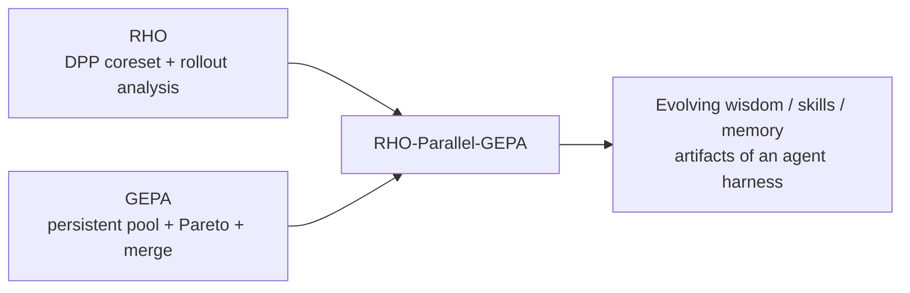
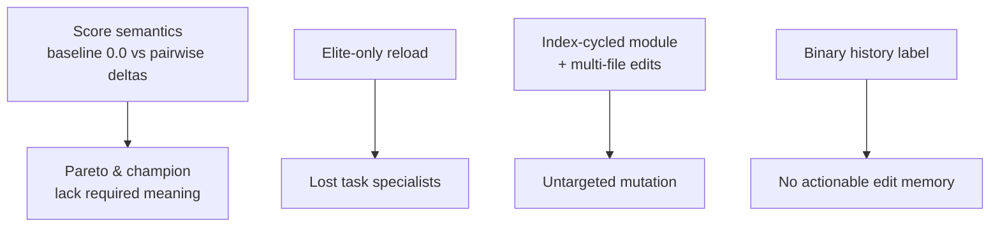
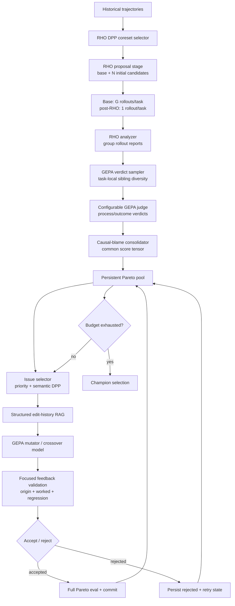
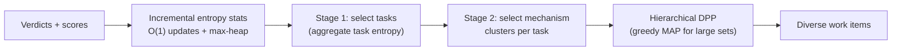
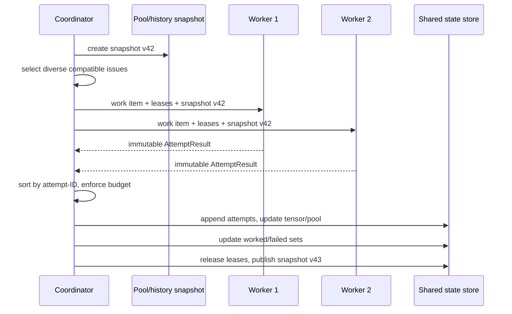
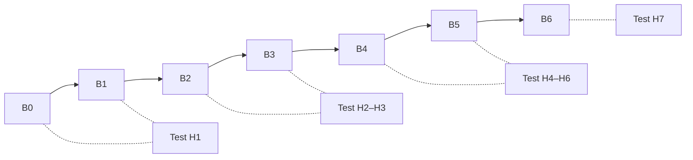

I'll build you a complete slide-by-slide deck with content and Mermaid diagrams. This is structured as a research presentation (~22 slides) you can drop straight into PowerPoint/Keynote/Marp/Reveal.js.

---

# RHO-Parallel-GEPA: Research Presentation Deck

## 🎬 Slide 1 — Title

**Title:** RHO-Parallel-GEPA: Persistent-Pool, Causal-Blame Evolution of Agent Harnesses

**Subtitle:** Evolving external agent policies (wisdom, skills, memory) via Pareto-guided, feedback-validated, lock-safe parallel GEPA

**Footer bullets:**
- Offline policy evolution — not part of normal Gaia agent runs
- Extension of RHO with GEPA pool mechanics
- Feature-gated, ablation-ready target architecture

---

## 📖 Slide 2 — Background: RHO and GEPA

**Content:**

| System | Core idea | Limitation addressed |
|--------|-----------|----------------------|
| **RHO** | Historical DPP coreset selection + repeated rollout analysis + best-of-N proposals | Discards non-winners (best-of-N) |
| **GEPA** | Persistent candidate pool + Pareto selection + reflective editing + genetic merge | Prompt-only candidates, no causal attribution |

**Key insight:** Combine RHO's rich trajectory evidence with GEPA's persistent-pool evolution — applied to *externally versioned agent harnesses*, not model weights.

**Mermaid:**


---

## ⚠️ Slide 3 — Problem Statement: Current Implementation Gaps

**Content (from the fidelity audit):**

- **Score semantics broken:** parent baseline `0.0` vs. child pairwise deltas against *different* parents → not a common score matrix. Pareto dominance currently meaningless across lineages.
- **No persistent pool:** later generations reload only elite names; non-elite specialists are permanently lost.
- **Weak mutation targeting:** module cycled by child index, not weakness-driven; edits can touch all six files.
- **Coarse history:** binary helpful/harmful label conflates no-op, rejected, and unavailable-score states.
- **No minibatch gate, no explicit budget, no parallel-safe persistence.**

**Speaker note:** These are documented, observed behaviors — the "what must be built before parallelism" list.

**Mermaid:**


---

## 🎯 Slide 4 — Research Objective

**Content:**

Evolve an external **agent harness** (wisdom + skills + memory), not model weights.

**Optimization objective:**
\[
\arg\max_{h \in P}\; \alpha\,\text{Outcome} + \beta\,\text{ProcessCoverage} + \gamma\,\text{Stability} - \delta\,\text{RegressionRisk}
\]

Initial defaults: `α=0.55, β=0.20, γ=0.15, δ=0.10` (experiment configuration, not universal truths).

**Protected critical floors:** safety, privacy, evidence-grounding, output-contract — cannot be overridden by high aggregate score.

**Harness structure:**
```
wisdom/   → intent_planner.md, reAct.md, critic.md,
            consolidator.md, scratchpad.md, synthesis.md
skills/   → agent-specific skill artifacts
memory/   → agent-specific durable-memory artifacts
```

---

## 🗺️ Slide 5 — Target System Topology (Key Diagram)

**Content:** Outer RHO stage seeds search → inner GEPA loop evolves pool until budget exhausted.

**Mermaid:**


---

## 🏗️ Slide 6 — Execution Hierarchy & Initial Pool Rule

**Content:**

```
Experiment
 └─ RHO-GEPA iteration r
     ├─ DPP-selected task set D_core
     ├─ H0 = {base} ∪ {N RHO proposals}   ← all preserved, none discarded
     ├─ base: G rollouts/task ; candidates: 1 rollout/task
     ├─ persistent GEPA pool P_r
     ├─ GEPA attempts/batches until budget exhausted
     └─ elite pool members E_r → seed next iteration
```

**Initial rollout cost:**
\[
k \times G + N \times k + N \times k
\]
(last term = evaluation/judging work; agent rollouts and judge calls reported separately)

**Explicit budget object (not just counts):**
`GEPA_MAX_ATTEMPTS / ACCEPTED_EDITS / MODEL_TOKENS / ROLLOUTS / JUDGE_VERDICTS / WALL_SECONDS / POOL_CANDIDATES / HISTORY_RECORDS / RAG_CONTEXT_TOKENS` + `GEPA_EDIT_MAX_RETRIES=3`

---

## 📦 Slide 7 — Data Contracts: Artifacts & Candidates

**Content:**

**ArtifactDescriptor** (adapter-owned inventory):
- `artifact_id`, `kind` (wisdom|skill|memory), `format`, `version_hash`
- `readable`, `writable`, `merge_strategy`, `phase_bindings`
- Artifact = single file **or** declared atomic group; work items declare read/write sets

**PoolCandidate:**
- `candidate_id`, `artifact_hashes`, `parent_ids`, `ancestor_ids`
- `admitted`, `score_tensor_ref`, `attempt_ids`, `lineage_stall_count`
- **Pool persists for the whole iteration** — elite materialization ≠ deletion of specialists

**Adapter-neutral capability contract:**
`artifact_inventory → read_artifacts → materialize_candidate → apply_structured_edit → run_full_rollout → capture_trace → evaluate_trace` (+ optional `replay_from_checkpoint`, capability-gated)

**Speaker note:** CUGA is the intended reference adapter; Gaia remains baseline. No CUGA-specific assumptions in the core until source/docs are imported.

---

## 🔍 Slide 8 — Causal-Blame GEPA Verdict (Signature Contribution)

**Content:**

- Free-form but **versioned causal hypotheses** — no fixed failure taxonomy.
- Continuous **blame distribution** over agent/module/artifact nodes.
- **Counterfactual evidence** supports attribution.
- Highest-blame editable node = primary mutation target; ties → declared multi-artifact write set.

**Verdict schema (excerpt):**
```json
{
  "mechanism_id": "retrieval-empty-result-loop",
  "kind": "process", "severity": 0.88, "confidence": 0.91,
  "blame_graph": {
    "nodes": [
      {"node_id": "gaia-react", "blame": 0.75,
       "artifact_candidates": ["wisdom/reAct.md"]},
      {"node_id": "gaia-critic", "blame": 0.25}
    ],
    "edges": [{"from": "gaia-react", "to": "gaia-critic",
               "evidence_refs": ["event-4","event-7"]}]
  },
  "counterfactual_evidence": [...],
  "improvement_direction": "Escalate source type..."
}
```

**Mechanism alignment:** `mechanism_cluster_id` via incremental task-local semantic clustering (anchored to base harness, frozen within an iteration). Defaults: `embeddinggemma`, threshold `0.80`, max `12` clusters/task.

---

## 🧮 Slide 9 — Candidate Score Tensor

**Content:**

Per candidate `c`, task `t`, rollout `r`, mechanism `m`:
- Judge score: \( q(c,t,r,m) \in [0,1] \)
- Weight: \( w = \text{severity} \times \text{confidence} \)
- Consolidated: \( Q(c,t,m) = \text{weightedMean}_r \)
- **Stability retained, not discarded:** \( \text{Stability} = 1 - \text{Dispersion}(q) \)

**Every cell carries provenance:**
```json
{"task_id": "gaia-123",
 "mechanism_cluster_id": "cluster-7",
 "score": 0.62, "severity_weight": 0.88,
 "confidence_weight": 0.91, "stability": 0.74,
 "rollout_count": 1, "verdict_ids": [...], "source": "gepa-judge-v1"}
```

**Speaker note:** This fixes the central blocker — a common, comparable, provenance-bearing score matrix is what makes Pareto and champion selection meaningful.

---

## 🤖 Slide 10 — Model Roles & Judge Pipeline

**Content:**

| Role | Input | Output | Config |
|------|-------|--------|--------|
| Rollout agent | task + harness | fresh trajectory | `GAIA_MODEL` |
| Analyzer + Judge | rollout group, trajectory, inventory | group report + causal verdicts | `GEPA_ANALYZER_JUDGE_MODEL` |
| Editor | issue, artifacts, RAG, evidence | rationale + edits / merge refinement | `GEPA_EDITOR_MODEL` |

**Resolution order:** overrides → role default → `GAIA_MODEL`. All resolved IDs recorded in manifests.

**Verdict sampling:** task-local sibling-rollout diversity only (DPP already diversified tasks). For `k=10, G=3`: \(10 \times \binom{3}{2} = 30\) pairwise comparisons — inexpensive. Sampler **maximizes** within-task dissimilarity, prioritizes high-severity/low-stability/under-covered cases.

**Default:** `GEPA_BLAME_CONSENSUS_RUNS=1`, calibration off (cost-controlled; both remain feature-gated ablations).

---

## 📊 Slide 11 — Causal-Blame Pareto Selection

**Content:**

**Why not a scalar?** One task holds multiple independent process obligations. A candidate improving retrieval recovery but missing formatting is still valuable genetic material.

**Pareto unit:** `(candidate, task, failure mechanism)` — not just `(candidate, task)`.

**Task-local dominance:** `a` dominates `b` on task `t` iff comparable provenance, no worse on every comparable severity-weighted mechanism, strictly better on ≥1, no protected-floor regression. Missing subtasks **excluded**, not zeroed.

**Parent selection:**
\[
\text{frequency}(c) = \sum_{t,m} \text{severity}(t,m)\cdot\text{confidence}(t,m)\cdot \mathbf{1}[c \text{ wins } (t,m)]
\]
Union of task/mechanism winners → remove dominated → sample ∝ weighted objective coverage. **Preserves specialists.**

**Champion:** chosen only after budget exhaustion via transparent aggregate (outcome, process, stability, regression risk, coverage) — every component in the manifest.

---

## 🧬 Slide 12 — Issue Selection, Semantic DPP & Entropy

**Content:**

**Cross-candidate entropy** (does harness design change task behavior?):
\[
H(t,m) = \text{Var}\big(\{Q(h_i,t,m)\}\big) \times \max\big(\max_i Q(h_i,t,m),\, \epsilon_{floor}\big)
\]
Classification: `recombination_target` / `frontier_exploration` / `skip`.

**Evidence floor before entropy counts:** ≥3 comparable admitted candidates AND ≥2 rollouts each → else `entropy_unavailable` (severity fallback).

**Quality hybrid:** \( \text{Quality}(t) = \beta(n)\,\text{Severity} + (1-\beta(n))\,H(t) \), β decreases with pool size.

**Issue DPP:** \( L_{ij} = q_i \times \text{sim}(i,j) \times q_j \); hard constraints block duplicate parent+write-set, concurrent workspace edits, work items without attributable evidence.

**Mermaid:**


---

## ✍️ Slide 13 — Feedback-Validated Editing

**Content:**

**Artifact learning state** (per artifact/group): `worked_set`, `regression_probe_set`, `failed_strategy_set`, `retry_state`.

**Mutator protocol:** reads inventory first → requests reads → proposes edits only within locked write set. Engine persists rationale, read/write sets, history IDs, verdict IDs, applied diff.

**Acceptance rule:**
\[
\Delta_{primary} \ge \epsilon \quad\text{and}\quad \Delta_{net} = Gain_{primary} - WeightedRegressions > 0
\]
- Small regressions allowed if large well-supported primary gain.
- **Hard floors** for safety/privacy/evidence/output compliance — never traded away.

**Deferred generalization probes:** cluster-level (default key `mechanism_cluster_id`), budget ≤ `GEPA_PROBE_BUDGET_FRACTION=0.15`; skipped clusters marked `generalization_unverified`, never silently passing.

**Retry:** `GEPA_EDIT_MAX_RETRIES=3` per `(issue fingerprint, artifact, lineage)` → then `exhausted` (retained in RAG; retry only on material evidence change).

---

## 🔒 Slide 14 — Parallel GEPA & Locking

**Content:**

- `PARALLEL_GEPA_ENABLED=false, GEPA_BATCH_SIZE=1` → sequential select→edit→validate→commit.
- Enabled: coordinator snapshots pool/history/artifacts/budget → selects ≤K compatible diverse items → concurrent workers → commit at one barrier.

**Lock policy:** immutable workspace content once attempt begins; write leases mandatory; workers never write shared state.

**Mermaid (batch barrier):**


**Speaker note:** Bounded stale-frontier tradeoff — every item selected from the same explicit snapshot. Entropy refresh only at the barrier, never in a worker.

---

## 🔀 Slide 15 — Deterministic Crossover / Merge

**Content:**

**Eligibility (9 rules):** distinct admitted candidates, no ancestor/descendant, common ancestor via full traversal, no duplicate triple, ≥1 descendant improves over ancestor, no catastrophic floor regression, sufficient complementarity, ≥1 complementary artifact change, no unresolved conflict.

**Per-artifact inheritance (deterministic by default):**
| Ancestor state | Decision |
|----------------|----------|
| unchanged left, changed right | take right |
| changed left, unchanged right | take left |
| both unchanged / identical | keep shared |
| both changed differently | stronger evidence side, else ancestor |

Only unresolved same-artifact conflicts invoke `GEPA_CROSSOVER_MODEL` (sees only the conflicting artifact).

**Complementarity:**
\[
\sum_{t,m} \text{severity}(t,m)\times|Q(left,t,m)-Q(right,t,m)|
\]
+ weight for disjoint changed artifact sets.

**Metric:** \( \text{CrossoverYield} = \frac{\text{accepted merges}}{\text{attempted merges}} \)

---

## 🧪 Slide 16 — Research Hypotheses

**Content:**

| ID | Claim | Failure criterion |
|----|-------|-------------------|
| **H1** | Persistent pool (base + all RHO) > RHO best-of-N at matched budget | No repeatable held-out gain / worse efficiency |
| **H2** | Causal-blame editing > severity-directed editing | Accepted-edit rate ↓>20% and gain ≤1pp |
| **H3** | Worked/regression feedback reduces pass-fail loops | No regression reduction or excessive cost |
| **H4** | Entropy prioritization > severity alone | No gain at matched task/rollout budget |
| **H5** | DPP issue selection adds real diversity | Diversity <0.50, or >10% wall time without ≥15% yield gain |
| **H6** | Provenance merge combines branches productively | Low yield or merged children regress vs mutation-only |
| **H7** | Lock-safe parallel batches cut wall time, keep quality | Correctness error, <1.5× speedup, or >1pp quality drop |

---

## 🪜 Slide 17 — Baselines (B0–B6)

**Content:**

| Baseline | Composition |
|----------|-------------|
| **B0** | Legacy RHO best-of-N |
| **B1** | + persistent pool + outcome Pareto |
| **B2** | + causal blame graph (sequential) |
| **B3** | + feedback validation + structured edit memory |
| **B4** | + entropy task/issue quality |
| **B5** | + deterministic merge |
| **B6** | + parallel batch execution |

**Key point:** B1 isolates the pool hypothesis. Later systems must not claim pool benefit from the full composite alone.

**Mermaid:**


---

## 📐 Slide 18 — Evaluation Protocol

**Content:**

**Data partitions:**
1. Historical source corpus (RHO/DPP input)
2. Evolution coreset (fixed default; anchor-refresh/full-entropy optional)
3. Generalization probes (near-mechanism tasks outside origin/worked sets)
4. Held-out evaluation (never used for mutation/validation/selection)

**Budget parity — report separately:** agent rollouts, analyzer/judge calls, editor calls, tokens by role, embedding calls, wall-clock, cached vs fresh. Comparisons valid only with matched rollout budgets or a full efficiency curve.

**Statistical reporting per config & seed:** held-out outcome mean/dispersion, process/mechanism score, accepted/rejected/no-op/exhausted counts, generalization rate, regression-probe violation rate, pool-size trajectory, blame stability & calibration agreement, mutation diversity, DPP wall time, crossover yield.

> *No causal claim rests on one smoke run or one model response.*

---

## ✅ Slide 19 — Blame, Entropy & Merge Validation

**Content:**

**Blame graph validation:**
- Default = 1 verdict call (cost-controlled, not causal proof).
- *Consensus ablation:* 2–3 independent calls → measure blame/artifact/cluster agreement; preserve disagreement.
- *Intervention calibration:* substitute highest-blame node output → re-run trajectory → record `blame_calibration_agreement` (charged to rollout budget).

**Entropy validation:** enforce evidence floor (≥3 candidates, ≥2 rollouts); report cluster anchor coverage, create/merge/split counts, fragmentation, collision audit, `cluster_freshness` (stale clusters get reduced entropy weight).

**Merge validation:** report attempted/eligible/accepted/rejected merges, complementarity distribution, crossover yield, artifact provenance. Fails if merge adds cost without improving held-out outcome/generalization/process vs mutation-only.

---

## 🚪 Slide 20 — Feature Gates & Standard Profiles

**Content:**

**Independent gates (all through the same agent-neutral adapter contract):**
`GEPA_ENABLED`, `PARALLEL_GEPA_ENABLED`, `GEPA_PERSISTENT_POOL_ENABLED`, `GEPA_CAUSAL_BLAME_GRAPH_ENABLED`, `GEPA_BLAME_CONSENSUS_RUNS`, `GEPA_BLAME_CALIBRATION_ENABLED`, `GEPA_EDIT_MEMORY_ENABLED`, `GEPA_SEMANTIC_HISTORY_ENABLED`, `GEPA_ENTROPY_DPP_ENABLED`, `GEPA_ISSUE_DPP_ENABLED`, `GEPA_ISSUE_SELECTION_MODE`, `GEPA_FEEDBACK_VALIDATION_ENABLED`, `GEPA_WORKED_SET_ENABLED`, `GEPA_REGRESSION_PROBES_ENABLED`, `GEPA_DETERMINISTIC_MERGE_ENABLED`, `GEPA_LLM_CONFLICT_REFINEMENT_ENABLED`, rollout counts, verdict & evidence-floor caps…

| Profile | Goal | Mechanisms |
|---------|------|-----------|
| `minimal` | Test H1 (B0 vs B1) | pool + basic outcome Pareto, sequential editor, no graph/RAG/merge/parallel |
| `research_sequential` | Test H2–H5 | + causal graph, feedback validation, worked sets |
| `research_parallel` | Test H7 | + compatible batches, write leases, barrier |
| `full_ablation` | Full matrix | every feature individually selectable |

Profile name + all resolved flags persisted in every manifest.

---

## 🏁 Slide 21 — Acceptance Criteria (Target-Complete Checklist)

**Content:**

- ✅ Every initial RHO candidate + base has a common, provenance-bearing score tensor before selection.
- ✅ A process specialist survives in the pool despite lower aggregate outcome.
- ✅ Analyzer reports separate from editor prompts, referenced by ID.
- ✅ Every verdict conforms to causal-blame schema with sanitized evidence.
- ✅ Every edit attempt records rationale, reads/writes, history IDs, validation set, deltas, terminal status.
- ✅ Accepted edits revalidated on origin + worked + regression sets.
- ✅ Small regressions only via positive weighted net gain, never violating floors.
- ✅ Retry exhaustion after `GEPA_EDIT_MAX_RETRIES`; parallel batches never overlap write leases.
- ✅ Deterministic merge reconstructs provenance without LLM for disjoint changes.
- ✅ Entropy only after evidence floors; fallback reasons visible in manifest.
- ✅ Every accepted edit gets ≥1 generalization probe or a justified, recorded skip.

---

## 🧭 Slide 22 — Summary & Roadmap

**Content:**

**What exists today (retain):** opt-in dispatch, agent-neutral contracts, immutable artifacts, bounded rollouts, gated six-file editing, basic mutation/crossover, redacted history + semantic ranking, verified smoke fixes, documentation.

**Build order before parallelism:**
1. **A** — Score matrix + persistent pool foundation
2. **B** — Pareto parent selection + strict module mutation
3. **C** — Minibatch gate + explicit budget
4. **D** — Structured edit memory + retrieval
5. **E** — Deterministic system-aware merge
6. **F** — Diverse parallel batch scheduler
7. **G** — End-to-end experiments & ablations

**One-line thesis:** *Persistent pool + causal attribution + feedback-validated edits + provenance-preserving merge — measured rigorously before any parallelism claim.*

---

### 💡 Usage tips
- Slides 5, 14, 17 carry the heaviest diagrams — give them extra talk time.
- For Marp/Reveal.js, the Mermaid blocks render natively; for PowerPoint, render them at [mermaid.live](https://mermaid.live) and paste as PNG.
- Want me to **condense this to 12 slides** for a short talk, or **expand any section** (e.g., a dedicated causal-blame deep-dive or a methods-only version for a lab meeting)?