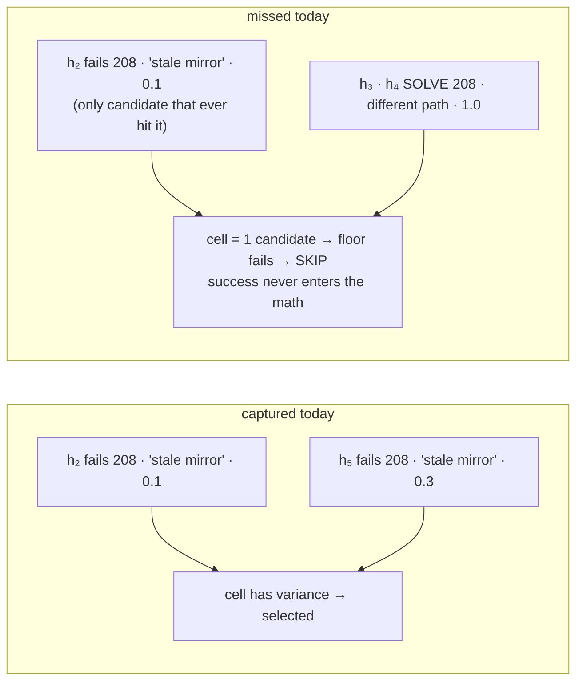
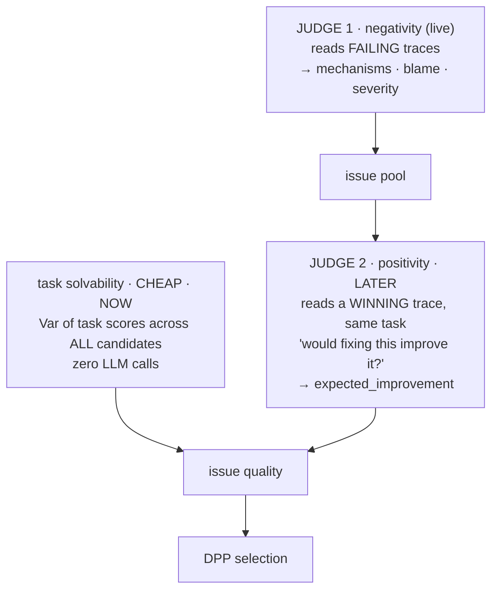

now , we should also introduce the 2-judge idea our slide... as a gap to fill in our DPP issue selection mechanism (now, we are only seeeing and comparing someone did it bad vs. someone did it less bad , .... we are not see if someone did it good) ....

# 🩺 The Gap Slide(s): "We Autopsy Failures. We Never Study Survivors."

This slots in right after P-4b (the compass), as **P-4c (the blind spot)** and **P-4d (the two-judge fix)**. It uses your exact insight verbatim on-slide, a vivid "survivor" story, and the honest staged plan from your design doc (cheap solvability signal now → positivity judge later).

---

## P-4c — The Blind Spot: Bad vs. Less-Bad, Never *Good*

**[Spoken hook — the survivor story]**
> *"Imagine a hospital quality board that only audits the patients who got worse. They compare charts: 'this protocol failed badly, that one failed less badly.' They never open the file of a single patient who **recovered**. So when a disease kills one patient under Protocol A — but patients with the same disease walk out healthy under Protocol B, via a different treatment path — the board sees one failed protocol, no disagreement among failures, and closes the file. The disease was treatable. The board just never studied the survivors. That is exactly what our entropy compass does today."*

**[On-Slide · your insight, verbatim]**
> *"Currently we only compare who did it **bad** vs. who did it **less bad**. We never see if someone did it **good**."*

**[On-Slide Visual · the two scenarios]**


**[On-Slide Table · the signal we're missing: task solvability]**
| candidates solving the task (any path) | reading | priority |
|---|---|---|
| ~0% | beyond current harness reach | low |
| **30–70%** | **solvable, not universal → failures are fixable** | **high** |
| ~100% | already solved | none |

### 🎙️ Speaker Notes
> "Entropy lives in `(task, mechanism)` cells and needs three comparable candidates. But an issue that only one candidate encountered has no cell-mates — the floor fails, entropy is `None`, the issue is skipped. Meanwhile two other candidates solved the *same task* by a different route. That success is the strongest possible evidence that the failure is a harness-side choice, not a law of nature — and our compass never looks at it. We measure disagreement among the sick; we ignore the recovered."

---

## P-4d — The Fix: Two Judges — *What Went Wrong* × *What's Worth Fixing*

**[Spoken hook]**
> *"So we add the survivor audit. Judge 1 stays: it reads failing traces and names what went wrong. Judge 2 is new: it reads a **winning** trace of the same task and asks, for every issue Judge 1 raised — 'would fixing this have mattered? Is this task solvable, and through which lever?' Negativity finds the disease; positivity certifies it's curable."*

**[On-Slide Visual · the two-judge compass]**


**[On-Slide Math · the quality formula grows two honest bonuses]**
```
quality = w·severity + w·confidence + entropy_term + w·coverage + w·pareto
        + 0.1 · task_solvability        ← Phase 8 · deterministic · live in pool stats
        + 0.2 · expected_improvement    ← Phase 9+ · 1 LLM call/issue · cached per (candidate, task)
```

**[On-Slide Text · how the two signals interact]**
| scenario | solvability | expected_improvement | verdict |
|---|---|---|---|
| task unsolvable | 0 | 0 | correctly low |
| solvable, parent already fixed it | high | 0 | medium — don't over-invest |
| solvable, parent lacks the fix | high | 0.8 | **high — both judges agree** |
| solvable via different path | high | n/a | **high — variance catches what positivity can't** |

- *status: gap identified · solvability drafted for `entropy.py`/`issues.py` (Phase 8) · positivity judge = Phase-9 design, budgeted under judge verdicts*

### 🎙️ Speaker Notes
> "Two layers, deliberately staged. The cheap one is already in the pool's statistics: the variance of *task* scores across all candidates, regardless of mechanism — no LLM calls, and it rescues exactly the 'only one candidate hit it, but others solved the task' case. The precise one is Judge 2: hand it a successful trajectory plus Judge 1's issue list, and it returns an `expected_improvement` per issue — 'this win already verifies checksums, so fixing the retrieval skill wouldn't change it: 0.0' versus 'this win got lucky; the mirror rule would still help: 0.6.' It costs one judge call per issue, so it waits for Phase 9, and we cache it per candidate-task pair because frequency-sampled parents repeat. Notice the continuity with RHO: RHO compared candidates against a fixed *baseline* trace; Judge 2 compares issues against a fixed *winning* trace. Survivors become the reference — the same self-evidence philosophy, one level up."

---

### 💡 Board pre-answers
- **"Why not just lower the evidence floor?"** → variance from one or two cell-mates is fabricated signal — the floor exists precisely to stop that. Solvability is a *task-level* statistic over the whole pool; it needs no mechanism-level floor.
- **"Doesn't a second judge double judge-bias?"** → Judge 2 is blind to expected answers like Judge 1; its output is an additive *bonus weight*, never a gate; and it is cross-checked by the deterministic solvability statistic.
- **"Cost?"** → solvability: O(pool) arithmetic, free. Positivity: 1 call/issue, deferred, cached, and charged to `GEPA_MAX_JUDGE_VERDICTS` — it appears in the manifest, not in the defaults.

**Transition into P-5:** *"The compass now sees both the sick and the recovered. But when the editor finally writes the cure, it discovers that in this world a single synonym can flip a task from 0/2 to 2/2…"*

Want me to fold P-4c/P-4d into the master Part-2 list with final numbering, or build the **positivity-judge prompt card** (exact schema) as an appendix slide?
